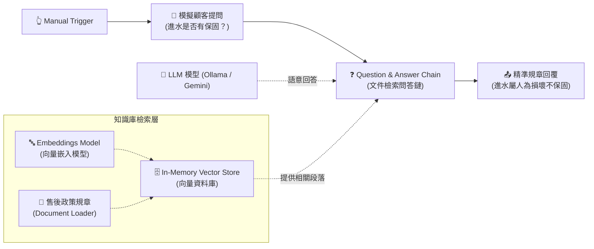

# 基礎範例 6：Question and Answer Chain（基礎文件檢索問答鏈）

## 📚 工作流程說明

如何讓 AI 根據指定的企業內部手冊準確回答問題，且絕對不胡言亂語（模型幻覺）？

**Question and Answer Chain** 是 RAG（檢索增強生成）的最精簡入門架構！它將**語言模型（LLM）**與**檢索器（Retriever / Vector Store）**直接串連。當收到提問時，檢索器會先找出與問題最相關的文件段落，並將段落作為參考依據交由 LLM 作答。因為是純粹的單向問答鏈，反應速度極快，架構清晰明瞭。

---

## 🧭 工作流程架構



---

## 📥 工作流程圖下載

- [下載範例流程：Question_and_Answer_Chain.json](./Question_and_Answer_Chain.json)

---

## 📋 節點詳細說明

1. **📝 Sticky Note（便利貼）**
   - 標記教學重點與檢索問答架構。

2. **🔄 模擬顧客提問 (Edit Fields)**
   - 模擬使用者詢問：「請問如果商品不小心進水了，原廠有提供免費保固維修嗎？另外退貨需要多久時間？」。

3. **❓ Question and Answer Chain（問答鏈核心）**
   - **Text**：傳入用戶提問 `{{ $json.user_question }}`。
   - **AI Retriever 連接點**：連接 In-Memory Vector Store。

4. **🗄️ In-Memory Vector Store & Embeddings**
   - **Vector Store**：在記憶體中建立即時向量索引庫。
   - **Embeddings**：使用 `nomic-embed-text` 或其他嵌入模型將文字轉為向量數字。
   - **Default Data Loader**：預載產品售後規章（包含 1 年保固、人為進水損壞不保固、7 天猶豫期規範）。

---

## 🎯 學習重點

- **RAG 核心架構入門**：理解文檔檢索（Retrieve）與文本生成（Generate）的分工。
- **向量嵌入（Embeddings）**：認識文字向量化的基本原理。
- **杜絕幻覺**：觀察 AI 如何嚴格依據規章文字準確回答「進水屬人為損壞不在保固內」。

---

## 💡 實際應用場景

- 企業內部員工請假規章與差旅報銷政策問答。
- 單一產品操作手冊與故障排除速查。
- 法律條文與合約重點精準問答。

---

## 🤖 AI 賦能延伸實作（附 Prompt 提詞）

<details>
<summary>👉 點擊展開可直接複製給 AI 助理的 Prompt 提詞</summary>

> 💡 **任務目標**：透過 AI 在問答鏈下方加入「出處條款標註」與「格式化美化」。

```text
請幫我在目前的「Question and Answer Chain」流程中進行延伸：
1. 在 Question and Answer Chain 的提示詞中規範：回答時請條列式呈現，且在最後一行務必標註【依據條款：第 X 條】。
2. 若使用者的問題在檢索規章中完全找不到答案，請回答：「抱歉，本規章手冊中未包含此資訊，建議您轉接專人客服。」
請幫我配置好問答鏈參數！
```
</details>
