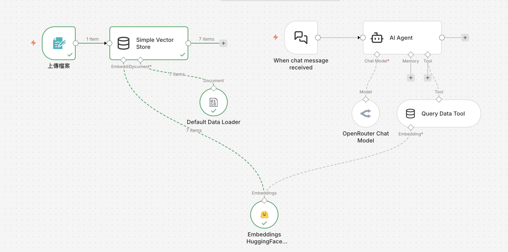

# 🎯 RAG 入門版 - 記憶體儲存

## 📖 什麼是這個範例？

這是 **最簡單的 RAG 實作**，讓您在 5 分鐘內體驗 RAG（檢索增強生成）技術的魅力！

整個系統只需要**一個工作流程**，就能實現：
- 📤 上傳文件（PDF,CSV,TXT）
- 🔍 自動建立向量索引
- 💬 智能問答對話

### 範例知識庫文件下載

[範例知識庫文件下載](../知識庫文件)

## ✨ 核心特色

### **為什麼從這裡開始？**

| 特點 | 說明 |
|------|------|
| 🚀 **超級簡單** | 只需一個工作流程，5分鐘快速體驗 |
| 💾 **記憶體儲存** | 使用 In-Memory Vector Store，無需外部資料庫 |
| 🆓 **零成本** | 可使用 HuggingFace 免費嵌入模型 |
| ⚡ **即時體驗** | 上傳檔案後立即可以開始問答 |
| 📚 **學習友善** | 專注於 RAG 核心概念，無額外複雜度 |

### **適用場景**

✅ RAG 技術學習和概念驗證  
✅ 快速測試和演示  
✅ 個人小規模使用（少量文件）  
✅ 教學和實驗

### **限制與注意事項**

⚠️ **資料不持久**：工作流程重啟或執行結束後，向量資料會消失  
⚠️ **不適合大量文件**：記憶體有限，建議小於 50 份文件  
⚠️ **無法跨流程共用**：每次執行都是獨立的索引  
⚠️ **適合測試**：生產環境建議使用基礎版或進階版

---

## 🎓 什麼是 RAG？

**RAG (Retrieval-Augmented Generation)** = 檢索增強生成

簡單來說，RAG 讓 AI 能夠：
1. 📖 **讀取**您的文件
2. 🔍 **檢索**相關資訊
3. 💬 **回答**基於文件內容的問題

### **RAG 的工作流程**

```
┌─────────────────────────────────────────────┐
│          RAG 工作流程（入門版）              │
├─────────────────────────────────────────────┤
│                                             │
│  Step 1: 📤 上傳文件                        │
│         ↓                                   │
│  Step 2: ✂️ 文件分割成小片段                │
│         ↓                                   │
│  Step 3: 🔢 將片段轉換為向量（Embedding）   │
│         ↓                                   │
│  Step 4: 💾 儲存到記憶體（In-Memory Store） │
│         ↓                                   │
│  Step 5: 💬 使用者提問                      │
│         ↓                                   │
│  Step 6: 🔍 語義搜尋相關片段                │
│         ↓                                   │
│  Step 7: 🤖 AI 根據片段生成答案             │
│                                             │
└─────────────────────────────────────────────┘
```

---

## 🏗️ 系統架構

### **節點說明**

```
┌──────────────────────────────────────────────────────────┐
│                    單一工作流程                           │
├──────────────────────────────────────────────────────────┤
│                                                          │
│  [上傳檔案] (Form Trigger)                               │
│      ↓                                                   │
│  [Simple Vector Store] (Insert Mode) ←─ [Embeddings]    │
│      ↑                                                   │
│  [Default Data Loader]                                   │
│                                                          │
│  ─────────────────────────────────────────────────────   │
│                                                          │
│  [When chat message received] (Chat Trigger)             │
│      ↓                                                   │
│  [AI Agent] ←─ [OpenRouter Chat Model]                  │
│      ↓                                                   │
│  [Query Data Tool] ←─ [Embeddings]                       │
│                                                          │
└──────────────────────────────────────────────────────────┘
```

### **流程架構圖**



### **流程圖下載**

[RAG入門_記憶體儲存.json](./RAG入門_記憶體儲存.json)

### **節點詳細說明**

這個工作流程分為**兩個主要流程**：

#### **🔵 流程一：檔案上傳與向量化儲存**（左側）

---

##### **1️⃣ 上傳檔案（Form Trigger）**

- **節點類型**：`n8n-nodes-base.formTrigger` v2.3
- **主要功能**：
  - 產生一個網頁表單，讓使用者可以上傳檔案
  - 接受 `.pdf` 和 `.csv` 格式的檔案
  - 表單標題：「Upload your data to test RAG」
  - 這是整個流程的**起始點**

**💡 學習重點**：
- 這就像是一個「入口大門」，使用者在這裡上傳他們的資料
- n8n 會自動產生一個網址，可以分享給其他人使用
- 支援多檔案上傳，一次可以處理多個文件

---

##### **2️⃣ Default Data Loader**

- **節點類型**：`documentDefaultDataLoader` v1.1
- **資料類型**：Binary（二進位）
- **主要功能**：
  - 讀取二進位檔案（Binary Data）
  - 將 PDF 或 CSV 內容解析成文字
  - 準備好讓向量資料庫處理

**💡 學習重點**：
- 這是一個「翻譯員」，把檔案變成 AI 能理解的格式
- 自動處理不同格式的文件
- 將非結構化資料轉換為結構化文字

---

##### **3️⃣ Embeddings HuggingFace Inference**

- **節點類型**：`embeddingsHuggingFaceInference` v1
- **使用模型**：`BAAI/bge-m3`
- **主要功能**：
  - 將文字轉換成向量（Embedding）
  - 連接到 HuggingFace API
  - 同時供應兩個節點使用（插入和查詢）

**💡 學習重點**：
- 這是整個系統的**核心技術**
- Embedding 就像是把文字轉換成「座標」，讓電腦能計算文字之間的相似度
- 同一個 Embedding 模型連接到兩個地方，確保「存入」和「查詢」使用相同的向量化方式
- BAAI/bge-m3 是一個多語言模型，支援中文、英文等多種語言

---

##### **4️⃣ Simple Vector Store（Insert 模式）**

- **節點類型**：`vectorStoreInMemory` v1.3
- **運作模式**：`insert`（插入模式）
- **Memory Key**：`vector_store_key`
- **主要功能**：
  - 接收來自表單的檔案
  - 將檔案內容轉換成**向量**並儲存在記憶體中
  - 使用共享的記憶體金鑰，讓查詢節點可以存取

**💡 學習重點**：
- 這就像一個「智慧型資料庫」
- 它不是單純儲存文字，而是將內容轉換成數學向量
- 這樣 AI 才能「理解」文件的意義並進行語義搜尋
- **Memory Key** 是關鍵：讓兩個 Vector Store 節點共享同一個資料庫

---

#### **🟢 流程二：AI 聊天查詢**（右側）

---

##### **5️⃣ When chat message received（Chat Trigger）**

- **節點類型**：`chatTrigger` v1.4
- **主要功能**：
  - 提供一個聊天介面
  - 接收使用者的問題
  - 啟動 AI 代理處理流程

**💡 學習重點**：
- 這是另一個「入口」，但這次是用來問問題的
- n8n 會產生一個聊天室網址，使用者可以在那裡和 AI 對話
- 與表單觸發器分開，形成兩個獨立的觸發點

---

##### **6️⃣ AI Agent**

- **節點類型**：`agent` v3
- **主要功能**：
  - 接收使用者的問題
  - 決定要使用哪些工具來回答
  - 整合所有資訊後產生回答

**💡 學習重點**：
- 這是整個 AI 系統的**「大腦」**
- 它會判斷：「我需要去資料庫找資料嗎？」「找到的資料要怎麼整合？」
- 它可以多次呼叫工具，直到找到最佳答案
- AI Agent 會自己判斷要不要使用工具，工具的描述很重要

---

##### **7️⃣ OpenRouter Chat Model**

- **節點類型**：`lmChatOpenRouter` v1
- **使用模型**：`nvidia/nemotron-nano-12b-v2-vl:free`
- **主要功能**：
  - 提供語言理解和生成能力
  - 免費模型，適合教學使用
  - 產生自然語言回答

**💡 學習重點**：
- 這是 AI 的**「語言能力」**
- 就像給 AI 一個「會說話的嘴巴」
- 不同的模型有不同的能力和特色
- 使用免費模型，零成本學習

---

##### **8️⃣ Query Data Tool（Vector Store - Retrieve 模式）**

- **節點類型**：`vectorStoreInMemory` v1.3
- **運作模式**：`retrieve-as-tool`（作為工具檢索）
- **Memory Key**：`vector_store_key`（與插入節點共享）
- **工具描述**：「Use this knowledge base to answer questions form the user」
- **主要功能**：
  - 從向量資料庫中搜尋相關文件
  - 根據使用者問題找出最相關的內容
  - 將找到的資料提供給 AI Agent

**💡 學習重點**：
- 這是 AI 的**「參考資料工具」**
- AI Agent 可以主動決定要不要使用這個工具
- 它會找出和問題最相關的片段，而不是整份文件
- 使用相同的 Memory Key，存取之前儲存的向量資料

---

## 🔄 完整運作流程

理解了每個節點的功能後，讓我們看看整個系統是如何運作的：

### **🔵 階段一：建立知識庫**

```
使用者上傳檔案 (Form Trigger)
    ↓
Default Data Loader 解析檔案
    ↓ (提取文字內容)
Embeddings 將文字向量化
    ↓ (轉換為數字向量)
Simple Vector Store 儲存向量
    ✅ (知識庫建立完成)
```

**詳細步驟**：
1. 使用者在網頁表單上傳 PDF 或 CSV 檔案
2. Default Data Loader 讀取檔案並提取文字內容
3. Embeddings 節點將文字轉換為向量（例如：1536 維度的數字陣列）
4. Simple Vector Store 將向量儲存在記憶體中，使用 `vector_store_key` 標識
5. 系統回傳「上傳成功」訊息

---

### **🟢 階段二：AI 智能問答**

```
使用者提問 (Chat Trigger)
    ↓
AI Agent 接收問題並分析
    ↓ (決策：需要查資料嗎？)
AI Agent 呼叫 Query Data Tool
    ↓ (搜尋相關片段)
Query Data Tool 從 Vector Store 檢索資料
    ↓ (返回最相關的內容)
AI Agent 整合資料
    ↓ (組織答案)
OpenRouter Chat Model 生成自然語言回答
    ↓
回答顯示在聊天介面
    ✅ (完成)
```

**詳細步驟**：
1. 使用者在聊天介面輸入問題
2. AI Agent 接收問題並判斷：「這個問題需要查詢知識庫嗎？」
3. 如果需要，AI Agent 呼叫 Query Data Tool
4. Query Data Tool 將問題轉換為向量，並在 Vector Store 中搜尋最相似的文件片段
5. 找到的相關片段回傳給 AI Agent
6. AI Agent 將問題和找到的資料一起傳給 OpenRouter Chat Model
7. Chat Model 根據資料生成準確的回答
8. 回答顯示在聊天介面上

---

### **🔑 兩個流程的連接點：Memory Key**

```
┌─────────────────────────────────────┐
│    vector_store_key (共享)           │
├─────────────────────────────────────┤
│                                     │
│  流程一：寫入 (Insert)               │
│  Simple Vector Store → 儲存向量      │
│                                     │
│  流程二：讀取 (Retrieve)             │
│  Query Data Tool → 檢索向量          │
│                                     │
└─────────────────────────────────────┘
```

**重要概念**：
- 兩個流程使用**相同的 Memory Key**（`vector_store_key`）
- 這讓它們能夠共享同一個向量資料庫
- 流程一負責「寫入」，流程二負責「讀取」
- 它們是獨立的觸發器，可以分別執行

---

## 🚀 快速開始（5 分鐘）

### **前置需求**

- ✅ n8n 帳號（本地安裝或雲端版都可）
- ✅ HuggingFace API Key（[免費申請](https://huggingface.co/settings/tokens)）
- ✅ OpenRouter API Key（[免費額度](https://openrouter.ai/)）

### **步驟 1：匯入工作流程**

1. 下載 `RAG入門_記憶體儲存.json`
2. 在 n8n 中點擊 **Import from File**
3. 選擇檔案並匯入

### **步驟 2：設定憑證**

#### **2.1 HuggingFace API**

1. 前往 [HuggingFace Tokens](https://huggingface.co/settings/tokens)
2. 建立新 Token（Read 權限即可）
3. 在 n8n 中新增 `HuggingFaceApi` 憑證
4. 貼上您的 API Token

#### **2.2 OpenRouter API**

1. 前往 [OpenRouter](https://openrouter.ai/)
2. 註冊並取得 API Key（新用戶有免費額度）
3. 在 n8n 中新增 `OpenRouter` 憑證
4. 貼上您的 API Key

### **步驟 3：取得上傳網址**

1. 開啟工作流程
2. 點擊 `上傳檔案` 節點
3. 複製 **Production URL**
4. 在瀏覽器中開啟該網址

### **步驟 4：上傳測試文件**

1. 準備一個 PDF 或 CSV 檔案（建議小於 5MB）
2. 在表單中上傳檔案
3. 等待處理完成（約 10-30 秒）

### **步驟 5：開始問答**

1. 回到 n8n 工作流程
2. 點擊 `When chat message received` 節點
3. 複製 **Chat URL**
4. 在瀏覽器中開啟聊天介面
5. 開始提問！

---

## 💡 測試範例

### **測試 1：簡單事實查詢**

**上傳文件**：產品說明書 PDF

**提問**：
```
這個產品的主要功能是什麼？
```

**預期結果**：AI 會從文件中找到產品功能列表並回答

---

### **測試 2：步驟性問題**

**上傳文件**：使用手冊 PDF

**提問**：
```
如何設定初始密碼？
```

**預期結果**：AI 會提供清楚的步驟說明

---

### **測試 3：找不到答案**

**提問**：
```
明天天氣如何？
```

**預期結果**：AI 應該回答「文件中沒有相關資訊」

---

## 🎯 核心概念理解

### **1. Embeddings（嵌入）是什麼？**

**簡單比喻**：將文字轉換為數字向量，讓電腦能理解「意義」

```
文字：「貓是一種可愛的動物」
     ↓ (Embedding)
向量：[0.23, -0.45, 0.89, ..., 0.12]
```

**為什麼重要？**
- 電腦無法直接理解文字
- 向量可以計算「相似度」
- 語義相近的文字會有相似的向量

### **2. Vector Store（向量資料庫）**

**作用**：儲存文件的向量表示，並支援快速搜尋

**記憶體儲存 vs 持久化儲存**

| 特性 | In-Memory（本範例） | Simple Vector Store | 雲端資料庫（Pinecone） |
|------|---------------------|---------------------|----------------------|
| **資料持久性** | ❌ 執行結束即消失 | ✅ 儲存在本地檔案 | ✅ 儲存在雲端 |
| **適用規模** | 小（<50 文件） | 中（<1000 文件） | 大（無限制） |
| **設定複雜度** | 🟢 超簡單 | 🟡 簡單 | 🔴 需要註冊服務 |
| **成本** | 🆓 免費 | 🆓 免費 | 💳 付費（有免費額度） |

### **3. 語義搜尋 vs 關鍵字搜尋**

**關鍵字搜尋**（傳統方式）
```
問題：「如何重置密碼？」
搜尋：找包含「重置」和「密碼」的文字
問題：如果文件中寫的是「忘記密碼的解決方法」就找不到了
```

**語義搜尋**（RAG 使用）
```
問題：「如何重置密碼？」
轉換為向量後，能找到意義相近的內容：
  ✅ "忘記密碼的解決方法"
  ✅ "密碼變更步驟"
  ✅ "重新設定登入資訊"
```

---

## 🎓 給學生的重點整理

完成這個範例後，請確保您理解以下重點：

### **1. 理解兩個獨立的觸發器**

**表單觸發 vs 聊天觸發**：

| 特性 | 表單觸發（Form Trigger） | 聊天觸發（Chat Trigger） |
|------|------------------------|------------------------|
| **功能** | 上傳資料 | 提問查詢 |
| **執行時機** | 上傳檔案時 | 發送訊息時 |
| **資料流向** | 檔案 → 向量資料庫 | 問題 → AI → 答案 |
| **是否共享** | 共享同一個 Vector Store | 共享同一個 Vector Store |

**重要**：
- 兩者是**分開的流程**，但共享同一個向量資料庫
- 必須先執行表單觸發（上傳檔案），才能使用聊天觸發（問答）
- 它們通過 `vector_store_key` 連接在一起

---

### **2. Embedding 的重要性**

**為什麼同一個 Embedding 要連接兩個地方？**

```
Embeddings HuggingFace Inference
    ↓                    ↓
插入節點          檢索節點
(儲存時)          (查詢時)
```

**原因**：
- ✅ **一致性**：確保「存入」和「查詢」使用相同的向量化方式
- ✅ **相似度計算**：只有用同樣的模型，才能正確計算相似度
- ✅ **避免錯誤**：如果用不同模型，查詢會找不到資料

**比喻**：
就像用同一把尺來測量和比較，如果存入時用公分、查詢時用英吋，就會出錯！

---

### **3. AI Agent 的智慧決策**

**AI Agent 如何決定要不要使用工具？**

```
使用者問：「今天天氣如何？」
AI Agent 思考：這個問題和上傳的文件無關
決策：不使用 Query Data Tool
回答：「抱歉，我無法回答天氣相關問題」

使用者問：「這份文件的主要內容是什麼？」
AI Agent 思考：需要查看文件內容
決策：使用 Query Data Tool 檢索資料
回答：基於文件內容的答案
```

**關鍵因素**：
- 📝 **工具描述**：「Use this knowledge base to answer questions form the user」
- 🧠 **AI 判斷**：根據問題和工具描述，決定是否使用
- 🔄 **多次呼叫**：可能多次使用工具來找到完整答案

---

### **4. RAG 架構的三個核心**

**記住這個簡單的公式**：

```
RAG = R + A + G
```

- **R** (Retrieval / 檢索)：從資料庫找資料
  - 使用 Query Data Tool
  - 語義搜尋，找最相關片段
  
- **A** (Augmented / 增強)：用找到的資料增強提示
  - AI Agent 整合問題和資料
  - 組合成完整的上下文
  
- **G** (Generation / 生成)：根據增強後的提示生成回答
  - OpenRouter Chat Model 生成答案
  - 自然語言回答

---

### **5. Memory Key 的共享機制**

**為什麼 Memory Key 這麼重要？**

```
┌─────────────────────────────────────┐
│     Memory Key = "vector_store_key"  │
├─────────────────────────────────────┤
│                                     │
│  插入節點 (Insert)                   │
│    使用：vector_store_key           │
│    功能：寫入向量資料                │
│                                     │
│  檢索節點 (Retrieve)                 │
│    使用：vector_store_key           │
│    功能：讀取向量資料                │
│                                     │
└─────────────────────────────────────┘
```

**實驗**：
- 如果兩個節點使用不同的 Memory Key，會發生什麼？
  - 答案：檢索節點會找不到資料！
  - 因為它們指向不同的「資料庫」

---

### **6. 可以改進的方向**

完成基礎版本後，您可以嘗試以下改進：

#### **改進 1：更換模型**
- 🔄 更換不同的 Embedding 模型（測試效果差異）
- 🔄 更換不同的 Chat Model（比較回答品質）

#### **改進 2：增加功能**
- ➕ 添加對話記憶（Simple Memory 節點）
- ➕ 增加更多工具給 AI Agent 使用
- ➕ 添加錯誤處理機制

#### **改進 3：優化參數**
- ⚙️ 調整 Top K 值（檢索數量）
- ⚙️ 調整 Temperature（回答隨機性）
- ⚙️ 調整 Chunk Size（文件分割大小）

#### **改進 4：擴展應用**
- 🌐 支援更多檔案格式（Word、Excel、TXT）
- 🔐 添加使用者驗證
- 📊 記錄查詢歷史和統計

---

## 💪 動手練習建議

### **練習 1：測試不同的問題類型**

上傳一份文件後，測試：
- ✅ 簡單事實問題：「文件中提到的主要產品是什麼？」
- ✅ 需要理解的問題：「這個方法的優缺點是什麼？」
- ✅ 需要推理的問題：「為什麼要使用這個技術？」
- ✅ 超出範圍的問題：「明天天氣如何？」

觀察 AI 如何回答不同類型的問題。

---

### **練習 2：比較不同的 Embedding 模型**

1. 使用預設的 `BAAI/bge-m3`，上傳文件並測試
2. 更換為 `sentence-transformers/all-MiniLM-L6-v2`，重新上傳並測試
3. 比較兩者的回答準確度和速度

**記錄觀察**：
- 哪個模型回答更準確？
- 哪個模型速度更快？
- 對中文的支援如何？

---

### **練習 3：調整 Top K 參數**

在 Query Data Tool 節點中：
1. 設定 Top K = 2，測試回答
2. 設定 Top K = 4（預設），測試回答
3. 設定 Top K = 8，測試回答

**觀察**：
- Top K 太小會怎樣？（可能資訊不足）
- Top K 太大會怎樣？（可能混入不相關資訊）
- 最佳值是多少？

---

### **練習 4：理解 Memory Key 的作用**

**實驗步驟**：
1. 修改檢索節點的 Memory Key 為 `different_key`
2. 上傳文件後嘗試問答
3. 觀察會發生什麼（應該會失敗）
4. 改回 `vector_store_key`，確認恢復正常

**學習目標**：深刻理解 Memory Key 的共享機制

---

## 🔧 進階調整

### **調整 1：更換 Embedding 模型**

**預設模型**：`BAAI/bge-m3`（多語言支援，效果好）

**其他選擇**：
- `sentence-transformers/all-MiniLM-L6-v2`（輕量級，速度快）
- `intfloat/multilingual-e5-large`（大型模型，效果更好但較慢）

**如何更換**：
1. 點擊 `Embeddings HuggingFace Inference` 節點
2. 修改 `Model Name` 參數
3. **注意**：Insert 和 Retrieve 兩個地方都要改成同一個模型

### **調整 2：更換語言模型**

**預設模型**：`nvidia/nemotron-nano-12b-v2-vl:free`（免費）

**其他選擇**：
```bash
# OpenRouter 支援的免費模型
- meta-llama/llama-3.2-3b-instruct:free
- google/gemini-flash-1.5:free
- qwen/qwen-2-7b-instruct:free
```

### **調整 3：限制檢索數量**

在 `Query Data Tool` 節點中：
- `Top K`：預設為 4，表示檢索 4 個最相關片段
- 增加到 6-8 可以提高準確度，但會增加 Token 使用量

---

## ❓ 常見問題

### **Q1: 為什麼我的文件上傳後無法問答？**

**可能原因**：
1. Embedding 模型設定不一致
2. Memory Key 設定錯誤
3. 文件格式不支援

**解決方法**：
1. 檢查兩個 Vector Store 節點的 `Memory Key` 都設為 `vector_store_key`
2. 確認兩個 Embeddings 節點使用相同模型
3. 確認文件是 PDF 或 CSV 格式

### **Q2: 重新執行工作流程後，之前上傳的文件不見了？**

**這是正常的！**

In-Memory Vector Store 的資料儲存在記憶體中，每次執行都是全新的索引。

**解決方案**：
- 升級到 **基礎版**（使用 Simple Vector Store，資料會持久化）
- 或升級到 **進階版**（使用雲端向量資料庫）

### **Q3: 支援哪些文件格式？**

**目前支援**：
- ✅ PDF（.pdf）
- ✅ CSV（.csv）

**想支援更多格式？**
1. 點擊 `上傳檔案` 節點
2. 修改 `Accept File Types` 參數
3. 加入：`.txt,.docx,.xlsx`

### **Q4: 可以一次上傳多個文件嗎？**

可以！Form Trigger 支援多檔案上傳。

**設定方法**：
1. 點擊 `上傳檔案` 節點
2. 在 `Upload your file(s)` 欄位設定中
3. 確認允許多檔案選擇

### **Q5: HuggingFace Embedding 太慢怎麼辦？**

**替代方案**：

**選項 1**：使用 OpenAI Embeddings（付費但快速）
- 節點類型：`Embeddings OpenAI`
- 模型：`text-embedding-3-small`
- 成本：約 $0.02 / 1M tokens

**選項 2**：使用 Google Gemini Embeddings（免費且快速）
- 節點類型：`Embeddings Google Gemini`  
- 模型：`text-embedding-004`
- 成本：免費（有配額限制）

---

## 📚 學習路徑

### **完成這個範例後，您已經學會：**

✅ RAG 的基本概念和工作流程  
✅ Embeddings（嵌入）的作用  
✅ Vector Store（向量資料庫）的運作原理  
✅ 語義搜尋 vs 關鍵字搜尋的差異  
✅ AI Agent 如何使用工具檢索資訊

### **下一步學習建議：**

1. **📁 基礎版 - 簡單向量儲存**
   - 學習資料持久化
   - 分離索引和問答流程
   - 多來源整合（本機 + Google Drive）

2. **☁️ 進階版 - 雲端向量資料庫**
   - 使用 Pinecone、Qdrant 等專業資料庫
   - 學習大規模文件管理
   - 企業級應用設計

---

## 🎓 教學建議

### **教學流程（45 分鐘）**

#### **Part 1：概念講解（15 分鐘）**
1. 什麼是 RAG？為什麼需要 RAG？
2. Embeddings 和 Vector Store 的基本概念
3. 語義搜尋的工作原理
4. 介紹範例架構

#### **Part 2：實作演示（20 分鐘）**
1. 匯入工作流程
2. 設定憑證（HuggingFace + OpenRouter）
3. 上傳測試文件
4. 執行問答測試
5. 觀察執行日誌，理解每個節點的作用

#### **Part 3：互動實驗（10 分鐘）**
1. 學生上傳自己的文件
2. 測試不同類型的問題
3. 討論 AI 回答的準確度
4. 嘗試調整參數（Top K、Temperature）

---

## 📖 參考資源

### **官方文件**
- [n8n AI Agent 文件](https://docs.n8n.io/integrations/builtin/cluster-nodes/root-nodes/n8n-nodes-langchain.agent/)
- [Vector Store 說明](https://docs.n8n.io/integrations/builtin/cluster-nodes/sub-nodes/n8n-nodes-langchain.vectorstoreinmemory/)
- [RAG 完整指南](https://docs.n8n.io/advanced-ai/rag-in-n8n/)

### **相關範本**
- [n8n RAG Starter](https://n8n.io/workflows/5010)
- [Document Q&A Template](https://n8n.io/workflows/2340)

### **延伸閱讀**
- [什麼是 RAG？](https://aws.amazon.com/what-is/retrieval-augmented-generation/)
- [Embeddings 深入解析](https://platform.openai.com/docs/guides/embeddings)
- [向量資料庫比較](https://zilliz.com/blog/vector-database-comparison)

---

## 🎉 完成檢查清單

- [ ] 成功匯入工作流程
- [ ] 設定 HuggingFace 和 OpenRouter 憑證
- [ ] 上傳一個測試文件
- [ ] 成功進行問答對話
- [ ] 理解 RAG 的基本工作流程
- [ ] 理解 Embeddings 和 Vector Store 的作用
- [ ] 知道 In-Memory Store 的限制
- [ ] 準備好學習基礎版或進階版

---

**🎓 恭喜完成 RAG 入門！您已經掌握了 RAG 的核心概念。**

**💡 下一步**：前往 [基礎版](../02_基礎版_簡單向量儲存/README.md) 學習資料持久化和多來源整合！
