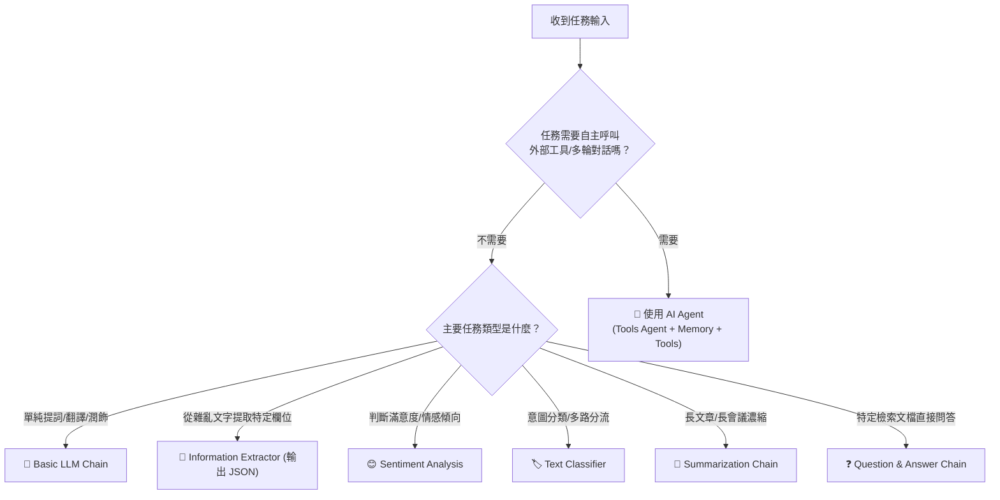

# 🤖 n8n AI 應用與智慧代理（AI Agent）全方位教學

歡迎來到 **n8n AI 應用與 AI Agent 智慧代理實戰教學**！

本章節專為初學者到進階開發者設計，採用**「先基礎概念、後進階實作」**的漸進式教學路徑：
1. **🟢 基礎篇**：先從最穩定、單純的 **專用 AI 節點（Basic LLM Chain、資訊提取、情緒分析、分類器、摘要、問答鏈）** 開始，讓您無門檻理解大語言模型（LLM）如何與 n8n 工作流協同運作。
2. **🟡 核心篇**：進入具備「自主思考、決策與工具調用」能力的 **AI Agent（智慧代理）** 核心骨幹。
3. **🔴 實戰篇**：落地到企業級真實場景，包含 **RAG 向量知識庫、子工作流調用、郵件分類閉環、多代理人協作（Multi-Agent）與全渠道客服中樞**。

> 💡 **AI 協作時代學習法**：在學習完基礎節點操作並透過 MCP 連線 AI（Gemini、ChatGPT 或 Claude）後，您可以直接複製每個範例下方的 **「AI 賦能延伸實作」** 折疊區塊（`<details>`）內的 Prompt 提詞，交由 AI 助理替您在畫布上全自動建構與擴充進階邏輯！

---

## 🧭 AI 節點選擇指南：專用節點 vs AI Agent

在 n8n 中，並非所有 AI 任務都需要動用龐大複雜的 AI Agent。根據任務特性選擇合適的節點，能讓工作流更穩定、成本更低、執行速度更快：

| 比較項目 | 專用基礎 AI 節點 / Chains (基礎篇) | AI Agent 智慧代理 (核心與實戰篇) |
| :--- | :--- | :--- |
| **代表節點** | `Basic LLM Chain`, `Information Extractor`, `Text Classifier`, `Sentiment Analysis`, `Summarization Chain` | `AI Agent` (Tools Agent) |
| **決策邏輯** | **確定性單向流程**（輸入 ➔ 處理 ➔ 輸出） | **自主推理循環**（思考 ➔ 決定工具 ➔ 執行 ➔ 總結） |
| **工具調用** | 無（專注於單一文字處理任務） | 具備（可自主決定呼叫 API、計算機、搜尋或子工作流） |
| **執行成本與速度** | ⚡ 最快、Token 消耗少、結果精準可控 | 🧠 較多 Token 消耗、需多輪推理思考 |
| **最佳適用情境** | 格式轉換、內容潤飾、意圖分類、情緒打分、文章摘要 | 互動聊天機器人、多工具動態調度、複合型業務代理 |



---

## 🚀 零成本快速入門：Ollama 與 Google Gemini

在開始之前，若您希望以**零 API 成本**進行本章節的所有學習：

> 📖 **[Ollama 本地安裝與設定指南](./Ollama安裝與設定.md)**  
> 包含 macOS / Windows / Linux 安裝、免費下載 `llama3`、`gemma` 模型及 n8n 憑證串接說明。另外也可直接使用 **Google Gemini API**（提供免費額度且無需信用卡綁定）。

---

## 📚 目錄導覽

- [【第一階段：基礎篇 🟢】專用 AI 節點與基本鏈（了解基本 AI 的使用）](#第一階段基礎篇-專用-ai-節點與基本鏈了解基本-ai-的使用)
  - [1. 基礎：Basic LLM Chain（基礎提示詞與文字生成）](#1-基礎basic-llm-chain基礎提示詞與文字生成)
  - [2. 基礎：Information Extractor（非結構化文字轉結構化 JSON）](#2-基礎information-extractor非結構化文字轉結構化-json)
  - [3. 基礎：Sentiment Analysis（文字情緒與滿意度分析）](#3-基礎sentiment-analysis文字情緒與滿意度分析)
  - [4. 基礎：Text Classifier（文字意圖分類與智慧路由）](#4-基礎text-classifier文字意圖分類與智慧路由)
  - [5. 基礎：Summarization Chain（長文本智慧摘要濃縮）](#5-基礎summarization-chain長文本智慧摘要濃縮)
  - [6. 基礎：Question and Answer Chain（基礎文件檢索問答鏈）](#6-基礎question-and-answer-chain基礎文件檢索問答鏈)
- [【第二階段：核心篇 🟡】AI Agent 原理與工具調用](#第二階段核心篇-ai-agent-原理與工具調用)
  - [7. 實作：智能客服聊天機器人（純對話與對話記憶）](#7-實作智能客服聊天機器人純對話與對話記憶)
  - [8. 實作：臺北市 YouBike 2.0 即時站點查詢助理（單一工具呼叫）](#8-實作臺北市-youbike-20-即時站點查詢助理單一工具呼叫)
  - [9. 實作：多工具整合即時天氣與新聞助理（多工具動態決策）](#9-實作多工具整合即時天氣與新聞助理多工具動態決策)
- [【第三階段：實戰篇 🔴】企業級進階應用與落地整合](#第三階段實戰篇-企業級進階應用與落地整合)
  - [10. 實作：企業私有知識庫 RAG 智慧問答系統（文件向量檢索）](#10-實作企業私有知識庫-rag-智慧問答系統文件向量檢索)
  - [11. 實作：具備工作流呼叫能力的 AI 萬能助理（Call Workflow Tool）](#11-實作具備工作流呼叫能力的-ai-萬能助理call-workflow-tool)
  - [12. 實作：Gmail 客服郵件智慧分類與自動歸檔系統（結構化業務閉環）](#12-實作gmail-客服郵件智慧分類與自動歸檔系統結構化業務閉環)
  - [13. 實作：多代理人協作團隊（Multi-Agent Supervisor 經理與專家架構）](#13-實作多代理人協作團隊multi-agent-supervisor-經理與專家架構)
  - [14. 實作：端到端客戶服務自動化平台（全渠道智慧分流與工單閉環）](#14-實作端到端客戶服務自動化平台全渠道智慧分流與工單閉環)

---

## 【第一階段：基礎篇 🟢】專用 AI 節點與基本鏈（了解基本 AI 的使用）

本階段聚焦於 n8n 內建的六大專用 AI 基礎節點，協助您在無需建立複雜 Agent 的情況下，快速將 AI 整合進現有自動化流程。

---

### 1. [基礎：Basic LLM Chain（基礎提示詞與文字生成）](./Basic_LLM_Chain/README.md)

最純粹、最穩定的 AI 入門起點！學習如何透過 Prompt 與大語言模型互動，進行文本翻譯、語氣潤飾或自動生成。

**學習重點**：
- Basic LLM Chain 節點基本架構與模型綁定（Ollama / Gemini / OpenAI）
- 使用 System Message 與 Prompt 提示詞規範輸出格式
- 在提示詞中動態引用上游節點資料（例如 `{{ $json.user_comment }}`）
- 多語言即時翻譯與在地化文案潤飾實作

- **附帶樣版**：[`Basic_LLM_Chain.json`](./Basic_LLM_Chain/Basic_LLM_Chain.json)

<details>
<summary>🤖 <strong>AI 賦能延伸實作（附 Prompt 提詞）</strong></summary>

> 💡 **任務目標**：透過 MCP 連線，讓 AI 為商品特色自動生成多語言社群宣傳文案與熱門標籤。

**可直接複製給 AI 的 Prompt 提詞**：
```text
請在 n8n 替我建立一個「多語言社群文案生成」工作流程：
1. 起點使用 Manual Trigger 節點，模擬輸入商品名稱與商品特色（product_name: "智能溫控保溫杯", features: "24小時長效保溫、LED觸控溫度顯示、316不銹鋼內膽"）。
2. 串接 Basic LLM Chain 節點，並連接 Ollama Chat Model 或 Google Gemini 模型。
3. Prompt 設定：請扮演專業社群行銷專家，根據輸入的商品資訊生成一段 100 字以內吸引人的繁體中文 Instagram 推廣短文，並附上 5 個精選熱門 Hashtags。
4. 將生成結果整理為包含 original_product, social_post, hashtags 欄位的標準 JSON 輸出。
請幫我建立所有節點並完成連線！
```
</details>

---

### 2. [基礎：Information Extractor（非結構化文字轉結構化 JSON）](./Information_Extractor/README.md)

告別複雜難維護的 Regular Expression（正規表達式）！直接利用 AI 從雜亂無章的 Email、留言或發票中，精準抽取強型別 JSON 欄位。

**學習重點**：
- Information Extractor 節點運作原理與 JSON Schema 定義
- 定義字串（String）、數字（Number）、布林值（Boolean）與物件陣列（Array）
- 自動處理非制式訂購留言、LINE 詢價訊息、履歷或發票文字
- 將抽取出的乾淨資料直接銜接資料庫或 Google Sheets 寫入

- **附帶樣版**：[`Information_Extractor.json`](./Information_Extractor/Information_Extractor.json)

<details>
<summary>🤖 <strong>AI 賦能延伸實作（附 Prompt 提詞）</strong></summary>

> 💡 **任務目標**：透過 AI 解析非制式客戶下單信件，自動提取買家資訊與商品購買明細。

**可直接複製給 AI 的 Prompt 提詞**：
```text
請在 n8n 建立一個「訂單郵件資訊結構化擷取」工作流程：
1. 起點使用 Manual Trigger，模擬一段雜亂的客戶訂購文字：「您好，我是陳大明（電話0912-345-678），請幫我寄到台北市信義區信義路五段7號。我要訂購高山烏龍茶 2 包（每包450元）還有日月潭紅茶 1 包（每包380元），謝謝！」。
2. 串接 Information Extractor 節點，連接 LLM 模型。
3. 定義 Schema 提取以下欄位：
   - customer_name (String)
   - phone (String)
   - shipping_address (String)
   - order_items (Array of Objects: 包含 item_name, quantity, unit_price)
   - total_amount (Number)
4. 後方串接 Set 節點驗證抽取出的結構化 JSON。
請幫我完成整體流程與 Schema 設定！
```
</details>

---

### 3. [基礎：Sentiment Analysis（文字情緒與滿意度分析）](./Sentiment_Analysis/README.md)

即時掌握顧客情緒！自動分析客戶回饋的情感傾向，快速捕捉負面客訴並啟動預警機制。

**學習重點**：
- Sentiment Analysis 節點原理與三段式（Positive、Neutral、Negative）情緒判別
- 自訂細部情感標籤（如：極度滿意、一般好評、疑慮詢問、憤怒投訴）
- 取得情緒信心分數（Confidence Score）
- 搭配 IF 節點：若偵測到負面極端情緒立即觸發緊急推播通知

- **附帶樣版**：[`Sentiment_Analysis.json`](./Sentiment_Analysis/Sentiment_Analysis.json)

<details>
<summary>🤖 <strong>AI 賦能延伸實作（附 Prompt 提詞）</strong></summary>

> 💡 **任務目標**：透過 AI 分析 App Store 評論，遇負面差評時自動發送 Telegram 警報給客服主管。

**可直接複製給 AI 的 Prompt 提詞**：
```text
請在 n8n 建立一個「客戶評論情緒監控與預警」工作流程：
1. 起點接收客戶評論留言（comment: "更新後一直閃退，登入資料都不見了，非常糟糕的體驗！"）。
2. 串接 Sentiment Analysis 節點，自訂 4 種情緒等級：delighted, neutral, disappointed, angry。
3. 串接 IF 節點判斷情緒是否為 "disappointed" 或 "angry"：
   - True 分支：串接 Telegram 節點發送警報「🚨 收到嚴重負面評論，請客服主管立即處理！內容：{{ $json.comment }}」。
   - False 分支：直接記錄為一般日誌。
請幫我建立所有節點並完成邏輯配置！
```
</details>

---

### 4. [基礎：Text Classifier（文字意圖分類與智慧路由）](./Text_Classifier/README.md)

自動化流程的智慧總機！根據文字內容將任務精準分類，配合 Switch 節點實現多路分支路由。

**學習重點**：
- Text Classifier 節點分類規則與 Zero-shot 分類機制
- 設定多類別標籤（如：技術支援、帳務發票、業務洽詢、人事招聘）
- 設定 Fallback 兜底類別（防止無法識別的情況）
- 搭配 Switch 節點實現自動化業務派工與跨部門流轉

- **附帶樣版**：[`Text_Classifier.json`](./Text_Classifier/Text_Classifier.json)

<details>
<summary>🤖 <strong>AI 賦能延伸實作（附 Prompt 提詞）</strong></summary>

> 💡 **任務目標**：建立智慧客服分流中樞，將進線問題自動派發至對應部門。

**可直接複製給 AI 的 Prompt 提詞**：
```text
請幫我在 n8n 建立一個「進線諮詢智慧分類分流」工作流程：
1. 起點使用 Manual Trigger 接收客戶問題 text。
2. 串接 Text Classifier 節點，連接 LLM 模型，定義 4 種分類類別：
   - technical_issue（系統異常、連線錯誤、操作疑問）
   - billing_inquiry（退款申請、發票開立、方案扣款）
   - sales_cooperation（企業方案、商務合作、報價需求）
   - general_faq（其他一般問題）
3. 後方串接 Switch 節點，針對 4 種輸出類別分別引導至不同的處理分支（如寄送特定範本或寫入工單）。
請幫我建立完整的工作流與分支連線！
```
</details>

---

### 5. [基礎：Summarization Chain（長文本智慧摘要濃縮）](./Summarization_Chain/README.md)

長篇大論救星！一秒精煉長篇新聞、會議記錄與政策法規，產出條理分明的重點摘要。

**學習重點**：
- Summarization Chain 節點運作機制
- **Stuff 模式**（短中篇文本快速整合）vs **Map-Reduce 模式**（處理超出 Token 限制的超長文件）
- 自訂摘要輸出規範（例如：限制 3 點核心要點、列出潛在風險與行動建議）

- **附帶樣版**：[`Summarization_Chain.json`](./Summarization_Chain/Summarization_Chain.json)

<details>
<summary>🤖 <strong>AI 賦能延伸實作（附 Prompt 提詞）</strong></summary>

> 💡 **任務目標**：抓取科技新聞長文，自動以 Map-Reduce 產出三段式精簡晨報。

**可直接複製給 AI 的 Prompt 提詞**：
```text
請在 n8n 替我建立一個「長篇新聞智慧晨報摘要」流程：
1. 起點輸入一篇長篇科技報導文字（article_content）。
2. 串接 Summarization Chain 節點，選擇 Map-Reduce 摘要模式，連接 LLM 模型。
3. 設定摘要要求：
   - 【一句話核心精華】（30字內）
   - 【3 大關鍵亮點】（條列式說明）
   - 【產業影響與後續追蹤】（50字內）
4. 輸出格式為乾淨的 Markdown 格式。
請幫我在畫布上建立並完成設定！
```
</details>

---

### 6. [基礎：Question and Answer Chain（基礎文件檢索問答鏈）](./Question_and_Answer_Chain/README.md)

RAG 知識庫的最簡實踐！讓 AI 根據指定的檢索文件（Retriever）直接回答問題，杜絕模型胡言亂語。

**學習重點**：
- Question and Answer Chain 節點架構
- 連接 Vector Store Retriever 檢索器
- 限制 AI 僅根據參考文件內容作答的邊界設定
- 與 AI Agent 的差異：單向問答無額外推理循環，反應速度更快

- **附帶樣版**：[`Question_and_Answer_Chain.json`](./Question_and_Answer_Chain/Question_and_Answer_Chain.json)

<details>
<summary>🤖 <strong>AI 賦能延伸實作（附 Prompt 提詞）</strong></summary>

> 💡 **任務目標**：建立產品售後規章專屬問答鏈，只依據說明書條款回答。

**可直接複製給 AI 的 Prompt 提詞**：
```text
請在 n8n 建立一個「產品售後規章 Q&A 問答鏈」：
1. 建立 Question and Answer Chain 節點，連接 LLM 模型。
2. 掛載 In-Memory Vector Store 作為 Retriever，預載產品保固政策（如人為損壞不保固、憑發票享一年保固）。
3. 當收到問題時，AI 僅依據規章檢索結果回答，若文件中未提及則明確回覆「規章中未包含此資訊」。
請幫我配置好該問答鏈與檢索器！
```
</details>

---

## 【第二階段：核心篇 🟡】AI Agent 原理與工具調用

當您的需求超越單向的文字處理，需要 AI **自主決定是否調用外部工具、查詢即時資料、或保持連續對話記憶** 時，就正式邁入 AI Agent 的領域！

---

### 7. [實作：智能客服聊天機器人（純對話與對話記憶）](./智能客服聊天機器人/README.md)

**難度**：入門 🟢 ｜ **亮點**：零門檻入門！對話記憶、角色設定與本地 Ollama / OpenAI 切換。

學習 AI Agent 的基本骨幹架構，透過 Chat Trigger 建立具備 Window Buffer Memory 連續對話記憶能力的客服助理。

**學習重點**：
- AI Agent 核心節點與 Chat Trigger 對話入口
- System Prompt 角色人格與回答邊界設計
- 記憶模組（Window Buffer Memory）的上下文長度控制
- 支援本機 Ollama（零成本）、Gemini 與 OpenAI 模型切換

- **附帶樣版**：[`智能客服聊天機器人.json`](./智能客服聊天機器人/智能客服聊天機器人.json)

<details>
<summary>🤖 <strong>AI 賦能延伸實作（附 Prompt 提詞）</strong></summary>

> 💡 **任務目標**：透過 MCP 連線，讓 AI 增加多語言自動偵測能力，並在用戶說「再見」時自動總結本次對話要點。

**可直接複製給 AI 的 Prompt 提詞**：
```text
請幫我在目前的「智能客服聊天機器人」工作流程中進行升級：
1. 更新 AI Agent 的 System Prompt：加入多語言自動偵測，要求以用戶發問的語言（繁中/英文/日文）進行同語系回答。
2. 設定結束對話邏輯：若用戶表達「謝謝、再見、結束諮詢」等意圖，在回答結尾以條列式附帶本次對話的 3 點核心摘要。
請幫我配置好 System Prompt 與相關參數！
```
</details>

---

### 8. [實作：臺北市 YouBike 2.0 即時站點查詢助理（單一工具呼叫）](./台北市youbike站點資訊查詢/README.md)

**難度**：入門 🟢 ｜ **亮點**：讓 AI 具備查資料能力！向政府開放資料 API 即時查詢車輛數。

引入單一 HTTP Request Tool，讓 AI Agent 具備向外部即時查詢的能力，回答台北市各站點即時可借可還車輛數。

**學習重點**：
- 為 AI Agent 掛載 Tool（工具）的核心觀念
- HTTP Request Tool 串接台北市開放資料 API
- 工具描述（Description）對 LLM 決策的重要影響
- 自然語言理解與 API 資料的解讀轉譯

- **附帶樣版**：[`台北市youbike站點資訊查詢.json`](./台北市youbike站點資訊查詢/台北市youbike站點資訊查詢.json)

<details>
<summary>🤖 <strong>AI 賦能延伸實作（附 Prompt 提詞）</strong></summary>

> 💡 **任務目標**：透過 MCP 連線，讓 AI 在查無車輛時，自動推薦周邊距離最近的 2 個替代站點。

**可直接複製給 AI 的 Prompt 提詞**：
```text
請幫我在「台北市 YouBike 查詢助理」中擴充推薦邏輯：
1. 更新 AI Agent 的提示詞：當使用者查詢的站點「可借車輛數為 0」時，AI 必須自動在 API 回傳的同區域站點清單中，找出可借車輛大於 3 輛且名稱最相近的 2 個替代站點推薦給用戶。
2. 輸出格式以繁體中文表格呈現：「推薦站點名稱」、「目前可借車數」、「地址」。
請幫我更新 System Prompt！
```
</details>

---

### 9. [實作：多工具整合即時天氣與新聞助理（多工具動態決策）](./天氣和新聞查詢_使用Ollama/README.md)

**難度**：初中級 🟡 ｜ **亮點**：多工具動態決策！AI 自主判斷使用者想問天氣還是新聞並分別呼叫。

同時為 AI Agent 配置天氣 API 與新聞 RSS 閱讀器，AI 能夠根據問題自主選擇工具，並使用 `$fromAI()` 動態生成查詢參數。

**學習重點**：
- 多工具（Multi-Tools）並存時的決策路由
- `$fromAI()` 語法動態將 LLM 參數注入工具請求
- RSS Feed Read Tool 讀取新聞串流
- 整合不同來源資料並組裝成條理分明的綜合回答

- **附帶樣版**：[`天氣和新聞查詢_使用Ollama.json`](./天氣和新聞查詢_使用Ollama/天氣和新聞查詢_使用Ollama.json)

<details>
<summary>🤖 <strong>AI 賦能延伸實作（附 Prompt 提詞）</strong></summary>

> 💡 **任務目標**：透過 MCP 連線，增加「出門穿搭與行程建議」整合能力。

**可直接複製給 AI 的 Prompt 提詞**：
```text
請幫我在「天氣與新聞助理」工作流程中加入生活管家邏輯：
1. 在 System Message 中新增規範：當用戶詢問天氣時，AI 除了回報氣溫與降雨機率，必須根據天氣數據額外給予 2 點「穿搭建議」與「是否需攜帶雨具」。
2. 若用戶同時詢問新聞，在回答末尾以「今日科技焦點」精選 1 則最重要的新聞標題與簡評。
請幫我更新提示詞！
```
</details>

---

## 【第三階段：實戰篇 🔴】企業級進階應用與落地整合

本階段帶您將 AI Agent 融入企業核心業務流程，打通私有文件知識庫、跨系統子工作流、多代理人團隊與全渠道服務。

---

### 10. [實作：企業私有知識庫 RAG 智慧問答系統（文件向量檢索）](./RAG智能問答系統/README.md)

**難度**：中級 🟡 ｜ **亮點**：徹底杜絕 AI 幻覺！讀取內部規章與 PDF 文件，精準依據知識庫回答。

學習 RAG（檢索增強生成）技術，將 PDF、Word 或試算表切塊（Chunking）、向量化（Embeddings）並儲存至 Vector Store，讓 AI 依據檢索到的精準段落作答。

**學習重點**：
- 向量資料庫（In-Memory / Supabase / PostgreSQL PGVector / Pinecone）
- Document Loader 文件切塊與 Text Splitter 策略
- Embeddings 向量模型原理與語意相似度檢索
- 結合 Vector Store Retriever 打造零幻覺企業 FAQ 機器人

- **完整 RAG 教學**：[進入 RAG 智能問答系統完整專案](./RAG智能問答系統/README.md)

<details>
<summary>🤖 <strong>AI 賦能延伸實作（附 Prompt 提詞）</strong></summary>

> 💡 **任務目標**：透過 MCP 連線，讓 AI 在回答時自動附上知識庫引用出處（頁碼或檔名）。

**可直接複製給 AI 的 Prompt 提詞**：
```text
請幫我在 RAG 知識庫問答流程中增加引用來源標註：
1. 在 AI Agent System Message 中要求：所有回答內容必須嚴格引用檢索到的文檔內容，若知識庫無相關資料請回答「抱歉，目前內部規章中查無此資料」。
2. 每次回答必須在文末標註：【資料出處：檔名 / 章節標題】。
請幫我更新 RAG Agent 提示詞設定！
```
</details>

---

### 11. [實作：具備工作流呼叫能力的 AI 萬能助理（Call Workflow Tool）](./具備工具使用能力的助理/README.md)

**難度**：中級 🟡 ｜ **亮點**：讓 AI 能觸發 n8n 工作流！呼叫運算工具與自訂子流程完成複雜任務。

解鎖最強大整合力！讓 AI Agent 透過 **Call n8n Workflow Tool** 調用其他獨立的 n8n 自動化流程（例如發送通知、更新資料庫或建立訂單）。

**學習重點**：
- Calculator Tool 解決 LLM 不擅長精確數學計算的弱點
- Call n8n Workflow Tool 將現有工作流程包裝為 AI 工具
- 工具輸入與輸出參數的 Schema 規範
- 打造可執行複合型業務指令的智慧中樞

- **附帶樣版**：[`ai_tools_assistant.json`](./具備工具使用能力的助理/ai_tools_assistant.json)

<details>
<summary>🤖 <strong>AI 賦能延伸實作（附 Prompt 提詞）</strong></summary>

> 💡 **任務目標**：透過 MCP 連線，讓 AI 在完成複雜運算後，自動將結果以 LINE / Telegram 訊息推播給使用者。

**可直接複製給 AI 的 Prompt 提詞**：
```text
請幫我在「具備工具使用能力的助理」流程中串接通知子工作流：
1. 建立一個子工作流程（Sub-workflow），接收參數 message 並透過 Telegram 發送。
2. 在 AI Agent 下方掛載 Call n8n Workflow Tool，描述為「當用戶要求將結果同步發送至通訊軟體時使用此工具」。
請幫我完成主流程與工具節點配置！
```
</details>

---

### 12. [實作：Gmail 客服郵件智慧分類與自動歸檔系統](./郵件智能分類系統/README.md)

**難度**：中高級 🟠 ｜ **亮點**：業務落地實戰！自動閱讀 Email、分類客訴/詢價並提取關鍵資料歸檔。

結合 Webhook / Gmail 觸發，AI 自動閱讀進線郵件，輸出包含類別（投訴/詢價/技術）、急迫度與 30 字摘要的標準 JSON，緊急事件立即推播，全量資料寫入 Google 試算表。

**學習重點**：
- 結構化提示詞（Structured JSON Output）規範
- 條件路由（IF 節點）過濾高風險緊急客訴
- 自動化工單登記與 Google Sheets / Database 存檔
- 企業客服流程自動化閉環

- **附帶樣版**：[`email_classifier_workflow.json`](./郵件智能分類系統/email_classifier_workflow.json)

<details>
<summary>🤖 <strong>AI 賦能延伸實作（附 Prompt 提詞）</strong></summary>

> 💡 **任務目標**：透過 MCP 連線，讓 AI 在分類完畢後自動擬定一封專業的客服回覆信草稿。

**可直接複製給 AI 的 Prompt 提詞**：
```text
請幫我在「郵件智能分類系統」中新增 AI 自動擬信功能：
1. 郵件分類完成後，由 AI Agent 依據信件類別生成專屬回覆 Email 內文。
2. 串接 Gmail 節點（Operation: Create Draft 建立草稿），將 AI 擬好的信件存入客服信箱的草稿匣供專員審核。
請幫我建立相關節點與連線！
```
</details>

---

### 13. [實作：多代理人協作團隊（Multi-Agent Supervisor 經理與專家架構）](./多代理協作系統/README.md)

**難度**：進階 🔴 ｜ **亮點**：打造 AI 團隊！主管 Agent 分解任務並指揮「研究員」與「文案師」協同完成。

實作階層式多代理架構（Hierarchical Multi-Agent）。專案主管（Supervisor Agent）接收複雜任務後，自動將任務拆解並指派給子代理專家，最後彙整產出高水準企劃。

**學習重點**：
- Multi-Agent 系統設計與職責分離（Separation of Concerns）
- 將 Agent 包裝為 Agent Tool 供主管 Agent 調用
- 複雜任務分解、上下文傳遞與多次迭代
- 模擬企業內部「調研 ➔ 撰稿 ➔ 審核」的協同作業流程

- **附帶樣版**：[`multi_agent_system.json`](./多代理協作系統/multi_agent_system.json)

<details>
<summary>🤖 <strong>AI 賦能延伸實作（附 Prompt 提詞）</strong></summary>

> 💡 **任務目標**：透過 MCP 連線，在多代理團隊中加入「SEO 關鍵字審查專家」。

**可直接複製給 AI 的 Prompt 提詞**：
```text
請幫我在目前的「多代理協作系統」中新增第 3 位專家 Agent：
1. 新增一個 Agent Tool：「SEO 關鍵字優化師」，專門檢查文案中的關鍵字密度、標題吸引度並給予評分（1~100）。
2. 主管 Agent 流程調整：研究員完成調研 ➔ 文案師撰寫內容 ➔ SEO 專家進行優化審查 ➔ 主管匯總輸出最終企劃。
請幫我配置新專家節點與主管調度提示詞！
```
</details>

---

### 14. [實作：端到端客戶服務自動化平台（全渠道智慧分流與工單閉環）](./客戶服務自動化平台/README.md)

**難度**：高級 🔴 ｜ **亮點**：企業級全渠道架構！知識庫比對、意圖分流、人機轉接與工單追蹤。

整合 Webhook、RAG 向量檢索、意圖判斷與真人升級機制的企業級全渠道客服中樞，支援即時回傳 API 與數據持久化。

**學習重點**：
- 全渠道統一 Webhook 接入（官網 Web、LINE、Telegram、App）
- AI 自主判斷「直接回答」vs「升級真人客服工單」
- 與資料庫（Supabase / PostgreSQL / Sheets）同步工單狀態
- 企業生產環境高可用性與例外防護

- **附帶樣版**：[`customer_service_platform.json`](./客戶服務自動化平台/customer_service_platform.json)

<details>
<summary>🤖 <strong>AI 賦能延伸實作（附 Prompt 提詞）</strong></summary>

> 💡 **任務目標**：透過 MCP 連線，當觸發轉接真人時，自動在 Slack 或 Telegram 發送包含一鍵認領按鈕的互動卡片。

**可直接複製給 AI 的 Prompt 提詞**：
```text
請幫我在「客戶服務自動化平台」的升級分支中擴充互動通知：
1. 當 escalate_to_human 為 true 時，透過 Telegram 節點發送包含「工單編號」、「客戶問題」與「立即認領」Inline Keyboard 按鈕的訊息。
2. 點擊按鈕時回傳 Webhook 標記該工單已被認領。
請幫我配置相關節點與參數！
```
</details>

---

## 🎯 建議學習階梯

```
[第一階段：基礎 AI 節點 🟢]
1. Basic LLM Chain ➔ 掌握基礎 Prompt 與 LLM 互動
2. Information Extractor ➔ 掌握非結構化文字轉 JSON
3. Sentiment Analysis ➔ 掌握顧客情緒分析與警報
4. Text Classifier ➔ 掌握意圖多分類與流程路由
5. Summarization Chain ➔ 掌握長文本與會議記錄摘要
6. Question & Answer Chain ➔ 掌握單向檢索問答

[第二階段：核心 AI Agent 🟡]
7. 智能客服聊天機器人 ➔ 掌握 Chat Trigger 與對話記憶
8. 台北市 YouBike 查詢 ➔ 掌握單一 API 工具整合
9. 天氣與新聞查詢 ➔ 掌握多工具動態決策與 $fromAI()

[第三階段：進階實戰與多代理 🔴]
10. RAG 智能問答系統 ➔ 掌握文件向量化與私有知識庫
11. 具備工具使用能力的助理 ➔ 掌握 Call Workflow Tool 與運算
12. 郵件智能分類系統 ➔ 掌握結構化輸出與業務工單閉環
13. 多代理協作系統 ➔ 掌握 Supervisor 主管與專家團隊協同
14. 客戶服務自動化平台 ➔ 掌握全渠道整合與真人升級機制
```
