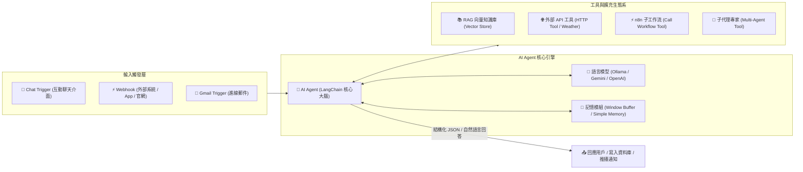

# 🤖 整合 LLM 模型的 AI Agent

歡迎來到 **n8n AI Agent 智慧代理實戰教學**！在本章節中，您將學習如何將 **大型語言模型（LLM）**（包含本地運行的 **Ollama**、免費的 **Google Gemini**、以及業界主流的 **OpenAI GPT** 與 **Claude**）與 **LangChain AI 節點** 深度整合，建構具備自主思考、工具調用（Tool Calling）、檢索增強生成（RAG）與多代理協作（Multi-Agent）能力的企業級自動化系統。

> 💡 **AI 協作時代學習法**：在學習完基礎概念並透過 MCP 連線 AI（Gemini、ChatGPT 或 Claude）後，您可以直接複製每個範例下方的 **「AI 賦能延伸實作」** 折疊區塊（`<details>`）內的 Prompt 提詞，交由 AI 助理替您在畫布上全自動建構與擴充進階邏輯！

---

## 📚 什麼是 AI Agent？

傳統自動化流程依賴於「固定規則（If-Else）」；而 **AI Agent（智慧代理）** 則具備「自主推理與決策」能力：

1. **🧠 理解與推理（Reasoning）**：理解用戶的模糊需求與對話上下文。
2. **🛠️ 工具調用（Tool Calling）**：當自身知識不足時，自主決定呼叫計算機、搜尋引擎、外部 API 或 n8n 子工作流。
3. **📖 檢索增強（RAG）**：從企業私有文件（PDF/Word/試算表）中檢索精準段落，杜絕模型幻覺。
4. **👥 多代理協作（Multi-Agent）**：如同一家小型公司，主管 Agent 拆解任務並指揮調研員、文案師等專家 Agent 協同完成複雜企劃。

---

## 🧭 AI Agent 核心架構



---

## 🚀 零成本快速入門：Ollama 與 Google Gemini

在開始之前，若您希望以**零 API 成本**進行本章節的所有學習：

> 📖 **[Ollama 本地安裝與設定指南](./Ollama安裝與設定.md)**  
> 包含 macOS / Windows / Linux 安裝、免費下載 `llama3`、`gemma` 模型及 n8n 憑證串接說明。另外也可直接使用 **Google Gemini API**（提供免費額度且無需信用卡綁定）。

---

## 📚 實作範例導覽（由淺至深）

本教學規劃了三個階段、共八個循序漸進的實作範例：

---

### 【階段一：基礎對話與工具呼叫】

---

### 1. [範例 1：智能客服聊天機器人（純對話與對話記憶）](./智能客服聊天機器人/README.md)

**難度**：入門 🟢 ｜ **亮點**：零門檻入門！對話記憶、角色設定與本地 Ollama / OpenAI 切換。

學習 AI Agent 的基本骨幹架構，透過 Chat Trigger 建立具備 Window Buffer Memory 連續對話記憶能力的客服助理。

**學習重點**：
- AI Agent 核心節點與 Chat Trigger 對話入口
- System Prompt 角色人格與回答邊界設計
- 記憶模組（Window Buffer Memory）的上下文長度控制
- 支援本機 Ollama（零成本）、Gemini 與 OpenAI 模型切換

- **附帶樣版**：[`智能客服聊天機器人.json`](./智能客服聊天機器人/智能客服聊天機器人.json)

<details>
<summary>🤖 <strong>AI 賦能延伸實作（附 Prompt 提詞）</strong></summary>

> 💡 **任務目標**：透過 MCP 連線，讓 AI 增加多語言自動偵測能力，並在用戶說「再見」時自動總結本次對話要點。

**可直接複製給 AI 的 Prompt 提詞**：
```text
請幫我在目前的「智能客服聊天機器人」工作流程中進行升級：
1. 更新 AI Agent 的 System Prompt：加入多語言自動偵測，要求以用戶發問的語言（繁中/英文/日文）進行同語系回答。
2. 設定結束對話邏輯：若用戶表達「謝謝、再見、結束諮詢」等意圖，在回答結尾以條列式附帶本次對話的 3 點核心摘要。
請幫我配置好 System Prompt 與相關參數！
```
</details>

---

### 2. [範例 2：臺北市 YouBike 2.0 即時站點查詢助理（單一工具呼叫）](./台北市youbike站點資訊查詢/README.md)

**難度**：入門 🟢 ｜ **亮點**：讓 AI 具備查資料能力！向政府開放資料 API 即時查詢車輛數。

引入單一 HTTP Request Tool，讓 AI Agent 具備向外部即時查詢的能力，回答台北市各站點即時可借可還車輛數。

**學習重點**：
- 為 AI Agent 掛載 Tool（工具）的核心觀念
- HTTP Request Tool 串接台北市開放資料 API
- 工具描述（Description）對 LLM 決策的重要影響
- 自然語言理解與 API 資料的解讀轉譯

- **附帶樣版**：[`台北市youbike站點資訊查詢.json`](./台北市youbike站點資訊查詢/台北市youbike站點資訊查詢.json)

<details>
<summary>🤖 <strong>AI 賦能延伸實作（附 Prompt 提詞）</strong></summary>

> 💡 **任務目標**：透過 MCP 連線，讓 AI 在查無車輛時，自動推薦周邊距離最近的 2 個替代站點。

**可直接複製給 AI 的 Prompt 提詞**：
```text
請幫我在「台北市 YouBike 查詢助理」中擴充推薦邏輯：
1. 更新 AI Agent 的提示詞：當使用者查詢的站點「可借車輛數為 0」時，AI 必須自動在 API 回傳的同區域站點清單中，找出可借車輛大於 3 輛且名稱最相近的 2 個替代站點推薦給用戶。
2. 輸出格式以繁體中文表格呈現：「推薦站點名稱」、「目前可借車數」、「地址」。
請幫我更新 System Prompt！
```
</details>

---

### 3. [範例 3：多工具整合即時天氣與新聞助理（多工具動態決策）](./天氣和新聞查詢_使用Ollama/README.md)

**難度**：初中級 🟡 ｜ **亮點**：多工具動態決策！AI 自主判斷使用者想問天氣還是新聞並分別呼叫。

同時為 AI Agent 配置天氣 API 與新聞 RSS 閱讀器，AI 能夠根據問題自主選擇工具，並使用 `$fromAI()` 動態生成查詢參數。

**學習重點**：
- 多工具（Multi-Tools）並存時的決策路由
- `$fromAI()` 語法動態將 LLM 參數注入工具請求
- RSS Feed Read Tool 讀取新聞串流
- 整合不同來源資料並組裝成條理分明的綜合回答

- **附帶樣版**：[`天氣和新聞查詢_使用Ollama.json`](./天氣和新聞查詢_使用Ollama/天氣和新聞查詢_使用Ollama.json)

<details>
<summary>🤖 <strong>AI 賦能延伸實作（附 Prompt 提詞）</strong></summary>

> 💡 **任務目標**：透過 MCP 連線，增加「出門穿搭與行程建議」整合能力。

**可直接複製給 AI 的 Prompt 提詞**：
```text
請幫我在「天氣與新聞助理」工作流程中加入生活管家邏輯：
1. 在 System Message 中新增規範：當用戶詢問天氣時，AI 除了回報氣溫與降雨機率，必須根據天氣數據額外給予 2 點「穿搭建議」與「是否需攜帶雨具」。
2. 若用戶同時詢問新聞，在回答末尾以「今日科技焦點」精選 1 則最重要的新聞標題與簡評。
請幫我更新提示詞！
```
</details>

---

### 【階段二：RAG 知識庫與工作流自動化】

---

### 4. [範例 4：企業私有知識庫 RAG 智慧問答系統（文件向量檢索）](./RAG智能問答系統/README.md)

**難度**：中級 🟡 ｜ **亮點**：徹底杜絕 AI 幻覺！讀取內部規章與 PDF 文件，精準依據知識庫回答。

學習 RAG（檢索增強生成）技術，將 PDF、Word 或試算表切塊（Chunking）、向量化（Embeddings）並儲存至 Vector Store，讓 AI 依據檢索到的精準段落作答。

**學習重點**：
- 向量資料庫（In-Memory / Supabase / PostgreSQL PGVector / Pinecone）
- Document Loader 文件切塊與 Text Splitter 策略
- Embeddings 向量模型原理與語意相似度檢索
- 結合 Vector Store Retriever 打造零幻覺企業 FAQ 機器人

- **完整 RAG 教學**：[進入 RAG 智能問答系統完整專案](./RAG智能問答系統/README.md)

<details>
<summary>🤖 <strong>AI 賦能延伸實作（附 Prompt 提詞）</strong></summary>

> 💡 **任務目標**：透過 MCP 連線，讓 AI 在回答時自動附上知識庫引用出處（頁碼或檔名）。

**可直接複製給 AI 的 Prompt 提詞**：
```text
請幫我在 RAG 知識庫問答流程中增加引用來源標註：
1. 在 AI Agent System Message 中要求：所有回答內容必須嚴格引用檢索到的文檔內容，若知識庫無相關資料請回答「抱歉，目前內部規章中查無此資料」。
2. 每次回答必須在文末標註：【資料出處：檔名 / 章節標題】。
請幫我更新 RAG Agent 提示詞設定！
```
</details>

---

### 5. [範例 5：具備工作流呼叫能力的 AI 萬能助理（Call Workflow Tool）](./具備工具使用能力的助理/README.md)

**難度**：中級 🟡 ｜ **亮點**：讓 AI 能觸發 n8n 工作流！呼叫運算工具與自訂子流程完成複雜任務。

解鎖最強大整合力！讓 AI Agent 透過 **Call n8n Workflow Tool** 調用其他獨立的 n8n 自動化流程（例如發送通知、更新資料庫或建立訂單）。

**學習重點**：
- Calculator Tool 解決 LLM 不擅長精確數學計算的弱點
- Call n8n Workflow Tool 將現有工作流程包裝為 AI 工具
- 工具輸入與輸出參數的 Schema 規範
- 打造可執行複合型業務指令的智慧中樞

- **附帶樣版**：[`ai_tools_assistant.json`](./具備工具使用能力的助理/ai_tools_assistant.json)

<details>
<summary>🤖 <strong>AI 賦能延伸實作（附 Prompt 提詞）</strong></summary>

> 💡 **任務目標**：透過 MCP 連線，讓 AI 在完成複雜運算後，自動將結果以 LINE / Telegram 訊息推播給使用者。

**可直接複製給 AI 的 Prompt 提詞**：
```text
請幫我在「具備工具使用能力的助理」流程中串接通知子工作流：
1. 建立一個子工作流程（Sub-workflow），接收參數 message 並透過 Telegram 發送。
2. 在 AI Agent 下方掛載 Call n8n Workflow Tool，描述為「當用戶要求將結果同步發送至通訊軟體時使用此工具」。
請幫我完成主流程與工具節點配置！
```
</details>

---

### 6. [範例 6：Gmail 客服郵件智慧分類與自動歸檔系統](./郵件智能分類系統/README.md)

**難度**：中高級 🟠 ｜ **亮點**：業務落地實戰！自動閱讀 Email、分類客訴/詢價並提取關鍵資料歸檔。

結合 Webhook / Gmail 觸發，AI 自動閱讀進線郵件，輸出包含類別（投訴/詢價/技術）、急迫度與 30 字摘要的標準 JSON，緊急事件立即推播，全量資料寫入 Google 試算表。

**學習重點**：
- 結構化提示詞（Structured JSON Output）規範
- 條件路由（IF 節點）過濾高風險緊急客訴
- 自動化工單登記與 Google Sheets / Database 存檔
- 企業客服流程自動化閉環

- **附帶樣版**：[`email_classifier_workflow.json`](./郵件智能分類系統/email_classifier_workflow.json)

<details>
<summary>🤖 <strong>AI 賦能延伸實作（附 Prompt 提詞）</strong></summary>

> 💡 **任務目標**：透過 MCP 連線，讓 AI 在分類完畢後自動擬定一封專業的客服回覆信草稿。

**可直接複製給 AI 的 Prompt 提詞**：
```text
請幫我在「郵件智能分類系統」中新增 AI 自動擬信功能：
1. 郵件分類完成後，由 AI Agent 依據信件類別生成專屬回覆 Email 內文。
2. 串接 Gmail 節點（Operation: Create Draft 建立草稿），將 AI 擬好的信件存入客服信箱的草稿匣供專員審核。
請幫我建立相關節點與連線！
```
</details>

---

### 【階段三：多代理協同與企業級平台】

---

### 7. [範例 7：多代理人協作團隊（Multi-Agent Supervisor 經理與專家架構）](./多代理協作系統/README.md)

**難度**：進階 🔴 ｜ **亮點**：打造 AI 團隊！主管 Agent 分解任務並指揮「研究員」與「文案師」協同完成。

實作階層式多代理架構（Hierarchical Multi-Agent）。專案主管（Supervisor Agent）接收複雜任務後，自動將任務拆解並指派給子代理專家，最後彙整產出高水準企劃。

**學習重點**：
- Multi-Agent 系統設計與職責分離（Separation of Concerns）
- 將 Agent 包裝為 Agent Tool 供主管 Agent 調用
- 複雜任務分解、上下文傳遞與多次迭代
- 模擬企業內部「調研 ➔ 撰稿 ➔ 審核」的協同作業流程

- **附帶樣版**：[`multi_agent_system.json`](./多代理協作系統/multi_agent_system.json)

<details>
<summary>🤖 <strong>AI 賦能延伸實作（附 Prompt 提詞）</strong></summary>

> 💡 **任務目標**：透過 MCP 連線，在多代理團隊中加入「SEO 關鍵字審查專家」。

**可直接複製給 AI 的 Prompt 提詞**：
```text
請幫我在目前的「多代理協作系統」中新增第 3 位專家 Agent：
1. 新增一個 Agent Tool：「SEO 關鍵字優化師」，專門檢查文案中的關鍵字密度、標題吸引度並給予評分（1~100）。
2. 主管 Agent 流程調整：研究員完成調研 ➔ 文案師撰寫內容 ➔ SEO 專家進行優化審查 ➔ 主管匯總輸出最終企劃。
請幫我配置新專家節點與主管調度提示詞！
```
</details>

---

### 8. [範例 8：端到端客戶服務自動化平台（全渠道智慧分流與工單閉環）](./客戶服務自動化平台/README.md)

**難度**：高級 🔴 ｜ **亮點**：企業級全渠道架構！知識庫比對、意圖分流、人機轉接與工單追蹤。

整合 Webhook、RAG 向量檢索、意圖判斷與真人升級機制的企業級全渠道客服中樞，支援即時回傳 API 與數據持久化。

**學習重點**：
- 全渠道統一 Webhook 接入（官網 Web、LINE、Telegram、App）
- AI 自主判斷「直接回答」vs「升級真人客服工單」
- 與資料庫（Supabase / PostgreSQL / Sheets）同步工單狀態
- 企業生產環境高可用性與例外防護

- **附帶樣版**：[`customer_service_platform.json`](./客戶服務自動化平台/customer_service_platform.json)

<details>
<summary>🤖 <strong>AI 賦能延伸實作（附 Prompt 提詞）</strong></summary>

> 💡 **任務目標**：透過 MCP 連線，當觸發轉接真人時，自動在 Slack 或 Telegram 發送包含一鍵認領按鈕的互動卡片。

**可直接複製給 AI 的 Prompt 提詞**：
```text
請幫我在「客戶服務自動化平台」的升級分支中擴充互動通知：
1. 當 escalate_to_human 為 true 時，透過 Telegram 節點發送包含「工單編號」、「客戶問題」與「立即認領」Inline Keyboard 按鈕的訊息。
2. 點擊按鈕時回傳 Webhook 標記該工單已被認領。
請幫我配置相關節點與參數！
```
</details>

---

## 🎯 學習路徑建議

```
[階段一：基礎入門]
1. 智能客服聊天機器人 ➔ 掌握 Chat Trigger、System Prompt 與對話記憶
2. 台北市 YouBike 查詢 ➔ 掌握單一 API 工具整合
3. 天氣與新聞查詢 ➔ 掌握多工具動態決策與 $fromAI()

[階段二：RAG 與自動化]
4. RAG 智能問答系統 ➔ 掌握文件向量化與私有知識庫問答
5. 具備工具使用能力的助理 ➔ 掌握 Call Workflow Tool 與自訂計算
6. 郵件智能分類系統 ➔ 掌握結構化輸出與業務工單分流

[階段三：進階多代理與平台]
7. 多代理協作系統 ➔ 掌握 Supervisor 主管與專家協同架構
8. 客戶服務自動化平台 ➔ 掌握端到端全渠道企業級架構
```

---

## 📚 相關資源

- [Ollama 本地安裝與設定指南](./Ollama安裝與設定.md)
- [RAG 智能問答系統完整教學](./RAG智能問答系統/README.md)
- [📱 LINE Messaging API 整合教學](../通訊軟體整合/LINE/README.md)
- [✈️ Telegram Bot 整合教學](../通訊軟體整合/Telegram/README.md)
- [🗄️ Supabase 向量資料庫整合教學](../雲端資料庫整合/Supabase/README.md)
- [n8n 官方 LangChain AI 節點文件](https://docs.n8n.io/integrations/builtin/cluster-nodes/root-nodes/n8n-nodes-langchain.agent/)
