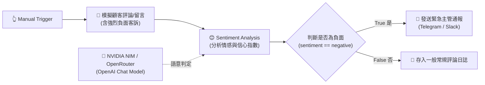

# 基礎範例 3：Sentiment Analysis（文字情緒與滿意度分析）

## 📚 工作流程說明

即時掌握顧客情緒與社群輿情是提升客戶滿意度的關鍵！

**Sentiment Analysis** 節點利用大語言模型強大的語意理解能力，精準分析文字背後的情感傾向（例如：Positive 正面、Neutral 中立、Negative 負面），並輸出信心評分（Confidence Score）。透過與 IF 條件節點結合，可以第一時間過濾出極度不滿的客訴，自動發送 Telegram / LINE 警報給主管介入處理。

> 🤖 **模型註冊與串接指南（推薦資安合規主軸）**：
> - [**NVIDIA NIM 微服務模型串接**](../../nvidia_nim/README.md)（推薦 `meta/llama-3.3-70b-instruct`）
> - [**OpenRouter 多模型聚合平台**](../../openrouter/README.md)（推薦 `meta-llama/llama-3.3-70b-instruct`）

---

## 🧭 工作流程架構



---

## 📥 工作流程圖下載

- [下載範例流程：Sentiment_Analysis.json](./Sentiment_Analysis.json)

---

## 📋 節點詳細說明

1. **📝 Sticky Note（便利貼）**
   - 標記教學重點與情緒分流機制。

2. **🔄 模擬顧客評論與客訴 (Edit Fields)**
   - 包含訂單編號 `order_id` 與一段表達延誤與客服失聯的強烈不滿文字。

3. **😊 Sentiment Analysis（情緒分析節點）**
   - **Text**：傳入文字 `{{ $json.review_text }}`。
   - **輸出屬性**：
     - `sentiment`：判定之情緒（positive, neutral, negative 或自訂標籤）。
     - `confidence_score`：模型判定之信心評分（0~1）。

4. **🔀 是否為負面客訴？(IF 節點)**
   - 條件規則：`{{ $json.sentiment }} == "negative"`。
   - **True 分支**：串接緊急通報，附帶訂單編號與評論原文。
   - **False 分支**：記錄至一般資料表。

5. **🧠 OpenAI Chat Model（連接 NVIDIA NIM / OpenRouter）**
   - 透過標準 OpenAI 相容介面提供高效的情感分析推理。

---

## 🎯 學習重點

- **情感傾向判定**：理解 LLM 如何解讀文字語意並標記情緒。
- **信心指標運用**：透過信心評分可過濾模糊不清的評論。
- **自動化危機預警**：學習「AI 分析 ➔ 條件判斷 ➔ 即時警報」的經典自動化模式。

---

## 💡 實際應用場景

- Google 商家、App Store / Google Play 用戶評論每日自動情緒評級。
- 客服信箱進線時，自動將負面嚴重情緒的郵件標記為高優先級（High Priority）。
- 社群品牌風向即時監控（公關危機預警）。

---

## 🤖 AI 賦能延伸實作（附 Prompt 提詞）

<details>
<summary>👉 點擊展開可直接複製給 AI 助理的 Prompt 提詞</summary>

> 💡 **任務目標**：透過 AI 自訂五星級滿意度標籤，並根據情緒自動擬定不同語氣的回覆草稿。

```text
請幫我在目前的「Sentiment Analysis」流程中進行升級：
1. 將 Sentiment Analysis 的情緒標籤自訂為 5 等級：5_star_praise, 4_star_satisfied, 3_star_neutral, 2_star_minor_issue, 1_star_furious。
2. 串接一個 Basic LLM Chain 節點：根據判定出的等級自動生成適當語氣的繁中公關回覆（例如 5 星表達感謝並給予折扣碼；1 星表達誠摯歉意並主動提供客服專線）。
請幫我配置好節點與提示詞！
```
</details>
