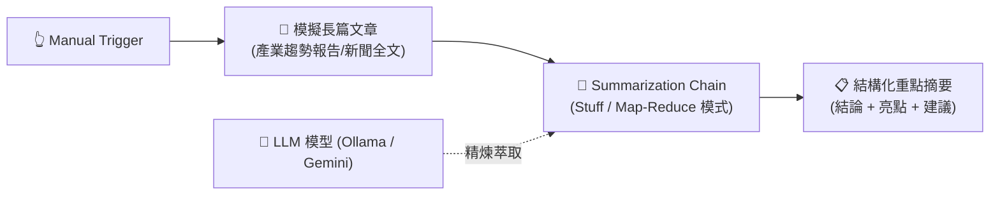

# 基礎範例 5：Summarization Chain（長文本智慧摘要濃縮）

## 📚 工作流程說明

在資訊過載的時代，每天有海量的新聞、會議逐字稿、產業報告與客戶訪談需要閱讀。

**Summarization Chain** 是專為長文本壓縮與摘要優化的專用鏈節點。它具備兩種核心處理模式：
1. **Stuff 模式**：適合單篇中短篇文章，直接將全文塞入 Prompt 進行快速摘要。
2. **Map-Reduce 模式**：適合超長篇巨幅文檔（甚至超過模型單次上下文上限），先將文檔自動切塊並分別摘要（Map），最後再將各小段摘要整合為總摘要（Reduce）。

---

## 🧭 工作流程架構



---

## 📥 工作流程圖下載

- [下載範例流程：Summarization_Chain.json](./Summarization_Chain.json)

---

## 📋 節點詳細說明

1. **📝 Sticky Note（便利貼）**
   - 標記教學重點與摘要模式說明。

2. **🔄 模擬長篇文章內容 (Edit Fields)**
   - 包含一篇關於 2026 AI 自動化趨勢的長篇分析文章。

3. **📝 Summarization Chain（摘要鏈核心）**
   - **Operation**：`summarize`。
   - **Type**：`stuff`（一般文章）或 `map_reduce`（巨篇長文）。
   - **自訂提示詞**：要求產出「🎯 一句話核心結論」、「📌 三大核心亮點」與「💡 企業行動建議」。

4. **🧠 Ollama Chat Model（語言模型）**
   - 連接本地或雲端大模型進行推理與文字濃縮。

---

## 🎯 學習重點

- **摘要模式抉擇**：理解 Stuff 模式與 Map-Reduce 模式的運作機制與適用時機。
- **結構化摘要規範**：學會透過 Prompt 強制模型輸出條理清晰的 Markdown 格式。
- **Token 限制突破**：理解大文件如何透過切塊摘要克服上下文窗口限制。

---

## 💡 實際應用場景

- 每日自動抓取 TechCrunch、BBC 等外媒新聞並產出 3 分鐘中文產業晨報。
- Zoom / Teams 線上會議逐字稿（Transcript）自動生成會議紀錄與待辦事項（Action Items）。
- 長篇 PDF 財務報表與法規文件重點速讀。

---

## 🤖 AI 賦能延伸實作（附 Prompt 提詞）

<details>
<summary>👉 點擊展開可直接複製給 AI 助理的 Prompt 提詞</summary>

> 💡 **任務目標**：透過 AI 串接 HTTP Request 抓取線上 RSS 新聞源，並在摘要後自動推播至 Telegram 頻道。

```text
請幫我在目前的「Summarization Chain」工作流程中進行前後串接：
1. 在流程前端新增一個 HTTP Request 節點，向科技新聞 RSS（例如 https://feeds.bbci.co.uk/news/technology/rss.xml）抓取最新一則新聞。
2. 將新聞內文傳入 Summarization Chain 產出繁體中文 3 點精華摘要。
3. 在流程後端串接 Telegram 節點，將摘要自動發布到團隊的每日晨報頻道中。
請幫我建立完整連線！
```
</details>
