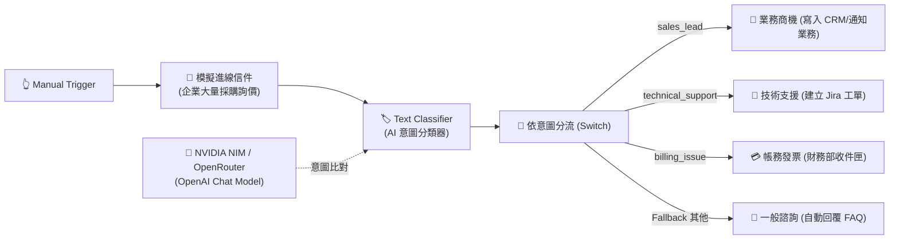

# 基礎範例 4：Text Classifier（文字意圖分類與智慧路由）

## 📚 工作流程說明

在企業客服與自動化流程中，如何將不同意圖的客戶進線精確分流至各個業務部門？

**Text Classifier** 節點是工作流的「AI 智慧總機」。透過定義各個類別的名稱與詳細描述，LLM 會在沒有大量訓練資料的情況下（Zero-shot Classification），自動將輸入文字歸類至最合適的類別標籤。後續搭配 n8n 的 **Switch 節點**，即可輕鬆實現自動化任務派工與跨部門流轉。

> 🤖 **模型註冊與串接指南（推薦資安合規主軸）**：
> - [**NVIDIA NIM 微服務模型串接**](../../nvidia_nim/README.md)（推薦 `meta/llama-3.3-70b-instruct`）
> - [**OpenRouter 多模型聚合平台**](../../openrouter/README.md)（推薦 `meta-llama/llama-3.3-70b-instruct`）

---

## 🧭 工作流程架構



---

## 📥 工作流程圖下載

- [下載範例流程：Text_Classifier.json](./Text_Classifier.json)

---

## 📋 節點詳細說明

1. **📝 Sticky Note（便利貼）**
   - 標記教學重點與意圖路由架構。

2. **🔄 模擬進線諮詢信件 (Edit Fields)**
   - 包含詢價 50 套企業授權與統編折扣的採購信件。

3. **🏷️ Text Classifier（意圖分類核心）**
   - **分類清單設計**：
     - `sales_lead`：企業採購、商務合作、大量授權、專屬報價
     - `technical_support`：系統報錯、無法登入、API 串接異常
     - `billing_issue`：退款申請、扣款失敗、發票更換
     - `general_inquiry`：一般常見問題、營業時間
   - **輸出屬性**：`category`。

4. **🔀 依意圖分流 (Switch 節點)**
   - 根據 `{{ $json.category }}` 的值，將資料流導向 4 個不同分支（Output 0~2 以及 Fallback Output 3）。

5. **🧠 OpenAI Chat Model（連接 NVIDIA NIM / OpenRouter）**
   - 穩定提供高精準度的意圖判定。

---

## 🎯 學習重點

- **零樣本文字分類（Zero-shot）**：利用模型常識進行多標籤分類。
- **分類描述（Category Description）**：學會撰寫精確描述引導模型提高辨識率。
- **Switch 路由整合**：掌握「AI 分類 + Switch 多分支分流」的企業標準架構。

---

## 💡 實際應用場景

- 客服信箱（Support Email）自動派工至工程、業務或財務團隊。
- 專案任務（Issue Tracker）自動分類為 Bug、Feature Request、Documentation。
- 社群貼文主題標籤自動貼標（新聞、娛樂、財經、科技）。

---

## 🤖 AI 賦能延伸實作（附 Prompt 提詞）

<details>
<summary>👉 點擊展開可直接複製給 AI 助理的 Prompt 提詞</summary>

> 💡 **任務目標**：透過 AI 在業務商機分支中，自動抽取聯絡人資訊並發送 Slack / Telegram 通知。

```text
請幫我在目前的「Text Classifier」工作流程中擴充業務分支：
1. 當 Switch 節點進入 sales_lead 分支時，串接一個 Information Extractor 抽取信件中的「公司名稱」、「預計採購數量」與「聯絡人信箱」。
2. 串接 Telegram（或 Slack）節點，發送通知：「🔥【高價值商機通知】公司：{{ $json.company_name }}，數量：{{ $json.quantity }} 套，請業務同仁儘速跟進！」。
請幫我配置好該分支的節點！
```
</details>
