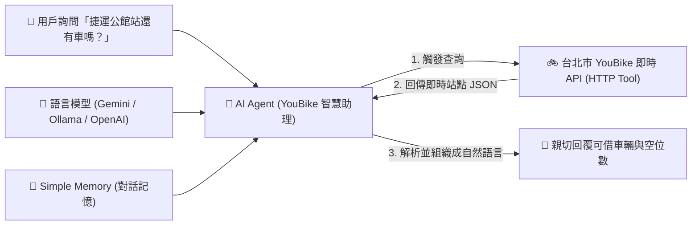

# 整合 LLM 模型的 AI Agent
## 範例 2：臺北市 YouBike 2.0 即時站點查詢助理（單一工具呼叫）

### 📚 工作流程說明

在具備基本對話概念後，學習如何讓 AI Agent 具備**單一工具使用能力**。本範例以台北市交通局 YouBike 客服（助理「帥氣的小犬」）為情境，當使用者詢問某捷運站周邊是否還有可借車輛時，AI 會主動調用 **HTTP Request Tool** 向臺北市政府開放資料 API 即時拉取最新站點數據，並以親切的繁體中文回答！

---

### 流程架構圖

---

### 工作流程樣版下載

- [📥 台北市 YouBike 站點資訊查詢工作流程樣版 (台北市youbike站點資訊查詢.json)](./台北市youbike站點資訊查詢.json)

---

## ⚙️ 設定與使用要點

1. **語言模型**：目前由 **Google Gemini Chat Model** 連到 AI Agent；若改為本地，將 AI Agent 的語言模型改接 **Ollama Chat Model** 並設定 Ollama 憑證與模型。
2. **工具**：僅使用一個 HTTP Request Tool，固定讀取台北市 YouBike 即時 JSON，無需額外參數；AI 會依對話決定是否呼叫並解讀回傳內容。
3. **System Message**：已定義 youbike 客服角色、個性、可使用的工具、職責、對話原則與輸出格式，以及無法處理時的機關聯絡人資訊（李彥安、02-27208889#6907、pn9607@gov.taipei）。
4. **Chat Trigger**：可依需求調整標題、副標、助理名稱、歡迎訊息與是否公開。

## 📌 建議先修

建議先完成 [智能客服聊天機器人](../智能客服聊天機器人/README.md)，理解 AI Agent 基本對話與 System Prompt 後，再學習本範例的「單一工具」整合。
