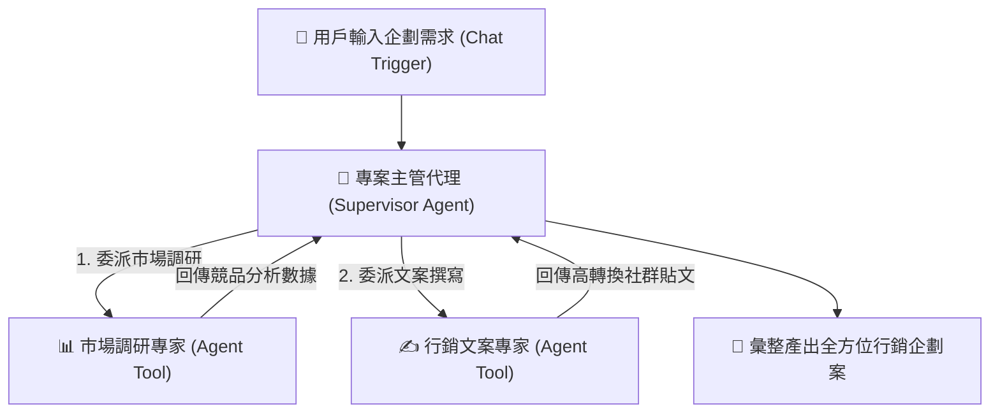

# 整合 LLM 模型的 AI Agent
## 範例 7：多代理人協作團隊（Multi-Agent Supervisor 經理與專家架構）

### 📚 工作流程說明

建立具備專業分工的「AI 團隊」！本範例展示如何設計 Multi-Agent 階層式架構：
- **主管代理（Supervisor Agent）**：接收複雜任務，進行子任務拆解與調度
- **市場調研專家（Agent Tool）**：負責收集行業趨勢、數據與競爭對手分析
- **行銷文案專家（Agent Tool）**：依據調研成果產出高吸引力的社群文案與企劃書
- 由主管 Agent 彙整所有專家產出，回應用戶一份結構完整的企劃案

---

### 流程架構圖



---

### 工作流程樣版下載

- [📥 多代理協作系統工作流程樣版 (multi_agent_system.json)](./multi_agent_system.json)

---

## 🎓 教學重點

### 1. 多代理系統架構設計

**多代理系統**的核心概念：
- **主代理（Manager Agent）**：負責任務分解和分配
- **專業代理（Specialist Agents）**：負責特定領域的任務
- **協作機制**：代理之間的溝通和協調

**架構範例**：
```
用戶請求
    ↓
主管理者（任務分解）
    ├─→ 研究專員（搜尋資訊）
    ├─→ 分析專員（處理數據）
    └─→ 寫作專員（生成內容）
    ↓
整合結果
```

### 2. 代理之間的溝通機制

**溝通方式**：
- **任務委派**：主代理將任務分配給專業代理
- **結果回傳**：專業代理將結果回傳給主代理
- **協作請求**：代理之間可以互相請求協助

**實作方式**：
- 使用 **AI Agent Tool** 將代理封裝成工具
- 主代理可以「呼叫」其他代理
- 使用 **Variables** 節點儲存中間結果

### 3. 任務委派策略

**委派策略**：
- **基於專業領域**：根據任務類型選擇合適的代理
- **基於優先級**：重要任務優先處理
- **基於依賴關係**：考慮任務之間的依賴

**範例**：
```
任務：「撰寫一份關於 AI 趨勢的報告」

主代理分解：
1. 研究專員 → 搜尋最新 AI 趨勢資訊
2. 分析專員 → 分析搜尋結果，整理重點
3. 寫作專員 → 基於分析結果撰寫報告
```

## ⚙️ 設定步驟

### 步驟一：建立主管理者代理
1. 加入 **Chat Trigger** 節點
2. 加入 **AI Agent** 節點（主管理者）
3. 選擇 Agent 類型：**Tools Agent**
4. 設定 System Prompt：
   ```
   你是一個任務管理者，負責將複雜任務分解並分配給專業團隊。
   團隊成員：
   - 研究專員：負責搜尋和收集資訊
   - 分析專員：負責數據分析和處理
   - 寫作專員：負責內容生成和撰寫
   
   請根據任務需求，選擇合適的團隊成員並分配任務。
   ```

### 步驟二：建立研究專員代理
1. 建立新的 **AI Agent** 節點（研究專員）
2. 設定 System Prompt：
   ```
   你是一個研究專員，擅長搜尋和收集資訊。
   當收到研究任務時，使用搜尋工具找到相關資訊。
   整理並回報搜尋結果。
   ```
3. 加入 **SerpAPI Tool** 節點
4. 設定 SerpAPI 憑證
5. 將研究專員封裝為 **AI Agent Tool**

### 步驟三：建立分析專員代理
1. 建立新的 **AI Agent** 節點（分析專員）
2. 設定 System Prompt：
   ```
   你是一個數據分析專員，擅長分析和處理數據。
   當收到數據分析任務時，使用計算工具進行分析。
   提供清晰的分析結果和見解。
   ```
3. 加入 **Calculator Tool** 節點
4. 將分析專員封裝為 **AI Agent Tool**

### 步驟四：建立寫作專員代理
1. 建立新的 **AI Agent** 節點（寫作專員）
2. 設定 System Prompt：
   ```
   你是一個寫作專員，擅長撰寫和內容生成。
   當收到寫作任務時，基於提供的資訊撰寫內容。
   確保內容清晰、結構完整、符合要求。
   ```
3. 加入 **Basic LLM Chain** 節點
4. 將寫作專員封裝為 **AI Agent Tool**

### 步驟五：在主管理者中註冊代理工具
1. 在主管理者的 **AI Agent** 中註冊三個代理工具：
   - 研究專員工具
   - 分析專員工具
   - 寫作專員工具
2. 為每個工具設定清楚的描述

### 步驟六：設定整合輸出
1. 加入 **Set** 節點整合各代理的結果
2. 格式化最終輸出
3. 加入 **Respond to Webhook** 或 **Chat** 節點回應用戶

### 步驟七：測試多代理系統
1. 啟用工作流程
2. 測試複雜任務：「幫我研究 AI 趨勢並撰寫報告」
3. 觀察各代理如何協作完成任務

## 💡 實際應用場景

- **研究報告生成**：研究 → 分析 → 撰寫
- **產品開發**：市場研究 → 需求分析 → 規格撰寫
- **內容創作**：資料收集 → 內容規劃 → 文章撰寫
- **數據分析**：數據收集 → 數據處理 → 報告生成
- **客戶服務**：問題分析 → 解決方案 → 回應撰寫

## 🔧 進階功能擴展

### 練習 1：加入更多專業代理
擴展團隊：
- **翻譯專員**：處理多語言任務
- **設計專員**：生成視覺內容
- **程式專員**：生成程式碼

### 練習 2：實作代理間協作
讓代理能夠互相協作：
- 研究專員 → 分析專員 → 寫作專員
- 建立代理之間的溝通機制

### 練習 3：任務優先級管理
加入優先級機制：
- 重要任務優先處理
- 任務佇列管理
- 資源分配優化

### 練習 4：結果品質評估
加入品質評估機制：
- 評估各代理的輸出品質
- 自動優化任務分配
- 記錄和分析協作效率

## 📌 常見問題

### Q: 如何避免代理之間的重複工作？
**A**: 
- 在主代理中明確任務分工
- 使用 Variables 節點共享中間結果
- 設定任務依賴關係
- 記錄已完成的任務

### Q: 如何處理代理執行失敗？
**A**: 
- 加入錯誤處理機制
- 設定重試邏輯
- 提供替代方案
- 記錄錯誤日誌

### Q: 多代理系統的成本如何控制？
**A**: 
- 使用較便宜的模型處理簡單任務
- 只在必要時使用強大的模型
- 快取重複的結果
- 監控 Token 使用量
