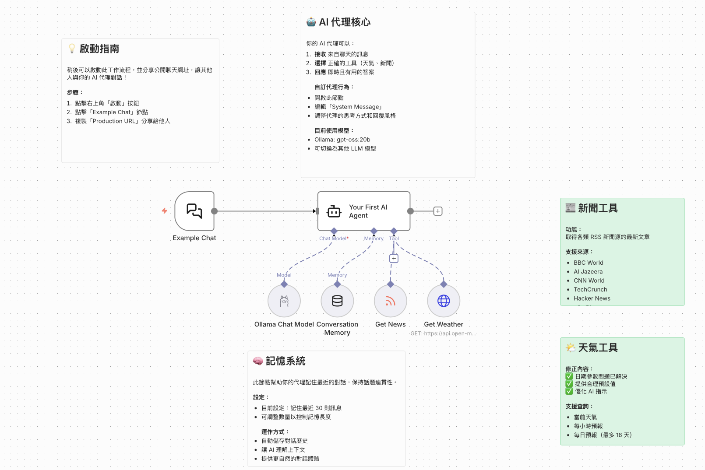

# 天氣和新聞查詢（使用 Ollama）

## 工作流名稱:天氣和新聞查詢_使用Ollama

## 重要技巧：[**$fromAI()**](#fromAI說明)

## 📚 學習目標

在掌握基本對話功能後，學習如何讓 AI Agent 具備**工具使用能力**。本範例工作流**預設使用 Google Gemini**（`gemini-3-flash-preview`），並保留 **Ollama Chat Model** 節點可切換為本地模型；聊天介面為台北市交通局 YouBike 服務中心（助理「帥氣的小犬」），能查詢天氣與台灣科技／新聞 RSS。

## 🎯 難度等級

**難度**: ⭐⭐☆ (初級到中級)  
**學習時間**: 45-60 分鐘  
**階段**: 階段一：基礎入門（進階）

## 📌 學習前提

建議先完成 [**智能客服聊天機器人**](../智能客服聊天機器人/README.md) 範例，理解 AI Agent 的基本對話功能後，再學習本範例的工具使用能力。

## 工作流架構



## 工作流下載

[天氣和新聞查詢工作流下載](./天氣和新聞查詢_使用Ollama.json)

## 📋 工作流程說明

這是**第二個 AI Agent 範例**，在基本對話功能的基礎上，加入**工具使用能力**。工作流內含 **Google Gemini Chat Model** 與 **Ollama Chat Model** 節點；**目前連接至 AI Agent 的為 Google Gemini**（`gemini-3-flash-preview`），可改接 Ollama 改為本地模型。聊天介面為「台北市交通局／youbike服務中心」，助理名稱「帥氣的小犬」。範例展示如何建立一個能：
- 接收並理解用戶的對話訊息
- **自主選擇合適的工具來回答問題**（核心）
- **獲取即時天氣資訊**（取得天氣，HTTP Request Tool + Open-Meteo，參數由 `$fromAI()` 決定）
- **檢索最新新聞內容**（RSS Read，台灣科技與新聞媒體 RSS 清單，URL 由 `$fromAI('URL', '', 'string')` 決定）
- 使用 **Simple Memory** 保持對話脈絡
- 提供即時且有用的答案

## 💡 為什麼這個範例很重要？

**學習重點**：
- ✅ **工具使用能力**：學習如何讓 AI 自主選擇和使用工具（取得天氣、RSS Read）
- ✅ **實用功能**：天氣查詢（Open-Meteo）與台灣科技／新聞 RSS 檢索
- ✅ **$fromAI() 應用**：天氣參數（經緯度、current/hourly/daily、日期、溫度單位）與 RSS URL 由 AI 動態決定
- ✅ **模型彈性**：預設 Gemini，可改接 Ollama 使用本地模型

**與前一個範例的差異**：
- 第一個範例（智能客服）：只有純對話功能
- 本範例：加入**工具選擇**與**外部資料獲取**（取得天氣、RSS Read），並在工具參數中大量使用 `$fromAI()`

**適用場景**：
- 需要即時資訊的智能助理
- 學習 Tool-Using Agent 的概念
- 建立多功能的 AI 系統
- 工具擴展的實驗平台

## 🔧 使用節點

- **When chat message received**（Chat Trigger）- 對話入口，接收用戶訊息；標題「台北市交通局」、副標「youbike服務中心」、助理名稱「帥氣的小犬」
- **AI Agent**（AI 代理核心）- 決策中心，選擇適當工具
- **Google Gemini Chat Model**（語言模型）- 本工作流目前連接的 LLM，使用 `gemini-3-flash-preview`
- **Ollama Chat Model**（選用）- 節點存在可切換為本地模型，例：`gpt-oss:20b-cloud`
- **Simple Memory**（對話記憶）- Window Buffer Memory，保持對話上下文
- **取得天氣**（HTTP Request Tool）- 呼叫 Open-Meteo API，參數由 `$fromAI()` 動態決定（經緯度、current/hourly/daily、日期、溫度單位等）
- **RSS Read**（RSS Feed Read Tool）- 讀取 RSS，URL 由 `$fromAI('URL', '', 'string')` 決定；工具描述內含台灣科技與新聞媒體 RSS 清單（TechNews、數位時代、TrendForce、Newtalk、風傳媒、CNA、PTS 等）

## 🎓 教學重點

### 1. AI Agent 的工作流程

你的 AI 代理運作分為三個步驟：

1. **接收（Receive）**：
   - 從聊天介面接收用戶訊息
   - 理解用戶的意圖和需求

2. **選擇（Choose）**：
   - 分析問題類型
   - 決定使用哪個工具或直接回答
   - 例如：天氣問題 → 取得天氣（HTTP Request Tool）
   - 例如：新聞問題 → RSS Read（RSS Feed Read Tool）

3. **回應（Respond）**：
   - 執行選定的工具
   - 整合工具返回的資料
   - 生成自然語言回應

### 2. System Message（系統訊息）的設計

System Message 定義了 AI 代理的：
- **角色定位**：你是什麼身份？
- **核心能力**：你能做什麼？
- **行為規範**：你應該如何回應？
- **工具使用**：如何選擇和使用工具？

**本範例的 System Message 重點**（與工作流 JSON 一致）：
- 使用 `<role>`、`<instructions>`、`<context>`、`<output_format>` 結構
- 角色為友善且樂於助人的助理，專門展示 n8n 中 AI 代理與工具使用
- 內含「我的工作原理」「我的目的」「工具使用指南」「當前日期與時間」等 context
- 輸出格式要求：以繁體中文、友善對話式回應；需用工具時先選工具再呈現結果；可主動建議可詢問的範例

### 3. 對話記憶（Simple Memory）

**Simple Memory**（Window Buffer Memory）的運作方式：
- 保存最近 30 則訊息（可調整）
- 自動管理記憶體使用
- 提供對話上下文給 AI
- 讓 AI 能理解前後關聯

**範例場景**：
```
用戶: "巴黎的天氣如何？"
AI: "巴黎今天溫度 15°C，多雲..."

用戶: "那明天呢？"  ← AI 能理解「那」指的是巴黎
AI: "巴黎明天溫度 17°C，晴天..."
```

### 4. 工具使用（Tool Usage）

**取得天氣**（HTTP Request Tool）：
- 使用 Open-Meteo API（`https://api.open-meteo.com/v1/forecast`）
- 查詢參數由 `$fromAI()` 動態決定：`latitude`、`longitude`、`current`、`hourly`、`daily`、`start_date`、`end_date`、`temperature_unit`
- 工具描述規定：目前天氣僅用 `current`；每小時預報用 `hourly` + 日期；每日概覽用 `daily` + 日期；地點依城市名推斷；日期格式 YYYY-MM-DD
- 無需 API 金鑰，免費使用

**RSS Read**（RSS Feed Read Tool）：
- URL 由 `$fromAI('URL', '', 'string')` 決定，AI 依工具描述中的清單選擇
- 工具描述內含**台灣科技與新聞媒體 RSS 清單**：TechNews 科技新報、數位時代、TrendForce、Newtalk、風傳媒、中央社（CNA）、公視（PTS）等
- 獲取最新文章標題與摘要；AI 依使用者問題選擇合適的 RSS 源

### 5. 語言模型設定

**目前連接的模型**：**Google Gemini Chat Model**（`gemini-3-flash-preview`）
- 工作流中此節點連接到 AI Agent，為預設使用的 LLM

**選用：Ollama Chat Model**（`gpt-oss:20b-cloud`）
- 節點存在但未連接；可改接此節點改為本地模型
- 需先啟動 Ollama 並設定 Base URL（如 `http://localhost:11434`）

## ⚙️ 設定步驟

### 前置準備

- **若使用 Google Gemini**（工作流預設）：需有 Google API 金鑰，並在 n8n 中設定 Google Gemini(PaLM) Api 憑證。
- **若改為使用 Ollama**：需先安裝並啟動 Ollama，再在 n8n 中設定 Ollama API 憑證。

**Ollama 安裝（選用）**  
**macOS**：`brew install ollama`  
**Linux**：`curl -fsSL https://ollama.ai/install.sh | sh`  
**Windows**：從 [Ollama 官網](https://ollama.ai) 下載安裝程式  

若使用 Ollama，下載模型後驗證：
```bash
ollama pull gpt-oss:20b-cloud
ollama list
```

### 步驟一：匯入工作流程

1. 下載 `天氣和新聞查詢_使用Ollama.json`
2. 在 n8n 中點擊「Import from File」或拖入檔案
3. 選擇下載的 JSON 檔案，工作流程會自動匯入
4. 若使用 Gemini：確認 **Google Gemini Chat Model** 節點已綁定 Google Gemini(PaLM) Api 憑證

### 步驟二：設定 Chat Trigger（When chat message received）

1. 節點已預先設定，介面為：
   - **Title**：台北市交通局
   - **Subtitle**：youbike服務中心
   - **Initial Messages**：您好:\n這是台北市youbike服務中心
   - **agentName / agentDescription**：帥氣的小犬、客服人員
2. 可自訂 **Public**、輸入提示文字等。

### 步驟三：設定 AI Agent 與連接

1. 開啟 **AI Agent** 節點，檢查 System Message（已預設好）。
2. 確認已連接：
   - **Google Gemini Chat Model**（語言模型，預設使用）
   - **Simple Memory**（對話記憶）
   - **取得天氣**（HTTP Request Tool）
   - **RSS Read**（RSS Feed Read Tool）
3. 若改為使用本地模型：將 AI Agent 的語言模型連接改為 **Ollama Chat Model**，並在該節點設定 Ollama 憑證與模型（如 `gpt-oss:20b-cloud`）。

### 步驟四：測試工作流程

1. 點擊「Save」儲存工作流程
2. 點擊「Activate」啟動工作流程
3. 點擊「🗨 Open Chat」開啟聊天視窗
4. 嘗試以下測試問題：

**測試問題範例**：
```
✅ "巴黎的天氣如何？"
✅ "給我最新的科技新聞。"（可觸發 RSS Read，依工具描述選台灣科技媒體）
✅ "n8n 是什麼？"
✅ "台北明天會下雨嗎？"
✅ "今天台灣有什麼新聞？"
✅ "給我一些 AI Agent 的應用想法。"
```

## 💡 實際應用場景

### 個人助理
- 查詢天氣、新聞、日程
- 回答一般知識問題
- 協助日常任務規劃

### 學習工具
- 練習 AI Agent 開發
- 理解 Prompt Engineering
- 實驗不同的工具組合

### 內部工具
- 公司內部問答系統
- 技術支援助手
- 流程自動化介面

### 原型開發
- 快速驗證 AI 應用想法
- 測試工具整合
- 概念驗證（POC）

## 🔧 進階功能擴展

### 練習 1：新增更多工具

**加入 Calculator Tool**：
```
1. 點擊 AI Agent 的 Tools 區域
2. 選擇「Add Tool」→「Calculator」
3. 測試數學計算問題
```

**加入 Wikipedia Tool**：
```
1. 安裝 Wikipedia 節點
2. 設定為 Tool
3. 讓 AI 能查詢維基百科
```

**加入 Gmail Tool**：
```
1. 連接 Gmail 帳戶
2. 設定發送郵件工具
3. 讓 AI 能代發郵件
```

### 練習 2：自訂 System Prompt

**改變 AI 性格**：
```
專業顧問型：
你是一位專業的商業顧問，擅長提供策略建議...

技術專家型：
你是一位資深工程師，專注於技術問題的深入解答...

輕鬆幽默型：
你是一位風趣的助手，喜歡用輕鬆的方式幫助用戶...
```

### 練習 3：優化對話記憶

調整 **Simple Memory**（對話記憶）參數：
- **Context Window Length**：30 → 50（保存更多歷史）
- 觀察記憶對對話品質的影響
- 找到效能與品質的平衡點

### 練習 4：切換不同模型

嘗試不同的 Ollama 模型：
```bash
# 下載其他模型
ollama pull llama2:7b
ollama pull mistral:7b
ollama pull codellama:7b

# 在 Ollama Chat Model 節點中切換模型
# 比較不同模型的回應品質和速度
```

### 練習 5：建立多語言支援

修改 System Message 加入多語言：
```
你能使用以下語言進行對話：
- 繁體中文（預設）
- English
- 日本語
- 한국어

請根據用戶使用的語言自動切換。
```

### 練習 6：加入自訂工具

**建立「搜尋本地檔案」工具**：
```
1. 使用 Execute Command 節點
2. 設定為 Tool
3. 執行 grep 或 find 命令
4. 讓 AI 能搜尋伺服器上的檔案
```

## 📌 常見問題

### Q: Ollama 無法連接怎麼辦？

**A**: 
1. 確認 Ollama 服務是否正在運行：
   ```bash
   ollama serve
   ```
2. 檢查 Base URL 是否正確（預設：`http://localhost:11434`）
3. 如果使用 Docker，確認 port mapping 正確
4. 檢查防火牆設定

### Q: AI 回應速度很慢？

**A**: 
- **切換到較小的模型**：若使用 Ollama，可改用 `llama2:7b` 等比 `gpt-oss:20b-cloud` 更輕量的模型
- **檢查硬體資源**：確保有足夠的 RAM 和 CPU
- **使用 GPU 加速**：如果有 NVIDIA GPU，啟用 CUDA
- **關閉其他應用**：釋放更多記憶體

### Q: 如何讓 AI 回答更準確？

**A**: 
- **優化 System Prompt**：提供更明確的指示
- **增加上下文**：調整 Simple Memory（對話記憶）長度
- **使用更大的模型**：例如 `llama2:13b`
- **提供範例**：在 System Prompt 中加入範例對話

### Q: 工具呼叫失敗怎麼辦？

**A**: 
- **檢查工具描述**：確保描述清楚易懂
- **測試工具節點**：單獨測試工具是否正常運作
- **查看執行日誌**：檢查錯誤訊息
- **簡化工具參數**：減少必填參數的數量

### Q: 如何部署給其他人使用？

**A**: 
1. **啟動工作流程**：點擊「Activate」
2. **設定 Public Chat**：在 Chat Trigger 中啟用 Public
3. **分享連結**：複製聊天 URL 分享給使用者
4. **設定 ngrok**：如果在本地運行，使用 ngrok 建立外部連結

### Q: Ollama 和 OpenAI 有什麼差異？

**A**: 

| 特性 | Ollama | OpenAI |
|------|--------|--------|
| 部署方式 | 本地運行 | 雲端 API |
| 成本 | 免費 | 按使用量付費 |
| 隱私 | 完全私密 | 資料傳送到外部 |
| 模型品質 | 中等 | 頂尖（GPT-4） |
| 回應速度 | 取決於硬體 | 穩定快速 |
| 適用場景 | 學習、開發、私有資料 | 生產環境、高品質需求 |

## 🚀 語言模型切換（Gemini / Ollama / OpenAI）

本工作流**預設使用 Google Gemini**（`gemini-3-flash-preview`）；流程中另有 **Ollama Chat Model** 節點可改接為本地模型。

### 使用 Google Gemini（預設）
- 確認 **Google Gemini Chat Model** 已連到 AI Agent，並設定 Google Gemini(PaLM) Api 憑證。
- 模型欄位為 `gemini-3-flash-preview`（與 JSON 一致）。

### 改為使用 Ollama
```
1. 將 AI Agent 的語言模型連接改為「Ollama Chat Model」
2. 在 Ollama Chat Model 節點設定 Ollama API 憑證（Base URL 如 http://localhost:11434）
3. 選擇模型（例如 gpt-oss:20b-cloud）
4. 其他節點與連接不變
```

### 改為使用 OpenAI
```
1. 新增 OpenAI Chat Model 節點並連到 AI Agent
2. 設定 OpenAI API Key 與模型（如 gpt-3.5-turbo、gpt-4）
3. 其他設定保持不變
```

### 使用策略參考
- 開發/測試：可用 Ollama 節省成本，或直接用 Gemini 快速驗證
- 生產環境：使用 Gemini / OpenAI 取得較穩定品質
- 敏感資料：使用 Ollama 保持資料在本地

## 📚 延伸學習

### 前置範例
建議先完成：
- [範例一：智能客服聊天機器人](../智能客服聊天機器人/README.md) - 學習基本對話功能

### 後續範例建議
完成此範例後，建議繼續學習：

1. **範例三：RAG** — [RAG 智能問答系統](../RAG智能問答系統/README.md) 或 [整合 RAG 的實作](../../RAG/README.md)（完整 RAG 由淺至深）；精簡版：[文件智能問答系統](../文件智能問答系統/README.md)（選讀）
   
2. [範例四：具備工具使用能力的助理](../具備工具使用能力的助理/README.md)
   - 學習更多進階工具整合技巧（使用雲端 API）

<a name='fromAI說明'></a>
## 💡 `$fromAI()` 函式說明

`$fromAI()` 語法說明書（技術文件）

---

## 一、`$fromAI()` 概述

`$fromAI()` 是 n8n AI 節點（特別是 Tool / AI Agent）專用的表達式函式，用於將參數值的決定權交給 AI，而非在 workflow 中寫死固定值。

**核心功能**：讓 AI 根據上下文動態決定參數值。

在本工作流中，`$fromAI()` 用於：
- **取得天氣**：經緯度、`current`／`hourly`／`daily`、`start_date`、`end_date`、`temperature_unit` 等參數均由 AI 動態決定。
- **RSS Read**：URL 使用 `$fromAI('URL', '', 'string')`，AI 依工具描述中的**台灣科技與新聞媒體 RSS 清單**選擇來源。

---

## 二、基本語法結構

```js
$fromAI(name, description, type, defaultValue)
```

### 1️⃣ `name`（參數名稱）

```js
'URL'
```

**說明**：
- 定義 AI 要產生的欄位名稱
- 會顯示在 AI 的工具參數 schema 中
- 應使用有意義且描述性的名稱

**常見範例**：
- `URL`
- `city`
- `keyword`
- `rssFeed`

---

### 2️⃣ `description`（AI 決策指引）

```js
'Select the most appropriate RSS feed URL based on the user query. Available options are listed in the tool description.'
```

**重要說明**：
- 此描述是給 AI 看的決策指引，不是給使用者看的
- AI 會根據這段文字來判斷如何選擇參數值
- 描述越清晰明確，AI 的決策品質越好

**技術要點**：
- 這是 prompt engineering 的實踐
- 透過清晰的描述引導 AI 做出正確決策

---

### 3️⃣ `type`（資料型別）

```js
'string'
```

**支援的資料型別**：

| 型別        | 說明                |
| --------- | ----------------- |
| `string`  | 文字字串（最常用）          |
| `number`  | 數值                |
| `boolean` | 布林值（true / false）   |
| `array`   | 陣列                |
| `object`  | 物件                |

**範例說明**：RSS URL 為字串型別，因此使用 `string`。

---

### 4️⃣ `defaultValue`（預設值）

```js
'https://feeds.bbci.co.uk/news/world/rss.xml'
```

**預設值的用途**：

1. **Fallback 機制**：當 AI 無法確定參數值時使用
2. **測試穩定性**：確保 workflow 在首次測試時能正常運作
3. **參考範例**：為 AI 提供一個參考答案，幫助理解預期格式

**重要概念**：預設值不等於固定值，而是作為 fallback 機制使用。

---

## 三、範例解析

```js
{{ 
  $fromAI(
    'URL',
    'Select the most appropriate RSS feed URL based on the user query. Available options are listed in the tool description.',
    'string',
    'https://feeds.bbci.co.uk/news/world/rss.xml'
  ) 
}}
```

**功能說明**：

此範例指示 AI：
- 產生一個名為 `URL` 的字串參數
- 根據使用者查詢內容，從工具描述中列出的 RSS 清單中選擇最適合的 RSS Feed URL
- 若無法確定，則使用預設值（BBC World News）

---

## 四、執行流程

### AI 決策流程：

1. **使用者輸入查詢**
   > 「今天台灣有什麼新聞？」

2. **AI 讀取工具描述**
   - 從 Tool description 中取得可用的 RSS 清單
   - 本工作流內含**台灣科技與新聞媒體**清單：TechNews 科技新報、數位時代、TrendForce、Newtalk、風傳媒、中央社（CNA）、公視（PTS）等

3. **AI 分析與判斷**
   - 根據「台灣」「科技」等關鍵字進行語義分析
   - 選擇最符合查詢意圖的 RSS Feed（例如 TechNews、CNA）

4. **回傳參數值**
```json
{
  "URL": "https://technews.tw/feed/"
}
```
（實際 URL 依 AI 選擇與工具描述中的清單為準）

5. **n8n 執行工具**
   - 將 AI 決定的 URL 值傳遞給 RSS Read Tool
   - 執行 RSS 讀取操作

**技術優勢**：整個流程無需使用條件判斷（if/switch）或程式碼邏輯，完全由 AI 自主決策。

---

## 五、核心概念

### 1. `$fromAI()` 是 AI 決策入口

`$fromAI()` 並非傳統的 JavaScript 函式，而是將參數決策的控制權交給 LLM，讓 AI 根據上下文動態決定參數值。

---

### 2. description 等同於 prompt

**最佳實踐**：
- ✅ 撰寫清晰、具體的描述，明確指示 AI 如何決策
- ❌ 避免模糊或過於簡略的描述

description 參數本質上就是 prompt engineering，需要精心設計以引導 AI 做出正確決策。

---

### 3. Tool + $fromAI = Agentic Workflow

當結合以下元件時：
- AI Agent
- Tool
- `$fromAI()`

即構成 **Agentic Workflow（代理式工作流程）**，實現 AI 自主決策和工具使用的智能自動化。

---

## 六、標準模板

```js
{{ 
  $fromAI(
    'parameter_name',
    'Clearly describe how the AI should decide this value, including constraints or available options.',
    'string',
    'default_value'
  ) 
}}
```

**使用說明**：
- `parameter_name`：替換為實際參數名稱
- 第二個參數：清楚描述 AI 應如何決定此值，包含約束條件或可用選項
- `string`：根據實際需求選擇適當的資料型別
- `default_value`：設定合理的預設值作為 fallback


---


