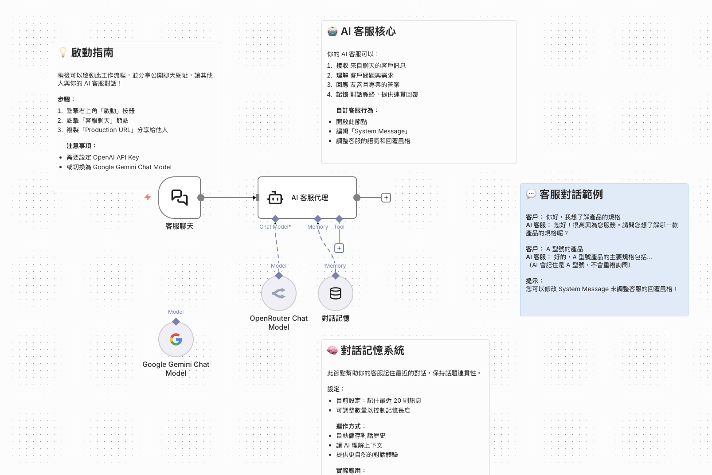

# 範例一：智能客服聊天機器人

## 📚 學習目標

理解 AI Agent 基本架構，學習如何建立一個能夠進行對話的智能客服系統。

## 🎯 難度等級

**難度**: ⭐☆☆ (初級)  
**學習時間**: 30-45 分鐘  
**階段**: 階段一：基礎入門

## 📋 工作流程說明

這個範例展示如何建立一個基本的 AI 聊天機器人，能夠：
- 接收用戶訊息
- 使用 AI 模型進行對話
- 保持對話記憶與脈絡
- 提供個人化的客服回應

## 🔧 使用節點

- **Chat Trigger**（觸發器）- 接收用戶訊息
- **AI Agent**（核心）- AI 處理中心
- **OpenAI Chat Model** 或 **Google Gemini Chat Model**（語言模型）- 生成回應
- **Simple Memory**（記憶功能）- 保持對話脈絡

## 🎓 教學重點

### 1. 如何設定 System Prompt（系統提示詞）

System Prompt 決定了 AI Agent 的角色和行為。範例：

```
你是一個友善且專業的客服助理。你的任務是：
1. 親切地回應客戶問題
2. 提供準確的產品資訊
3. 協助解決客戶問題
4. 在無法解決時，禮貌地引導客戶聯繫人工客服
```

### 2. 對話記憶的重要性

- **Simple Memory** 節點會自動儲存對話歷史
- 讓 AI 能夠理解上下文，提供連貫的回應
- 記憶會隨著對話進行而更新

### 3. Chat Model 的選擇與設定

**OpenAI Chat Model**：
- 支援 GPT-3.5、GPT-4 等模型
- 需要 OpenAI API Key
- 回應品質高，但成本較高

**Google Gemini Chat Model**：
- 支援 Gemini Pro 等模型
- 需要 Google API Key
- 成本較低，適合大量使用

## ⚙️ 設定步驟

### 步驟一：建立觸發器
1. 在工作流程中加入 **Chat Trigger** 節點
2. 設定觸發器名稱（例如：`客服聊天`）

### 步驟二：設定 AI Agent
1. 加入 **AI Agent** 節點
2. 連接 **Chat Trigger** 到 **AI Agent**
3. 選擇 Agent 類型：**Basic Agent**

### 步驟三：設定語言模型
1. 在 AI Agent 中選擇 **Chat Model**
2. 選擇 **OpenAI Chat Model** 或 **Google Gemini Chat Model**
3. 設定 API 憑證
4. 選擇模型（例如：`gpt-3.5-turbo` 或 `gemini-pro`）

### 步驟四：設定 System Prompt
1. 在 AI Agent 的 **System Message** 欄位輸入 System Prompt
2. 定義 AI 的角色和行為

### 步驟五：加入記憶功能
1. 在 AI Agent 設定中啟用 **Memory**
2. 選擇 **Simple Memory** 類型
3. 設定記憶保留時間（可選）

### 步驟六：測試工作流程
1. 啟用工作流程
2. 在 Chat Trigger 中發送測試訊息
3. 觀察 AI Agent 的回應

## 💡 實際應用場景

- **客服系統**：24/7 自動回應客戶問題
- **產品諮詢**：回答產品相關問題
- **預約系統**：協助客戶預約服務
- **FAQ 問答**：回答常見問題

## 🔧 進階功能擴展

### 練習 1：修改 System Prompt
嘗試修改 System Prompt，讓 AI 表現不同的性格：
- 專業型：正式、專業的語氣
- 親切型：友善、輕鬆的語氣
- 技術型：詳細、技術性的回答

### 練習 2：加入知識庫
整合 **Vector Store** 和 **RAG**，讓 AI 能夠查詢內部文件：
- 使用 **Default Data Loader** 載入文件
- 使用 **Embeddings** 建立向量索引
- 使用 **Question and Answer Chain** 進行檢索

### 練習 3：多語言支援
在 System Prompt 中加入多語言支援：
```
你可以使用繁體中文、簡體中文、英文進行對話。
根據用戶的語言自動切換回應語言。
```

## 📌 常見問題

### Q: AI 回應太慢怎麼辦？
**A**: 
- 選擇較快的模型（例如：GPT-3.5 比 GPT-4 快）
- 減少 System Prompt 的長度
- 檢查網路連線速度

### Q: 如何讓 AI 記住用戶資訊？
**A**: 
- 使用 **Simple Memory** 節點
- 在 System Prompt 中指示 AI 記住重要資訊
- 使用 **Variables** 節點儲存用戶資料

### Q: 如何限制 AI 的回應長度？
**A**: 
- 在 System Prompt 中加入：「請保持回應簡潔，不超過 100 字」
- 使用 **Max Tokens** 參數限制輸出長度

## 📥 如何導入此 Workflow

### 方法一：從檔案導入
1. 下載 `智能客服聊天機器人.json` 檔案
2. 在 n8n 介面中，點擊右上角的「…」選單
3. 選擇「Import from File」
4. 選擇下載的 JSON 檔案
5. Workflow 將自動載入

### 方法二：從剪貼簿導入
1. 複製 `智能客服聊天機器人.json` 的內容
2. 在 n8n 介面中，點擊右上角的「…」選單
3. 選擇「Import from Clipboard」
4. 貼上複製的內容
5. 點擊「Import」

### 導入後的設定
1. **設定 OpenAI API Key**
   - 點擊「OpenAI Chat Model」節點
   - 在「Credentials」區域點擊「Create New」
   - 輸入您的 OpenAI API Key
   - 儲存設定

2. **（可選）切換為 Google Gemini**
   - 刪除「OpenAI Chat Model」節點
   - 加入「Google Gemini Chat Model」節點
   - 連接到「AI 客服代理」節點
   - 設定 Google API Key

3. **測試 Workflow**
   - 點擊右上角的「啟動」按鈕
   - 點擊「客服聊天」節點
   - 使用測試介面或複製 Production URL
   - 開始對話測試

## 🖼️ Workflow 視覺化



*截圖展示了 workflow 的完整結構與節點連接*

## 📚 相關資源

- [n8n AI Agent 文件](https://docs.n8n.io/integrations/builtin/core-nodes/n8n-nodes-base.agent/)
- [OpenAI API 文件](https://platform.openai.com/docs)
- [Google Gemini API 文件](https://ai.google.dev/docs)

---


