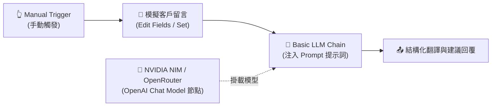
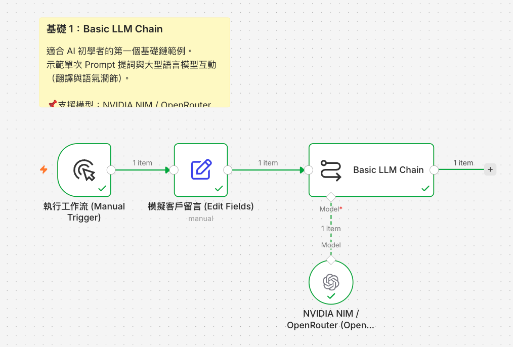

# 基礎範例 1：Basic LLM Chain（基礎提示詞與文字生成）

## 📚 工作流程說明

**Basic LLM Chain** 是進入 n8n AI 世界最純粹、最穩定的起點！

不同於具備自主決策與工具調用循環的 AI Agent，**Basic LLM Chain 採用確定性的「單向處理鏈」**：接收輸入資料 ➔ 組合 Prompt 提示詞 ➔ 呼叫語言模型（LLM）➔ 輸出結果。適用於文字翻譯、格式潤飾、摘要生成、以及固定規則的內容產出。

> 🤖 **模型註冊與串接指南（推薦資安合規主軸）**：
> - [**NVIDIA NIM 微服務模型串接**](../../nvidia_nim/README.md)（免費取得 API Key，使用 `meta/llama-3.3-70b-instruct` 或 `nvidia/nemotron-3.5-lightning-30b-a3b`）
> - [**OpenRouter 多模型聚合平台**](../../openrouter/README.md)（單一 Key 調用多種主流合規模型）

---

## 🧭 工作流程架構



---

## 🖼️ 預覽圖



---

## 📥 工作流程圖下載

- [下載範例流程：Basic_LLM_Chain.json](./Basic_LLM_Chain.json)

---

## 📋 節點詳細說明

1. **📝 Sticky Note（便利貼）**
   - 標記教學重點與流程目的。

2. **👆 Manual Trigger（執行工作流）**
   - 用於手動測試與驗證工作流程。

3. **🔄 Edit Fields (Set - 模擬客戶留言)**
   - 建立測試用英文字串：`customer_name` 與 `customer_feedback`。

4. **🔗 Basic LLM Chain（核心鏈節點）**
   - **功能**：接收上游資料，透過 Expression 語法 `{{ $json.customer_feedback }}` 組合提示詞，並送入模型。
   - **提示詞規範**：要求模型輸出繁體中文翻譯、核心訴求與建議回覆方向。

5. **🧠 OpenAI Chat Model（連接 NVIDIA NIM / OpenRouter）**
   - **Base URL 設定**：
     - NVIDIA NIM：`https://integrate.api.nvidia.com/v1`
     - OpenRouter：`https://openrouter.ai/api/v1`
   - **模型選擇**：例如 `meta/llama-3.3-70b-instruct`。

---

## 🎯 學習重點

- **基礎 Chain 觀念**：理解單向 LLM 呼叫與 AI Agent 循環推理的差異。
- **動態提示詞（Expression）**：掌握在 Prompt 中動態注入 `$json` 變數的技巧。
- **標準 OpenAI 相容介面**：學會透過 Base URL 連接 NVIDIA NIM 與 OpenRouter。

---

## 💡 實際應用場景

- 跨境電商多語言客服留言即時翻譯。
- 部落格文章多平台社群貼文（FB/IG/Threads）自動轉寫與改寫。
- 行銷信件主旨與內容語氣潤飾（正式、幽默、熱情）。

---

## 🤖 AI 賦能延伸實作（附 Prompt 提詞）

<details>
<summary>👉 點擊展開可直接複製給 AI 助理的 Prompt 提詞</summary>

> 💡 **任務目標**：透過 AI 在現有工作流後方加入「多語系自動偵測與雙向轉換」功能。

```text
請幫我在目前的「Basic LLM Chain」工作流程中進行擴充：
1. 在模擬輸入中增加一個 target_language 欄位（例如："日文"、"英文"、"德文"）。
2. 更新 Basic LLM Chain 的 Prompt，使其能根據 {{ $json.target_language }} 動態將內容翻譯為指定的目標語言。
3. 同時要求輸出一句適合該語言文化的商務開場問候語。
請幫我調整提示詞表達式！
```
</details>
