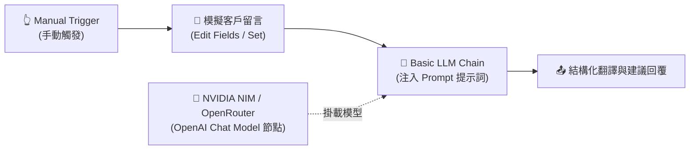

# 基礎範例 1：Basic LLM Chain（基礎提示詞與文字生成）

### 📚 工作流程說明

**Basic LLM Chain** 是進入 n8n AI 世界最純粹、最穩定的起點！

不同於具備自主決策與工具調用循環的 AI Agent，**Basic LLM Chain 採用確定性的「單向處理鏈」**：接收輸入資料 ➔ 組合 Prompt 提示詞 ➔ 呼叫語言模型（LLM）➔ 輸出結果。適用於文字翻譯、格式潤飾、摘要生成、以及固定規則的內容產出。

> 🤖 **模型註冊與串接指南（推薦資安合規主軸）**：
> - [**NVIDIA NIM 微服務模型串接**](../../nvidia_nim/README.md)（免費取得 API Key，使用 `meta/llama-3.3-70b-instruct`）
> - [**OpenRouter 多模型聚合平台**](../../openrouter/README.md)（單一 Key 調用多種主流合規模型）

---

### 🧭 工作流程架構



---

### 預覽圖


---

### 📥 工作流程圖下載

- [下載範例流程：Basic_LLM_Chain.json](./Basic_LLM_Chain.json)

---

### 📋 節點詳細說明

1. **📝 Sticky Note（便利貼）**
   - **功能**：流程中的教學指引與重點標記。
   - **內容**：說明 Basic LLM Chain 的基本概念與支援模型。

2. **👆 執行工作流 (Manual Trigger)**
   - **功能**：手動點擊「Execute Workflow」按鈕啟動工作流程。
   - **用途**：適合開發測試與單次除錯。

3. **🔄 模擬客戶留言 (Edit Fields / Set)**
   - **功能**：模擬接收來自海外顧客的英文留言。
   - **欄位設計**：
     - `customer_name`: 顧客姓名（如 `"Sarah Jenkins"`）。
     - `customer_feedback`: 顧客回饋文字（如詢問客製化訂製與海外運送限制）。

4. **🔗 Basic LLM Chain（核心提示詞鏈）**
   - **功能**：接收上游資料，透過表達式（Expression）動態注入 Prompt，並將文字傳送給語言模型。
   - **提示詞設計**：
     ```text
     請閱讀以下來自顧客 {{ $json.customer_name }} 的留言：
     "{{ $json.customer_feedback }}"

     請輸出：
     1. 繁體中文翻譯
     2. 核心需求歸納（20 字以內）
     3. 建議客服回覆草稿（繁體中文，親切專業語氣）
     ```

5. **🧠 NVIDIA NIM / OpenRouter (OpenAI Chat Model)**
   - **功能**：提供大語言模型（LLM）的文字理解與生成大腦。
   - **模型選擇**：`meta/llama-3.3-70b-instruct`。

---

### 🎯 學習重點

- **基礎 Chain 觀念**：理解單向 LLM 呼叫與自主 AI Agent 循環推理的本質差異。
- **動態提示詞（Expression）**：掌握在 Prompt 中動態注入 `$json.欄位名稱` 的技巧。
- **標準 OpenAI 相容介面**：學會透過 Base URL 連接 NVIDIA NIM 與 OpenRouter 企業推論服務。

---

### 💡 實際應用場景

- **跨境電商多語言客服留言即時翻譯**：將外語留言自動翻譯並擬定回覆草稿。
- **社群貼文多平台轉寫**：將一篇產品介紹自動改寫為適合 FB、IG、Threads 的不同文案。
- **行銷信件語氣潤飾**：將生硬的技術說明轉換為親切活潑的行銷文案。

---

### ⚙️ 設定步驟

1. **匯入流程**：將 `Basic_LLM_Chain.json` 複製並貼上至 n8n 畫布中。
2. **配置憑證**：在 OpenAI Chat Model 節點中選取您的 NVIDIA NIM 或 OpenRouter 憑證。
3. **執行測試**：點擊「Execute Workflow」或在 Manual Trigger 點擊測試。
4. **檢視結果**：點擊 Basic LLM Chain 節點查看輸出的繁體中文翻譯與回覆草稿。

---

### 🤖 AI 賦能延伸實作（附 Prompt 提詞）

<details>
<summary>👉 點擊展開可直接複製給 AI 助理的 Prompt 提詞</summary>

> 💡 **任務目標**：透過 AI 在現有工作流後方加入「多語系自動偵測與雙向轉換」功能。

```text
請幫我在目前的「Basic LLM Chain」工作流程中進行擴充：
1. 在模擬輸入中增加一個 target_language 欄位（例如："日文"、"英文"、"德文"）。
2. 更新 Basic LLM Chain 的 Prompt，使其能根據 {{ $json.target_language }} 動態將內容翻譯為指定的目標語言。
3. 同時要求輸出一句適合該語言文化的商務開場問候語。
請幫我調整提示詞表達式！
```
</details>
