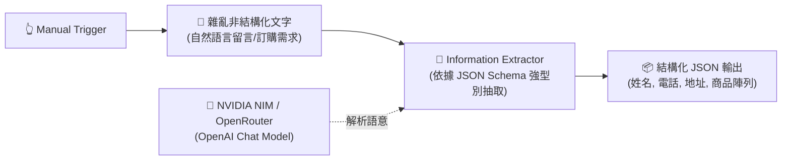

# 基礎範例 2：Information Extractor（非結構化文字轉結構化 JSON）

## 📚 工作流程說明

在自動化實務中，使用者輸入的資料往往是雜亂無章的自然語言（例如：LINE 訊息、Email 詢價、客服留言或發票 OCR 文字）。

過去我們必須撰寫極度脆弱且難以維護的 Regular Expression（正規表達式）來硬抓文字；現在透過 **Information Extractor** 節點，只要提供 **JSON Schema（欄位規格定義）**，AI 就會自動以強型別（String, Number, Array, Object）將目標資訊精準擷取出來，轉換為乾淨的 JSON 物件供後續資料庫儲存。

> 🤖 **模型註冊與串接指南（推薦資安合規主軸）**：
> - [**NVIDIA NIM 微服務模型串接**](../../nvidia_nim/README.md)（推薦 `meta/llama-3.3-70b-instruct`）
> - [**OpenRouter 多模型聚合平台**](../../openrouter/README.md)（推薦 `anthropic/claude-3.5-sonnet` 或 `meta-llama/llama-3.3-70b-instruct`）

---

## 🧭 工作流程架構



---

## 📥 工作流程圖下載

- [下載範例流程：Information_Extractor.json](./Information_Extractor.json)

---

## 📋 節點詳細說明

1. **📝 Sticky Note（便利貼）**
   - 標記教學重點與 JSON Schema 抽取目標。

2. **🔄 模擬自然語言訂購留言 (Edit Fields)**
   - 包含一段混合中文、數字、地址、商品明細與統編的口語訂購文字。

3. **📄 Information Extractor（資訊抽取核心）**
   - **Text**：傳入自然語言文字 `{{ $json.raw_message }}`。
   - **Schema 定義**：
     - `customer_name` (String) - 顧客姓名
     - `phone` (String) - 聯絡電話
     - `shipping_address` (String) - 收件地址
     - `tax_id` (String) - 統一編號
     - `order_items` (Array) - 商品明細陣列（包含 `item_name`, `quantity`, `unit_price`）
     - `total_amount` (Number) - 總金額

4. **🧠 OpenAI Chat Model（連接 NVIDIA NIM / OpenRouter）**
   - 建議設定 `temperature: 0` 或 `0.1`，讓數值與欄位抽取維持最高準確度與一致性。

---

## 📖 JSON Schema 格式設計與原理說明

在 `Information Extractor` 節點中，我們所設定的不是一般的「資料 JSON」，而是遵循國際標準的 **[JSON Schema（JSON 結構規格定義）](https://json-schema.org/learn/miscellaneous-examples)**。

### 1. 範例 Schema 完整結構

```json
{
  "type": "object",
  "properties": {
    "customer_name": { "type": "string", "description": "顧客姓名" },
    "phone": { "type": "string", "description": "聯絡電話" },
    "shipping_address": { "type": "string", "description": "收件地址" },
    "tax_id": { "type": "string", "description": "統一編號（若無則為空）" },
    "order_items": {
      "type": "array",
      "items": {
        "type": "object",
        "properties": {
          "item_name": { "type": "string", "description": "商品名稱" },
          "quantity": { "type": "number", "description": "購買數量" },
          "unit_price": { "type": "number", "description": "單價" }
        },
        "required": ["item_name", "quantity"]
      }
    },
    "total_amount": { "type": "number", "description": "訂單預估總金額" }
  },
  "required": ["customer_name", "phone", "shipping_address", "order_items"]
}
```

### 2. 關鍵欄位語法解析

- **`"type": "object"`**：宣告最外層輸出必須是一個鍵值對物件（Key-Value Object）。
- **`"properties"`**：定義該物件底下包含的所有欄位名稱與規格。
- **`"type": "string" | "number" | "boolean" | "array" | "object"`**：
  - 強型別約束。例如宣告為 `"number"` 時，AI 會自動將自然語言中的「2 盒」轉換為純數字 `2`；「單價 600 元」轉換為 `600`。
- **`"description"`（極重要）**：
  - **給 LLM 的語意提示詞**。AI 會依據這段描述在非結構化文字中進行語意對齊與搜尋。
- **`"order_items"` 陣列與巢狀結構**：
  - `"type": "array"`：宣告該欄位為清單/陣列。
  - `"items"`：定義陣列中每一項（Item）的子結構。此處定義每個項目都是一個包含商品名稱、數量與單價的 `object`。
- **`"required": [...]`**：
  - 必填約束。強制要求 LLM 輸出時必須包含這些欄位鍵值，確保下游流程資料完整性。

### 3. 為什麼 AI 節點需要 JSON Schema？

| 比較維度 | 傳統 Prompt 要求「請輸出 JSON」 | 使用 JSON Schema（Structured Outputs） |
| :--- | :--- | :--- |
| **型別安全** | 數字容易變成字串 `"2"` 或包含中文單位 | 100% 強制轉換為指定型別（如數值 `2`） |
| **格式穩定度** | 容易夾帶 \`\`\`json 標籤或遺漏括號 | 底層 Grammar-Guided 採樣約束，輸出保證可被解析 |
| **巢狀清單抽取** | 難以穩定抽取多筆訂購商品 | 透過 `items` 結構可精準一次抽出陣列物件 |

> 📚 **延伸閱讀**：更多標準規範與語法可參考 [JSON Schema 官方範例](https://json-schema.org/learn/miscellaneous-examples)。

---

## 🎯 學習重點

- **強型別 Schema 設計**：學會定義 String, Number, Boolean, Array, Object 等資料型態。
- **陣列與巢狀抽取**：體驗從文字中一次性抽出多項購買清單（陣列物件）。
- **零程式碼取代表達式**：理解 LLM 如何理解上下文語意並自動忽略無關廢話。

---

## 💡 實際應用場景

- LINE / Messenger 社群團購下單訊息自動解析並寫入 Google 試算表。
- 履歷文字（Resume）自動抽取求職者姓名、學歷、技能清單與工作年資。
- 廠商報價單 / 發票 OCR 文字自動抽取金額、品名與發票號碼。

---

## 🤖 AI 賦能延伸實作（附 Prompt 提詞）

<details>
<summary>👉 點擊展開可直接複製給 AI 助理的 Prompt 提詞</summary>

> 💡 **任務目標**：透過 AI 在資訊抽取後自動串接 DataTable 或 Google Sheets 節點儲存。

```text
請幫我在目前的「Information Extractor」工作流程後方擴充：
1. 接收 Information Extractor 抽取出的 order_items 陣列。
2. 串接一個 Loop (Item Lists / Split Out) 節點將陣列拆解為單筆資料。
3. 串接 DataTable 節點（或 Google Sheets），將每一筆訂購項目的「顧客姓名」、「聯絡電話」、「商品名稱」、「數量」與「金額」自動寫入資料表。
請幫我建立相關節點並完成資料映射！
```
</details>
