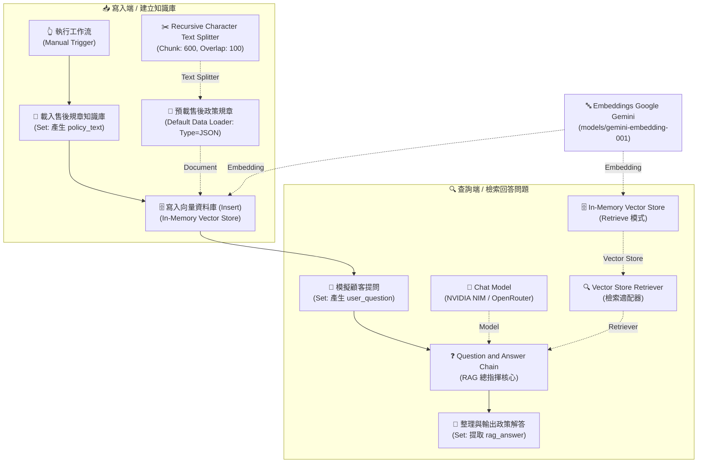

# 基礎範例 6：Question and Answer Chain（RAG 規章知識庫問答）

> 📖 **教學定位**：本範例為標準 RAG（檢索增強生成）的基礎必修課。學習如何將企業內部的「售後規章」建立為向量知識庫，並透過問答鏈讓 AI 嚴格根據條文精準作答，徹底消除胡言亂語與幻覺。

---

## 一、這個工作流在教什麼？

用一份「售後服務規章」文字，建立一個能精準回答顧客問題的問答機器人。

核心概念是 **RAG（Retrieval-Augmented Generation，檢索增強生成）**：
先把規章切碎、轉成向量存入資料庫；當顧客提問時，先「語意檢索」出最相關的規章段落，再把段落連同問題一起交給大語言模型作答。

### ❓ 為什麼非要 RAG 不可？

| 做法 | 面臨問題 |
|---|---|
| **直接問 LLM**<br/>「我們的退貨規定是什麼？」 | 模型不知道貴公司的內部私有規章，只能憑空瞎編（產生**幻覺 Hallucination**）。 |
| **把整份規章塞進 Prompt** | 文件一大就會超過 Context 視窗上限、成本極高（Token 昂貴），且模型容易忽略長文的中間段落。 |
| **RAG（檢索增強生成）** | 只撈出最相關的 2～4 段精華餵給模型，**精準度高、節省 Token 成本、答案具備可溯源性**。 |

> 💡 **一句話總結給學生**：
> **RAG = 開書考試。不是要模型死記硬背，而是在它答題前，精準幫它翻到正確的那一頁！**

---

## 二、整體架構：兩條獨立的線（寫入端 vs 查詢端）

本工作流程最關鍵的觀念，在於它在同一個流程中貫穿了 **寫入端（建立知識庫）** 與 **查詢端（檢索與回答問題）** 兩條核心路線：



> ⚠️ **關鍵記憶體機制**：
> 1. **為什麼需要兩顆 Vector Store 節點？**
>    - `Insert 模式` 的節點才有 `Document` 插槽（負責收錄文件）。
>    - `Retrieve 模式` 的節點只有 `Embedding` 插槽（負責供 Retriever 調度搜尋）。
>    - **一顆節點無法同時兼具兩種插槽與用途**，因此必須拆為寫入與查詢兩顆節點。
> 2. **In-Memory 生命週期**：資料暫存於 n8n 執行記憶體中，n8n 重啟即會清空。因此測試時每次都必須從 `Manual Trigger` 完整執行一遍。

---

## 三、六層架構比喻表（觀念速查）

| 層級 | 節點名稱 | 白話生活比喻 | 核心職責 |
|:---:|---|---|---|
| **1. 資料來源** | 載入售後規章知識庫 | 拿到一本全新的政策規章手冊 | 注入原始文本資料（`policy_text`） |
| **2. 文件載入** | Default Data Loader | 把手冊打開，攤平成標準閱讀格式 | 將 JSON 文字包裝為 LangChain Document |
| **3. 智慧切片** | Recursive Character Text Splitter | 將厚手冊撕成一張張重點便利貼 | 依語意標點分割成 600 字小區塊 |
| **4. 向量嵌入** | Embeddings Google Gemini | 幫每張便利貼編上「語意空間座標」 | 將文字轉為數學向量（如 768 維） |
| **5. 儲存檢索** | Vector Store (Insert / Retrieve) | 把便利貼收進抽屜；提問時撈出最像的幾張 | 記憶體索引儲存與語意相似度檢索 |
| **6. 組織生成** | QA Chain + Chat Model | 看著撈出來的便利貼，親切寫出白話解答 | 結合問題與規章片段，生成零幻覺回覆 |

---

## 📥 工作流程與資料檔案下載

- [下載完整範例工作流程：Question_and_Answer_Chain.json](./Question_and_Answer_Chain.json)
- [查看/下載售後規章範例文本：售後服務與保固政策規章.txt](./售後服務與保固政策規章.txt)

---

## 四、節點逐一詳細說明（參數配置與教學重點）

### 1. 👆 執行工作流（Manual Trigger）
- **節點類型**：`n8n-nodes-base.manualTrigger`
- **作用**：手動點擊「Execute workflow」或「Test step」啟動整條流程。
- **教學重點**：Trigger 是 n8n 每條工作流的起點。教學階段使用 Manual Trigger，實務生產環境可換成 `Webhook`（接前端聊天視窗）或 `Schedule Trigger`（定時排程重建向量庫）。

---

### 2. 📄 載入售後規章知識庫（Set / Edit Fields）
- **節點類型**：`n8n-nodes-base.set`（v3.4）
- **作用**：將整份售後規章條文放進欄位 `policy_text`。
- **教學重點**：
  - 此處為「教學示範資料注入點」。在企業真實場景中，可替換為 `Google Drive`、`Notion`、`MySQL / PostgreSQL` 或 `HTTP Request` 節點自動讀取。
  - 讓學生理解：n8n 的資料是一包一包的 JSON Item 在節點間傳遞流動，`policy_text` 就是這包 JSON 中的一個 String 屬性。

---

### 3. 🗄️ 寫入向量資料庫（Insert）
- **節點類型**：`@n8n/n8n-nodes-langchain.vectorStoreInMemory`
- **關鍵參數**：
  - **Mode**：`Insert Documents`
  - **Clear Store**：`true`（每次寫入前清空舊快取，避免重複堆疊）
- **底部插槽**：
  - `Embedding *`（必填）➔ 連接 Embeddings Model
  - `Document`（必填）➔ 連接 Default Data Loader
- **教學重點（本課最關鍵觀念）**：
  - **為什麼要兩顆 Vector Store？** 因為 `Insert` 模式才有 `Document` 插槽接收文本；而 `Retrieve` 模式只有 `Embedding` 插槽供檢索。一顆節點無法同時身兼兩職。
  - 正式企業環境可延伸：將 In-Memory 替換為 `Qdrant`、`Pinecone`、`Supabase (pgvector)`，資料便能永久保存，不需每次重新 Insert。

---

### 4. 📄 預載售後政策規章（Default Data Loader）
- **節點類型**：`@n8n/n8n-nodes-langchain.documentDefaultDataLoader`
- **關鍵參數**：
  - **Type of Data**：`JSON`（⚠️ 學生最常選錯成 String 或維持預設 Binary 而報錯）
  - **JSON Mode**：`expressionData`
  - **JSON Data**：`={{ $json.policy_text }}`
- **底部插槽**：`Text Splitter *` ➔ 連接 Recursive Character Text Splitter
- **作用**：將上游傳入的 JSON 字串轉換為 LangChain 標準 Document 資料物件。

---

### 5. ✂️ Recursive Character Text Splitter（文本切片器）
- **節點類型**：`@n8n/n8n-nodes-langchain.textSplitterRecursiveCharacterTextSplitter`
- **關鍵參數**：
  - **Chunk Size**：`600`
  - **Chunk Overlap**：`100`
- **教學重點（RAG 檢索品質的核心生命線）**：
  - **Chunk Size（切片大小）**：每段文字容量。太大 ➔ 包含過多無關主題，檢索雜訊多；太小 ➔ 完整語意被切斷。繁體中文條文建議抓 300～600 字最合適。
  - **Chunk Overlap（重疊字數）**：相鄰兩段保留重疊的字數，避免關鍵規定剛好在切分邊界被硬生生切斷。
  - **Recursive（遞迴）的真義**：優先以段落（`\n\n`）、換行（`\n`）、句號（`。`）依序嘗試切割，儘量確保每句話完整，最後逼不得已才硬切字元。

---

### 6. 🔤 Embeddings Google Gemini（向量嵌入模型）
- **節點類型**：`@n8n/n8n-nodes-langchain.embeddingsGoogleGemini`
- **憑證**：Google Gemini(PaLM) API（可於 Google AI Studio 免費申請）
- **建議模型**：`models/gemini-embedding-001`
- **重要連線**：**一顆 Embedding 節點同時接到底部兩個 Vector Store 節點！**
- **教學重點**：
  - **Embedding 是什麼**：將文字轉換為空間數學座標（向量）。語意越接近，向量空間距離越近。顧客問「東西摔壞能修嗎」，即便規章寫的是「物理外力撞擊除外條款」，語意搜尋也能精準命中。
  - **寫入端與查詢端必須使用同一顆模型**：如果寫入用 Gemini（768 維），查詢用 OpenAI（1536 維），向量空間維度完全不同，會直接報錯或檢索出亂碼。

---

### 7. 💬 模擬顧客提問（Set / Edit Fields）
- **節點類型**：`n8n-nodes-base.set`（v3.4）
- **欄位配置**：
  - `user_question`：`請問如果商品不小心進水了，原廠有提供免費保固維修嗎？另外退貨需要多久時間？`
- **教學重點**：實務上此節點即為顧客在 LINE、Messenger、網頁聊天室輸入的即時訊息。

---

### 8. ❓ Question and Answer Chain（RAG 總指揮核心）
- **節點類型**：`@n8n/n8n-nodes-langchain.chainRetrievalQa`（v1.4）
- **關鍵參數**：
  - **Prompt Type**：`Define below`
  - **Text**：`={{ $json.user_question }}`
- **底部插槽**：
  - `Model *` ➔ 連接語言模型
  - `Retriever *` ➔ 連接向量檢索器
- **作用**：封裝好的 RAG 控制中樞，背後自動執行三件事：
  1. 拿問題到 Retriever 檢索出最相關的 2~4 個規章段落。
  2. 將檢索出的規章片段與問題自動組裝進 Prompt 範本。
  3. 呼叫 Chat Model 進行閱讀理解並輸出精準解答。

---

### 9. 🧠 NVIDIA NIM / OpenRouter（OpenAI Chat Model）
- **節點類型**：`@n8n/n8n-nodes-langchain.lmChatOpenAi`（v1.2）
- **建議設定**：`temperature: 0.1`，模型推薦 `meta/llama-3.3-70b-instruct`。
- **教學重點（區分 Chat Model 與 Embedding Model 的差異）**：
  - **Embedding Model**：只負責「文字轉數字座標」，專門找資料，不會講話。
  - **Chat Model**：負責「閱讀理解與組織語言」，看著找到的資料講人話。
  - 兩者職責分明，**絕對不可互換**。

---

### 10. 🔍 Vector Store Retriever（向量檢索適配器）
- **節點類型**：`@n8n/n8n-nodes-langchain.retrieverVectorStore`
- **底部插槽**：`Vector Store *` ➔ 連接 In-Memory Vector Store
- **關鍵參數**：`Limit`（即 top-k，預設檢索 4 筆最相關片段）。
- **教學重點**：QA Chain 只認 Retriever 介面，透過轉接頭將 Vector Store 封裝成標準檢索器。

---

### 11. 🗄️ In-Memory Vector Store（Retrieve 模式）
- **節點類型**：`@n8n/n8n-nodes-langchain.vectorStoreInMemory`
- **底部插槽**：`Embedding *`（接同一顆 Gemini Embedding 節點）
- **教學重點**：查詢端透過此節點直接在記憶體中比對相似度，並提供給 Retriever。

---

### 12. 🎯 整理與輸出政策解答（Set / Edit Fields）
- **節點類型**：`n8n-nodes-base.set`（v3.4）
- **欄位配置**：
  - `rag_answer`：`={{ $json.text || $json.response?.text || $json.output }}`
- **作用**：提取乾淨的最終解答文字，便於後續串接 LINE Notify、Slack、Email 或回寫資料庫。

---

## 五、常見錯誤與除錯清單（學生排錯聖經）

| 症狀 / 報錯訊息 | 發生原因 | 正確解決方案 |
|---|---|---|
| **節點顯示紅色驚嘆號** | 底部帶有 `*` 的必填插槽未連接，或 API 憑證未選取。 | 檢查並補齊所有子節點插槽與 API Key 憑證。 |
| **`The value "string" is not supported!`** | Default Data Loader 的 `Type of Data` 誤選或誤設為 string。 | 將 Type of Data 改選為 **`JSON`**，並使用 Expression 指定 `{{ $json.policy_text }}`。 |
| **答案完全在編造（幻覺）** | 查詢端未撈到任何規章資料，AI 只能自由發揮。 | 確認工作流每次測試皆從 Manual Trigger 完整跑過（確保寫入端已先執行）。 |
| **報錯：維度不符（Dimension Mismatch）** | 寫入端與查詢端使用了不同的 Embedding 模型。 | 確保寫入與查詢的兩顆 Vector Store 連接的是**同一顆 Embeddings Model 節點**。 |
| **重新整理後查不到資料** | In-Memory 資料只存於 RAM 中，n8n 重啟後會消失。 | 每次測試務必點擊 `Manual Trigger` 執行完整工作流，重建向量索引。 |
| **AI 抓錯規章段落回答** | Chunk Size 太大導致雜訊多，或太大導致片段被切散。 | 調整 Text Splitter 的 Chunk Size 為 500~600，Overlap 為 100。 |

---

## 六、建議課堂操作與實驗順序（刻意改壞教學法）

1. **第一步：先跑寫入端**
   - 點擊「載入售後規章知識庫」與「寫入向量資料庫」，觀察規章文字如何被注入與切割。
2. **第二步：執行完整流程**
   - 點擊 Manual Trigger 跑完全程，在「整理與輸出政策解答」檢視精準的保固與退款回答。
3. **第三步：課堂實驗「刻意改壞 — 換成錯誤 Embedding」**
   - 將查詢端的 Embedding 換成不同模型 ➔ 觀察 n8n 拋出維度不符錯誤，讓學生深刻體會「向量空間一致性」。
4. **第四步：課堂實驗「刻意改壞 — 調整 Chunk Size」**
   - 將 Chunk Size 改為極端的 `50` ➔ 觀察條文被切成碎片後，AI 檢索上下文缺失導致回答品質劇降。
5. **第五步：測試邊界問題**
   - 提問規章中完全沒寫的事項（如：「可以退款到別人的比特幣錢包嗎？」）➔ 觀察 AI 是否能誠實回答規章未載明。

---

## 📄 預載售後政策規章（測試文本全文）

```text
【TechCorp 數位智能 產品售後服務與保固政策總規章（2026年版）】

一、 原廠保固範圍與期限
1. 凡購買本公司全系列正品，憑購買發票、電子訂單憑證或產品保固卡，享有自簽收日起算「1 年（12 個月）原廠有限保固服務」。
2. 保固期內，若屬非人為因素引起之硬體功能故障、晶片瑕疵或零組件異常，本公司提供免費檢測與免費維修更換服務。

二、 人為損壞與除外條款（非免費保固項目）
以下情況均不在免費保固範圍內，本公司將依檢測情況酌收零件工本費與檢測服務費（基本檢測費 500 元）：
1. 液體滲入損壞：產品因進水、受潮、浸泡液體、飲料潑灑或汗水侵蝕導致之機板短路與零件鏽蝕。
2. 物理外力撞擊：因重摔、擠壓、撞擊導致外殼破裂、螢幕碎裂或內部結構損毀。
3. 非原廠拆修：未經原廠授權私自拆解、改裝、更換副廠零件或刷除非官方韌體者。
4. 天災不可抗力：因雷擊、水災、火災、地震等天然災害造成之損壞。

三、 7 天猶豫期與退貨規範
1. 猶豫期計算：依照消費者保護法規定，線上通路訂購之商品享有自收件次日起算「7 天猶豫期（鑑賞期）」。
2. 猶豫期非試用期：辦理退貨之商品必須保持全新未拆封狀態，包含主機、配件、原廠包裝盒、說明書、發票及贈品皆需完整無缺。
3. 退貨運費負擔：在 7 天猶豫期內提出合規退貨申請，由本公司委派物流免費到府取件。

四、 退款時程與作業天數
1. 驗收時效：本公司售後中心於收到退回包裹後，將於 1 個工作天內完成商品完整性驗收。
2. 款項返還：
   - 信用卡付款：確認驗收無誤後，將於「3 個工作天內」完成信用卡線上刷退。
   - ATM / 貨到付款：將於「5 個工作天內」將款項全額匯入買方指定之銀行帳戶。

五、 新品不良（DOA）換貨規範
1. 若商品於收件後「15 天內」發生非人為之功能性故障，本公司將免費提供原箱換新機服務。

六、 客服諮詢專線
- 客服專線：0800-888-999（週一至週五 09:00 - 18:00）
- 線上報修：https://service.techcorp.com
```
