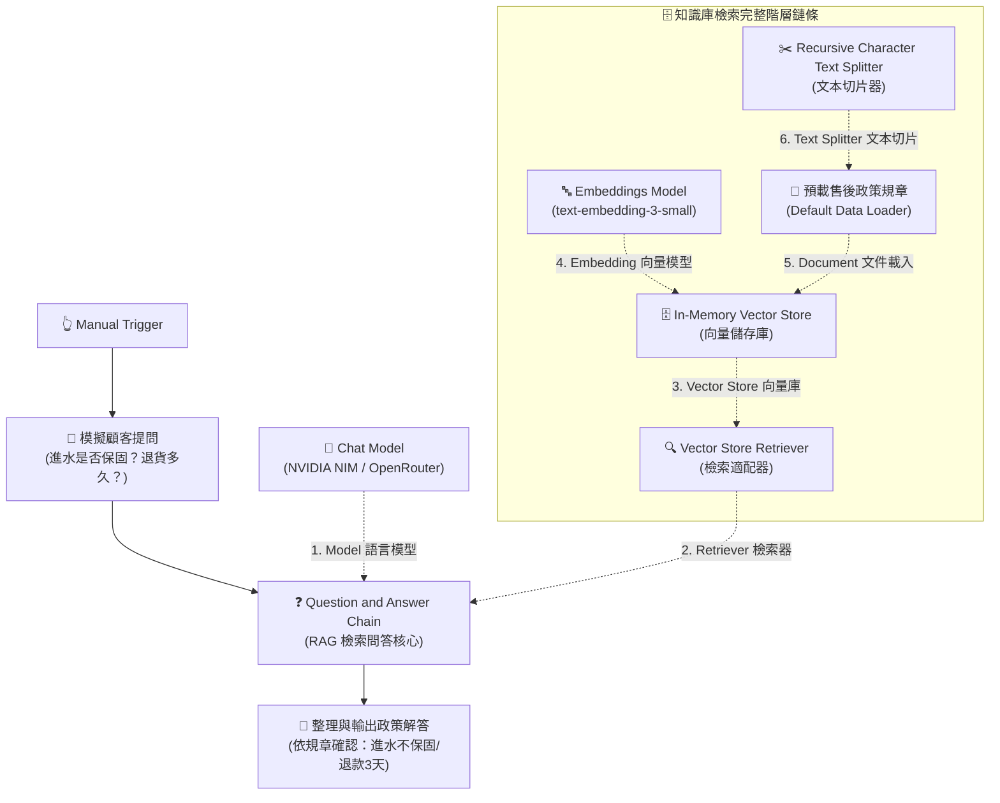

# 基礎範例 6：Question and Answer Chain（RAG 規章知識庫問答）

## 📚 工作流程說明

在自動化客服與企業問答中，通用大語言模型（如 GPT、Llama、Claude）常常會產生「幻覺（Hallucination）」或回答過時的資訊。

**Question and Answer Chain（檢索問答鏈）** 是建構 **RAG（Retrieval-Augmented Generation，檢索增強生成）** 的標準專用 AI 節點。透過將企業內部的「售後規章、產品手冊、保固條款」載入向量資料庫，當使用者提問時，系統會先**精準檢索出相關的規章段落**，再交由 AI **嚴格根據該段落作答**，徹底消除胡言亂語！

> 🤖 **模型註冊與串接指南（推薦資安合規主軸）**：
> - [**NVIDIA NIM 微服務模型串接**](../../nvidia_nim/README.md)（推薦 `meta/llama-3.3-70b-instruct`）
> - [**OpenRouter 多模型聚合平台**](../../openrouter/README.md)（推薦 `meta-llama/llama-3.3-70b-instruct`）

---

## 🧭 工作流程架構（RAG 6 大節點層級串接鏈）

在 n8n 中，Question and Answer Chain 的底層 LangChain 架構具有**嚴格的型別插槽相依性**：



---

## 📥 工作流程與資料檔案下載

- [下載修復與完整連線範例流程：Question_and_Answer_Chain.json](./Question_and_Answer_Chain.json)
- [查看/下載售後規章偽資料文本：售後服務與保固政策規章.txt](./售後服務與保固政策規章.txt)

---

## 📋 節點詳細說明（各節點職責與運作原理）

### 1. **📝 Sticky Note（便利貼）**
- **功能**：畫布流程的註解與指引。
- **內容**：清楚標示 6 階層標準 RAG 的連線關係，提醒開發者各節點底部的必連插槽。

---

### 2. **👆 執行工作流 (Manual Trigger)**
- **功能**：手動點擊「Execute Workflow」按鈕來啟動流程。
- **用途**：適合開發測試、單次偵錯與學習驗證。

---

### 3. **💬 模擬顧客提問 (Edit Fields / Set)**
- **功能**：模擬進線顧客提出的口語問題。
- **內容**：包含欄位 `user_question`：「*請問如果商品不小心進水了，原廠有提供免費保固維修嗎？另外退貨需要多久時間？*」。

---

### 4. **❓ Question and Answer Chain（RAG 總指揮核心）**
- **功能**：RAG 檢索問答流程的主控節點（Root Chain）。
- **操作**：
  - 接收來自上游的顧客問題（`{{ $json.user_question }}`）。
  - 調用底部的 **Retriever（檢索器）** 前往向量知識庫搜尋最相關的政策規章。
  - 將檢索到的規章段落與顧客問題組裝，交由 **Chat Model** 生成流暢的繁體中文解答。
- **必連插槽**：
  - `Model *` ➔ 連接語言模型
  - `Retriever *` ➔ 連接向量檢索器

---

### 5. **🧠 NVIDIA NIM / OpenRouter (OpenAI Chat Model)**
- **功能**：提供大語言模型（LLM）的文字理解與回覆生成大腦。
- **參數**：建議設定 `temperature: 0.1`，讓回答高度忠於規章條文，嚴格防止模型自由發揮（胡言亂語）。

---

### 6. **🔍 Vector Store Retriever（向量檢索適配器）**
- **功能**：作為 `Question and Answer Chain` 與 `Vector Store` 之間的「轉接橋樑」。
- **為什麼需要它？**：
  - QA Chain 要求的插槽型別是 `ai_retriever`（檢索器）。
  - Vector Store 提供的插槽型別是 `ai_vectorStore`（資料庫）。
  - 透過此節點可將向量資料庫封裝為具備語意搜尋功能的檢索器。

---

### 7. **🗄️ In-Memory Vector Store（記憶體向量資料庫）**
- **功能**：知識庫的臨時儲存所。
- **概念**：在流程執行時，於記憶體中建立一個微型向量索引，儲存所有切片後的政策規章向量，提供毫秒級的相似度比對。

---

### 8. **🔤 Embeddings Model（向量嵌入模型）** 💡（初學者重點科普）

#### ❓ 什麼是「Embedding（向量化）」？學生常問：這到底是做什麼的？
> **生活化比喻（AI 的文字座標翻譯官）**：
> 1. **人類用文字思考**，但**電腦和資料庫只懂數字**。
> 2. `Embeddings Model`（如 `text-embedding-3-small`）就像是一本「語意數學字典」。它會把每一句話、每一個詞彙，轉換成一串包含 1536 個數字的**空間座標（數學向量 Vector）**。
> 3. **語意越相近的文字，在數學空間中的距離就越近！**
>
> ```text
> 「進水」 ───(數學距離極近)───> 「受潮、液體滲入」
> 「退貨」 ───(數學距離極近)───> 「退款、猶豫期」
> 「西瓜」 ───(數學距離極遠)───> 「保固維修」
> ```
> 4. **為什麼 RAG 非要它不可？**
>    傳統資料庫搜尋只能「字面完全一樣」才找得到（Keyword Search）；但有了 **Embedding 向量化**，即便顧客問：「*手機掉到馬桶裡有保固嗎？*」，AI 透過向量計算也能精準找到寫著「*液體滲入損壞不予免費保固*」的條款！

- **功能**：負責將政策規章文字與使用者的提問「即時轉換為數學向量」，供向量資料庫進行語意搜尋。

---

### 9. **📄 預載售後政策規章 (Default Data Loader)**
- **功能**：資料來源載入器。
- **內容**：內建載入整篇真實的企業售後服務與保固條款規章（涵蓋 1 年保固、進水人為損壞除外、7 天退貨、3 天刷退等規定）。

---

### 10. **✂️ Recursive Character Text Splitter（文本智慧切片器）**
- **功能**：長文分塊切片。
- **概念**：自動將長篇規章以每 1,000 字切成小塊（Chunk），並保留 200 字的重疊（Overlap），防止法規條文在段落交界處被硬生生切斷。

---

### 11. **🎯 整理與輸出政策解答 (Set)**
- **功能**：將 RAG 問答鏈最終生成的解答文字（`rag_answer`）整理為標準 JSON 格式，方便後續串接 LINE、Email 或客服系統輸出。

---

## 🛠️ 常見錯誤排查：為什麼原本的畫布會亮紅燈？

### 🔴 致命錯誤 1：`In-Memory Vector Store` 無法直接連到 `QA Chain`
- **原因**：QA Chain 底部要求 `Retriever *` 型別，而 Vector Store 是 `Vector Store` 型別，兩者型別不相容。
- **解決方案**：在兩者之間加入 **`Vector Store Retriever`** 節點轉接即可！

### 🔴 致命錯誤 2：`Default Data Loader` 缺少 `Text Splitter *`
- **原因**：`Default Data Loader` 底部紅星標記的 `Text Splitter *` 為必連插槽。
- **解決方案**：在下方連接 **`Recursive Character Text Splitter`** 節點。

### 🔴 致命錯誤 3：`Embeddings Model` 缺少憑證
- **解決方案**：選取有效的 OpenAI / OpenRouter 憑證，並選用 `text-embedding-3-small`。

---

## 📄 預載售後政策規章（Default Data Loader 偽資料文本）

在 `Default Data Loader` 節點中預載的規章全文如下：

```text
【TechCorp 數位智能 產品售後服務與保固政策總規章（2026年版）】

一、 原廠保固範圍與期限
1. 凡購買本公司全系列正品，憑購買發票、電子訂單憑證或產品保固卡，享有自簽收日起算「1 年（12 個月）原廠有限保固服務」。
2. 保固期內，若屬非人為因素引起之硬體功能故障、晶片瑕疵或零組件異常，本公司提供免費檢測與免費維修更換服務。

二、 人為損壞與除外條款（非免費保固項目）
以下情況均不在免費保固範圍內，本公司將依檢測情況酌收零件工本費與檢測服務費（基本檢測費 500 元）：
1. 液體滲入損壞：產品因進水、受潮、浸泡液體、飲料潑灑或汗水侵蝕導致之機板短路與零件鏽蝕。
2. 物理外力撞擊：因重摔、擠壓、撞擊導致外殼破裂、螢幕碎裂或內部結構損毀。
3. 非原廠拆修：未經原廠授權私自拆解、改裝、更換副廠零件或刷除非官方韌體者。
4. 天災不可抗力：因雷擊、水災、火災、地震等天然災害造成之損壞。

三、 7 天猶豫期與退貨規範
1. 猶豫期計算：依照消費者保護法規定，線上通路訂購之商品享有自收件次日起算「7 天猶豫期（鑑賞期）」。
2. 猶豫期非試用期：辦理退貨之商品必須保持全新未拆封狀態，包含主機、配件、原廠包裝盒、說明書、發票及贈品皆需完整無缺。
3. 退貨運費負擔：在 7 天猶豫期內提出合規退貨申請，由本公司委派物流免費到府取件。

四、 退款時程與作業天數
1. 驗收時效：本公司售後中心於收到退回包裹後，將於 1 個工作天內完成商品完整性驗收。
2. 款項返還：
   - 信用卡付款：確認驗收無誤後，將於「3 個工作天內」完成信用卡線上刷退。
   - ATM / 貨到付款：將於「5 個工作天內」將款項全額匯入買方指定之銀行帳戶。

五、 新品不良（DOA）換貨規範
1. 若商品於收件後「15 天內」發生非人為之功能性故障，本公司將免費提供原箱換新機服務。

六、 客服諮詢專線
- 客服專線：0800-888-999（週一至週五 09:00 - 18:00）
- 線上報修：https://service.techcorp.com
```

---

## 🎯 學習重點

- **標準 6 階層 RAG 架構**：理解 Chain ➔ Retriever ➔ Vector Store ➔ Embeddings / Document ➔ Splitter 的嚴格依賴關係。
- **語意搜尋（Semantic Search）**：了解 Embedding 向量模型如何跨越字面限制，實現意圖匹配。
- **零幻覺保證**：限制 AI 只能嚴格依據檢索出的規章回答。

---

### 💡 實際應用場景

- **內部企業 HR 規章查詢機器人**：員工詢問請假、報帳、差旅補助辦法。
- **電商客服售後 FAQ 機器人**：精準解答退貨條件、保固範圍、物流時效。
- **產品操作手冊技術支援**：依據說明書解答特定錯誤代碼與障礙排除步驟。

---

### ⚙️ 設定步驟

1. **匯入流程**：將 `Question_and_Answer_Chain.json` 複製並貼上至 n8n 編輯器中。
2. **綁定模型憑證**：
   - 在 OpenAI Chat Model 節點中選取您的 NVIDIA NIM 或 OpenRouter 憑證。
   - 在 Embeddings Model 節點中選取您的 Embeddings 憑證（`text-embedding-3-small`）。
3. **執行測試**：點擊「Execute Workflow」或在 Manual Trigger 點擊測試。
4. **檢視成果**：點擊最後一個「整理與輸出政策解答」節點，查看 AI 是否嚴格依據規章回答「進水不屬免費保固」與「退款 3 個工作天」。

---

## 🤖 AI 賦能延伸實作（附 Prompt 提詞）

<details>
<summary>👉 點擊展開可直接複製給 AI 助理的 Prompt 提詞</summary>

> 💡 **任務目標**：透過 AI 助理將 Question and Answer Chain 連接 Webhook 與通訊軟體，打造即時客服問答機器人。

```text
請幫我在目前的「Question and Answer Chain」工作流程中升級為線上客服機器人：
1. 起點改為接收 Webhook（或 Chat Trigger）傳入的顧客問題 {{ $json.chatInput }}。
2. 透過 Question and Answer Chain 連接知識庫進行檢索回答。
3. 串接 LINE Notify（或 Telegram / Slack）節點，將問題與 AI 依據規章回答的內容發送給顧客。
請幫我配置好連線與變數對應！
```
</details>
