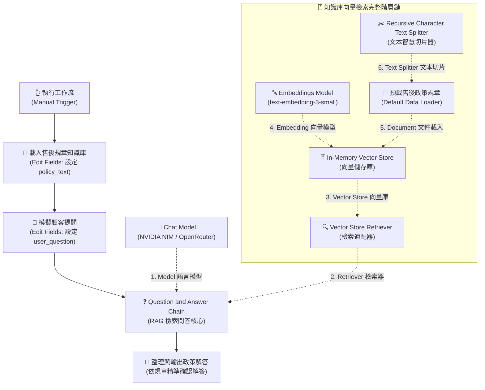

# 基礎範例 6：Question and Answer Chain（RAG 規章知識庫問答）

## 📚 工作流程說明

在自動化客服與企業問答中，通用大語言模型（如 GPT、Llama、Claude）常常會產生「幻覺（Hallucination）」或回答過時的資訊。

**Question and Answer Chain（檢索問答鏈）** 是建構 **RAG（Retrieval-Augmented Generation，檢索增強生成）** 的標準專用 AI 節點。透過將企業內部的「售後規章、產品手冊、保固條款」載入向量資料庫，當使用者提問時，系統會先**精準檢索出相關的規章段落**，再交由 AI **嚴格根據該段落作答**，徹底消除胡言亂語！

> 🤖 **模型註冊與串接指南（推薦資安合規主軸）**：
> - [**NVIDIA NIM 微服務模型串接**](../../nvidia_nim/README.md)（推薦 `meta/llama-3.3-70b-instruct`）
> - [**OpenRouter 多模型聚合平台**](../../openrouter/README.md)（推薦 `meta-llama/llama-3.3-70b-instruct`）

---

## 🧭 工作流程架構（RAG 完整 6 階層串接鏈）

在 n8n 中，RAG 工作流由「**主資料流程**」與「**AI 子節點插槽鏈**」兩個維度共同組成：



---

## 📥 工作流程與資料檔案下載

- [下載修復與完整連線範例流程：Question_and_Answer_Chain.json](./Question_and_Answer_Chain.json)
- [查看/下載售後規章偽資料文本：售後服務與保固政策規章.txt](./售後服務與保固政策規章.txt)

---

## 🔍 連接與除錯大解密：為什麼之前節點會亮紅燈？

### 🛑 常見錯誤 1：Default Data Loader 出現 `The value "string" is not supported!`
- **原因分析**：
  - n8n 的 `Default Data Loader`（預設資料載入器）底層只支援 `JSON` 與 `Binary` 兩種資料類型，**下拉選單中沒有 `string` 這個值**。
  - 若在 JSON 設定中誤填了 `"dataType": "string"`，n8n 就會亮紅燈發出警告。
- **正確設定**：
  1. 打開 `Default Data Loader` 節點。
  2. 將 **Type of Data** 選擇為 **`JSON`**。
  3. 點擊 **Add Option** ➔ 新增 **JSON Data**。
  4. 輸入表達式：`={{ $json.policy_text }}`（指向主流程準備好的知識庫文字欄位）。

---

### 🛑 常見錯誤 2：Default Data Loader 左側提示 `No input connected`
- **原因分析**：
  - `Default Data Loader` 是一個子節點（Sub-node），它需要由**主流程（Parent nodes）**傳遞資料過來。
  - 如果主流程中沒有前置節點先載入規章文字（例如直接從 Trigger 連到只有問題的節點），Data Loader 就拿不到規章文本，只能在記憶體中建立空索引或拿問題當知識庫。
- **正確設定**：
  - 在主流程的 `Manual Trigger` 之後，加入 **`載入售後規章知識庫 (Edit Fields)`** 節點，將規章全文存入 `policy_text` 欄位中，隨後一併流經 QA Chain。

---

### 🛑 常見錯誤 3：`In-Memory Vector Store` 無法直接連到 `QA Chain`
- **原因分析**：
  - `Question and Answer Chain` 底部要求的插槽是 `Retriever *`（檢索器）。
  - `In-Memory Vector Store` 輸出的插槽是 `Vector Store`（向量儲存庫）。
- **正確設定**：
  - 兩者中間必須加入 **`Vector Store Retriever`** 作為適配轉接橋樑。

---

### 🛑 常見錯誤 4：`Default Data Loader` 底部缺少 `Text Splitter *`
- **原因分析**：
  - 長篇規章如果沒有切片，整篇塞入向量庫會導致檢索失真，且容易超出單段 Embedding 上限。
- **正確設定**：
  - 在 `Default Data Loader` 底部必連插槽接上 **`Recursive Character Text Splitter`**（建議 Chunk Size: 600, Overlap: 100）。

---

## 📋 節點詳細說明（各節點職責與參數）

### 1. **📝 Sticky Note（便利貼）**
- **功能**：畫布流程的註解與指引，清楚標示主資料流程與 AI 子節點插槽的連線規範。

---

### 2. **👆 執行工作流 (Manual Trigger)**
- **功能**：手動點擊「Test step」或「Execute Workflow」按鈕啟動測試。

---

### 3. **📄 載入售後規章知識庫 (Edit Fields / Set)**
- **功能**：模擬企業知識庫資料源，將整篇售後保固規章載入至 `policy_text` 欄位。
- **欄位配置**：
  - 名稱：`policy_text`
  - 類型：`String`
  - 內容：包含保固範圍、進水人為損壞除外條款、7天退貨猶豫期、3天刷退時程等完整規章全文。

---

### 4. **💬 模擬顧客提問 (Edit Fields / Set)**
- **功能**：模擬顧客進線提問的口語問題。
- **欄位配置**：
  - 名稱：`user_question`
  - 內容：`請問如果商品不小心進水了，原廠有提供免費保固維修嗎？另外退貨需要多久時間？`

---

### 5. **❓ Question and Answer Chain（RAG 總指揮核心）**
- **功能**：RAG 問答鏈的主控核心。
- **操作**：
  - Prompt Text：設定為 `={{ $json.user_question }}`。
  - 自動透過 Retriever 檢索最相符的條款片段，組裝後交給 LLM 回覆。
- **插槽連接**：
  - `Model *` ➔ 連接語言模型（NVIDIA NIM / OpenRouter）。
  - `Retriever *` ➔ 連接向量檢索適配器（Vector Store Retriever）。

---

### 6. **🧠 NVIDIA NIM / OpenRouter (OpenAI Chat Model)**
- **功能**：文字理解與精準回覆生成大腦。
- **建議設定**：`temperature: 0.1`，讓回覆嚴格遵循規章文字，杜絕自由發揮與幻覺。

---

### 7. **🔍 Vector Store Retriever（向量檢索適配器）**
- **功能**：將 Vector Store 轉接包裝為 QA Chain 認可的 Retriever 介面。
- **插槽連接**：
  - `Vector Store *` ➔ 連接 In-Memory Vector Store。

---

### 8. **🗄️ In-Memory Vector Store（記憶體向量資料庫）**
- **功能**：在工作流執行期間，於記憶體建立即時向量索引並進行語意相似度檢索。
- **插槽連接**：
  - `Embedding *` ➔ 連接 Embeddings Model。
  - `Document` ➔ 連接預載售後政策規章 (Default Data Loader)。

---

### 9. **🔤 Embeddings Model（向量嵌入模型）**
- **功能**：將規章切片與顧客問題轉換為 1536 維空間數學向量。
- **模型推薦**：`text-embedding-3-small`。

---

### 10. **📄 預載售後政策規章 (Default Data Loader)**
- **功能**：從上游取得規章文字，準備轉交給切片器與向量資料庫。
- **參數關鍵**：
  - **Type of Data**：`JSON`
  - **JSON Data**：`={{ $json.policy_text }}`

---

### 11. **✂️ Recursive Character Text Splitter（文本切片器）**
- **功能**：將長篇條文自動切成適合向量化的語意區塊。
- **參數設定**：
  - Chunk Size：`600`
  - Chunk Overlap：`100`

---

### 12. **🎯 整理與輸出政策解答 (Edit Fields / Set)**
- **功能**：提取問答鏈的最終輸出文字（`rag_answer`），方便下游串接客服介面。
- **表達式**：`={{ $json.text || $json.response?.text || $json.output }}`

---

## 📄 預載售後政策規章（測試文本）

```text
【TechCorp 數位智能 產品售後服務與保固政策總規章（2026年版）】

一、 原廠保固範圍與期限
1. 凡購買本公司全系列正品，憑購買發票、電子訂單憑證或產品保固卡，享有自簽收日起算「1 年（12 個月）原廠有限保固服務」。
2. 保固期內，若屬非人為因素引起之硬體功能故障、晶片瑕疵或零組件異常，本公司提供免費檢測與免費維修更換服務。

二、 人為損壞與除外條款（非免費保固項目）
以下情況均不在免費保固範圍內，本公司將依檢測情況酌收零件工本費與檢測服務費（基本檢測費 500 元）：
1. 液體滲入損壞：產品因進水、受潮、浸泡液體、飲料潑灑或汗水侵蝕導致之機板短路與零件鏽蝕。
2. 物理外力撞擊：因重摔、擠壓、撞擊導致外殼破裂、螢幕碎裂或內部結構損毀。
3. 非原廠拆修：未經原廠授權私自拆解、改裝、更換副廠零件或刷除非官方韌體者。
4. 天災不可抗力：因雷擊、水災、火災、地震等天然災害造成之損壞。

三、 7 天猶豫期與退貨規範
1. 猶豫期計算：依照消費者保護法規定，線上通路訂購之商品享有自收件次日起算「7 天猶豫期（鑑賞期）」。
2. 猶豫期非試用期：辦理退貨之商品必須保持全新未拆封狀態，包含主機、配件、原廠包裝盒、說明書、發票及贈品皆需完整無缺。
3. 退貨運費負擔：在 7 天猶豫期內提出合規退貨申請，由本公司委派物流免費到府取件。

四、 退款時程與作業天數
1. 驗收時效：本公司售後中心於收到退回包裹後，將於 1 個工作天內完成商品完整性驗收。
2. 款項返還：
   - 信用卡付款：確認驗收無誤後，將於「3 個工作天內」完成信用卡線上刷退。
   - ATM / 貨到付款：將於「5 個工作天內」將款項全額匯入買方指定之銀行帳戶。

五、 新品不良（DOA）換貨規範
1. 若商品於收件後「15 天內」發生非人為之功能性故障，本公司將免費提供原箱換新機服務。

六、 客服諮詢專線
- 客服專線：0800-888-999（週一至週五 09:00 - 18:00）
- 線上報修：https://service.techcorp.com
```

---

## 🎯 測試與驗證

1. 匯入最新版 [`Question_and_Answer_Chain.json`](./Question_and_Answer_Chain.json)。
2. 在 **Chat Model** 與 **Embeddings Model** 中綁定您的 API 金鑰憑證。
3. 點擊 **Test step** 或 **Execute Workflow**。
4. 檢視最後一個節點「整理與輸出政策解答」，AI 會精準回答：
   - **進水損壞**：屬於人為除外責任，不享有免費保固，需酌收零件費與基本檢測費 500 元。
   - **退貨時效**：享有 7 天猶豫期；收到退貨驗收後，信用卡將於 3 個工作天內完成刷退，匯款則為 5 個工作天。
