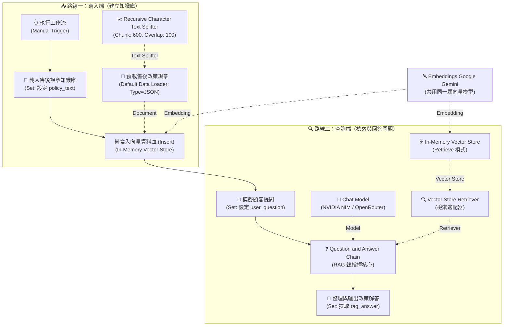
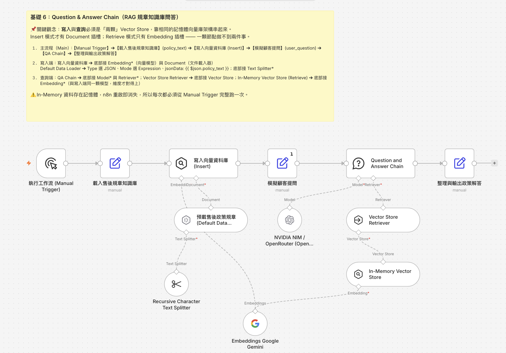

# 基礎範例 6：Question and Answer Chain（RAG 規章知識庫問答）

> 🎯 **本課核心目標**：學會使用 n8n 的 RAG（檢索增強生成）架構，將企業內部規章文字轉為向量知識庫，讓 AI 能嚴格依據條文精準回答問題，**徹底消除胡言亂語與模型幻覺**！

---

## 🧭 一、核心觀念：什麼是 RAG？為什麼非它不可？

在客服與企業內部問答中，通用大語言模型（如 GPT、Llama、Gemini）常會產生「幻覺（Hallucination）」或回答錯誤資訊。

```
┌────────────────────────────────────────────────────────────────────────┐
│ 💡 給學生的生活化比喻：                                                │
│ RAG = 「開書考試」。不是要 AI 把整本厚手冊背起來，而是幫它翻到正確那一頁！  │
└────────────────────────────────────────────────────────────────────────┘
```

### 📊 三種企業問答做法對照表

| 做法 | 運作方式 | 優點 | 致命缺點 |
|:---|:---|:---:|:---|
| **1. 直接問 LLM** | 直接提問：「*我們公司的退貨規定是什麼？*」 | 速度快 | ❌ 模型不知道公司內部規章，只能**憑空瞎編（幻覺）**。 |
| **2. 整份塞進 Prompt** | 把整份 5 萬字規章全部貼在 Prompt 裡 | 資訊完整 | ❌ 超過 Context 上限、**Token 費用極貴**，且模型容易漏看中間段落。 |
| **3. RAG（本課標準做法）** | 先檢索出最相關的 2~4 段精華，再餵給模型回答 | 準確、省錢 | ✅ **精準零幻覺、答案可溯源、大幅節省 Token！** |

---

## 🏗️ 二、工作流程全景架構（寫入端 vs 查詢端 兩條線）

在 n8n 中，標準的 RAG 工作流由 **「寫入端（建立知識庫）」** 與 **「查詢端（檢索與回答）」** 兩條獨立路線組合而成：



> ⚠️ **新手必備心法**：
> 1. **為什麼要有兩顆 Vector Store？**
>    - `Insert 模式` 才有 `Document` 插槽（負責收錄規章）。
>    - `Retrieve 模式` 只有 `Embedding` 插槽（負責提供檢索）。
>    - 一顆節點無法同時兼具兩種插槽，所以必須分開成寫入與查詢兩顆！
> 2. **資料生命週期**：In-Memory 資料存在 RAM 記憶體中，n8n 重啟即會清空。因此每次測試請由 `Manual Trigger` 完整執行一遍。

---

## 預覽圖



---

## 🔌 三、畫布插槽連線指南（常見紅燈與斷點排查）

在 n8n 畫布上連接節點底部插槽（Sub-nodes）時，若出現紅色驚嘆號或懸空的 `+` 號，請對照以下步驟修復：

```text
【常見錯誤畫面】：
Question and Answer Chain ───────┐ (Retriever* 懸空亮紅燈，無法直接連 Vector Store)
                                 ↓ (+)
                              [ 缺少轉接器！ ]
                                 ↓
                         In-Memory Vector Store
                        /                      \
              (Embedding*)                    (Document)
                   ↓                              ↓
             Embeddings Model            Default Data Loader
                                                  ↓ (+) (Text Splitter* 懸空亮紅燈)
                                           [ 缺少切片器！ ]
```

### 🔴 斷點 1：`QA Chain` 底部的 `Retriever *` 懸空亮紅燈
- **問題**：為什麼不能直接把右邊的 `In-Memory Vector Store` 拉上去連到 `QA Chain`？
- **原因**：`QA Chain` 要求的是 `Retriever`（檢索器型別），而 `Vector Store` 輸出的是 `Vector Store`（資料庫型別），兩者型別不相容。
- **正確接法**：
  1. 點擊 `Retriever *` 下方的 **`+` 號**。
  2. 新增 **`Vector Store Retriever`** 節點。
  3. 再從 `Vector Store Retriever` 底部的 `Vector Store *` 連到 **`In-Memory Vector Store`**。

### 🔴 斷點 2：`Default Data Loader` 底部的 `Text Splitter *` 懸空亮紅燈
- **問題**：為什麼 Data Loader 底部一定要接東西？
- **原因**：帶有紅色星號 `*` 為必填插槽。規章長文必須先經過切片器分割成 Chunk，才能正常寫入向量庫。
- **正確接法**：
  1. 點擊 `Default Data Loader` 底部的 **`+` 號**。
  2. 新增 **`Recursive Character Text Splitter`**（建議 Chunk: 600, Overlap: 100）。

### 🔴 斷點 3：模型節點右下角亮紅燈
- **原因**：尚未選取有效的 API 憑證（Credentials）。
- **正確接法**：雙擊打開模型節點，在 `Credential for...` 下拉選單中選取您的 API 帳號。

---

## 📖 四、六層 RAG 架構生動比喻表

| 層級 | 節點名稱 | 生活化比喻 | 核心職責 |
|:---:|---|---|---|
| **1. 資料來源** | 載入售後規章知識庫 | 拿到一本全新的「公司規章手冊」 | 注入原始規章文字（`policy_text`） |
| **2. 文件載入** | Default Data Loader | 把手冊打開，攤平成標準閱讀格式 | 將 JSON 文字轉換為標準 Document 物件 |
| **3. 智慧切片** | Text Splitter | 將厚手冊撕成一張張重點「便利貼」 | 依語意標點分割成 600 字小區塊 |
| **4. 向量化** | Embeddings Gemini | 幫每張便利貼編上「語意空間座標」 | 將文字轉為 768 維數學向量數值 |
| **5. 儲存檢索** | Vector Store (雙節點) | 把便利貼收進抽屜；提問時撈出最相關的幾張 | 記憶體索引儲存與語意相似度計算 |
| **6. 組織生成** | QA Chain + Chat Model | 看著撈出來的便利貼，親切寫出白話解答 | 結合問題與規章片段，生成零幻覺回覆 |

---

## 📥 五、工作流程與資料下載

- 📦 **完整工作流程檔**：[Question_and_Answer_Chain.json](./Question_and_Answer_Chain.json)（可直接匯入 n8n）
- 📄 **售後規章範例文本**：[售後服務與保固政策規章.txt](./售後服務與保固政策規章.txt)

---

## 🧩 六、各節點詳細參數與模組化說明

### 🅰️ 主資料流程模組（負責資料流轉與提問）

#### 1. 👆 執行工作流 (Manual Trigger)
- **用途**：手動點擊「Execute workflow」啟動測試。
- **實務延伸**：正式環境可替換為 `Webhook`（接前端聊天介面）或 `Schedule Trigger`（定時排程重建索引）。

#### 2. 📄 載入售後規章知識庫 (Set / Edit Fields)
- **用途**：建立 `policy_text` 欄位，放入售後保固規章全文（包含保固、除外條款、退貨退款天數等）。
- **實務延伸**：實務上可改由 Google Drive、Notion、資料庫或 HTTP Request 節點動態讀取文件。

#### 3. 💬 模擬顧客提問 (Set / Edit Fields)
- **用途**：建立 `user_question` 欄位，模擬進線顧客提出的口語問題。

#### 4. 🎯 整理與輸出政策解答 (Set / Edit Fields)
- **用途**：提取 RAG 最終解答文字，設定欄位 `rag_answer`：`={{ $json.text || $json.response?.text || $json.output }}`。

---

### 🅱️ 寫入端子節點模組（負責規章切片與存庫）

#### 5. 🗄️ 寫入向量資料庫 (In-Memory Vector Store - Insert)
- **模式**：`Mode = Insert Documents`、`Clear Store = true`。
- **底部插槽**：
  - `Embedding *` ➔ 連接共用 Embeddings 節點
  - `Document` ➔ 連接 Default Data Loader

#### 6. 📄 預載售後政策規章 (Default Data Loader)
- **關鍵參數**：
  - **Type of Data**：`JSON`（⚠️ 嚴禁選錯為 String 或預設 Binary）
  - **JSON Mode**：`expressionData`
  - **JSON Data**：`={{ $json.policy_text }}`
- **底部插槽**：`Text Splitter *` ➔ 連接切片器

#### 7. ✂️ Recursive Character Text Splitter（文本切片器）
- **關鍵參數**：`Chunk Size = 600`、`Chunk Overlap = 100`。
- **教學重點**：
  - **Chunk Size（切片大小）**：一段文字容量。太長 ➔ 雜訊多；太短 ➔ 語意被切斷。中文建議 300~600 字。
  - **Chunk Overlap（重疊字數）**：相鄰兩段重疊字數，防止條款剛好在邊界處被硬切斷。
  - **Recursive（遞迴）**：優先按照段落 `\n\n` ➔ 換行 `\n` ➔ 句號 `。` 順序切割，確保語意完整。

---

### 🅲️ 查詢端子節點模組（負責檢索與回答）

#### 8. ❓ Question and Answer Chain（RAG 控制中樞）
- **關鍵參數**：`Prompt Type = Define below`、`Text = ={{ $json.user_question }}`。
- **底層運作三步驟**：
  1. 拿問題去 Retriever 撈出最相關的 2~4 個規章片段。
  2. 自動將片段與問題組裝進內建 Prompt 模板。
  3. 呼叫 Chat Model 組織成流暢易懂的繁體中文解答。

#### 9. 🧠 NVIDIA NIM / OpenRouter (OpenAI Chat Model)
- **建議設定**：`temperature: 0.1`（低溫確保嚴格忠於規章，杜絕自由發揮）。
- **推薦模型**：`meta/llama-3.3-70b-instruct`。

#### 10. 🔍 Vector Store Retriever（檢索適配器）
- **用途**：介面轉接頭。將 Vector Store 包裝成 QA Chain 要求的 Retriever 介面。
- **參數**：`Limit = 4`（top-k，檢索最相似的 4 個片段）。

#### 11. 🗄️ In-Memory Vector Store (Retrieve 模式)
- **用途**：接收檢索請求，在記憶體中快速比對相似度。
- **底部插槽**：`Embedding *` ➔ 連接共用 Embeddings 節點。

---

### 🅳️ 核心向量模型模組（語意轉換核心）

#### 12. 🔤 Embeddings Google Gemini（向量嵌入模型）
- **建議模型**：`models/gemini-embedding-001`（產出 768 維空間座標）。
- **連線規範**：**一顆 Embedding 節點同時接到底部「寫入端」與「查詢端」兩個 Vector Store！**
- **💡 學生常問：各種模型維度不同，為什麼我們在節點中不需要手動設定維度？**
  1. **出廠固定**：維度由模型架構原生決定（Gemini 產出 768 維、OpenAI small 產出 1536 維），API 吐出幾個數字，n8n 就存幾個數字，不需人工宣告。
  2. **In-Memory 免開規格**：記憶體向量庫會自動適配傳入長度，不需像傳統資料庫預先建表定義欄位。
  3. **共用節點 100% 一致**：寫入與查詢共用同一顆節點，維度必然完全相同，因此不用操心維度設定。
  4. **何時才需手動設？** 只有使用外部實體資料庫（如 Qdrant / Pinecone / Supabase pgvector）時，才需要在資料庫建立 Index 時指定維度數值。

---

## 🛠️ 七、常見錯誤與除錯排錯清單

| 症狀 / 報錯訊息 | 發生原因 | 正確解決方案 |
|---|---|---|
| 🔴 **節點顯示紅色驚嘆號** | 底部帶有 `*` 的必填插槽未連接，或 API 憑證未選取。 | 檢查並補齊所有子節點插槽，並於模型節點選取有效的 API Key 憑證。 |
| 🔴 **`The value "string" is not supported!`** | Default Data Loader 的 `Type of Data` 誤選或誤設為 string。 | 將 Type of Data 改選為 **`JSON`**，並使用 Expression 指定 `{{ $json.policy_text }}`。 |
| 🔴 **答案完全在憑空編造（幻覺）** | 查詢端未撈到任何規章資料，AI 只能自由發揮。 | 確認每次測試皆從 Manual Trigger 完整執行（確保寫入端已先寫入向量庫）。 |
| 🔴 **報錯：維度不符（Dimension Mismatch）** | 寫入端與查詢端使用了不同的 Embedding 模型。 | 確保寫入與查詢的兩顆 Vector Store 連接的是**同一顆 Embeddings 節點**。 |
| 🔴 **重新整理後查不到資料** | In-Memory 資料只存在 RAM 中，重啟後會清空。 | 每次測試務必由 `Manual Trigger` 執行整條工作流，重新建立索引。 |
| 🔴 **AI 抓錯規章段落回答** | Chunk Size 太大導致雜訊多，或太小導致段落被切散。 | 調整 Text Splitter 的 Chunk Size 為 500~600，Overlap 為 100。 |

---

## 🎯 八、測試題庫（工作流程預設題 + 5 道防幻覺驗證題）

測試時，請將以下問題複製至「模擬顧客提問」節點的 `user_question` 欄位進行驗證：

### 🌟 工作流程預設測試題（開箱即測）

- 💬 **預設提問（`user_question`）**：
  ```text
  請問如果商品不小心進水了，原廠有提供免費保固維修嗎？另外退貨需要多久時間？
  ```
- 🎯 **標準答案與規章條文拆解**：
  1. **進水是否免費保固**：**不提供免費保固**。（規章第 2 條：進水屬人為除外項目，需酌收零件費與**基本檢測費 500 元**）
  2. **退貨需要多久時間**：享 **7 天猶豫期（鑑賞期）**；收到退貨包裹後於 **1 個工作天內** 完成驗收；信用卡於 **3 個工作天內** 刷退，ATM / 貨到付款於 **5 個工作天內** 匯入指定帳戶。（規章第 3、4 條）
- 🔍 **檢驗要點**：AI 必須同時回答「進水不保固（收 500 檢測費）」與「7天退貨 / 驗收 1 天 / 刷退 3 天 / 匯款 5 天」，兩者皆有憑有據。

---

### 🧪 延伸 5 道防幻覺驗證測試題

#### 題 1：新品不良換新判定（測試條款天數精準度）
- 💬 **問題**：`請問我買的耳機在收件第 10 天突然開不了機（非人為摔到），可以免費換一台全新的給我嗎？`
- 🎯 **標準答案**：**可以免費換新**。（規章第 5 條：收件後 15 天內非人為故障提供「原箱換新機」服務，第 10 天仍在 DOA 保障期內）
- 🔍 **檢驗要點**：精準回答「15 天內」與「原箱換新機」，不可誤判為 7 天猶豫期或只能送修。

#### 題 2：人為進水損壞與收費標準（測試除外責任與金額）
- 💬 **問題**：`如果我的設備不小心潑到飲料受潮壞掉，原廠保固可以免費修嗎？如果不行的話基本檢測費是多少？`
- 🎯 **標準答案**：**不能免費維修**。（規章第 2 條：液體滲入屬人為除外責任，需酌收零件工本費與**基本檢測費 500 元**）
- 🔍 **檢驗要點**：明確拒絕免費保固，並精準報出「基本檢測費 500 元」。

#### 題 3：鑑賞期退貨條件與運費負擔（測試規則細節理解）
- 💬 **問題**：`我在官網買了商品，目前在 7 天鑑賞期內想退貨。請問我已經拆封試用過還能退嗎？退貨運費要我自己出嗎？`
- 🎯 **標準答案**：**拆封不可退貨；合規退貨運費由原廠負擔**。（規章第 3 條：猶豫期非試用期需全新未拆封；原廠委派物流**免費到府取件**）
- 🔍 **檢驗要點**：清楚指出「猶豫期非試用期（拆封不能退）」，且確認買方不需負擔運費。

#### 題 4：退款作業時效差異（測試多條件對照能力）
- 💬 **問題**：`請問我的退貨包裹寄回給你們之後，售後中心驗收要多久？我是刷信用卡的，大概幾天會刷退？如果是轉帳付款又是幾天？`
- 🎯 **標準答案**：驗收 **1 個工作天**；信用卡 **3 個工作天內** 線上刷退；ATM / 轉帳 **5 個工作天內** 匯入指定帳戶。（規章第 4 條）
- 🔍 **檢驗要點**：清晰分列 1 天（驗收）、3 天（信用卡）、5 天（匯款），數字不可張冠李戴。

#### 題 5：規章未載明事項（🔥 終極防幻覺大考驗）
- 💬 **問題**：`請問退款可以直接退到我的比特幣（BTC）虛擬貨幣錢包嗎？另外如果有加入你們的 VIP 會員，保固期可以延長到 3 年嗎？`
- 🎯 **標準答案**：**均無此規定 / 規章未載明**。（規章僅提供信用卡與銀行匯款，無虛幣退款；保固為 1 年，未提及 VIP 延長 3 年辦法）
- 🔍 **檢驗要點**：**RAG 關鍵考驗！** 未經 RAG 的模型常會瞎編「可以退虛幣」或「VIP 享延長」；標準 RAG 必須誠實回答「規章未提供/未載明此項規定」。

---

## 🔬 九、建議課堂操作順序（刻意改壞教學法）

1. **第一步：先跑寫入端** ➔ 觀察文字如何被載入與切片。
2. **第二步：執行完整流程** ➔ 觀察 AI 依據規章精準輸出解答。
3. **第三步：刻意改壞 — 換成錯誤 Embedding** ➔ 觀察維度不符報錯，理解「向量空間一致性」。
4. **第四步：刻意改壞 — 將 Chunk Size 改為 50** ➔ 觀察條文被切成碎屑後，AI 檢索上下文缺失導致回答品質劇降。
5. **第五步：測試邊界問題** ➔ 提問規章完全未提及的事項，觀察 AI 是否能誠實回答「規章未載明」。

---

## 📄 十、預載售後政策規章（測試文本全文）

```text
【TechCorp 數位智能 產品售後服務與保固政策總規章（2026年版）】

一、 原廠保固範圍與期限
1. 凡購買本公司全系列正品，憑購買發票、電子訂單憑證或產品保固卡，享有自簽收日起算「1 年（12 個月）原廠有限保固服務」。
2. 保固期內，若屬非人為因素引起之硬體功能故障、晶片瑕疵或零組件異常，本公司提供免費檢測與免費維修更換服務。

二、 人為損壞與除外條款（非免費保固項目）
以下情況均不在免費保固範圍內，本公司將依檢測情況酌收零件工本費與檢測服務費（基本檢測費 500 元）：
1. 液體滲入損壞：產品因進水、受潮、浸泡液體、飲料潑灑或汗水侵蝕導致之機板短路與零件鏽蝕。
2. 物理外力撞擊：因重摔、擠壓、撞擊導致外殼破裂、螢幕碎裂或內部結構損毀。
3. 非原廠拆修：未經原廠授權私自拆解、改裝、更換副廠零件或刷除非官方韌體者。
4. 天災不可抗力：因雷擊、水災、火災、地震等天然災害造成之損壞。

三、 7 天猶豫期與退貨規範
1. 猶豫期計算：依照消費者保護法規定，線上通路訂購之商品享有自收件次日起算「7 天猶豫期（鑑賞期）」。
2. 猶豫期非試用期：辦理退貨之商品必須保持全新未拆封狀態，包含主機、配件、原廠包裝盒、說明書、發票及贈品皆需完整無缺。
3. 退貨運費負擔：在 7 天猶豫期內提出合規退貨申請，由本公司委派物流免費到府取件。

四、 退款時程與作業天數
1. 驗收時效：本公司售後中心於收到退回包裹後，將於 1 個工作天內完成商品完整性驗收。
2. 款項返還：
   - 信用卡付款：確認驗收無誤後，將於「3 個工作天內」完成信用卡線上刷退。
   - ATM / 貨到付款：將於「5 個工作天內」將款項全額匯入買方指定之銀行帳戶。

五、 新品不良（DOA）換貨規範
1. 若商品於收件後「15 天內」發生非人為之功能性故障，本公司將免費提供原箱換新機服務。

六、 客服諮詢專線
- 客服專線：0800-888-999（週一至週五 09:00 - 18:00）
- 線上報修：https://service.techcorp.com
```

---

## 🎯 學習重點

- **雙 Vector Store 架構**：理解 n8n 中寫入端（Insert）與查詢端（Retrieve）分工協作的必要性。
- **語意搜尋（Semantic Search）**：掌握 Embedding 向量模型如何跨越字面關鍵字限制，精準命中用戶問題意圖。
- **零幻覺保證（Grounding）**：學會透過 RAG 限制大語言模型只能根據檢索出的規章作答，杜絕模型胡言亂語。
- **文本切片智慧（Chunking）**：理解 Chunk Size 與 Overlap 對語意完整度與檢索品質的關鍵影響。

---

### 💡 實際應用場景

- **企業內部 HR 規章與員工手冊查詢機器人**：員工快速查詢請假規範、差旅報帳、福利補助辦法。
- **電商平台 24 小時售後服務與 FAQ 機器人**：精準解答顧客關於保固期、退換貨資格、退款時效等問題。
- **產品技術支援與操作手冊速查**：依據硬體說明書解答特定錯誤代碼與障礙排除步驟。
- **法務合約與合規條款比對系統**：快速檢索合約範本中的特定責任限制與終止協議條款。

---

### ⚙️ 設定步驟

1. **匯入流程**：將 [`Question_and_Answer_Chain.json`](./Question_and_Answer_Chain.json) 複製並貼上至 n8n 畫布中。
2. **綁定 API 憑證**：
   - 在 **Chat Model** 節點中選取您的 NVIDIA NIM、OpenRouter 或 OpenAI 憑證。
   - 在 **Embeddings Model** 節點中選取您的 Google Gemini 或 OpenAI 向量模型憑證。
3. **執行測試**：點擊畫布下方的「**Execute Workflow**」或在 `Manual Trigger` 點擊測試。
4. **檢視成果**：點擊最後一個「**整理與輸出政策解答**」節點，查看 AI 是否嚴格依據規章回答「進水不屬免費保固」與「退款時效詳情」。

---

## 🤖 AI 賦能延伸實作（附 Prompt 提詞）

<details>
<summary>👉 點擊展開可直接複製給 AI 助理的 Prompt 提詞</summary>

> 💡 **任務目標**：透過 AI 助理將 Question and Answer Chain 升級為 LINE / Webhook 即時在線客服機器人，並結合未命中轉真人客服機制。

```text
請幫我在目前的「Question and Answer Chain」工作流程中進行升級與擴充：
1. 起點改為接收 Webhook 傳入的顧客即時提問 {{ $json.body.user_message }} 與顧客 ID {{ $json.body.user_id }}。
2. 透過現有的雙 Vector Store RAG 架構進行規章檢索與精準問答。
3. 在 QA Chain 後方加入一個 IF 條件判斷節點：
   - 若 AI 的回答包含「規章未載明」或「無法查詢到相關規定」等關鍵字，自動串接 Telegram / Slack 節點發送「🚨 需要真人客服介入支援」通知給客服主管。
   - 若成功回答，則透過 HTTP Request 節點（或 LINE Messaging API）將標準解答發送回覆給顧客。
請幫我配置好相關連線、判斷條件與變數對應！
```
</details>

