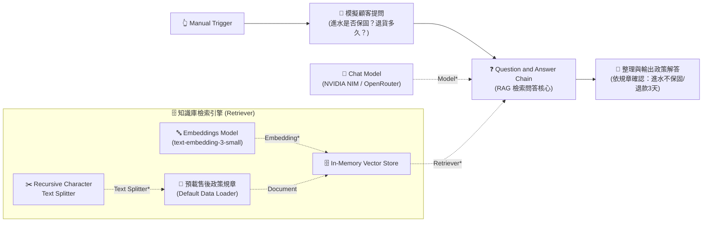

# 基礎範例 6：Question and Answer Chain（RAG 規章知識庫問答）

## 📚 工作流程說明

在自動化客服與企業問答中，通用大語言模型（如 GPT、Llama、Claude）常常會產生「幻覺（Hallucination）」或回答過時的資訊。

**Question and Answer Chain（檢索問答鏈）** 是建構 **RAG（Retrieval-Augmented Generation，檢索增強生成）** 的核心節點。透過將企業內部的「售後規章、產品手冊、保固條款」載入向量資料庫，當使用者提問時，系統會先**精準檢索出相關的規章段落**，再交由 AI **嚴格根據該段落作答**，徹底消除胡言亂語！

> 🤖 **模型註冊與串接指南（推薦資安合規主軸）**：
> - [**NVIDIA NIM 微服務模型串接**](../../nvidia_nim/README.md)（推薦 `meta/llama-3.3-70b-instruct`）
> - [**OpenRouter 多模型聚合平台**](../../openrouter/README.md)（推薦 `meta-llama/llama-3.3-70b-instruct`）

---

## 🧭 工作流程架構（5 大核心節點標準連線）



---

## 📥 工作流程圖下載

- [下載修復與完整連線範例流程：Question_and_Answer_Chain.json](./Question_and_Answer_Chain.json)

---

## 🛠️ 常見錯誤剖析：為什麼原本的節點會亮紅燈？

如果您在畫布上看到節點亮紅色驚嘆號或無法執行，通常是以下 3 個原因：

### 🔴 問題 1：`In-Memory Vector Store` 孤立未連接（Retriever* 空白）
- **原因**：`Question and Answer Chain` 節點底部標有紅星的 **`Retriever *`** 插槽未拉線，而 `In-Memory Vector Store` 節點孤立飄在畫布上。
- **解法**：必須將 `In-Memory Vector Store` 向上拉線連接至 `Question and Answer Chain` 的 `Retriever *` 插槽！

### 🔴 問題 2：`Default Data Loader` 缺少 `Text Splitter *`
- **原因**：在 n8n 的標準規範中，`Default Data Loader` 節點底部有一個紅星插槽 **`Text Splitter *`**（必接），未連接分詞器時會直接亮紅燈報錯。
- **解法**：在下方新增一個 **`Recursive Character Text Splitter`** 節點並拉線連接至 `Default Data Loader`。

### 🔴 問題 3：`Embeddings Model` 缺少憑證
- **解法**：確認已選取相容的 OpenAI / OpenRouter 憑證，並使用 `text-embedding-3-small` 或相容嵌入模型。

---

## 📋 5 大關鍵節點角色詳解

1. **❓ Question and Answer Chain（RAG 總指揮）**
   - 負責接收使用者問題，協調向量檢索器（Retriever）找出最相關的政策條文，最後交由 Chat Model 組織成流暢的自然語言回覆。

2. **🗄️ In-Memory Vector Store（記憶體向量庫）**
   - 充當知識庫的角色，儲存規章條文的向量特徵值，提供語意相似度檢索（Semantic Search）。

3. **🔤 Embeddings Model（向量嵌入模型）**
   - 將人類文字轉化為高維度數學向量（如 `text-embedding-3-small`）。

4. **📄 預載售後政策規章 (Default Data Loader)**
   - 載入企業內部的知識庫文字（如 1 年保固、進水人為損壞不保固、7 天猶豫期、3 天退款規章）。

5. **✂️ Recursive Character Text Splitter（文本切片器）**
   - 自動將長篇政策條款切分為小區塊（Chunk），方便向量庫進行精確檢索。

---

## 🎯 學習重點

- **標準 RAG 架構落地**：掌握「文件載入 ➔ 切片 ➔ 向量化 ➔ 檢索 ➔ 模型生成」的完整企業級閉環。
- **零幻覺保證**：透過指定檢索器，限制模型只能依據檢索到的政策回答，絕不胡亂捏造。
- **多插槽協同串接**：學會 n8n 中 Model、Retriever、Embedding、Document 與 Text Splitter 的層級依賴關係。

---

## 💡 實際應用場景

- **內部企業 HR 規章查詢機器人**：員工詢問請假、報帳、差旅補助辦法。
- **電商客服售後 FAQ 機器人**：精準解答退貨條件、保固範圍、物流時效。
- **產品操作手冊技術支援**：依據說明書解答特定錯誤代碼與障礙排除步驟。

---

## 🤖 AI 賦能延伸實作（附 Prompt 提詞）

<details>
<summary>👉 點擊展開可直接複製給 AI 助理的 Prompt 提詞</summary>

> 💡 **任務目標**：透過 AI 助理將 Question and Answer Chain 連接 Webhook 與通訊軟體，打造即時客服問答機器人。

```text
請幫我在目前的「Question and Answer Chain」工作流程中升級為線上客服機器人：
1. 起點改為接收 Webhook（或 Chat Trigger）傳入的顧客問題 {{ $json.chatInput }}。
2. 透過 Question and Answer Chain 連接知識庫進行檢索回答。
3. 串接 LINE Notify（或 Telegram / Slack）節點，將問題與 AI 依據規章回答的內容發送給顧客。
請幫我配置好連線與變數對應！
```
</details>
