# 應用實戰 1：Question and Answer Chain 整合 LINE 智慧客服（信用卡權益諮詢機器人）

> 🎯 **本課核心目標**：將基礎 RAG 規章問答鏈落地於真實通訊軟體！學會透過 **LINE Messaging API** 與 **n8n Webhook** 連動，讓客戶在手機 LINE 聊天室中提問時，AI 能即時檢索信用卡規章手冊並給出排版美觀、精確無幻覺的繁體中文解答。

---

## 🧭 一、為什麼要將 RAG 整合進 LINE？

在企業客服實務中，使用者最常使用的溝通介面就是 **LINE**。傳統關鍵字回覆機器人（如「輸入 1 查額度、輸入 2 查回饋」）極度僵硬，一旦客戶打錯字或提出口語化複合問題（例如：「*我下週出國刷卡有 2.5% 回饋嗎？機票要刷多少才有免費機場接送？*」），傳統機器人便立刻破功。

透過 **n8n Question and Answer Chain + LINE Bot**，我們可以達到：
1. **白話理解**：客戶可以用任何日常口語直接提問。
2. **條文精準檢索**：AI 自動翻查厚達數十頁的信用卡權益手冊，絕不憑空瞎編。
3. **手機端友善排版**：移除不支援的 Markdown 語法，改以 Emoji 與「•」項目符號美化，閱讀體驗極佳。
4. **全天候秒級回應**：24 小時在線，分擔人工客服超過 80% 的重複性諮詢！

---

## 🏗️ 二、工作流程全景架構（兩條獨立管線）

本工作流程由 **「路線一：知識庫初始化（寫入端）」** 與 **「路線二：LINE 即時客服對話（查詢端）」** 組成：

```mermaid
flowchart TD
    subgraph Write_Pipeline ["📥 路線一：知識庫初始化（手動執行一次）"]
        Trigger["👆 執行工作流<br/>(Manual Trigger)"] --> LoadCard["📄 載入信用卡資料<br/>(Set: 設定 policy_text)"]
        LoadCard --> InsertVS["🗄️ Simple Vector Store (Insert)<br/>(In-Memory Vector Store)"]
        
        DocLoader["📄 Default Data Loader<br/>(Type: JSON, policy_text)"] -.->|Document| InsertVS
        Splitter["✂️ Recursive Character Text Splitter<br/>(Chunk: 600, Overlap: 200)"] -.->|Text Splitter| DocLoader
        Embed1["🔤 Embeddings Google Gemini<br/>(向量模型)"] -.->|Embedding| InsertVS
    end

    subgraph Read_Pipeline ["💬 路線二：LINE 即時客服對話（Webhook 觸發）"]
        LineHook["📲 Webhook 接收 LINE 訊息<br/>(POST /tvdi_line_bot)"] --> QAChain["❓ Question and Answer Chain<br/>(Gemini Flash + RAG 核心)"]
        QAChain --> LineClean["✨ LINE美化回覆<br/>(Code 節點：去除 Markdown)"]
        LineClean --> LineReply["📤 HTTP Request<br/>(POST 回覆 LINE Messaging API)"]
        
        ChatModel["🧠 Google Gemini Chat Model<br/>(models/gemini-3.8-flash)"] -.->|Model| QAChain
        Retriever["🔍 Vector Store Retriever<br/>(檢索適配器)"] -.->|Retriever| QAChain
        RetrieveVS["🗄️ Simple Vector Store1<br/>(Retrieve 模式: vector_store_key)"] -.->|Vector Store| Retriever
        Embed2["🔤 Embeddings Google Gemini1<br/>(向量模型)"] -.->|Embedding| RetrieveVS
    end

    style Write_Pipeline fill:#f0fdf4,stroke:#16a34a,stroke-width:2px
    style Read_Pipeline fill:#eff6ff,stroke:#2563eb,stroke-width:2px
```



> 📌 **架構重點提醒**：
> 1. **In-Memory 記憶體特性**：每次 n8n 重新啟動或第一次佈署時，必須先點擊一次「**When clicking ‘Execute workflow’**」手動執行路線一，將信用卡權益文字載入並建立向量索引。
> 2. **共用 Memory Key**：寫入端的 `Simple Vector Store` 與查詢端的 `Simple Vector Store1` 的 Memory Key 必須相同（本範例為 `vector_store_key`），才能在同一個記憶體空間中存取資料。

---

## 🌟 三、三大核心設計亮點

### 💡 亮點 1：專為 LINE 量身打造的高情商 Prompt
LINE 聊天視窗與一般網頁 Markdown 渲染不同，若直接輸出 `#` 標題或 `**粗體**`，在 LINE 手機螢幕上只會顯示出未解析的星號與井號，十分雜亂。

我們在 `Question and Answer Chain` 的 Prompt 中加入了嚴謹的排版約束：
```text
{{ $('Webhook').item.json.body.events[0].message.text }}

請根據檢索到的信用卡資料回答使用者問題。

【LINE 回覆格式要求】
1. 回覆必須適合直接顯示在 LINE 聊天室，請使用清楚、自然、好閱讀的繁體中文。
2. 禁止使用 Markdown 語法，包括 #、##、**粗體**、*斜體*、- 清單、`程式碼`、> 引用、[連結](網址) 等。
3. 請使用 emoji、換行與「•」項目符號來增加可讀性。
4. 回覆建議格式：
📌 重點答案
• 項目一
• 項目二

💡 補充說明
簡短說明必要的條件或注意事項。
5. 如果使用者詢問費用、條件、比例、期限等資訊，請直接列出數字與條件，不要只給概括描述。
6. 不要輸出「根據提供的資料」這類冗長開場白，直接回答問題。
7. 如果資料中沒有答案，請明確說「目前提供的資料中沒有這項資訊」，不要自行編造。
```

---

### 💡 亮點 2：雙重防護！Code 節點「LINE 美化回覆」清洗器
儘管 Prompt 已經要求 AI 避免使用 Markdown，但大語言模型有時仍可能偶發輸出 `**` 或 `-`。我們在輸出端配置了 `Code` 節點進行正規表達式清洗：

```javascript
const response = $json.response ?? '';

let text = String(response)
  .replace(/\r\n/g, '\n')
  .replace(/^\s*#{1,6}\s*/gm, '')              // 清除 Markdown 標題 #
  .replace(/\*\*(.*?)\*\*/g, '$1')             // 清除 **粗體**
  .replace(/__(.*?)__/g, '$1')                 // 清除 __底線粗體__
  .replace(/~~(.*?)~~/g, '$1')                 // 清除 ~~刪除線~~
  .replace(/`([^`]+)`/g, '$1')                 // 清除行內 code
  .replace(/(?<!\w)\*([^*\n]+)\*(?!\w)/g, '$1') // 清除 *斜體*
  .replace(/(?<!\w)_([^_\\n]+)_(?!\w)/g, '$1') // 清除 _斜體_
  .replace(/\[([^\]]+)\]\(([^)]+)\)/g, '$1（$2）') // 轉化連結格式
  .replace(/^\s*[-*+]\s+/gm, '• ')             // 清單符號統一替換為圓點 •
  .replace(/^\s*>\s?/gm, '')                   // 清除引用符號 >
  .replace(/\n{3,}/g, '\n\n')                  // 壓縮過多空行
  .trim();

return [{ json: { ...$json, line_reply: text } }];
```

---

### 💡 亮點 3：標準 LINE Messaging API 回覆規格
在最後的 `HTTP Request` 節點中，使用官方標準的 `replyToken` 機制進行單次性免費用戶回覆：

- **Request URL**：`https://api.line.me/v2/bot/message/reply`
- **Method**：`POST`
- **Authentication**：`Generic Credential Type` ➔ `Header Auth`（Header 名稱填入 `Authorization`，值填入 `Bearer {YOUR_CHANNEL_ACCESS_TOKEN}`）
- **JSON Body**：
```json
={{ {
  replyToken: $('Webhook').item.json.body.events[0].replyToken,
  messages: [
    {
      type: 'text',
      text: $('LINE美化回覆').item.json.line_reply
    }
  ]
} }}
```

---

## 📥 四、檔案下載與參考文件

- 📦 **完整工作流程檔**：[line_bot回應_2.json](./line_bot回應_2.json)（可直接匯入 n8n 畫布）
- 📄 **信用卡權益說明手冊**：[信用卡權益說明.txt](./信用卡權益說明.txt)（包含國內外回饋比例、機場服務、分期手續費、保險理賠等完整規章）

---

## 🧩 五、各節點詳細功能與參數指南

### 🅰️ 寫入端節點（路線一）

| 節點名稱 | 節點類型 | 關鍵參數設定 | 功能說明 |
|---|---|---|---|
| **When clicking ‘Execute workflow’** | `manualTrigger` | 預設 | 手動點擊觸發知識庫初始化 |
| **載入信用卡資料** | `set` | `policy_text = 信用卡權益說明...` | 注入厚達數萬字的信用卡條款手冊 |
| **Simple Vector Store** | `vectorStoreInMemory` | `mode = insert`, `memoryKey = vector_store_key`, `clearStore = true` | 接收文件切片，清空後重新建立向量索引 |
| **Default Data Loader** | `documentDefaultDataLoader` | `jsonMode = expressionData`, `jsonData = ={{ $json.policy_text }}` | 將文字欄位轉化為 Document 物件 |
| **Recursive Character Text Splitter** | `textSplitterRecursiveCharacterTextSplitter` | `chunkSize = 600`, `chunkOverlap = 200` | 依段落與句號將長規章切割為語意區塊 |
| **Embeddings Google Gemini** | `embeddingsGoogleGemini` | `Credential: Google Gemini(PaLM) Api account` | 將文本切片轉換為高維向量座標 |

---

### 🅱️ 查詢端節點（路線二）

| 節點名稱 | 節點類型 | 關鍵參數設定 | 功能說明 |
|---|---|---|---|
| **Webhook** | `webhook` | `httpMethod = POST`, `path = tvdi_line_bot`, `responseMode = responseNode` | 接收 LINE 官方傳送的 Webhook 事件通知 |
| **Question and Answer Chain** | `chainRetrievalQa` | 專屬繁中 LINE Prompt，引用 Webhook 中的文字訊息 | 協調檢索器與語言模型，依據條文組織解答 |
| **Google Gemini Chat Model** | `lmChatGoogleGemini` | `modelName = models/gemini-3.8-flash` | 快速、高推理品質的大語言模型 |
| **Vector Store Retriever** | `retrieverVectorStore` | 預設（Top-k 檢索） | 連接向量庫，抓取語意最相關的條款片段 |
| **Simple Vector Store1** | `vectorStoreInMemory` | `mode = retrieve`, `memoryKey = vector_store_key` | 記憶體向量庫查詢端口 |
| **Embeddings Google Gemini1** | `embeddingsGoogleGemini` | 與寫入端相同憑證與模型 | 將用戶問題即時轉換為向量進行相似度比對 |
| **LINE美化回覆** | `code` | 正則表達式清除 Markdown 符號 | 產出最適合手機閱讀的純文字 `line_reply` |
| **HTTP Request** | `httpRequest` | `POST https://api.line.me/v2/bot/message/reply` | 發送回覆訊息至顧客 LINE 視窗 |

---

## 📱 六、LINE Developers 後台串接四步驟

### 步驟 1：建立 Provider 與 Messaging API Channel
1. 登入 [LINE Developers Console](https://developers.line.biz/)。
2. 建立一個 Provider（例如：`MyCompany`）。
3. 建立一個 **Create a Messaging API channel**，填寫機器人名稱與大頭照。

### 步驟 2：取得長期 Channel Access Token
1. 進入該 Channel 的 **Messaging API** 頁籤。
2. 滑動到最底部的 **Channel access token** 區塊。
3. 點擊 **Issue** 產生長效 Token 並複製備用。

### 步驟 3：在 n8n 建立 Header Auth 憑證
1. 在 n8n 左側選單進入 **Credentials** ➔ **Add Credential**。
2. 搜尋並選取 **Header Auth**。
3. 設定：
   - **Name**：`Authorization`
   - **Value**：`Bearer 你的Channel_Access_Token`（⚠️ 注意 Bearer 與 Token 之間有一個半形空格）

### 步驟 4：設定 Webhook URL
1. 在 n8n 的 `Webhook` 節點中，複製 **Production URL**（例如：`https://your-n8n.com/webhook/tvdi_line_bot`）。
2. 回到 LINE Developers 的 Messaging API 頁籤，將 URL 貼入 **Webhook URL** 欄位。
3. 點擊 **Update** 並啟用 **Use webhook**。
4. 關閉 LINE 官方的「自動回應訊息（Auto-reply messages）」，以免造成雙重回覆。

---

## 🎯 七、實際驗證測試題庫

在 LINE 聊天室中傳送以下問題，驗證 AI 是否精確依照規章作答：

### 題 1：海外消費回饋率與手續費（複合計算驗證）
- 💬 **LINE 提問**：`請問你們的尊榮現金回饋卡在國外刷卡回饋是多少？有扣海外手續費嗎？`
- 🎯 **預期 LINE 回覆**：
  ```text
  📌 重點答案
  • 海外消費享 2.5% 現金回饋
  • 包含 1.5% 國外交易手續費
  • 扣除手續費後實際淨回饋率為 1.0%

  💡 補充說明
  海外消費每月最高回饋上限為 2,000 元。
  ```

### 題 2：機場免費接送服務（資格門檻驗證）
- 💬 **LINE 提問**：`我想預約機場接送，尊榮卡一年可以免費幾次？要提早幾天預約？`
- 🎯 **預期 LINE 回覆**：
  ```text
  📌 重點答案
  • 尊榮現金回饋卡每年享免費 4 次機場接送
  • 服務範圍涵蓋桃園、松山、高雄小港機場
  • 必須在出發前 3 天撥打專線 02-8888-8888 預約

  💡 補充說明
  接送車型為豪華轎車（最多可乘載 3 人與 3 件行李），若需取消必須於 24 小時前提出。
  ```

### 題 3：信用卡遭盜刷緊急掛失（安全與責任驗證）
- 💬 **LINE 提問**：`我的信用卡好像被盜刷了！請問要打哪支電話？掛失前的損失我要賠嗎？`
- 🎯 **預期 LINE 回覆**：
  ```text
  📌 重點答案
  • 請立即撥打 24 小時掛失專線：02-8888-9999
  • 掛失前 24 小時內的盜刷損失，持卡人自負額最高為 3,000 元
  • 掛失後發生的盜刷損失由銀行全額負擔

  💡 補充說明
  掛失後 3 至 5 個工作天內會寄發卡號變更的新卡。原綁定的自動扣款需要重新設定。
  ```

### 題 4：防幻覺題（問規章完全未記載的事項）
- 💬 **LINE 提問**：`請問你們信用卡刷卡可以累積比特幣或以太幣嗎？`
- 🎯 **預期 LINE 回覆**：
  ```text
  目前提供的資料中沒有這項資訊，本行信用卡僅提供現金回饋與紅利點數累積，未載明虛擬貨幣累積項目。
  ```

---

## 🛠️ 八、常見錯誤與排查清單

| 報錯訊息 / 異常現象 | 發生原因 | 解決方法 |
|---|---|---|
| 🔴 **HTTP 401 Unauthorized** | Header Auth 的 Token 填寫錯誤或缺少 `Bearer ` 前綴。 | 檢查憑證中的 Value 是否為 `Bearer {TOKEN}`，並確認 Token 是否完整。 |
| 🔴 **LINE Bot 毫無反應** | Webhook URL 未開啟、或使用到了 Test URL 而非 Production URL。 | 請使用 Production URL，並在 LINE 後台點擊「Verify」確認連線成功，且確認「Use webhook」為開啟狀態。 |
| 🔴 **`Invalid reply token`** | 回覆耗時過久導致 LINE 的 `replyToken` 過期（通常為 30 秒至 1 分鐘）。 | 確認模型回應速度正常，且同一個 `replyToken` 只能使用一次。 |
| 🔴 **回覆帶有大量星號 `**`** | QA Chain 輸出了 Markdown 且 Code 節點被繞過。 | 確認工作流程中連線有確實經過 `LINE美化回覆` 節點。 |
| 🔴 **回答變成胡言亂語** | 尚未手動執行路線一，記憶體中沒有資料。 | 點擊一次 `When clicking ‘Execute workflow’` 重新將條款寫入記憶體向量庫。 |

---

[⬅️ 返回階段一主目錄](../README.md) ｜ [➡️ 前往應用實戰 2：Google Drive 動態規章同步與 LINE 高可用客服](../Question_and_Answer_Chain_應用2/README.md)
