# 應用實戰 2：Question and Answer Chain 整合 Google Drive 動態規章同步與 LINE 高可用客服

> 🎯 **本課核心目標**：實現企業級「**文件雲端化動態維護**」與「**高可用通訊架構**」！將規章知識庫從本機寫死升級為 **Google Drive 自動搜尋、下載、文字提取與向量化**；並在 LINE 客服端導入 **Respond to Webhook 秒級響應**，徹底杜絕 LINE 官方重送造成的重複回覆問題。

---

## 🧭 一、為什麼需要從「應用 1」升級至「應用 2」？

在「應用 1」中，我們已經成功讓 LINE 與 RAG 結合。但在實際企業運作中，往往會面臨兩個致命痛點：

```
【傳統痛點 1】：規章修訂需工程師手動改流程
公司每年更新信用卡回饋或售後條款，工程師必須手動進 n8n 複製貼上好幾萬字規章 ➔ 缺乏效率且容易出錯。

【傳統痛點 2】：LINE Webhook 逾時重送導致重複回答
大語言模型檢索長文通常需要 3~5 秒，若網路稍有波動，LINE 官方 Webhook 只要在特定秒數內未收到 HTTP 200 回應，
便會判定「發送失敗」並自動重送 2~3 次！導致使用者問一句話，機器人卻連回兩三次一模一樣的長文訊息。
```

### 💡 應用 2 的解方：
1. **Google Drive 雲端動態同步**：行政或法務部門只要在雲端硬碟更新「信用卡權益說明.txt」，n8n 便能自動搜尋、下載、解讀文字並重新建立索引，實現業務與技術解耦。
2. **Respond to Webhook 雙軌架構**：收到 LINE 訊息的瞬間，第一路立刻向 LINE 官方伺服器回傳 `{"status": "ok"}` 報平安，第二路安心進行 RAG 檢索與生成，最後透過 LINE Reply API 優雅回覆，徹底解決重複觸發！

---

## 🏗️ 二、工作流程全景架構

本流程由 **「動態雲端同步路線」** 與 **「LINE 高可用雙軌路線」** 構成：

```mermaid
flowchart TD
    subgraph Google_Drive_Pipeline ["☁️ 路線一：Google Drive 規章動態搜尋與向量化（寫入端）"]
        Trigger["👆 執行工作流<br/>(Manual Trigger)"] --> GSearch["🔍 Google Drive 搜尋檔案<br/>(搜尋: 信用卡權益說明)"]
        GSearch --> GDownload["📥 Google Drive 下載檔案<br/>(Download: binary data)"]
        GDownload --> Extract["📄 Extract from File<br/>(從檔案解析純文字)"]
        Extract --> SetField["⚙️ Set 整理欄位<br/>(policy_text = $json.data)"]
        SetField --> InsertVS["🗄️ Simple Vector Store (Insert)<br/>(In-Memory Vector Store)"]
        
        DocLoader["📄 Default Data Loader<br/>(Type: JSON, policy_text)"] -.->|Document| InsertVS
        Splitter["✂️ Recursive Character Text Splitter<br/>(Chunk: 600, Overlap: 200)"] -.->|Text Splitter| DocLoader
        Embed1["🔤 Embeddings Google Gemini<br/>(向量模型)"] -.->|Embedding| InsertVS
    end

    subgraph High_Availability_Pipeline ["⚡ 路線二：LINE 高可用雙軌客服對話（查詢端）"]
        LineHook["📲 Webhook 接收 LINE 訊息<br/>(POST /tvdi_line_bot)"] --> RespHook["⚡ Respond to Webhook<br/>(立即回覆 HTTP 200 防止重試)"]
        LineHook --> QAChain["❓ Question and Answer Chain<br/>(Gemini Flash + RAG 核心)"]
        
        QAChain --> LineClean["✨ LINE美化回覆<br/>(Code 節點：去除 Markdown)"]
        LineClean --> LineReply["📤 HTTP Request<br/>(POST 回覆 LINE Messaging API)"]
        
        ChatModel["🧠 Google Gemini Chat Model<br/>(models/gemini-3.8-flash)"] -.->|Model| QAChain
        Retriever["🔍 Vector Store Retriever<br/>(檢索適配器)"] -.->|Retriever| QAChain
        RetrieveVS["🗄️ Simple Vector Store1<br/>(Retrieve 模式: vector_store_key)"] -.->|Vector Store| Retriever
        Embed2["🔤 Embeddings Google Gemini1<br/>(向量模型)"] -.->|Embedding| RetrieveVS
    end

    style Google_Drive_Pipeline fill:#f8fafc,stroke:#0284c7,stroke-width:2px
    style High_Availability_Pipeline fill:#eff6ff,stroke:#2563eb,stroke-width:2px
```



---

## 🌟 三、核心技術細節與實戰亮點

### 💡 亮點 1：Google Drive 檔案動態讀取三部曲
傳統 n8n 處理二進位檔案需要複雜的設定，在本作法中透過三個精準節點達成全自動管線：

1. **Google Drive 搜尋檔案 (Search)**：
   - 資源：`fileFolder`
   - 搜尋字串：`信用卡權益說明`
   - 指定資料夾 ID：`folderId`（限定搜尋特定專案目錄，避免撈錯檔案）
   - Limit：`1`（取得最新一筆）
2. **Google Drive 下載檔案 (Download)**：
   - 操作：`download`
   - File ID：`={{ $json.id }}`（動態承接搜尋節點吐出的檔案 ID）
   - Binary Property Name：`data`
3. **Extract from File（檔案文字提取）**：
   - 操作：`text`
   - 自動將下載的二進位純文字檔轉譯為字串，由後續的 `Set 整理欄位` 將 `data` 映射為 `policy_text`。

---

### 💡 亮點 2：Respond to Webhook 雙軌設計（消滅重複回覆惡夢）
LINE Messaging API 的 Webhook 機制非常嚴格，若發送 Webhook 後幾秒內未收到接收端回應 `HTTP 200 OK`，LINE 伺服器會認為「訊息遞送失敗」而進行自動重試重發。

傳統做法中，若將 Webhook 的回應模式設定為 `On Received` 或直到整條 AI 鏈路跑完才回應，極容易引發重送。

本工作流程在 `Webhook` 節點下方**並行分流**：
```text
                  ┌───► Respond to Webhook (0.1秒秒回 200 OK，向 LINE 簽收)
Webhook (收到訊息) ┤
                  └───► QA Chain ➔ LINE美化回覆 ➔ HTTP Request (安心慢慢思考並發送解答)
```
- **Respond to Webhook 節點**：
  - Respond With：`JSON`
  - Response Body：`{ "status": "ok" }`
  - 此舉能在 100 毫秒內立刻平息 LINE 伺服器的重發等待，徹底杜絕重複訊息。

---

### 💡 亮點 3：手機版專屬繁中 Prompt 與 Regex 清洗
與應用 1 相同，本工作流嚴格遵守 LINE 聊天室視覺標準：
1. **Prompt 約束**：嚴禁 `#`、`**`、`-` 等 Markdown 語法，要求使用 Emoji 與「•」項目條列。
2. **Code 節點二次清洗**：確保即便 LLM 輸出瑕疵，也能在發往 LINE 之前自動過濾。

---

## 📥 四、檔案下載與參考文件

- 📦 **完整工作流程檔**：[回應line_bot4.json](./回應line_bot4.json)（可直接匯入 n8n 畫布）
- 📄 **測試用規章手冊**：[信用卡權益說明.txt](./信用卡權益說明.txt)（請將此檔案上傳至您的 Google Drive 測試資料夾）

---

## 🧩 五、各節點詳細參數設定一覽

### 🅰️ 雲端同步與向量寫入端

| 節點名稱 | 節點類型 | 關鍵參數設定 | 功能說明 |
|---|---|---|---|
| **When clicking ‘Execute workflow’** | `manualTrigger` | 預設 | 手動執行雲端同步與向量庫重建 |
| **Google Drive 搜尋檔案** | `googleDrive` | `resource = fileFolder`, `queryString = 信用卡權益說明`, `limit = 1` | 在指定的 Google Drive 目錄搜尋規章檔案 |
| **Google Drive 下載檔案** | `googleDrive` | `operation = download`, `fileId = ={{ $json.id }}`, `binary = data` | 下載該檔案為二進位資料 |
| **Extract from File** | `extractFromFile` | `operation = text` | 將二進位串流解讀為純文字字串 |
| **Set 整理欄位** | `set` | `policy_text = ={{ $json.data }}` | 統整欄位名稱，供 Data Loader 讀取 |
| **Simple Vector Store** | `vectorStoreInMemory` | `mode = insert`, `memoryKey = vector_store_key`, `clearStore = true` | 接收文字切片並寫入記憶體向量庫 |
| **Default Data Loader** | `documentDefaultDataLoader` | `jsonMode = expressionData`, `jsonData = ={{ $json.policy_text }}` | 轉為 Document 物件 |
| **Recursive Character Text Splitter** | `textSplitterRecursiveCharacterTextSplitter` | `chunkSize = 600`, `chunkOverlap = 200` | 智慧遞迴切片 |
| **Embeddings Google Gemini** | `embeddingsGoogleGemini` | `Credential: Google Gemini(PaLM) Api account` | 產生 768 維語意向量 |

---

### 🅱️ LINE 高可用即時查詢端

| 節點名稱 | 節點類型 | 關鍵參數設定 | 功能說明 |
|---|---|---|---|
| **Webhook** | `webhook` | `httpMethod = POST`, `path = tvdi_line_bot`, `responseMode = responseNode` | 接收用戶 LINE 訊息通知 |
| **Respond to Webhook** | `respondToWebhook` | `respondWith = JSON`, `responseBody = {"status": "ok"}` | ⚡ 100ms 內回覆 200 OK，防止重發 |
| **Question and Answer Chain** | `chainRetrievalQa` | 專屬繁中 LINE Prompt，引用 Webhook 提問 | 負責語意檢索與解答生成 |
| **Google Gemini Chat Model** | `lmChatGoogleGemini` | `modelName = models/gemini-3.8-flash` | Gemini Flash 語言模型核心 |
| **Vector Store Retriever** | `retrieverVectorStore` | 預設 | 檢索適配器（Top-k 檢索） |
| **Simple Vector Store1** | `vectorStoreInMemory` | `mode = retrieve`, `memoryKey = vector_store_key` | 查詢端向量庫 |
| **Embeddings Google Gemini1** | `embeddingsGoogleGemini` | 與寫入端共用同款模型 | 問題向量化 |
| **LINE美化回覆** | `code` | 正則表達式清除 Markdown 語法 | 產出極簡純文字回覆 `line_reply` |
| **HTTP Request** | `httpRequest` | `POST https://api.line.me/v2/bot/message/reply` | 發送回覆訊息至客戶 LINE 聊天室 |

---

## ☁️ 六、Google Drive 串接與測試步驟

### 步驟 1：建立 Google Cloud 憑證並上傳規章
1. 前往 Google Cloud Console 啟用 **Google Drive API**。
2. 建立 OAuth 2.0 Client ID 憑證（或使用 n8n 內建之 Google OAuth 連結）。
3. 在 Google Drive 中建立一個專用資料夾（例如：`企業規章知識庫`）。
4. 將 [`信用卡權益說明.txt`](./信用卡權益說明.txt) 上傳至該資料夾中。
5. 複製該 Google Drive 資料夾網址中的 Folder ID（網址最後一段英數字符號）。

### 步驟 2：配置 n8n Google Drive 節點
1. 雙擊打開 **Google Drive 搜尋檔案** 節點。
2. 選取您的 Google Drive 帳號憑證。
3. 將剛剛複製的 Folder ID 貼入 `Folder` 欄位（以 ID 模式）。
4. 點擊 **Test step**，確認能成功搜尋到檔案並取得檔案 ID。

### 步驟 3：執行寫入端管線
點擊畫布上的「**When clicking ‘Execute workflow’**」，觀察從 Google Drive 搜尋 ➔ 下載 ➔ 提取純文字 ➔ 切片 ➔ 向量化寫入的流暢運行，確保記憶體知識庫建置完成！

---

## 🎯 七、實際驗證測試情境

在手機 LINE 聊天室中，針對雲端下載的最新規章手冊進行實測：

### 題 1：分期付款手續費（多條件精確比對）
- 💬 **LINE 提問**：`請問刷卡買 3 萬元的電腦想分 12 期，手續費是多少？每期要繳多少錢？`
- 🎯 **預期 LINE 回覆**：
  ```text
  📌 重點答案
  • 12 期手續費率為 7.5%
  • 分期手續費：30,000 × 7.5% = 2,250 元
  • 總支付金額：32,250 元
  • 每期應繳金額：2,687 元

  💡 補充說明
  單筆消費滿 3,000 元即可辦理分期，須於結帳日前 3 天提出申請。若店家有提供配合的特約零利率分期則免手續費。
  ```

### 題 2：旅遊平安險與班機延誤理賠（理賠金額精確度）
- 💬 **LINE 提問**：`刷你們的卡買機票有送旅遊平安險嗎？如果飛機延誤 8 小時可以賠多少錢？`
- 🎯 **預期 LINE 回覆**：
  ```text
  📌 重點答案
  • 刷卡購買 80% 以上團費或機票，享 500 萬元旅遊平安險
  • 班機延誤 4 小時理賠 3,000 元
  • 班機延誤 8 小時理賠 6,000 元（上限 12 小時 9,000 元）

  💡 補充說明
  申請理賠時請務必保留登機證正本與航空公司開立之班機延誤證明書。
  ```

---

## 🛠️ 八、常見錯誤與排查清單

| 異常現象 | 發生原因 | 解決方法 |
|---|---|---|
| 🔴 **Google Drive 搜尋不到檔案** | Folder ID 設定錯誤、或搜尋關鍵字與 Google Drive 檔名不吻合。 | 確認檔案確實存在該資料夾內，檔名包含「信用卡權益說明」，且 Folder ID 設定正確。 |
| 🔴 **Extract from File 報錯** | 二進位屬性名稱不匹配。 | 確認下載節點的 Binary Property Name 為 `data`，Extract 節點的輸入也對應到相同屬性。 |
| 🔴 **LINE 依然重複送出兩三次訊息** | `Webhook` 節點未開啟 `responseMode = responseNode`，導致 `Respond to Webhook` 節點失效。 | 雙擊打開 Webhook 節點，確認 **Response Mode** 設定為 **Using 'Respond to Webhook' Node**。 |
| 🔴 **重新啟動 n8n 後問答無資料** | In-Memory 向量庫重開機後會自動釋放記憶體。 | 點擊一次寫入端的 `When clicking ‘Execute workflow’`，幾秒鐘即可重新自雲端下載並建立索引。 |

---

[⬅️ 返回應用實戰 1：LINE 智慧客服](../Question_and_Answer_Chain_應用1/README.md) ｜ [🏠 返回階段一主目錄](../README.md)
