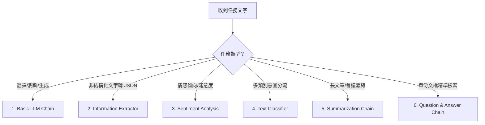

# 🟢 階段一：基礎專用 AI 節點（了解基本 AI 的使用）

歡迎進入 **AI 應用學習第一階段**！

在本階段中，我們將學習 n8n 內建的 **六大專用 AI 基礎節點**。這些節點屬於「確定性的單向處理鏈（Chains）」，不需要複雜的推理或工具調用，反應速度最快、消耗 Token 最少、結果最精準可控，是掌握 AI 自動化的最佳起點。

> 🤖 **模型註冊與串接指南（推薦資安合規主軸）**：
> - [**NVIDIA NIM 微服務模型串接**](../../nvidia_nim/README.md)（免費取得 API Key，使用 `meta/llama-3.3-70b-instruct`）
> - [**OpenRouter 多模型聚合平台**](../../openrouter/README.md)（單一 Key 調用多種主流合規模型）

---

## 🧭 階段一 範例導覽

---

### 1. [範例 1：Basic LLM Chain（基礎提示詞與文字生成）](./Basic_LLM_Chain/README.md)
*最純粹的 AI 入門！學習如何透過 Prompt 與大語言模型互動，進行文本翻譯與文案潤飾。*
- **學習重點**：Basic LLM Chain 節點設定、動態引用 `{{ $json.text }}`、多語言翻譯。
- **附帶樣版**：[`Basic_LLM_Chain.json`](./Basic_LLM_Chain/Basic_LLM_Chain.json)

---

### 2. [範例 2：Information Extractor（非結構化文字轉結構化 JSON）](./Information_Extractor/README.md)
*告別複雜 Regex！利用 AI 從雜亂 Email 或訊息中，以強型別 JSON Schema 精準抽取欄位。*
- **學習重點**：JSON Schema 定義、商品陣列物件抽取、直接銜接資料庫儲存。
- **附帶樣版**：[`Information_Extractor.json`](./Information_Extractor/Information_Extractor.json)

---

### 3. [範例 3：Sentiment Analysis（文字情緒與滿意度分析）](./Sentiment_Analysis/README.md)
*即時掌握顧客情緒！自動分析客戶回饋的情感傾向，快速捕捉負面客訴並啟動預警。*
- **學習重點**：正/負/中立與自訂情緒分類、信心指數評分、搭配 IF 節點緊急通報。
- **附帶樣版**：[`Sentiment_Analysis.json`](./Sentiment_Analysis/Sentiment_Analysis.json)

---

### 4. [範例 4：Text Classifier（文字意圖分類與智慧路由）](./Text_Classifier/README.md)
*自動化流程的智慧總機！根據文字內容精準分類，配合 Switch 節點實現多路業務派工。*
- **學習重點**：Zero-shot 分類原理、類別描述撰寫、搭配 Switch 實現流程分流。
- **附帶樣版**：[`Text_Classifier.json`](./Text_Classifier/Text_Classifier.json)

---

### 5. [範例 5：Summarization Chain（長文本智慧摘要濃縮）](./Summarization_Chain/README.md)
*長篇大論救星！一秒精煉長篇新聞、會議記錄與政策法規，產出條理分明的重點摘要。*
- **學習重點**：Stuff 模式 vs Map-Reduce 模式、突破 Token 限制、條列式結構化摘要。
- **附帶樣版**：[`Summarization_Chain.json`](./Summarization_Chain/Summarization_Chain.json)

---

### 6. [範例 6：Question & Answer Chain（基礎文件檢索問答鏈）](./Question_and_Answer_Chain/README.md)
*RAG 知識庫最簡實踐！讓 AI 根據指定的檢索文件（Retriever）直接回答問題，杜絕幻覺。*
- **學習重點**：Retriever 與 Vector Store 掛載、Embeddings 原理、嚴格依規章作答。
- **附帶樣版**：[`Question_and_Answer_Chain.json`](./Question_and_Answer_Chain/Question_and_Answer_Chain.json)

---

[⬅️ 返回 AI 總目錄](../README.md) ｜ [➡️ 前往階段二：AI Agent 核心與工具調用](../階段二_AI_Agent核心與工具調用/README.md)
