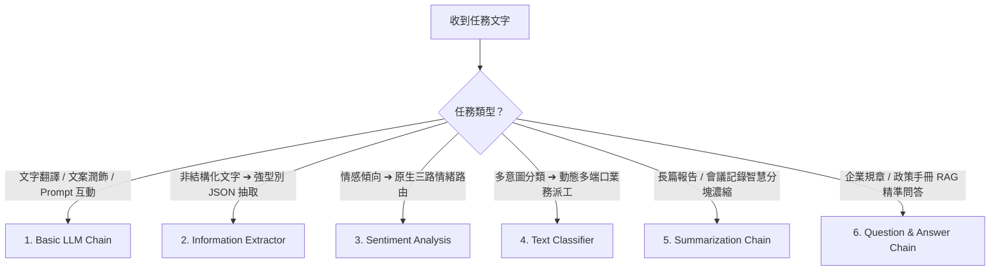

# 🟢 階段一：基礎專用 AI 節點（了解基本 AI 的使用）

歡迎進入 **AI 應用學習第一階段**！

在本階段中，我們將學習 n8n 內建的 **六大專用 AI 基礎節點**。這些節點屬於「確定性的單向處理鏈（Chains）」，不需要複雜的推理或工具調用，反應速度最快、消耗 Token 最少、結果最精準可控，是掌握 AI 自動化的最佳起點。

> 🤖 **模型註冊與串接指南（推薦資安合規主軸）**：
> - [**NVIDIA NIM 微服務模型串接**](../../nvidia_nim/README.md)（免費取得 API Key，使用 `meta/llama-3.3-70b-instruct`）
> - [**OpenRouter 多模型聚合平台**](../../openrouter/README.md)（單一 Key 調用多種主流合規模型）

---

## 🧭 階段一 範例導覽

---

### 1. [範例 1：Basic LLM Chain（基礎提示詞與文字生成）](./Basic_LLM_Chain/README.md)
*最純粹的 AI 入門！學習如何透過 Prompt 與大語言模型互動，進行文本翻譯與文案潤飾。*
- **學習重點**：Basic LLM Chain 節點設定、動態引用 `{{ $json.text }}`、多語言翻譯。
- **附帶樣版**：[`Basic_LLM_Chain.json`](./Basic_LLM_Chain/Basic_LLM_Chain.json)

---

### 2. [範例 2：Information Extractor（非結構化文字轉結構化 JSON）](./Information_Extractor/README.md)
*告別複雜 Regex！利用 AI 從雜亂 Email 或訊息中，以強型別 JSON Schema 精準抽取欄位。*
- **學習重點**：JSON Schema 定義、商品陣列物件抽取、直接銜接資料庫儲存。
- **附帶樣版**：[`Information_Extractor.json`](./Information_Extractor/Information_Extractor.json)

---

### 3. [範例 3：Sentiment Analysis（文字情緒分析與三路語意分流）](./Sentiment_Analysis/README.md)
*即時掌握顧客情緒！原生自帶 Positive / Neutral / Negative 三路輸出端口，達成秒級客訴預警。*
- **學習重點**：AI 語意路由器概念、原生三路端口分流、信心評分指標。
- **附帶樣版**：[`Sentiment_Analysis.json`](./Sentiment_Analysis/Sentiment_Analysis.json)

---

### 4. [範例 4：Text Classifier（文字意圖分類與動態多路路由）](./Text_Classifier/README.md)
*自動化流程的智慧總機！依據定義的 Categories 動態生成輸出端口，實現跨部門自動化派工。*
- **學習重點**：動態多端口路由機制、Category 描述寫作技巧、多標籤與 Other 容錯分支。
- **附帶樣版**：[`Text_Classifier.json`](./Text_Classifier/Text_Classifier.json)

---

### 5. [範例 5：Summarization Chain（長文本智慧摘要濃縮）](./Summarization_Chain/README.md)
*長篇大論救星！自動將長文切片（Chunking 1000 字）並保留重疊緩衝（Overlap 200 字），產出條理分明的精準摘要。*
- **學習重點**：克服 Token 上限、分塊（Chunking）與重疊（Overlap）原理、結構化決策摘要。
- **附帶樣版**：[`Summarization_Chain.json`](./Summarization_Chain/Summarization_Chain.json)

---

### 6. [範例 6：Question & Answer Chain（RAG 規章知識庫問答）](./Question_and_Answer_Chain/README.md)
*標準 6 階層 RAG 知識庫落地！讓 AI 嚴格根據指定的企業規章文件檢索回答，徹底杜絕幻覺。*
- **學習重點**：6 階層標準 RAG 架構、Vector Store Retriever 適配器、Embeddings 向量化原理。
- **附帶樣版**：[`Question_and_Answer_Chain.json`](./Question_and_Answer_Chain/Question_and_Answer_Chain.json)、[`售後服務與保固政策規章.txt`](./Question_and_Answer_Chain/售後服務與保固政策規章.txt)

---

[⬅️ 返回 AI 總目錄](../README.md) ｜ [➡️ 前往階段二：AI Agent 核心與工具調用](../階段二_AI_Agent核心與工具調用/README.md)
