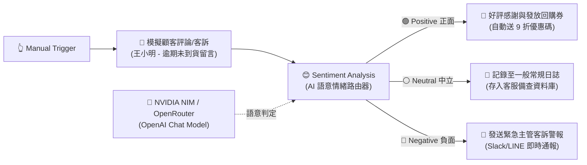

# 基礎範例 3：Sentiment Analysis（AI 語意情緒分流與客訴預警）

## 📚 工作流程說明

在客戶關係管理（CRM）與自動化客服中，即時辨識使用者的情緒傾向至關重要！

**Sentiment Analysis（情緒分析）** 節點是 n8n 的專用 AI 節點之一。它結合了大語言模型（LLM）的深度語意理解能力，但最特別的是：**它本身就是一個「AI 語意路由器（Semantic Router）」！**

### 💡 核心觀念：為什麼不需要額外串接 IF 節點？
過去做情緒分析時，我們常誤以為必須先拿到 `sentiment: "negative"` 文字，再接一個 `IF` 節點來判斷。然而在 n8n 中，**Sentiment Analysis 節點原生就提供 3 個輸出端口（Output Ports）**：
- 🟢 **Output 0 (Positive)**：正面讚揚分支
- ⚪ **Output 1 (Neutral)**：中立平穩分支
- 🔴 **Output 2 (Negative)**：負面客訴分支

AI 會根據語意分析結果，**自動將資料導向對應的輸出通道**，完全不需手動撰寫條件判斷式！

> 🤖 **模型註冊與串接指南（推薦資安合規主軸）**：
> - [**NVIDIA NIM 微服務模型串接**](../../nvidia_nim/README.md)（推薦 `meta/llama-3.3-70b-instruct`）
> - [**OpenRouter 多模型聚合平台**](../../openrouter/README.md)（推薦 `meta-llama/llama-3.3-70b-instruct`）

---

## 🧭 工作流程架構



---

## 📥 工作流程圖下載

- [下載重構範例流程：Sentiment_Analysis.json](./Sentiment_Analysis.json)

---

## 📋 節點詳細說明

1. **📝 Sticky Note（便利貼）**
   - 標記教學重點與原生三路輸出分流機制。

2. **🔄 模擬顧客評論與客訴 (Edit Fields)**
   - 包含顧客姓名 `customer_name`、訂單編號 `order_id` 與一段表達延誤未到貨且客服失聯的強烈不滿文字 `review_text`。

3. **😊 Sentiment Analysis（情緒分析與語意路由核心）**
   - **Text to Analyze**：傳入自然語言文字 `{{ $json.review_text }}`。
   - **三路原生輸出（Outputs）**：
     - `Positive`（第 1 個輸出端）：導向好評獎勵流程。
     - `Neutral`（第 2 個輸出端）：導向常規存檔流程。
     - `Negative`（第 3 個輸出端）：導向負面客訴緊急警報流程。
   - **輸出屬性（Output JSON）**：
     - 自動在資料中附加 `sentiment`（情緒類別）與 `confidence_score`（信心指數，0~1）。

4. **🧠 OpenAI Chat Model（連接 NVIDIA NIM / OpenRouter）**
   - 建議設定 `temperature: 0`，以保持情緒判定的確定性與一致性。

5. **💖 / 📝 / 🚨 三大處置分支節點**
   - **好評感謝分支 (Positive)**：自動生成感謝詞並發送回購禮券。
   - **常規日誌分支 (Neutral)**：寫入常規記錄，供日後客服參考。
   - **緊急警報分支 (Negative)**：提取訂單編號、顧客姓名、負面評論原文與信心指數，即時發送警報給主管介入處理。

---

## ⚙️ 節點設定指南與參數詳解

在 n8n 中配置 `Sentiment Analysis` 節點時，請掌握以下設定要點：

### 1. 必填參數：Text to Analyze（待分析文字）
- **欄位作用**：指定要讓 AI 分析情緒的文字內容。
- **設定方式**：切換為 **`Expression`（表達式）** 模式，填入：
  ```text
  {{ $json.review_text }}
  ```
- ⚠️ **注意事項**：此欄位為必填項（有紅色驚嘆號），未填寫時無法執行。

### 2. 底部模型插槽：Model *（語言模型）
- 節點底部標有紅星的 `Model *` 插槽為**必接插槽**。
- 必須從畫布下方拉線連接一個語言模型節點（如 `OpenAI Chat Model`、`NVIDIA NIM` 或 `Ollama Chat Model`）。

### 3. Options 進階選項（點擊 Add Option）
- **Sentiment Property**：自訂輸出情緒名稱的欄位（預設為 `sentiment`）。
- **Score Property**：自訂信心評分的欄位（預設為 `confidence_score`）。
- **自訂情緒分類（Custom Sentiments）**：若業務需要，可自訂輸出端口（例如增加 `Toxic`、`Urgent` 等多種標籤）。

---

## 🛠️ 常見錯誤排除（Troubleshooting）

### ❓ 為什麼執行時出現 `Issues: - Parameter "Text to Analyze" is required.`？

表示 `Text to Analyze` 欄位目前為空白。請依照以下步驟操作：

1. **先點擊左側「Execute previous nodes」**：
   - 讓前置的「模擬顧客評論」節點先執行，左側 INPUT 面板就會載入 `review_text` 欄位資料。
2. **切換為 Expression 模式填入變數**：
   - 將 `Text to Analyze` 切換為 **`Expression`** 模式，填入 `={{ $json.review_text }}`（或直接用滑鼠從左側面板將 `review_text` 拖曳進輸入框）。
3. **確認底部 Model* 已連線**：
   - 確認底部紅星插槽已連線至語言模型節點。
4. **點擊「Execute step」**：
   - 執行成功後，資料會自動從對應的輸出端口（如 Negative）流出！

---

## 🎯 學習重點

- **AI 語意路由概念**：掌握多分支輸出（Multi-Output Ports）架構，擺脫傳統繁瑣的 IF 條件串接。
- **即時公關危機攔截**：負面客訴在第一時間經由 Negative 輸出端自動分流，達成秒級警報。
- **全自動化顧客分群經營**：正面好評即時觸發獎勵機制，提升顧客黏著度與回購率。

---

## 💡 實際應用場景

- **電商平台商品評論**：5 星好評自動引導至社群分享，1~2 星差評立即通報售後客服團隊。
- **客服 Helpdesk 郵件進線分流**：負面情緒信件優先派工（High Priority Queue）。
- **社群媒體輿情監控**：即時分析粉專留言，過濾公關危機事件。

---

## 🤖 AI 賦能延伸實作（附 Prompt 提詞）

<details>
<summary>👉 點擊展開可直接複製給 AI 助理的 Prompt 提詞</summary>

> 💡 **任務目標**：透過 AI 助理在 Sentiment Analysis 後方自動串接 Telegram 警報與 Google Sheets 資料表記錄。

```text
請幫我擴充目前的「Sentiment Analysis」情緒分流工作流程：
1. 當 Sentiment Analysis 判定為 Negative（第 3 個輸出端）時：
   - 串接 Telegram 節點（或 Slack 節點），向「客服主管群組」發送緊急告警，內容包含：訂單編號、顧客姓名、評論原文與情緒信心分數。
2. 當判定為 Positive（第 1 個輸出端）時：
   - 串接 Google Sheets 節點（Append row），將顧客姓名、好評內容與日期自動寫入「優良顧客感謝清單」。
3. 當判定為 Neutral（第 2 個輸出端）時：
   - 串接 Google Sheets 節點記錄至「常規意見反應表」。
請幫我建立所有目標節點並完成三路連線！
```
</details>
