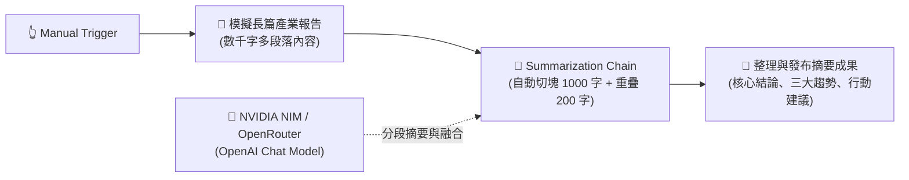
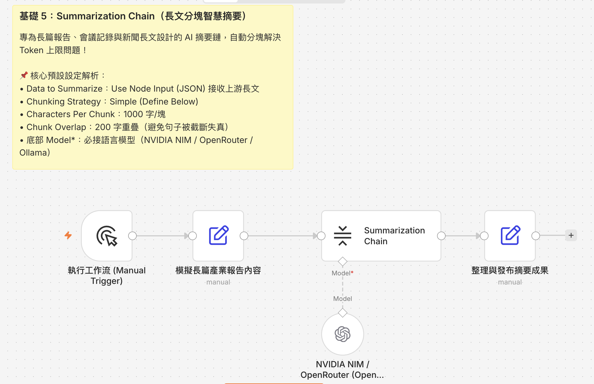

# 基礎範例 5：Summarization Chain（長篇文檔智慧分塊摘要）

## 📚 工作流程說明

在自動化處理會議逐字稿、產業長篇研報、法律合約或 PDF 文件時，我們經常面臨一個巨大的挑戰：**文章長度遠遠超過大語言模型（LLM）的單次輸入 Token 上限（Context Window Limit）**。

**Summarization Chain（摘要鏈）** 節點是 n8n 專門為長文摘要設計的高階專用 AI 節點。它具備**「自動分塊（Chunking）」**與**「分階段濃縮（Map-Reduce / Stuff / Refine）」**機制，即使是數萬字的大篇幅內容，也能自動切片、分段閱讀並最終融合為一份結構嚴謹的專業摘要！

> 🤖 **模型註冊與串接指南（推薦資安合規主軸）**：
> - [**NVIDIA NIM 微服務模型串接**](../../nvidia_nim/README.md)（推薦 `meta/llama-3.3-70b-instruct`）
> - [**OpenRouter 多模型聚合平台**](../../openrouter/README.md)（推薦 `meta-llama/llama-3.3-70b-instruct`）

---

## 🧭 工作流程架構



---

## 預覽圖



---

## 📥 工作流程圖下載

- [下載重構範例流程：Summarization_Chain.json](./Summarization_Chain.json)

---

## ⚙️ 節點設定指南與預設參數詳解

在 n8n 的 `Summarization Chain` 節點面板中，預設包含了多項關鍵參數，以下逐一深入解析其背後的運作機制：

### 1. Data to Summarize（資料來源模式）
- **`Use Node Input (JSON)`（預設推薦）**：
  - 直接接收前置節點傳入的 JSON 資料（例如前一個 Edit Fields 或 Webhook 傳來的文字欄位）。節點會自動提取字串內容進行摘要。
- **`Use Node Input (Binary)`**：
  - 用於摘要二進位檔案（如上游讀取進來的 PDF、DOCX 或 TXT 文件）。
- **`Use Document Loader`**：
  - 允許在節點下方連接專門的 Document Loader 子節點（如從外部網頁、Notion 或雲端硬碟讀取長篇文檔）。

---

### 2. Chunking Strategy（分塊切片策略）
長文無法一次性餵給模型，因此需要「切片」處理：
- **`Simple (Define Below)`（預設推薦）**：直接在面板下方設定切片大小與重疊量。
- **`Advanced (Connect Splitter)`**：允許外接高階的分詞器子節點（如 `Recursive Character Text Splitter`）。

---

### 3. Characters Per Chunk: `1000`（每塊字元大小）
- **預設值**：`1000` 字元。
- **原理**：將整篇數千或數萬字的文章，按照每 1,000 字切成一個獨立的「知識片段（Chunk）」，分別交由語言模型閱讀。

---

### 4. Chunk Overlap (Characters): `200`（分塊重疊字元數，極重要 ⚠️）
- **預設值**：`200` 字元。
- **為什麼需要 Overlap（重疊）？**
  - 如果硬性每 1,000 字切一刀，一句重要的話或段落核心很可能會**剛好在第 1,000 字的位置被硬生生切成兩半**，導致前一塊遺失後半句、後一塊缺少主詞，造成 AI 語意理解斷層。
  - 透過設定 `200` 字元的重疊區間，第 2 個 Chunk 的開頭會包含第 1 個 Chunk 結尾的 200 字，**確保段落脈絡完整連貫，避免斷章取義！**

```text
[------------- Chunk 1 (1000 字) -------------]
                               [==== 200字重疊 ====]
                               [------------- Chunk 2 (1000 字) -------------]
```

---

### 5. 底部模型插槽：Model *（語言模型）
- 節點底部的紅星 `Model *` 為**必要連接**。
- 必須連接語言模型（如 `OpenAI Chat Model`、`NVIDIA NIM` 或 `Ollama Chat Model`）來執行真正的文字閱讀與濃縮。

---

### 6. Options 進階選項（點擊 Add Option）
- **Prompt（自訂輸出格式提示詞）**：
  - 可在此填入希望模型產出的摘要結構（例如：「1. 核心結論 2. 三大亮點 3. 行動建議」），強制模型按照標準格式輸出。

---

## 🛠️ 常見錯誤排除（Troubleshooting）

### ❓ 點擊 `Execute step` 出現 `No input data` 或空白？
1. **先執行前置節點**：
   - 點擊左側面板的 **`Execute previous nodes`** 按鈕，讓模擬文章的節點先執行並輸出文字。
2. **確認 Data to Summarize**：
   - 保持為 `Use Node Input (JSON)`。
3. **確認底部 Model* 已連接**：
   - 確認畫布下方已連線至語言模型節點。
4. **點擊「Execute step」**：
   - 模型就會開始進行分塊摘要並在右側輸出最終成果。

---

## 🎯 學習重點

- **克服 LLM Context Window 上限**：理解超長文檔透過分塊（Chunking）處理的核心機制。
- **Overlap 重疊緩衝概念**：掌握重疊字元如何保護跨段落語意不失真。
- **結構化摘要輸出**：學會透過 Prompt 強制 AI 產出清晰、專業的決策者摘要。

---

### 💡 實際應用場景

- **跨國會議逐字稿自動摘要**：將 1~2 小時的長篇會議文字濃縮為 500 字行動方針（Action Items）。
- **長篇 PDF 研報 / 論文速讀**：自動歸納核心論點與關鍵數據。
- **客戶長篇諮詢案件紀錄歸納**：在工單結案前自動產出處理歷程總結。

---

### ⚙️ 設定步驟

1. **匯入流程**：將 `Summarization_Chain.json` 複製並貼上至 n8n 編輯器中。
2. **綁定憑證**：在 OpenAI Chat Model 節點中選取您的 NVIDIA NIM 或 OpenRouter 憑證。
3. **執行測試**：點擊「Execute Workflow」或在 Manual Trigger 點擊測試。
4. **檢視成果**：點擊最後一個「整理與發布摘要成果」節點，查看輸出的結構化核心結論、三大趨勢與行動建議。

---

## 🤖 AI 賦能延伸實作（附 Prompt 提詞）

<details>
<summary>👉 點擊展開可直接複製給 AI 助理的 Prompt 提詞</summary>

> 💡 **任務目標**：透過 AI 在 Summarization Chain 產出摘要後，自動將報告整理並推播至 Slack / Telegram 頻道。

```text
請幫我在目前的「Summarization Chain」工作流程後方擴充推播通知：
1. 接收 Summarization Chain 產出的摘要內容。
2. 串接一個 Telegram 節點（或 Slack 節點），向「營運主管戰情報告群」發送訊息：
   - 標題：📢【每日產業 AI 趨勢洞察摘要】
   - 內容：{{ $json.text }}
   - 附加發布時間：{{ $now.format('yyyy-MM-dd HH:mm') }}
請幫我建立推播節點並完成訊息排版連線！
```
</details>
