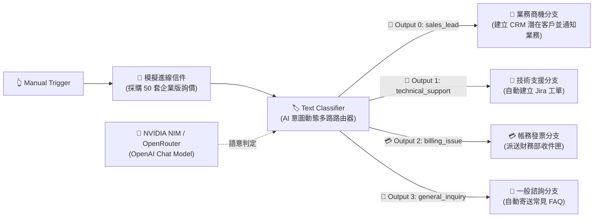
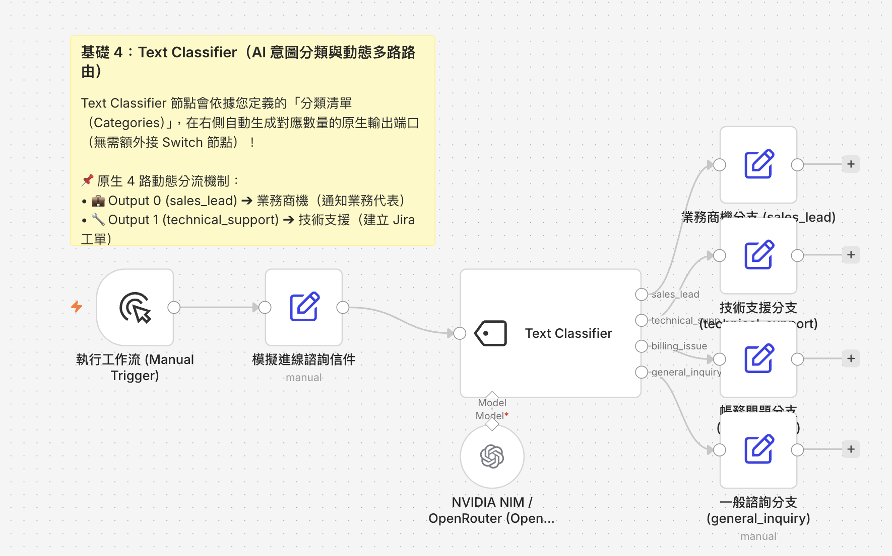

# 基礎範例 4：Text Classifier（AI 意圖分類與動態多路路由）

## 📚 工作流程說明

在自動化派工與企業客服中，如何將客戶進線的郵件或訊息精準分流至各個業務部門？

**Text Classifier（文字意圖分類器）** 節點是 n8n 的專用 AI 節點之一。它結合了大語言模型強大的語意辨識能力，最特別的是：**它本身就是一個「動態多路 AI 路由器（Dynamic Multi-Branch Router）」！**

### 💡 核心觀念：為什麼不需要額外串接 Switch 節點？
過去我們習慣先用 AI 分類出字串標籤，再接一個 `Switch` 節點來判斷分支。但在 n8n 中，**只要在 `Text Classifier` 內定義了 N 個分類類別（Categories），節點右側就會自動動態生成 N 個獨立的輸出端口（Output Ports）！**

AI 模型比對語意後，會直接將資料從對應的分類端口發射出去，下游節點直接拉線即可，完全不需要 Switch 節點！

> 🤖 **模型註冊與串接指南（推薦資安合規主軸）**：
> - [**NVIDIA NIM 微服務模型串接**](../../nvidia_nim/README.md)（推薦 `meta/llama-3.3-70b-instruct`）
> - [**OpenRouter 多模型聚合平台**](../../openrouter/README.md)（推薦 `meta-llama/llama-3.3-70b-instruct`）

---

## 🧭 工作流程架構



---

## 預覽圖



---

## 📥 工作流程圖下載

- [下載重構範例流程：Text_Classifier.json](./Text_Classifier.json)

---

## 📋 節點詳細說明

1. **📝 Sticky Note（便利貼）**
   - 標記教學重點與 4 路動態輸出端口對應機制。

2. **🔄 模擬進線諮詢信件 (Edit Fields)**
   - 包含詢價 50 套企業授權與統編折扣的採購信件（`inquiry_message`、`sender_email`）。

3. **🏷️ Text Classifier（意圖分類核心）**
   - **Input Text**：傳入待分類的自然語言文字 `{{ $json.inquiry_message }}`。
   - **分類清單設計（Categories）**：
     - `sales_lead` (Output 0)：企業採購、商務合作、大量授權、專屬報價洽詢。
     - `technical_support` (Output 1)：系統報錯、無法登入、API 串接異常、功能故障。
     - `billing_issue` (Output 2)：退款申請、信用卡扣款失敗、發票更換。
     - `general_inquiry` (Output 3)：其他一般常見問題、營業時間、門市地點。

4. **🧠 OpenAI Chat Model（連接 NVIDIA NIM / OpenRouter）**
   - 設定 `temperature: 0`，以確保意圖分類的穩定性與確定性。

5. **💼 / 🔧 / 💳 / 💬 四大業務處置分支節點**
   - **商務商機分支 (sales_lead)**：通知業務同仁並建置 CRM 商機。
   - **技術支援分支 (technical_support)**：指派值班工程師與 Jira 工單。
   - **帳務發票分支 (billing_issue)**：轉發財務團隊處理開票與退款。
   - **一般諮詢分支 (general_inquiry)**：自動發送常見問題手冊。

---

## ⚙️ 節點設定指南與進階選項

在配置 `Text Classifier` 節點時，請掌握以下關鍵設定：

### 1. Categories（類別清單設計原則）
- **Category（類別名稱，必填 ⚠️）**：
  - 填入英文代號（例如 `sales_lead`、`technical_support`）。
  - **重要**：這個名稱會直接成為該節點右側「輸出端口（Output Port）」的標籤名稱！
- **Description（類別描述，極關鍵）**：
  - 這是**給 LLM 的語意判斷提示**！描述寫得越具體、關鍵字越完整，AI 分類的精準度就越高。

### 2. Options 進階選項（點擊 Add Option）
- **Allow Multiple Classes To Be True（多標籤分類）**：
  - 預設關閉（單一分類）。若開啟此功能，當一封信件同時提到「系統 Bug」與「要求退款」時，資料會**同時從多個端口輸出**！
- **Fallback / Other Branch（額外 Other 分支）**：
  - 若開啟，當輸入文字完全無法匹配任何已定義的類別時，會自動從額外的 `Other` 端口輸出，避免資料遺失。

---

## 🛠️ 常見錯誤排除（Troubleshooting）

### ❓ 出現 `Issues: - Parameter "Category" is required.` 警告？
- **原因**：Categories 清單中的 **Category（類別名稱）** 欄位為空白。
- **解決方式**：請為每一個類別輸入英文字串名稱（例如 `sales_lead`、`technical_support`、`billing_issue`、`general_inquiry`）。

### ❓ 為什麼不需要接 Switch 節點？
- **錯誤做法**：在 Text Classifier 後方接 Switch，並只拉一條線連到 Switch。這會導致只有第一個類別（Output 0）能流進 Switch，其他類別的資料會被丟失！
- **正確做法**：直接從 `Text Classifier` 的多個輸出孔拉線連到各自的處理節點。

### ❓ 出現 `Input Text is required` 警告？
- 點擊左側面板的 **`Execute previous nodes`** 帶入資料。
- 將 `Input Text` 切換為 **`Expression`** 模式，填入 `={{ $json.inquiry_message }}`。

---

## 🎯 學習重點

- **動態多端口路由（Dynamic Multi-Branch Routing）**：掌握 n8n AI 節點自動生成輸出端口的強大機制。
- **意圖分類 Prompting 技巧**：透過 Description 精準定義類別邊界。
- **跨部門自動派工**：實現從單一收件匣自動路由至業務、工程、財務等各部門。

---

### 💡 實際應用場景

- **客服 Email 智慧派工**：自動識別售前、售後、客訴與財務信件。
- **GitHub / Jira 議題自動打標籤**：依據 Bug 描述自動打上 `frontend`、`backend`、`database` 等標籤。
- **社群媒體貼文分流**：將社群留言自動分類為行銷合作、產品反饋或公關危機。

---

### ⚙️ 設定步驟

1. **匯入流程**：將 `Text_Classifier.json` 複製並貼上至 n8n 編輯器中。
2. **綁定憑證**：在 OpenAI Chat Model 節點中選取您的 NVIDIA NIM 或 OpenRouter 憑證。
3. **執行測試**：點擊「Execute Workflow」或在 Manual Trigger 點擊測試。
4. **檢視結果**：觀察大批量授權詢價信件是否自動從 `sales_lead`（Output 0）端口輸出，並成功觸發「💼 業務商機分支」。

---

## 🤖 AI 賦能延伸實作（附 Prompt 提詞）

<details>
<summary>👉 點擊展開可直接複製給 AI 助理的 Prompt 提詞</summary>

> 💡 **任務目標**：透過 AI 助理在業務商機分支中，自動抽取聯絡人資訊並發送 Slack / Telegram 通知。

```text
請幫我在目前的「Text Classifier」工作流程中擴充業務分支：
1. 當 Text Classifier 走入 sales_lead（第 1 個輸出端）時：
   - 串接一個 Information Extractor 節點，依 JSON Schema 抽取信件中的「公司名稱」、「預計採購數量」與「聯絡人信箱」。
   - 串接 Telegram（或 Slack）節點，向業務群組發送通知：「🔥【高價值商機通知】公司：{{ $json.company_name }}，數量：{{ $json.quantity }} 套，請業務同仁儘速跟進！」。
2. 當走入 technical_support（第 2 個輸出端）時：
   - 串接 HTTP Request 節點自動建立 Jira 工單。
請幫我配置好該分支的節點與連線！
```
</details>
