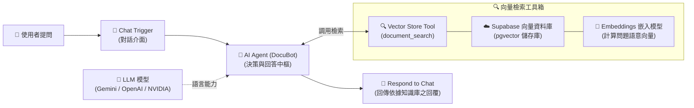

# 基礎範例 2：Supabase 雲端儲存 RAG 智能問答系統

## 📚 工作流程說明

本範例展示如何運用 **Supabase 雲端向量資料庫（PostgreSQL + pgvector）** 打造企業級的 **RAG（檢索增強生成）智能問答系統**。

在企業與個人應用中，將向量資料庫託管在雲端（如 Supabase）具備以下優勢：
1. **永久持久化儲存**：文件向量化後永久儲存於雲端，重啟工作流程或伺服器都不會遺失。
2. **分離式架構（分離索引與檢索）**：
   - **寫入端（索引工作流）**：文件（PDF/Word/Markdown）上傳後切塊（Chunking）、計算 Embeddings 向量並寫入 Supabase。
   - **讀取端（問答工作流）**：使用者提問時，AI Agent 自主調用向量檢索工具，精準比對知識庫段落並生成專業回答。
3. **零維運成本**：免自建伺服器，利用 Supabase 免費方案即可享有完整的 PostgreSQL 與 pgvector 向量運算能力。

> 🤖 **模型註冊與串接指南（推薦資安合規主軸）**：
> - [**NVIDIA NIM 微服務模型串接**](../../../nvidia_nim/README.md)（免費取得 API Key，使用 `meta/llama-3.3-70b-instruct`）
> - [**OpenRouter 多模型聚合平台**](../../../openrouter/README.md)（單一 Key 調用多種主流合規模型）

---

## 🧭 工作流程架構



---

## 📥 工作流程圖下載

### 🌟 主要核心流程
- [下載核心工作流程：Supabase_RAG_智能問答.json](./Supabase_RAG_智能問答.json)

### 📦 額外延伸範例（點擊下載進階工作流）
為了方便學習完整 RAG 生命週期，我們提供以下額外延伸範例：
1. **[01_RAG文件索引_本機上傳.json](./額外範例/01_RAG文件索引_本機上傳.json)**：本機上傳 PDF/TXT/MD 文件，自動切塊、計算 Embeddings 並寫入 Supabase 向量庫。
2. **[02_RAG文件索引_Google_Drive同步.json](./額外範例/02_RAG文件索引_Google_Drive同步.json)**：自動監聽 Google Drive 雲端資料夾，同步解析並向量化新增文件。
3. 👉 **進階檢索策略（Metadata 來源過濾）**：已獨立為專屬單元，請前往學習 [**範例 3：RAG 檢索策略與來源過濾**](../04_檢索策略/README.md)。

---

## 📋 節點詳細說明

### 1. 💬 Chat Trigger（對話觸發器）
- **功能**：提供內建的聊天視窗介面，接收使用者輸入的提問（`$json.chatInput`）。
- **設定重點**：可自訂歡迎訊息與對話副標題，引導使用者提問。

### 2. 🤖 AI Agent (Tools Agent)
- **功能**：作為核心大腦，根據使用者的問題自主決定是否調用 `document_search` 工具檢索向量庫。
- **System Prompt 設定**：
  - 設定為專業文件助手「DocuBot」。
  - 規範回答準則：**「嚴格依據文件內容回答，不臆測捏造；若知識庫未提及則坦誠告知」**。

### 3. 🧠 LLM Chat Model
- **支援平台**：Google Gemini、OpenAI、NVIDIA NIM 或 OpenRouter。
- **建議參數**：`Temperature` 設為 `0.3`（較保守數值，確保回答精準並降低幻覺）。

### 4. 🔍 Vector Store Tool（向量檢索工具）
- **工具名稱**：`document_search`
- **Tool Description**：描述「使用此工具在文件資料庫中搜尋相關資訊」，供 AI Agent 判斷何時調用。
- **Top K 參數**：設為 `4`（每次檢索取出最相似的 4 個文字區塊）。

### 5. ☁️ Supabase Vector Store
- **功能**：連接 Supabase 雲端 PostgreSQL，執行 pgvector 餘弦相似度（Cosine Distance）檢索。
- **資料表名稱**：預設為 `documents`。

### 6. 🧠 Embeddings 嵌入模型
- **功能**：將使用者的提問轉換為高維度向量值。
- **⚠️ 重要原則**：檢索端使用的 Embeddings 模型（如 `text-embedding-004` 或 `text-embedding-3-small`）**必須與寫入索引時完全一致**。

---

## 🔑 Supabase 專案設定 3 步驟快速指引

若要在 Supabase 建立向量資料庫，只需在 Supabase 的 **SQL Editor** 貼上並執行以下 SQL 語法：

```sql
-- 1. 啟用 pgvector 向量擴充套件
CREATE EXTENSION IF NOT EXISTS vector;

-- 2. 建立儲存文件切塊與向量的資料表
CREATE TABLE IF NOT EXISTS documents (
  id BIGSERIAL PRIMARY KEY,
  content TEXT,
  metadata JSONB,
  embedding VECTOR(1536) -- 若使用 text-embedding-004 請改為 VECTOR(768)
);

-- 3. 建立向量相似度搜尋的 HNSW 索引（加速百萬筆檢索）
CREATE INDEX IF NOT EXISTS documents_embedding_idx 
ON documents USING hnsw (embedding vector_cosine_ops);
```

---

## 📄 測試資料與參考指南

本範例附帶實用的測試資料與進階技術文件：
- 📁 **[測試資料目錄](./測試資料/)**：
  - [`產品資訊.md`](./測試資料/產品資訊.md) ｜ [`產品資訊.pdf`](./測試資料/產品資訊.pdf) ｜ [`說明書.txt`](./測試資料/說明書.txt)
- 📚 **[進階參考指南](./參考指南/)**：
  - [`完整使用指南.md`](./參考指南/完整使用指南.md) ｜ [`快速參考卡.md`](./參考指南/快速參考卡.md) ｜ [`升級到PGVector指南.md`](./參考指南/升級到PGVector指南.md)

---

## 🎯 學習重點

1. **雲端向量資料庫優勢**：理解 Supabase / PostgreSQL 在生產環境中做持久化向量存儲的價值。
2. **語意搜尋原理**：掌握 Embedding 向量維度一致性與 Top-K 相似度檢索機制。
3. **杜絕模型幻覺**：透過 System Prompt 與 RAG 檢索內容限制，打造可信賴的企業級知識助理。

---

## 🤖 AI 賦能延伸實作

<details>
<summary>💡 <strong>AI 賦能延伸實作（可直接複製給 AI 的 Prompt 提詞）</strong></summary>

> **任務目標**：透過 MCP 連線，讓 AI 助理為此工作流程擴充「引用來源標註」與「查無結果時的主動工單派工」邏輯。

**可直接複製給 AI 的 Prompt 提詞**：
```text
請幫我在目前的 n8n 畫布上，延伸「Supabase 雲端 RAG 智能問答」工作流程：
1. 檢查目前的 AI Agent 節點，更新 System Prompt 提示詞：
   - 要求 AI 在回答時，文末必須列出【參考段落與來源檔名】（取自 metadata.source 欄位）。
2. 在 AI Agent 後方加入條件分支判斷：
   - 若檢索結果相似度過低或 AI 判定「知識庫無相關資料」，自動觸發發送 Slack/Email 提醒客服專員補齊該題目的知識庫文件。
3. 請幫我配置好節點連線與提示詞調整。
```
</details>

---

[⬅️ 返回上一單元：01_記憶體儲存入門](../01_記憶體儲存入門/README.md) ｜ [➡️ 前往下一單元：03_檢索策略與來源過濾](../03_檢索策略與來源過濾/README.md) ｜ [🏠 返回 RAG 總目錄](../README.md)
