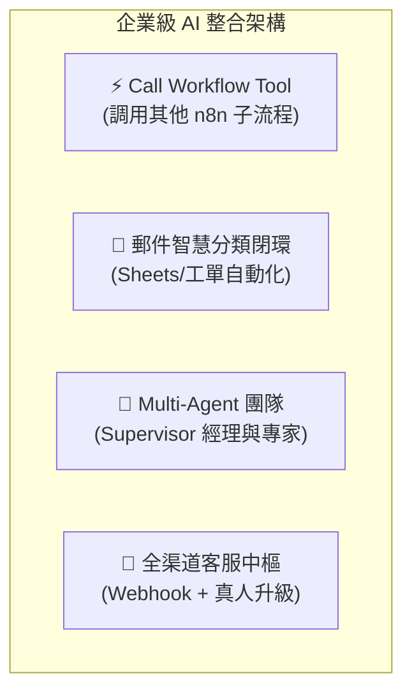

# 🔴 階段三：企業級進階實戰與多代理

歡迎進入 **AI 應用學習第三階段**！

本階段聚焦於 **企業真實業務場景的深度落地**，包含跨系統子工作流調度（Call Workflow Tool）、郵件分類與工單閉環、多代理人（Multi-Agent Supervisor）團隊協同作業、以及全渠道客服中樞。

> 🤖 **模型註冊與串接指南（推薦資安合規主軸）**：
> - [**NVIDIA NIM 微服務模型串接**](../../nvidia_nim/README.md)（免費取得 API Key，使用 `meta/llama-3.3-70b-instruct`）
> - [**OpenRouter 多模型聚合平台**](../../openrouter/README.md)（單一 Key 調用多種主流合規模型）

---

## 🧭 階段三 範例導覽

---

### 1. [範例 1：具備工作流呼叫能力的 AI 萬能助理（Call Workflow Tool）](./具備工具使用能力的助理/README.md)
*解鎖最強整合力！讓 AI Agent 透過 Call n8n Workflow Tool 調用其他自動化流程完成複合任務。*
- **學習重點**：Calculator 運算工具、將現有工作流程包裝為 AI Tool、工具 Schema 規範。
- **附帶樣版**：[`ai_tools_assistant.json`](./具備工具使用能力的助理/ai_tools_assistant.json)

---

### 2. [範例 2：Gmail 客服郵件智慧分類與自動歸檔系統](./郵件智能分類系統/README.md)
*業務落地實戰！自動閱讀 Email、分類客訴/詢價並提取關鍵資料，緊急事件立即推播、全量寫入 Google 試算表。*
- **學習重點**：結構化 JSON Output 規範、IF 條件過濾緊急客訴、Google Sheets 工單閉環。
- **附帶樣版**：[`email_classifier_workflow.json`](./郵件智能分類系統/email_classifier_workflow.json)

---

### 3. [範例 3：多代理人協作團隊（Multi-Agent Supervisor 經理與專家架構）](./多代理協作系統/README.md)
*打造 AI 團隊！專案主管（Supervisor）接收任務後，自動拆解並指揮「研究員」與「文案師」協同完成企劃。*
- **學習重點**：Multi-Agent 職責分離、Agent Tool 包裝、任務拆解與上下文傳遞。
- **附帶樣版**：[`multi_agent_system.json`](./多代理協作系統/multi_agent_system.json)

---

### 4. [範例 4：端到端客戶服務自動化平台（全渠道智慧分流與工單閉環）](./客戶服務自動化平台/README.md)
*企業級全渠道架構！整合 Webhook、RAG 向量檢索、意圖判斷、真人升級機制與資料持久化。*
- **學習重點**：全渠道統一 Webhook、AI 判定「直接回答 vs 升級真人」、資料庫同步工單狀態。
- **附帶樣版**：[`customer_service_platform.json`](./客戶服務自動化平台/customer_service_platform.json)

---

[⬅️ 返回階段二：AI Agent 核心與工具調用](../階段二_AI_Agent核心與工具調用/README.md) ｜ [🏠 返回 AI 總目錄](../README.md)
