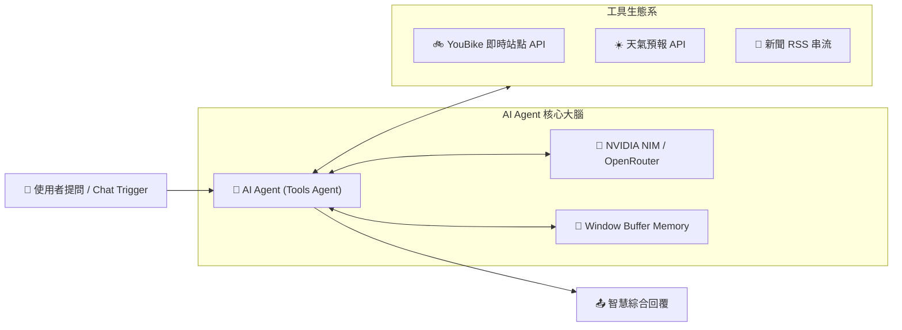

# 🟡 階段二：AI Agent 核心與工具調用

歡迎進入 **AI 應用學習第二階段**！

當您的業務需求超越了單純的文字處理，需要 AI **具備自主思考、保持連續對話記憶、自主判斷並調用外部工具（API / 查詢）** 時，我們就正式進入 **AI Agent（智慧代理）** 的世界。

> 🤖 **模型註冊與串接指南（推薦資安合規主軸）**：
> - [**NVIDIA NIM 微服務模型串接**](../../nvidia_nim/README.md)（免費取得 API Key，使用 `meta/llama-3.3-70b-instruct`）
> - [**OpenRouter 多模型聚合平台**](../../openrouter/README.md)（單一 Key 調用多種主流合規模型）

---

## 🧭 階段二 範例導覽

---

### 1. [範例 1：智能客服聊天機器人（純對話與對話記憶）](./智能客服聊天機器人/README.md)
*零門檻入門！學習 AI Agent 骨幹架構、角色設定與 Window Buffer Memory 連續對話記憶。*
- **學習重點**：AI Agent 核心節點、Chat Trigger 對話入口、System Prompt 邊界規範、記憶長度控制。
- **附帶樣版**：[`智能客服聊天機器人.json`](./智能客服聊天機器人/智能客服聊天機器人.json)

---

### 2. [範例 2：臺北市 YouBike 2.0 即時站點查詢助理（單一工具呼叫）](./台北市youbike站點資訊查詢/README.md)
*讓 AI 具備聯網查資料能力！串接政府開放資料 API 即時查詢站點可借可還車輛數。*
- **學習重點**：掛載 HTTP Request Tool、Tool Description 對 LLM 決策的影響、API 資料解讀轉譯。
- **附帶樣版**：[`台北市youbike站點資訊查詢.json`](./台北市youbike站點資訊查詢/台北市youbike站點資訊查詢.json)

---

### 3. [範例 3：多工具整合即時天氣與新聞助理（多工具動態決策）](./天氣和新聞查詢_使用Ollama/README.md)
*多工具動態決策！AI 自主判斷使用者想問天氣還是新聞，並使用 `$fromAI()` 動態生成查詢參數。*
- **學習重點**：多工具路由判斷、`$fromAI()` 參數動態提取、RSS Feed Read Tool 串流讀取。
- **附帶樣版**：[`天氣和新聞查詢_使用Ollama.json`](./天氣和新聞查詢_使用Ollama/天氣和新聞查詢_使用Ollama.json)

---

[⬅️ 返回階段一：基礎專用 AI 節點](../階段一_基礎專用AI節點/README.md) ｜ [➡️ 前往階段三：企業級進階實戰與多代理](../階段三_企業級進階實戰與多代理/README.md) ｜ [🏠 返回 AI 總目錄](../README.md)
