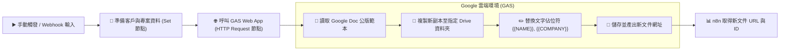

# 📜 Google Apps Script (GAS) 整合
## 範例 1：GAS 基礎文字佔位符替換（Google Docs 自動套版）

### 📚 工作流程說明

當企業內部需要頻繁產出格式固定的文件（例如：客戶歡迎信、專案授權書、錄取通知書）時，手動複製修改容易出錯且耗時。

本範例展示：
1. 在 Google Docs 中設計包含 `{{CUSTOMER_NAME}}`、`{{COMPANY_NAME}}`、`{{PROJECT_TITLE}}`、`{{DATE}}` 的標準公版範本。
2. n8n 透過 **HTTP Request 節點** 將資料以 JSON 格式發送給 GAS 網路應用程式（Web App）。
3. GAS 自動在 Google Drive 複製一份新的文件副本，精準替換所有文字佔位符，並將新文件的 Google Docs 連結即時回傳給 n8n。

---

### 流程架構圖



---

### 工作流程樣版與程式碼下載

- [📥 n8n 工作流程樣版 (01_gas_text_placeholder.json)](./01_gas_text_placeholder.json)
- [📜 Google Apps Script 原始碼 (Code.gs)](./Code.gs)

---

## 🛠️ GAS 部署步驟（3 分鐘上手）

1. 開啟 [Google Drive](https://drive.google.com/)，建立一份新的 Google 文件作為**公版範本**，在內文中輸入如下範例內容，並記下網址中的檔案 ID：
   ```text
   親愛的 {{CUSTOMER_NAME}} 您好：
   感謝貴公司（{{COMPANY_NAME}}）選擇與我們合作「{{PROJECT_TITLE}}」！
   簽約日期：{{DATE}}
   ```
2. 開啟 [Google Apps Script 編輯器 (script.google.com)](https://script.google.com/)，建立新專案。
3. 將本目錄中的 [`Code.gs`](./Code.gs) 內容貼入編輯器並存檔。
4. 點擊右上角 **部署 (Deploy)** ➔ **新增部署 (New deployment)**：
   - 類型選取：**網頁應用程式 (Web app)**
   - 執行身分：**我 (Me)**
   - 誰可以存取：**任何人 (Anyone)**
5. 點擊 **部署**，完成 Google 權限授權，並複製取得的 **網頁應用程式網址 (Web App URL)**。
6. 回到 n8n，將 HTTP Request 節點中的 URL 替換為您的 Web App URL 即可！

---

#### 📋 節點詳細說明

1. **📝 流程說明（Sticky Note）**
   - **功能**：介紹 Google Docs 佔位符正則表達式轉義（`\\{\\{KEY\\}\\}`）與 GAS Web App 架構。

2. **📝 準備套版資料（Set Node）**
   - **customerName**：`陳大明`
   - **companyName**：`未來科技股份有限公司`
   - **projectTitle**：`n8n 企業自動化系統導入專案`
   - **date**：`{{ $now.format('yyyy-MM-dd') }}`

3. **🌐 呼叫 GAS Web App 套版（HTTP Request Node）**
   - **Method**：`POST`
   - **URL**：`https://script.google.com/macros/s/YOUR_GAS_WEB_APP_ID/exec`
   - **Body Type**：`JSON`

---

#### 🧪 測試與驗證方法

在 n8n 中點擊「Test step」執行，若回傳如下 JSON 即表示套版成功：

```json
{
  "status": "success",
  "message": "文件已成功建立並替換佔位符！",
  "docId": "1a2b3c4d5e6f...",
  "docName": "未來科技股份有限公司_陳大明_n8n 企業自動化系統導入專案",
  "docUrl": "https://docs.google.com/document/d/1a2b3c4d5e6f.../edit"
}
```

點擊 `docUrl` 即可在瀏覽器開啟完全客製化的 Google 文件！

---

#### 🎯 學習重點

- **`makeCopy` 避免破壞範本**：始終在副本上替換資料，保留原始公版範本的乾淨完整。
- **正則轉義符號**：在 GAS 中使用 `replaceText("\\{\\{KEY\\}\\}", value)`，需使用雙反斜線跳脫大括號。

---

<details>
<summary>🤖 <strong>AI 賦能延伸實作（附 Prompt 提詞）</strong></summary>

> 💡 **任務目標**：透過 MCP 連線，讓 AI 增加多欄位動態轉換（如電話、職稱、聯絡地址）。

**可直接複製給 AI 的 Prompt 提詞**：
```text
請幫我在「GAS 基礎文字佔位符」流程中擴充欄位：
1. 在 Set 節點中加入 phone, title, address 三個欄位。
2. 更新 HTTP Request 的 JSON Body，傳送這三個新欄位給 GAS。
3. 幫我修改 Code.gs 中的 replaceText 邏輯，支援 {{PHONE}}, {{TITLE}}, {{ADDRESS}} 佔位符替換。
請提供修改後的節點設定與 GAS 程式碼！
```
</details>
