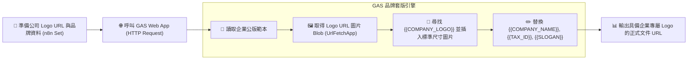

# 📜 Google Apps Script (GAS) 整合
## 範例 2：公司專屬 Logo 與品牌套版（企業自訂 CI/VI 格式）

### 📚 工作流程說明

每個企業都有自訂的公文格式、標題頁首（Header）、官方 Logo 圖片與統一編號格式。

本範例展示：
1. 在 Google Docs 公版範本的頁首或正文處放入圖片佔位符 `{{COMPANY_LOGO}}` 與品牌文字佔位符（`{{COMPANY_NAME}}`、`{{TAX_ID}}`、`{{SLOGAN}}`、`{{ADDRESS}}`、`{{CONTACT_EMAIL}}`）。
2. n8n 將企業品牌資料與 Logo 圖片的公開網址（URL）傳送給 GAS Web App。
3. GAS 透過 `UrlFetchApp` 下載圖片，自動將 `{{COMPANY_LOGO}}` 文字轉為正式的內嵌圖片，並設定標準寬高比例，產出完全符合公司品牌規範的正式官方公文。

---

### 流程架構圖



---

### 工作流程樣版與程式碼下載

- [📥 n8n 工作流程樣版 (02_gas_logo_branding.json)](./02_gas_logo_branding.json)
- [📜 Google Apps Script 原始碼 (Code.gs)](./Code.gs)

---

## 🛠️ Google Docs 範本設計建議

在 Google 文件範本中，您可以這樣設計您的頁首與正文：

```text
┌──────────────────────────────────────────────────────────┐
│  {{COMPANY_LOGO}}                                        │
│  {{COMPANY_NAME}} ｜ 統一編號：{{TAX_ID}}               │
│  「{{SLOGAN}}」                                          │
├──────────────────────────────────────────────────────────┤
│  聯絡地址：{{ADDRESS}}                                   │
│  官方信箱：{{CONTACT_EMAIL}}    發文日期：{{DATE}}      │
│                                                          │
│  【主旨】2026 年度企業自動化轉型合作備忘錄              │
│  ...                                                     │
└──────────────────────────────────────────────────────────┘
```

---

#### 📋 節點詳細說明

1. **📝 流程說明（Sticky Note）**
   - **功能**：介紹 GAS `UrlFetchApp.fetch()` 與 `insertInlineImage()` 圖片置換技術。

2. **🏢 準備企業品牌資料與 Logo（Set Node）**
   - **companyName**：`極客數位創新科技股份有限公司`
   - **taxId**：`88889999`
   - **logoUrl**：提供公開圖檔網址（如 PNG / JPG）
   - **slogan**：`AI 驅動無限可能，自動化重塑企業未來`
   - **address**：`台北市信義區信義路五段 7 號 88 樓`
   - **contactEmail**：`service@geek-innovation.example.com`

3. **🌐 呼叫 GAS 替換 Logo 與品牌版面（HTTP Request Node）**
   - **Method**：`POST`
   - **URL**：您的 GAS Web App 部署網址

---

#### 🎯 學習重點

- **動態圖片置換技巧**：GAS 透過 `findText("{{COMPANY_LOGO}}")` 定位段落，再利用 `insertInlineImage()` 插入實體圖檔，並將佔位文字清空。
- **等比例尺寸控制**：使用 `setWidth()` 與 `setHeight()` 鎖定 Logo 呈現大小，避免圖檔過大破壞版面。

---

<details>
<summary>🤖 <strong>AI 賦能延伸實作（附 Prompt 提詞）</strong></summary>

> 💡 **任務目標**：透過 MCP 連線，讓 AI 增加「主管電子簽名檔圖片」置換功能。

**可直接複製給 AI 的 Prompt 提詞**：
```text
請幫我在「公司專屬 Logo 套版」工作流程中加入「主管電子簽名檔」圖片置換：
1. 在 n8n Set 節點中加入 signatureUrl 欄位。
2. 修改 Code.gs 腳本，搜尋文件中的 {{MANAGER_SIGNATURE}} 佔位符。
3. 下載主管簽名透明底圖並插入文件底部簽署欄位（寬度設為 120px，高度設為 40px）。
請提供完整的 Code.gs 程式碼與 n8n 欄位配置！
```
</details>
