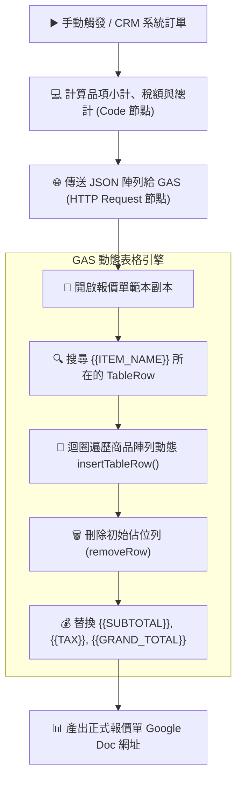

# 📜 Google Apps Script (GAS) 整合
## 範例 3：動態多列報價單與收據生成（表格動態擴充與金額結算）

### 📚 工作流程說明

在商業請款與估價流程中，每張訂單的商品品項數量都不固定（可能只有 1 樣，也可能有 20 樣），傳統固定格式範本無法靈活適應。

本範例展示：
1. 在 Google Docs 建立具備表格結構的標準報價單範本。
2. n8n 透過 **Code 節點** 動態計算各項目的「小計（Subtotal）」、5% 營業稅（Tax）與「含稅總計（Grand Total）」。
3. GAS 自動辨識表格中的佔位列，依據 n8n 傳來的商品數量**動態插入新列**，填入品名、數量、單價與金額，並在最後自動刪除原始佔位列，產出整齊專業的報價單。

---

### 流程架構圖



---

### 工作流程樣版與程式碼下載

- [📥 n8n 工作流程樣版 (03_gas_dynamic_table_invoice.json)](./03_gas_dynamic_table_invoice.json)
- [📜 Google Apps Script 原始碼 (Code.gs)](./Code.gs)

---

## 🛠️ Google Docs 表格範本設計指南

請在您的 Google 文件中插入一個 4 欄表格：

```text
┌──────────────────────────────────────────────────────────────┐
│ 報價單編號：{{QUOTATION_NO}}           報價日期：{{DATE}}   │
│ 客戶名稱：{{CLIENT_NAME}}             統一編號：{{CLIENT_TAX_ID}} │
├───────────────────────────────┬──────┬──────────┬────────────┤
│ 品名與規格說明                │ 數量 │   單價   │    小計    │
├───────────────────────────────┼──────┼──────────┼────────────┤
│ {{ITEM_NAME}}                 │{{QTY}}│{{PRICE}} │{{SUBTOTAL}}│
├───────────────────────────────┴──────┴──────────┼────────────┤
│ 未稅小計                                        │ {{SUBTOTAL}}│
│ 營業稅 (5%)                                     │ {{TAX}}    │
│ 應付總金額 (含稅)                               │ {{GRAND_TOTAL}} │
└─────────────────────────────────────────────────┴────────────┘
```

---

#### 📋 節點詳細說明

1. **📝 流程說明（Sticky Note）**
   - **功能**：介紹 GAS `insertTableRow()` 與 `appendTableCell()` 動態渲染技術。

2. **💻 計算報價單品項與金額（Code Node）**
   - **功能**：使用 JavaScript 計算各列金額，格式化千分位與貨幣符號，並加總未稅與含稅總額。

3. **🌐 呼叫 GAS 動態產生多列報價單（HTTP Request Node）**
   - **Method**：`POST`
   - **傳送格式**：包含 `items` 陣列與各類金額字串。

---

#### 🎯 學習重點

- **表格節點遍歷模型**：理解 Google Docs DOM 樹狀結構（`Body ➔ Table ➔ TableRow ➔ TableCell ➔ Paragraph`）。
- **乾淨刪除佔位列**：動態插入完成後，務必呼叫 `table.removeRow(rowIndex)` 移除模板行，讓版面整齊無破綻。

---

<details>
<summary>🤖 <strong>AI 賦能延伸實作（附 Prompt 提詞）</strong></summary>

> 💡 **任務目標**：透過 MCP 連線，讓 AI 增加多幣別匯率自動折算（USD / TWD / JPY）。

**可直接複製給 AI 的 Prompt 提詞**：
```text
請幫我在「動態多列報價單」工作流程中加入匯率即時折算：
1. 在 Code 節點前串接 HTTP Request 節點向公開匯率 API（如 open.er-api.com）取得 USD 對 TWD 即時匯率。
2. 在 Code 節點中將外幣報價換算為等值新台幣。
3. 輸出包含 currency, exchangeRate 與 usdTotal 欄位，並更新報價單備註。
請幫我配置好匯率 API 請求與計算程式碼！
```
</details>
