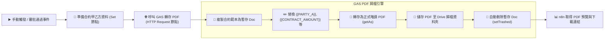

# 📜 Google Apps Script (GAS) 整合
## 範例 4：企業合約與證書生成 PDF 與雲端歸檔（不可竄改與自動清潔）

### 📚 工作流程說明

對於具備法律效力或正式頒發的文件（例如：保密協議 NDA、採購合約、結業證書），通常不能以可編輯的 Google Docs 交付，而必須轉為**唯讀且排版鎖定的 PDF 檔案**。此外，若每次套版都殘留 Google Doc 副本，會造成企業雲端硬碟雜亂。

本範例展示：
1. n8n 傳送合約甲乙方名稱、統編、有效期限與合約金額。
2. GAS 複製合約範本、替換文字佔位符後，自動將文件轉為 **`application/pdf`** 格式。
3. 將正式 PDF 存入指定的 Google Drive 歸檔資料夾，並**自動將暫存的 Google Doc 移至垃圾桶**，保持雲端空間整潔。
4. n8n 取得 PDF 下載連結與預覽網址。

---

### 流程架構圖



---

### 工作流程樣版與程式碼下載

- [📥 n8n 工作流程樣版 (04_gas_contract_pdf_drive.json)](./04_gas_contract_pdf_drive.json)
- [📜 Google Apps Script 原始碼 (Code.gs)](./Code.gs)

---

## 🛠️ Google Docs 合約範本文字設計

在 Google Docs 中建立範本：

```text
┌──────────────────────────────────────────────────────────────┐
│                    【企業技術服務合作合約書】                │
│                                                              │
│  合約編號：{{CONTRACT_NO}}                                  │
│  立合約書人：                                                │
│  甲方：{{PARTY_A}}（統一編號：{{PARTY_A_TAX_ID}}）           │
│  乙方：{{PARTY_B}}（統一編號：{{PARTY_B_TAX_ID}}）           │
│                                                              │
│  第一條 合約期間：自 {{EFFECTIVE_DATE}} 起至 {{EXPIRY_DATE}} 止 │
│  第二條 服務報酬：總金額計新台幣 {{CONTRACT_AMOUNT}} 整      │
│                                                              │
│  簽署日期：{{SIGN_DATE}}                                     │
└──────────────────────────────────────────────────────────────┘
```

---

#### 📋 節點詳細說明

1. **📝 流程說明（Sticky Note）**
   - **功能**：介紹 `getAs(MimeType.PDF)` 與 `setTrashed(true)` 垃圾清理機制。

2. **📝 準備合約甲乙方資料（Set Node）**
   - **contractNo**：`CTR-2026-8899`
   - **partyA / partyB**：企業名稱與統編
   - **effectiveDate / expiryDate**：合約期間
   - **contractAmount**：`$360,000`

3. **🌐 呼叫 GAS 產出合約 PDF（HTTP Request Node）**
   - **Method**：`POST`
   - **URL**：您的 GAS Web App 部署網址

---

#### 🎯 學習重點

- **`getAs(MimeType.PDF)` 核心轉換**：Google 伺服器端原生向量級別 PDF 轉檔，保證字型與排版 100% 忠實呈現。
- **暫存檔自動生命週期管理**：實踐「建立暫存 ➔ 轉檔 ➔ 儲存成品 ➔ 刪除暫存」的企業軟體最佳實踐。

---

<details>
<summary>🤖 <strong>AI 賦能延伸實作（附 Prompt 提詞）</strong></summary>

> 💡 **任務目標**：透過 MCP 連線，讓 AI 增加「結業學員證書」自訂學員姓名與證書編號條碼。

**可直接複製給 AI 的 Prompt 提詞**：
```text
請幫我將合約流程改造成「學員結業證書自動生成 PDF」：
1. 接收學員姓名 studentName, 課程名稱 courseTitle, 完課日期 completionDate, 證書字號 certId。
2. 替換 Google Docs 證書範本中的佔位符，並自動生成橫式 (Landscape) 高畫質 PDF。
3. 將產出的證書儲存在 Google Drive 的「2026結業證書」資料夾中。
請提供修改後的 Code.gs 與 n8n 工作流配置！
```
</details>
