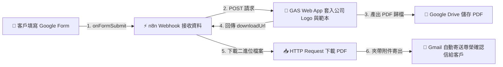

# 📜 Google Apps Script (GAS) 整合
## 範例 5：Google 表單提交 ➔ 自動生成客製 PDF ➔ Gmail 寄送（雙向全自動化閉環）

### 📚 工作流程說明

這是結合 Google Workspace、GAS 與 n8n 最具商業價值的旗艦綜合應用：
1. **外部觸發（Inbound）**：客戶在 Google 表單填寫諮詢或預約服務，GAS 的 `onFormSubmit` 觸發器自動將表單回答透過 Webhook 即時送達 n8n。
2. **客製套版與 PDF 轉檔（Outbound）**：n8n 呼叫 GAS Web App，將填寫資料套入具備**企業 Logo**、**公司專屬排版**與**官方印鑑**的公版範本，並轉存為高解析度 PDF。
3. **二進位檔案下載與寄發**：n8n 下載該 PDF 檔案二進位資料，透過 **Gmail 節點** 將精美確認信與 PDF 附件自動發送至客戶信箱，打造 100% 零人工介入的自動化商業體驗！

---

### 流程架構圖



---

### 工作流程樣版與程式碼下載

- [📥 n8n 工作流程樣版 (05_gas_form_trigger_email_loop.json)](./05_gas_form_trigger_email_loop.json)
- [📜 Google Apps Script 原始碼 (Code.gs)](./Code.gs)

---

## 🛠️ 雙向串接建置步驟

### 步驟 1：在 Google 表單綁定 `onFormSubmit`
1. 開啟您的 Google 表單，點選右上角三個點 ➔ **指令碼編輯器 (Apps Script)**。
2. 貼上 [`Code.gs`](./Code.gs) 中的第一部分程式碼，並將 `n8nWebhookUrl` 改為您的 n8n Webhook 正式網址。
3. 點選左側鬧鐘圖示 **觸發條件 (Triggers)** ➔ **新增觸發條件**：
   - 活動來源：**來自試算表 (From spreadsheet)** 或 **來自表單 (From form)**
   - 活動類型：**提交表單時 (On form submit)**
4. 儲存並授權。

### 步驟 2：部署 PDF 生成 Web App
1. 依據「範例 1~4」的方式將第二部分的 `doPost(e)` 部署為網頁應用程式（Web app，權限：任何人）。
2. 在 n8n 的「呼叫 GAS 生成公司專屬 PDF」節點中貼上該 Web App URL。

---

#### 📋 節點詳細說明

1. **⚡ 接收 Google Form 提交（Webhook Node）**
   - **Path**：`google-form-submission`
   - **HTTP Method**：`POST`

2. **🏢 呼叫 GAS 生成公司專屬 PDF（HTTP Request Node）**
   - **Method**：`POST`
   - **功能**：呼叫 GAS 產出 PDF 並取得 `downloadUrl`。

3. **📥 下載 PDF 二進位檔案（HTTP Request Node）**
   - **URL**：`={{ $json.downloadUrl }}`
   - **Response Format**：`File` (Binary)

4. **📧 Gmail 自動寄發 PDF 附件（Gmail Node）**
   - **Send To**：`={{ $('接收 Google Form 提交').item.json.body.customerEmail }}`
   - **Attachments**：指定二進位屬性 `data`，將 PDF 作為附件寄出。

---

#### 🎯 學習重點

- **Google Workspace 雙向通訊閉環**：完全融合「Google Form (事件來源) ➔ n8n (自動化大腦) ➔ GAS (Google 文件深度處理) ➔ Gmail (用戶交付)」的現代企業架構。
- **無伺服器架構 (Serverless)**：完全不用自建伺服器或購買轉檔軟體，全依賴 Google 雲端與 n8n 達成高可靠性。

---

<details>
<summary>🤖 <strong>AI 賦能延伸實作（附 Prompt 提詞）</strong></summary>

> 💡 **任務目標**：透過 MCP 連線，讓 AI 在寄出 Email 的同時，同步發送 Telegram 訊息通知內部業務主管有新客戶預約。

**可直接複製給 AI 的 Prompt 提詞**：
```text
請幫我在「Google 表單閉環」工作流程中加入業務主管 Telegram 即時推播：
1. 在「下載 PDF 二進位檔案」節點後，平行連接一個 Telegram 節點。
2. 發送訊息給業務主管群組，內容包含客戶姓名、Email、預約方案、備註需求與 Google Drive PDF 檢視連結。
3. 保持原本 Gmail 節點正常寄送確認信給客戶。
請幫我配置好 Telegram 節點與平行連線！
```
</details>
