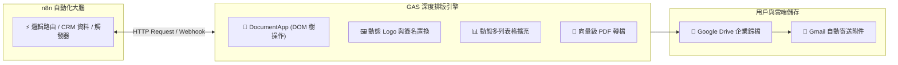

# 📜 Google Apps Script (GAS) 整合實作（企業自訂範本與自動化）

歡迎來到 **n8n 與 Google Apps Script (GAS) 整合實戰教學**！

在企業日常營運中，標準化的 Google 節點雖然能完成大部分試算表讀寫，但當面臨**「完全自訂公司格式的公文」**、**「動態替換企業專屬 Logo」**、**「不固定行數的商品報價單動態表格」**或**「不可竄改的正式 PDF 合約與證書」**時，**Google Apps Script (GAS)** 搭配 **Placeholder（佔位符）範本** 就是最靈活且完全免費的終極武器！

> 💡 **AI 協作時代學習法**：在完成基礎節點設定並透過 MCP 連線 AI（Gemini、ChatGPT 或 Claude）後，您可以直接複製各範例中的 **「AI 賦能延伸實作」** 折疊區塊（`<details>`）內的 Prompt 提詞，由 AI 助理替您在畫布上全自動建構與擴充進階邏輯！

---

## 📌 為什麼需要 n8n + GAS 雙劍合璧？



1. **完全自訂品牌 CI/VI**：使用熟悉的 Google Docs 設計版面，自由擺放公司 Logo（`{{COMPANY_LOGO}}`）、字型、顏色、頁首頁尾與官方印鑑。
2. **動態多列表格自由擴充**：支援任意筆數的商品明細（1 筆或 100 筆自動增列），免去繁瑣的排版調整。
3. **原生高品質 PDF 轉換**：Google 雲端伺服器原生轉檔，中文不缺字、不跑版，自動刪除中間暫存檔保持雲端乾淨。
4. **完全免費無額外軟體授權**：直接使用 Google 帳號自帶的雲端運算資源，零伺服器維護成本。

---

## 🛠️ GAS 前置部署與連線要點

n8n 與 GAS 的整合透過 **Web App API** 與 **Webhook** 進行雙向通訊：

1. **部署為 Web App**：在 Google Apps Script 編輯器點選「部署」➔「新增部署」➔「網頁應用程式」，將存取權限設為「任何人 (Anyone)」。
2. **接收端 `doPost(e)`**：GAS 透過 `e.postData.contents` 解析 n8n 傳來的 JSON 參數。
3. **回傳 JSON 規範**：GAS 使用 `ContentService.createTextOutput(JSON.stringify(res)).setMimeType(ContentService.MimeType.JSON)` 回傳結果給 n8n。

---

## 📚 實作範例導覽（由淺至深）

本教學規劃了五個由淺至深、涵蓋企業各類文件場景的實作範例：

---

### 1. [範例 1：GAS 基礎文字佔位符替換（Google Docs 自動套版）](./01_基礎文字佔位符替換/README.md)

**難度**：入門 🟢 ｜ **核心技術**：GAS `replaceText()` + n8n HTTP Request

學習如何在 Google Docs 建立含有 `{{CUSTOMER_NAME}}`、`{{COMPANY_NAME}}` 的範本，並由 n8n 透過 HTTP POST 呼叫 GAS 自動複製副本、替換佔位符並回傳文件連結。

**學習重點**：
- GAS Web App 部署流程與授權
- 正則表達式佔位符跳脫（`\\{\\{KEY\\}\\}`）
- `makeCopy` 保護原始範本機制

- **附帶資源**：[`01_gas_text_placeholder.json`](./01_基礎文字佔位符替換/01_gas_text_placeholder.json)、[`Code.gs`](./01_基礎文字佔位符替換/Code.gs)

<details>
<summary>🤖 <strong>AI 賦能延伸實作（附 Prompt 提詞）</strong></summary>

> 💡 **任務目標**：透過 MCP 連線，讓 AI 增加多欄位動態轉換（如電話、職稱、聯絡地址）。

**可直接複製給 AI 的 Prompt 提詞**：
```text
請幫我在「GAS 基礎文字佔位符」流程中擴充欄位：
1. 在 Set 節點中加入 phone, title, address 三個欄位。
2. 更新 HTTP Request 的 JSON Body，傳送這三個新欄位給 GAS。
3. 幫我修改 Code.gs 中的 replaceText 邏輯，支援 {{PHONE}}, {{TITLE}}, {{ADDRESS}} 佔位符替換。
請提供修改後的節點設定與 GAS 程式碼！
```
</details>

---

### 2. [範例 2：公司專屬 Logo 與品牌套版（企業自訂 CI/VI 格式）](./02_公司專屬Logo與品牌套版/README.md)

**難度**：初級 🟢 ｜ **核心技術**：GAS `UrlFetchApp` + `insertInlineImage()`

在 Google Docs 頁首或內文建立 `{{COMPANY_LOGO}}` 圖片佔位符，GAS 自動自圖檔 URL 下載圖片並內嵌為標準尺寸 Logo，同時套入統編、品牌標語與聯絡資訊。

**學習重點**：
- GAS 圖片下載與 Blob 轉換
- 動態定位段落並置換實體圖片
- 保持企業品牌視覺一致性

- **附帶資源**：[`02_gas_logo_branding.json`](./02_公司專屬Logo與品牌套版/02_gas_logo_branding.json)、[`Code.gs`](./02_公司專屬Logo與品牌套版/Code.gs)

<details>
<summary>🤖 <strong>AI 賦能延伸實作（附 Prompt 提詞）</strong></summary>

> 💡 **任務目標**：透過 MCP 連線，讓 AI 增加主管電子簽名檔圖片置換。

**可直接複製給 AI 的 Prompt 提詞**：
```text
請幫我在「公司專屬 Logo 套版」工作流程中加入「主管電子簽名檔」圖片置換：
1. 在 n8n Set 節點中加入 signatureUrl 欄位。
2. 修改 Code.gs 腳本，搜尋文件中的 {{MANAGER_SIGNATURE}} 佔位符。
3. 下載主管簽名透明底圖並插入文件底部簽署欄位（寬度設為 120px，高度設為 40px）。
請提供完整的 Code.gs 程式碼與 n8n 欄位配置！
```
</details>

---

### 3. [範例 3：動態多列報價單與收據生成（表格動態擴充與金額結算）](./03_動態多列報價單與收據生成/README.md)

**難度**：中級 🟡 ｜ **核心技術**：GAS `insertTableRow()` + n8n Code 運算

解決品項數量不固定的痛點！在 Google Docs 設計報價單表格，n8n 計算各項小計、稅金與總額後傳入，GAS 自動在表格中插入對應數量的新列並清除佔位行。

**學習重點**：
- Google Docs DOM 表格結構操作
- 動態陣列迴圈新增 `insertTableRow`
- 自動計算千分位格式化與營業稅加總

- **附帶資源**：[`03_gas_dynamic_table_invoice.json`](./03_動態多列報價單與收據生成/03_gas_dynamic_table_invoice.json)、[`Code.gs`](./03_動態多列報價單與收據生成/Code.gs)

<details>
<summary>🤖 <strong>AI 賦能延伸實作（附 Prompt 提詞）</strong></summary>

> 💡 **任務目標**：透過 MCP 連線，讓 AI 增加多幣別匯率即時折算。

**可直接複製給 AI 的 Prompt 提詞**：
```text
請幫我在「動態多列報價單」工作流程中加入匯率即時折算：
1. 在 Code 節點前串接 HTTP Request 節點向公開匯率 API 取得 USD 對 TWD 即時匯率。
2. 在 Code 節點中將外幣報價換算為等值新台幣。
3. 輸出包含 currency, exchangeRate 與 usdTotal 欄位，並更新報價單備註。
請幫我配置好匯率 API 請求與計算程式碼！
```
</details>

---

### 4. [範例 4：企業合約與證書生成 PDF 與雲端歸檔（不可竄改與自動清潔）](./04_企業合約證書生成PDF與雲端歸檔/README.md)

**難度**：中高級 🟡 ｜ **核心技術**：GAS `getAs(MimeType.PDF)` + `setTrashed()`

針對具備法律效力的合約書與證書，GAS 在套版完成後自動將 Google Doc 轉存為唯讀 PDF 檔案存入 Google Drive 歸檔資料夾，並自動刪除中間暫存 Doc 保持雲端整潔。

**學習重點**：
- 伺服器端原生向量級 PDF 轉檔
- 暫存檔自動生命週期管理（防止硬碟堆積雜檔）
- 產出公開唯讀下載與預覽連結

- **附帶資源**：[`04_gas_contract_pdf_drive.json`](./04_企業合約證書生成PDF與雲端歸檔/04_gas_contract_pdf_drive.json)、[`Code.gs`](./04_企業合約證書生成PDF與雲端歸檔/Code.gs)

<details>
<summary>🤖 <strong>AI 賦能延伸實作（附 Prompt 提詞）</strong></summary>

> 💡 **任務目標**：透過 MCP 連線，讓 AI 將合約流程改造成學員結業證書自動生成。

**可直接複製給 AI 的 Prompt 提詞**：
```text
請幫我將合約流程改造成「學員結業證書自動生成 PDF」：
1. 接收學員姓名 studentName, 課程名稱 courseTitle, 完課日期 completionDate, 證書字號 certId。
2. 替換 Google Docs 證書範本中的佔位符，並自動生成橫式 (Landscape) 高畫質 PDF。
3. 將產出的證書儲存在 Google Drive 的「2026結業證書」資料夾中。
請提供修改後的 Code.gs 與 n8n 工作流配置！
```
</details>

---

### 5. [範例 5：Google 表單提交 ➔ 自動生成客製 PDF ➔ Gmail 寄送（雙向全自動化閉環）](./05_表單提交自動生成客製PDF並寄信/README.md)

**難度**：進階旗艦 🔴 ｜ **核心技術**：GAS `onFormSubmit` + Webhook + Gmail 附件

最完整的企業自動化閉環！客戶填寫 Google 表單 ➔ GAS 觸發 n8n ➔ 呼叫 GAS 套用公司 Logo 與格式產出專屬 PDF ➔ n8n 下載附件並透過 Gmail 即時寄給客戶。

**學習重點**：
- Google 表單 `onFormSubmit` 事件觸發器
- 雙向 Webhook 與 API 閉環架構
- Gmail 節點發送二進位 PDF 檔案附件
- 100% 零人工介入的現代企業營運模式

- **附帶資源**：[`05_gas_form_trigger_email_loop.json`](./05_表單提交自動生成客製PDF並寄信/05_gas_form_trigger_email_loop.json)、[`Code.gs`](./05_表單提交自動生成客製PDF並寄信/Code.gs)

<details>
<summary>🤖 <strong>AI 賦能延伸實作（附 Prompt 提詞）</strong></summary>

> 💡 **任務目標**：透過 MCP 連線，讓 AI 在寄信同時發送 Telegram 訊息給業務主管。

**可直接複製給 AI 的 Prompt 提詞**：
```text
請幫我在「Google 表單閉環」工作流程中加入業務主管 Telegram 即時推播：
1. 在「下載 PDF 二進位檔案」節點後，平行連接一個 Telegram 節點。
2. 發送訊息給業務主管群組，內容包含客戶姓名、Email、預約方案、備註需求與 Google Drive PDF 檢視連結。
3. 保持原本 Gmail 節點正常寄送確認信給客戶。
請幫我配置好 Telegram 節點與平行連線！
```
</details>

---

## 🎯 學習路徑建議

```
[文字基礎]
1. 基礎文字佔位符替換 ➔ 掌握 replaceText 與 Google Doc 複製機制

[企業品牌]
2. 公司專屬 Logo 與品牌套版 ➔ 掌握圖片置換與 CI/VI 規範
3. 動態多列報價單與收據 ➔ 掌握 Table 動態增列與財務金額計算

[正式交付與閉環]
4. 企業合約生成 PDF 與歸檔 ➔ 掌握 PDF 轉檔與暫存垃圾清理
5. 表單提交 ➔ PDF ➔ Gmail 閉環 ➔ 掌握雙向事件驅動與客戶交付
```

---

## 📚 相關資源

- [Google Workspace API 服務教學](../Google_Cloud_api服務/README.md)
- [Google Apps Script 官方文檔](https://developers.google.com/apps-script)
- [DocumentApp 官方 API 手冊](https://developers.google.com/apps-script/reference/document/document-app)
- [Webhook 實作由淺至深教學](../webhook實作/README.md)
- [💬 通訊軟體整合 (LINE & Telegram)](../通訊軟體整合/README.md)