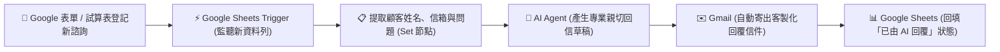

# 整合 Google 服務
## 範例 8：Google 試算表整合 AI 智慧客服與自動郵件回覆（AI + Google Workspace）

### 📚 工作流程說明

這個 n8n 工作流程示範如何將 **Google Workspace（Google Sheets + Gmail）** 與 **大型語言模型（LLM）** 深度整合，打造企業級的「**全自動 AI 智慧客服回信與工單追蹤系統**」。

當使用者在 Google 表單填寫諮詢、或由內部人員在 Google 試算表中登記新顧客提問時，工作流程會自動觸發並由 **AI Agent** 智慧研讀問題意圖，生成專業親切且結構化的繁體中文 Email 回覆草稿，接著透過 **Gmail 節點** 直接寄送給顧客，最後將處理時間、回信摘要與「已由 AI 回覆」狀態即時**回填至原 Google 試算表**，實現端到端、零人工介入的智慧客服閉環！

---

### 流程架構圖



---

### 工作流程樣版下載

- [📥 Google 試算表整合 AI 智慧客服樣版 (google_sheets_ai_customer_service.json)](./google_sheets_ai_customer_service.json)

---

#### 📋 節點詳細說明

1. **📝 流程說明（Sticky Note）**
   - **功能**：說明 Google Sheets 觸發、AI 語意生成、Gmail 發信與試算表狀態回填的四大核心階段。

2. **⚡ Google Sheets 新增諮詢觸發器（Google Sheets Trigger Node）**
   - **功能**：定時輪詢（Poll）指定的 Google 試算表，當有新的一列資料（Row）寫入時自動啟動工作流程。
   - **設定要點**：
     - **Document**：選擇您的諮詢登記試算表。
     - **Sheet**：選擇工作表分頁（例如：`客戶諮詢登記表`）。
     - **Poll Times**：每分鐘（Every Minute）檢查一次。

3. **📋 提取諮詢資料（Edit Fields / Set Node）**
   - **功能**：提取並格式化關鍵欄位：
     - `customerName`：顧客姓名
     - `customerEmail`：顧客電子信箱
     - `inquirySubject`：諮詢主題
     - `inquiryContent`：問題詳細內容
     - `rowNumber`：當前資料列數（用於最後精準更新該列）

4. **🤖 AI 智慧客服代理（AI Agent Node）**
   - **功能**：調用大語言模型（如 OpenAI `gpt-4o-mini`、Gemini 或本地 Ollama）進行郵件草稿生成。
   - **System Prompt 設定**：
     ```text
     你是一位專業的 Google Workspace 智慧客服專家。請使用流暢優雅的台灣繁體中文撰寫郵件回覆，排版需結構化，適度使用條列式重點。
     ```

5. **✉️ Gmail 自動寄出回信（Gmail Node）**
   - **功能**：透過 Gmail API 發送客製化郵件給顧客。
   - **設定要點**：
     - **To**：`={{ $('提取諮詢資料').item.json.customerEmail }}`
     - **Subject**：`=【客服回覆】Re: {{ $('提取諮詢資料').item.json.inquirySubject }}`
     - **Email Type**：`HTML`
     - **Message**：包含 AI 生成的解答內文與官方簽名檔。

6. **📊 Google Sheets 回填處理狀態（Google Sheets Node）**
   - **功能**：使用 `Update` 操作，根據 `row_number` 精準更新該列的狀態欄位：
     - `處理狀態`：`已由 AI 回覆`
     - `AI回信摘要`：截取前 100 字摘要存檔
     - `回覆時間`：`{{ $now.format('yyyy-MM-dd HH:mm:ss') }}`

---

#### 🎯 學習重點

- **Google Workspace 跨服務閉環**：掌握 Sheets（資料源）➔ AI（智慧大腦）➔ Gmail（通訊）➔ Sheets（存檔追蹤）的完整自動化。
- **Trigger 與 Action 節點組合**：理解如何使用 Google Sheets Trigger 監聽新資料，並在流程最後以 Update 模式回寫資料列。
- **AI 客服提示詞工程**：掌握撰寫禮貌、專業且具備條理的商業 Email 提示詞。
- **OAuth 2.0 憑證複用**：體驗同一 Google 帳號授權管理 Sheets 與 Gmail 多項服務。

---

#### 💡 實際應用場景

- **電商售前售後諮詢**：顧客在官網表單詢問規格或運送進度，AI 自動於 1 分鐘內回覆標準解答。
- **研習課程報名與諮詢**：自動審閱學員提問並發送專屬報到指引。
- **內部 IT / HR 服務台 (Help Desk)**：員工填表申請設備或諮詢規章，AI 自動回覆並記錄工單處理狀態。

---

#### ⚙️ 設定步驟

1. **準備 Google 試算表**：
   - 建立一份名為 `客戶諮詢登記表` 的試算表，首行標題欄設定為：`顧客姓名`、`電子信箱`、`諮詢主題`、`問題內容`、`處理狀態`、`AI回信摘要`、`回覆時間`。
2. **在 n8n 建立憑證**：
   - 設定 `Google Sheets OAuth2 API` 憑證與 `Gmail OAuth2` 憑證（參考 [Google Cloud 設定指南](../../google_cloud設定/README.md)）。
   - 設定 `OpenAI API`（或 Gemini）憑證。
3. **匯入工作流程**：下載並將 [`google_sheets_ai_customer_service.json`](./google_sheets_ai_customer_service.json) 匯入至 n8n。
4. **綁定試算表與憑證**：
   - 在「Google Sheets 新增諮詢觸發器」與「Google Sheets 回填處理狀態」節點選取您建立好的試算表。
5. **啟動工作流測試**：將工作流程設為 **Active**，在試算表手動新增一列測試資料（填入您自己的 Email），靜候 1 分鐘，觀察 Gmail 收信與試算表欄位自動更新！
