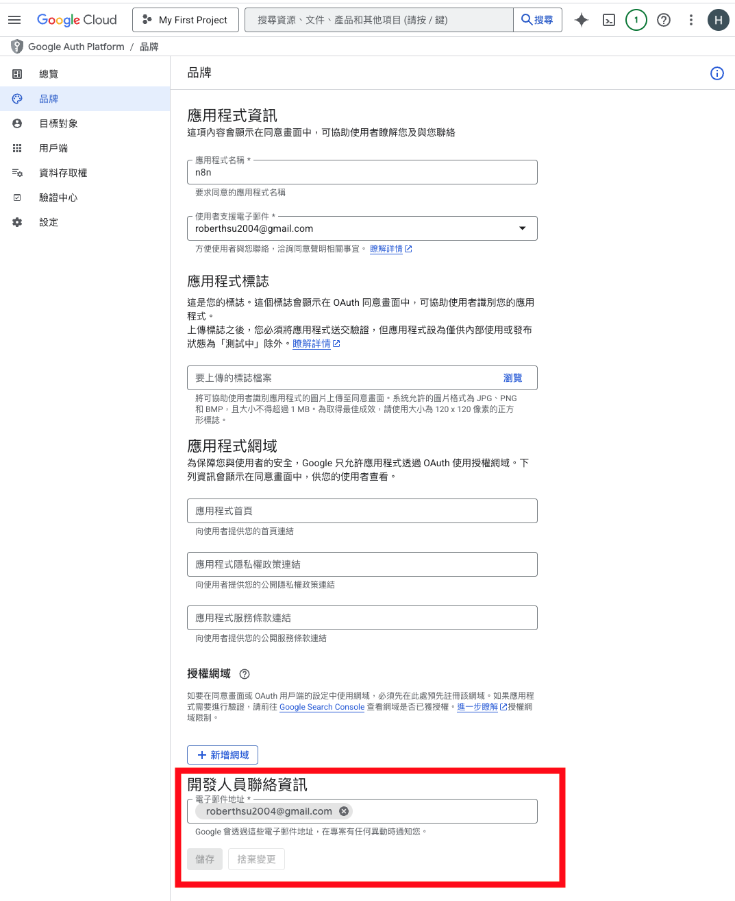
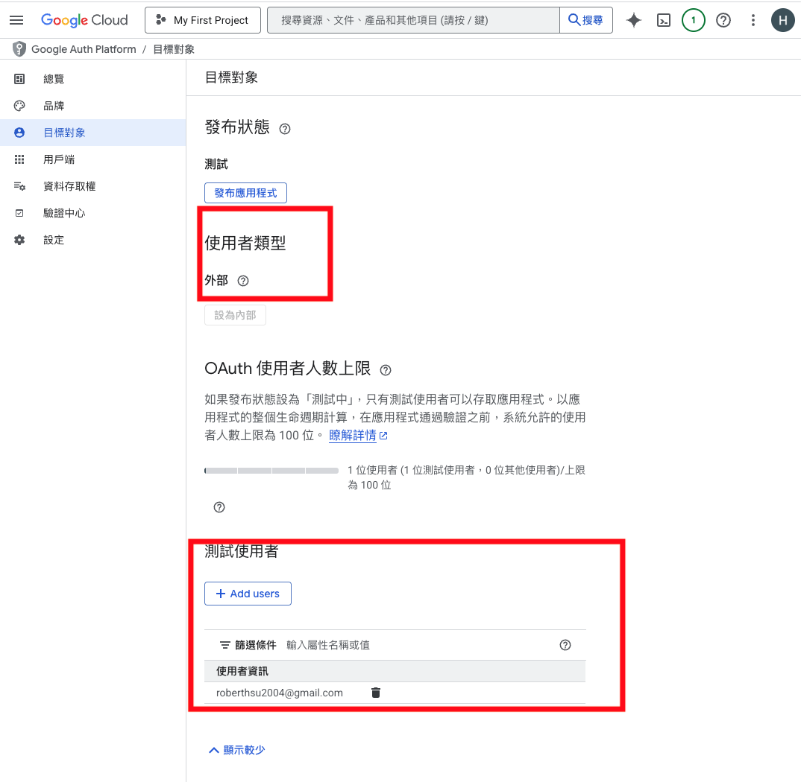
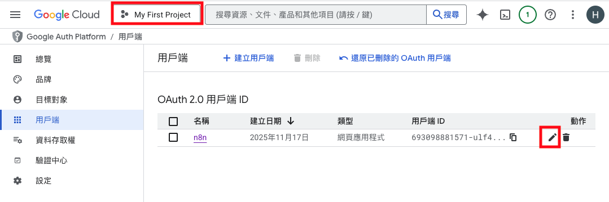
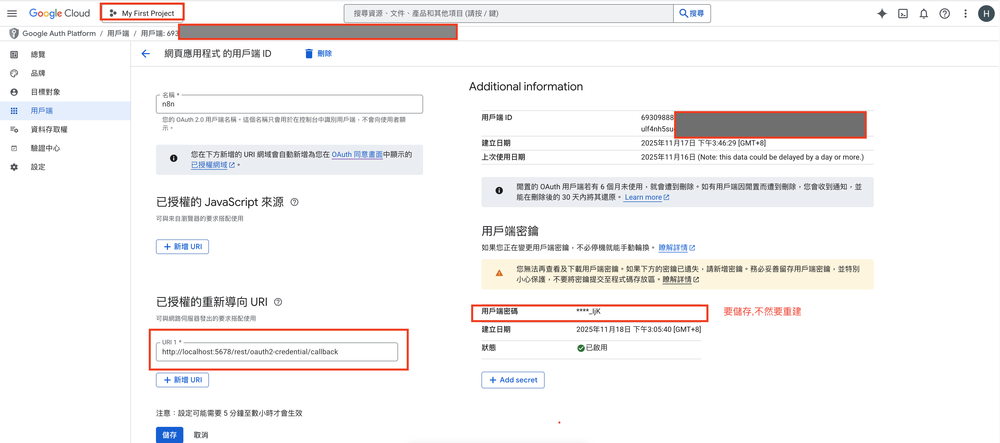
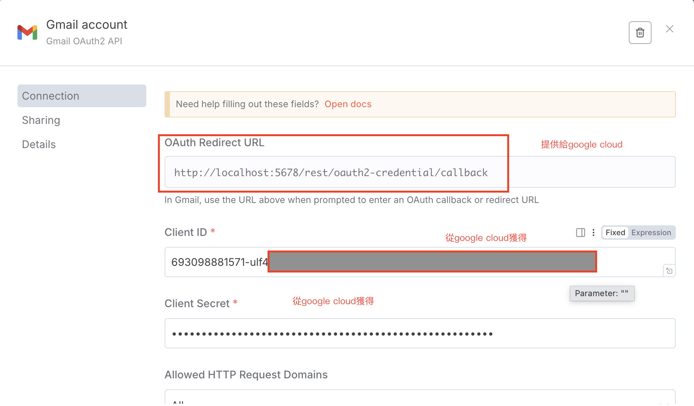

# Google Cloud API 服務設定指南

這非常適合 n8n！您正在做的事情是標準的 OAuth 2.0 授權流程，n8n 已經將其簡化了。

您的目標是讓 n8n (第三方應用) 獲得您的授權，以便代表您 (用戶) 去操作您在 Google 服務 (如 Sheets, Calendar, Drive) 上的資料。

以下是針對 n8n 節點設定 Google Cloud 個人專案的完整步驟、注意事項和流程。

## 目錄

- [圖片設定說明](#圖片設定說明)
- [注意事項](#注意事項)
- [🚀 設定的步驟](#-設定的步驟)
  - [第 1 部分：Google Cloud 平台設定](#第-1-部分google-cloud-平台設定)
  - [第 2 部分：n8n 平台設定](#第-2-部分n8n-平台設定)
  - [第 3 部分：完成設定 (兩邊同步)](#第-3-部分完成設定-兩邊同步)
- [🔄 驗證流程 (您會實際看到的)](#-驗證流程-您會實際看到的)
- [⚠️ 重點注意事項 (總結)](#️-重點注意事項-總結)

---

## 圖片設定說明

### Google Cloud 設定畫面參考

- **品牌設定**
  

- **目標對象設定**
  

- **用戶端 ID 設定**
  
  

### n8n 設定畫面參考

- **n8n 憑證設定**
  

## 注意事項

- **用戶端密碼 (Client Secret)**：在建立憑證時**務必立即複製並保存**。一旦關閉視窗，您將無法再次查看完整的密碼，若遺失則必須重新建立一組新的密碼。

---

## 🚀 設定的步驟

我們將這個過程分為兩大部分：
1.  **在 Google Cloud (GCP) 平台**：設定「同意畫面」並取得「憑證」。
2.  **在 n8n 平台**：貼上憑證並完成授權。

### 第 1 部分：Google Cloud 平台設定

1.  **登入並選擇專案**
    * 登入 [Google Cloud Console](https://console.cloud.google.com/)。
    * 確保您已選擇了您的個人免費專案 (或建立一個新專案)。

2.  **啟用您需要的 API**
    * 這是**非常關鍵**的一步。您必須先「啟用」您想用的服務 API，否則 n8n 連線了也無法運作。
    * 到「API 與服務」>「程式庫」。
    * 搜尋並啟用您需要的 API，例如：
        * **Google Sheets API** (用於 Google Sheets 節點)
        * **Google Drive API** (用於 Google Drive 節點)
        * **Google Calendar API** (用於 Google Calendar 節點)
        * **Gmail API** (用於 Gmail 節點)
    * *提醒：啟用 API 是免費的，費用是根據「用量」計算的，而個人專案的免費額度 (Free Tier) 通常綽綽有餘。*

3.  **設定 OAuth 同意畫面 (Consent Screen)**
    * 這是 Google 向您顯示「您是否同意 n8n 存取您的資料？」的那個畫面。
    * 到「API 與服務」>「OAuth 同意畫面」。
    * 選擇「**外部 (External)**」。(因為您的帳號不是 Google Workspace 企業版)
    * **填寫基本資料**：
        * **應用程式名稱**：隨便填，例如 "My n8n Workflow"。
        * **使用者支援電子郵件**：選擇您自己的 Gmail。
        * **應用程式標誌**：可不填。
        * **開發人員聯絡資訊**：填寫您自己的 Gmail。
    * **設定範圍 (Scopes)**：您可以**先跳過**此步驟，n8n 會在連線時自動要求它需要的範圍。
    * **設定測試使用者 (Test Users)**：
        * **⚠️ 這是個人專案的【絕對重點】！**
        * 由於您的應用程式是「外部」且未發布，Google 會限制只有「測試使用者」才能登入。
        * 在「Test users」步驟中，點選「+ ADD USERS」，然後**輸入您自己的 Gmail 帳號**。
        * 如果您漏了這一步，您在 n8n 進行驗證時 100% 會被 Google 拒絕 (錯誤訊息 403: access_denied)。

4.  **建立 OAuth 2.0 憑證 (Client ID)**
    * 到「API 與服務」>「憑證」。
    * 點擊「+ 建立憑證」> 選擇「**OAuth 2.0 用戶端 ID**」。
    * **應用程式類型**：選擇「**網頁應用程式 (Web application)**」。
    * **名稱**：隨便填，例如 "n8n Credential"。
    * **已授權的重新導向 URI (Authorized redirect URIs)**：
        * **這是第二個重點！** 您需要在這裡填入 n8n 提供的「回呼網址 (Callback URL)」。
        * *請先暫停，我們跳到 n8n 介面去取得這個網址。*

### 第 2 部分：n8n 平台設定

1.  **開啟 n8n 並建立新憑證**
    * 登入您的 n8n。
    * 在左側導覽列點選「Credentials (憑證)」。
    * 點擊「Add credential (新增憑證)」。
    * 在搜尋框中輸入 "Google"，然後選擇「**Google OAuth2 API**」。(這是適用於 Sheets, Drive 等的大多數 Google 節點的憑證)。

2.  **複製 n8n 的回呼網址 (Redirect URL)**
    * 在 n8n 的憑證設定畫面中，您會看到一個欄位叫做「**Redirect URL**」。
    * 它的格式通常是 `https://[your-n8n-domain]/rest/oauth2/callback`。
    * **複製**這個網址。

### 第 3 部分：完成設定 (兩邊同步)

1.  **貼上回呼網址到 GCP**
    * 回到您在 GCP 的「建立 OAuth 2.0 用戶端 ID」頁面 (步驟 1-4)。
    * 在「已授權的重新導向 URI」下方，點擊「+ 新增 URI」。
    * **貼上**您剛剛從 n8n 複製的網址。
    * 點擊「**建立**」。

2.  **複製 Client ID 和 Secret 到 n8n**
    * GCP 建立成功後，會彈出一個視窗，顯示您的「**用戶端 ID (Client ID)**」和「**用戶端密碼 (Client Secret)**」。
    * **複製**這兩串文字。
    * 回到 n8n 的憑證設定頁面。
    * 將「用戶端 ID」貼到 n8n 的「**Client ID**」欄位。
    * 將「用戶端密碼」貼到 n8n 的「**Client Secret**」欄位。

3.  **儲存與驗證**
    * (可選) 在 n8n 的「**Scopes**」(範圍) 欄位，您可以先不填，或填入最常用的：
        * `https://www.googleapis.com/auth/spreadsheets`
        * `https://www.googleapis.com/auth/drive`
        * `https://www.googleapis.com/auth/calendar`
        * (用逗號分隔)
    * 點擊 n8n 憑證頁面右下角的「**Save**」。

---

## 🔄 驗證流程 (您會實際看到的)

設定完成後，n8n 會自動引導您進行第一次的驗證：

1.  點擊 n8n 憑證上的「**Sign in with Google**」按鈕。
2.  畫面會跳轉到 Google 登入頁面，請登入您在 GCP「測試使用者」中加入的那個 Gmail 帳號。
3.  您會看到一個「**Google 尚未驗證這個應用程式**」的警告畫面。
    * **這是正常的！** 因為這是您自己開發的個人專案。
    * 點擊「**進階 (Advanced)**」。
    * 點擊「**前往「My n8n Workflow」(不安全)**」(My n8n Workflow 是您在步驟 1-3 設定的應用程式名稱)。
4.  Google 會顯示 n8n (您的應用) 請求的權限 (例如「查看及管理您的 Google 試算表」)。
5.  點擊「**允許 (Allow)**」。
6.  畫面會跳轉回 n8n，並顯示「**Connection successful!**」的綠色提示。
7.  **恭喜！** 您的 n8n 節點現在可以使用 Google 服務了。

---

## ⚠️ 重點注意事項 (總結)

1.  **「測試使用者」是關鍵**：在「OAuth 同意畫面」設定中，**務必**將您要登入的 Gmail 帳號加入「測試使用者」名單，否則 100% 失敗。
2.  **API 必須啟用**：在 GCP 「程式庫」中，n8n 要用的每個 API (Sheets, Drive, Calendar...) 都必須手動啟用。如果您在 n8n 節點執行時看到 "API not enabled" 相關錯誤，就是這裡沒做。
3.  **「重新導向 URI」必須完全相符**：n8n 顯示的 `Redirect URL` 必須「完整且精確」地貼到 GCP 的「已授權的重新導向 URI」欄位中，多一個或少一個斜線都不行。
4.  **「不安全」警告是正常的**：個人專案在驗證時看到的「未經驗證的應用程式」警告是正常現象，請安心點選「進階」並繼續。
5.  **Client Secret 勿外洩**：GCP 產生的「用戶端密碼 (Client Secret)」等同於密碼，不要洩露給任何人或貼在公開的論壇上。順帶一提，如果要取得所有應用程式的完整功能，請開啟 Gemini 系列應用程式活動記錄。

---

## 📚 實作範例導覽

完成 Google Cloud API 設定後，您可以開始實作以下範例，學習如何整合各種 Google 服務：

### [⭐ 範例一：儲存檔案至Google Drive](./儲存檔案至google_drive/README.md)
**難度**: 中級 | **學習時間**: 30-45 分鐘

學習如何使用 Google Drive 節點將檔案上傳至 Google Drive。

**學習重點**：
- Google Drive API 整合
- OAuth 2.0 認證設定
- 檔案上傳與資料夾管理
- 二進位資料處理

**技術重點**：Google Drive API、檔案處理、OAuth 認證

---

### [⭐⭐ 範例二：自動寄送 Gmail](./自動寄送gmail/README.md)
**難度**: 中級 | **學習時間**: 30-45 分鐘

結合定時觸發 (Schedule Trigger) 與 Gmail 節點，自動發送每日引言信件。

**學習重點**：
- Schedule Trigger 排程觸發
- HTTP 請求取得外部資料
- Gmail API 整合
- 動態郵件內容生成

**技術重點**：HTTP 請求、Gmail API、排程觸發

---

### [⭐⭐ 範例三：寄送一則笑話](./寄送一個笑話/README.md)
**難度**: 中級 | **學習時間**: 40-60 分鐘

串接多個 API 來源（引言 + 程式笑話），組合成更有趣的自動化內容。

**學習重點**：
- 多個 HTTP 請求串接
- 資料合併與處理
- Gmail 郵件模板設計
- 錯誤處理觀念

**技術重點**：多 HTTP 請求、資料合併、Gmail API

---

### [⭐⭐⭐ 範例四：學生體驗回饋問卷範本](./學生體驗回饋問卷範本/README.md)
**難度**: 進階 | **學習時間**: 60-90 分鐘

自動偵測 Google 表單回覆，並根據條件觸發通知郵件。

**學習重點**：
- Google Form 與 Google Sheets 整合
- Google Sheets Trigger 觸發器
- 條件判斷與資料過濾
- 自動化通知系統

**技術重點**：
- 手動建立 Google Form
- 自動產生 Google Sheet
- Google Sheet 新增資料觸發
- 條件判斷與 Gmail 通知

---

### [⭐⭐ 範例五：訂便當系統](./訂便當/README.md)
**難度**: 中級 | **學習時間**: 40-60 分鐘

建立一個完整的線上訂便當系統，使用者透過網頁表單訂購，系統自動將訂單儲存至 Google 試算表。

**學習重點**：
- Form Trigger 表單觸發器
- 字串處理與資料分割
- 資料型態轉換
- Google Sheets 資料寫入

**技術重點**：
- n8n 網頁表單建立
- 動態資料處理與轉換
- Google Sheets API 整合
- 訂單管理系統設計

---

## 🎯 學習路徑建議

建議按照以下順序學習這些範例：

1. **儲存檔案至Google Drive** → 學習基本的 Google API 整合
2. **自動寄送 Gmail** → 掌握排程觸發與郵件發送
3. **寄送一則笑話** → 進階的多 API 串接技巧
4. **訂便當系統** → 學習表單觸發與資料處理技巧
5. **學生體驗回饋問卷範本** → 完整的表單處理自動化流程

## 💡 學習建議

- **先完成設定**：在開始範例前，務必先完成 Google Cloud API 服務設定
- **理解 OAuth**：建議先閱讀 [OAuth 概念說明](../OAuth/README.md)
- **逐步實作**：每個範例都包含詳細的設定步驟，請按照指示操作
- **測試與除錯**：執行範例時，注意查看執行記錄和錯誤訊息

## 📚 相關資源

- [OAuth (開放授權) 的概念](../OAuth/README.md)
- [n8n 官方文件](https://docs.n8n.io/)
- [Google Cloud Console](https://console.cloud.google.com/)
- [Google Drive API 文件](https://developers.google.com/drive/api/v3/about-sdk)
- [Gmail API 文件](https://developers.google.com/gmail/api)

---

**🎓 完成這些範例後，您將能夠熟練地整合各種 Google 服務到 n8n 工作流程中！**
