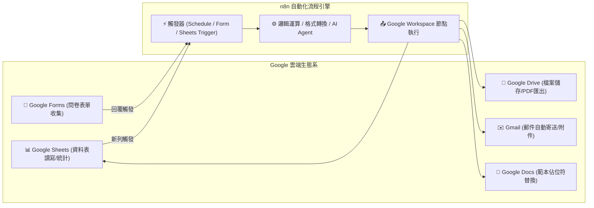

# 🔗 整合 Google 服務（Google Workspace 自動化實作）

歡迎來到 Google 雲端與 Google Workspace 自動化教學！Google 提供的雲端服務（包含 **Google Drive**、**Gmail**、**Google Sheets**、**Google Docs** 與 **Google 表單**）是現代企業與個人日常辦公最仰賴的核心工具。透過 n8n，您可以將這些原本獨立的應用程式串接成全自動的端到端商業工作流，實現自動備份、定時通訊、訂單資料歸檔、動態證書 PDF 生成乃至於 AI 智慧客服！

> 💡 **AI 協作時代學習法**：在完成基礎節點設定並透過 MCP 連線 AI（Gemini、ChatGPT 或 Claude）後，您可以直接複製各範例中的 **「AI 賦能延伸實作」** 折疊區塊（`<details>`）內的 Prompt 提詞，由 AI 助理替您在畫布上全自動建構與擴充進階邏輯！

---

## 📌 前置準備指南

在開始建置 Google 自動化工作流程前，您需要完成 Google Cloud Console 上的 OAuth 2.0 憑證設定並在 n8n 中成功授權：

> 🔑 **完整設定教學**：
> 1. [📱 Google Cloud API 服務設定指南（建立專案與 OAuth 2.0 憑證）](../google_cloud設定/README.md)
> 2. [🔐 OAuth 2.0 (開放授權) 核心概念解析](../OAuth/README.md)

---

## 🧭 Google Workspace 整合核心架構


```mermaid
flowchart LR
    subgraph Google_Workspace["Google 雲端生態系"]
        Drive["📁 Google Drive (檔案儲存/PDF匯出)"]
        Gmail["✉️ Gmail (郵件自動寄送/附件)"]
        Sheets["📊 Google Sheets (資料表讀寫/統計)"]
        Docs["📑 Google Docs (範本佔位符替換)"]
        Forms["📝 Google Forms (問卷表單收集)"]
    end

    subgraph n8n_Engine["n8n 自動化流程引擎"]
        Triggers["⚡ 觸發器 (Schedule / Form / Sheets Trigger)"]
        Process["⚙️ 邏輯運算 / 格式轉換 / AI Agent"]
        Actions["📤 Google Workspace 節點執行"]
    end

    Forms -->|回覆觸發| Triggers
    Sheets -->|新列觸發| Triggers
    Triggers --> Process
    Process --> Actions
    Actions --> Drive
    Actions --> Gmail
    Actions --> Sheets
    Actions --> Docs
```

---

## 📚 實作範例導覽（由淺至深）

本教學規劃了八個循序漸進、貼近真實辦公場景的實作範例：

---

### 1. [範例 1：自動備份檔案至 Google Drive](./儲存檔案至google_drive/README.md)

**難度**：入門 🟢 ｜ **核心服務**：Google Drive API

從政府開放資料平台下載最新 CSV 檔案，使用新版 Extract from File 節點解析並轉換為 Excel 格式，自動上傳至 Google Drive 指定資料夾備份。

**學習重點**：
- Google Drive API 整合與 OAuth 2.0 憑證綁定
- 二進位資料（Binary Data）下載與格式轉換
- 使用 Extract from File 與 Convert to File 節點
- 雲端硬碟檔案自動上傳與資料夾管理

- **附帶樣版**：[`儲存檔案至googe_drive.json`](./儲存檔案至google_drive/儲存檔案至googe_drive.json)

<details>
<summary>🤖 <strong>AI 賦能延伸實作（附 Prompt 提詞）</strong></summary>

> 💡 **任務目標**：透過 MCP 連線，讓 AI 在上傳完成後，自動將檔案公開分享連結複製並輸出至日誌。

**可直接複製給 AI 的 Prompt 提詞**：
```text
請幫我在目前的「儲存檔案至 Google Drive」工作流程後進行延伸：
1. 保持下載 CSV、轉換 Excel 並上傳至 Google Drive 的流程。
2. 在 Google Drive 節點後，接續新增一個 Google Drive 節點（Operation: Share），設定將上傳的檔案分享權限設為「知道連結的人皆可檢視」。
3. 串接 Set 節點，輸出包含 file_name, file_id, web_view_link 的摘要資訊。
請幫我建立相關節點與連線！
```
</details>

---

### 2. [範例 2：每日早晨 AI 晨報與 Gmail 自動發信](./自動寄送gmail/README.md)

**難度**：入門 🟢 ｜ **核心服務**：Gmail API

結合 Schedule Trigger 定時排程與 HTTP Request 抓取每日名言，組裝為高質感 HTML 晨報郵件並透過 Gmail 自動寄送至團隊信箱。

**學習重點**：
- Schedule Trigger 定時排程（如每天早上 08:30）
- 呼叫外部 API 取得每日隨機引言
- 動態 HTML 郵件模板設計與變數替換
- Gmail 節點發送郵件與授權配置

- **附帶樣版**：[`自動寄送gmail.json`](./自動寄送gmail/自動寄送gmail.json)

<details>
<summary>🤖 <strong>AI 賦能延伸實作（附 Prompt 提詞）</strong></summary>

> 💡 **任務目標**：透過 MCP 連線，讓 AI 結合大型語言模型（LLM）將英文名言翻譯為繁體中文，並附加工作啟發小語後再由 Gmail 寄出。

**可直接複製給 AI 的 Prompt 提詞**：
```text
請幫我將「自動寄送 Gmail」工作流程升級為「AI 晨報助理」：
1. 起點保留 Schedule Trigger（每天 08:30）與 HTTP Request 抓取引言。
2. 串接 AI Agent 節點，搭配 OpenAI 或 Gemini 模型，將英文名言翻譯為繁體中文，並產生一句 30 字的工作激勵小語。
3. 將 AI 翻譯與激勵小語排版為美觀的 HTML 郵件。
4. 透過 Gmail 節點寄送至指定信箱。
請幫我建立節點並配置好提示詞！
```
</details>

---

### 3. [範例 3：多來源 API 整合與幽默笑話電子報](./寄送一個笑話/README.md)

**難度**：初中級 🟡 ｜ **核心服務**：Gmail API + 多 API 串接

同時發送多個 HTTP 請求（名人名言 API + 程式工程師笑話 API），使用 JavaScript Code 節點進行多資料源合併，發送中英雙語幽默電子報。

**學習重點**：
- 多個 HTTP 請求並行串接與資料流聚合
- JavaScript Code 節點陣列合併與資料清洗
- 設計具備問答式排版（Setup & Punchline）的郵件介面
- 錯誤處理與 API 備援觀念

- **附帶樣版**：[`寄送一個笑話.json`](./寄送一個笑話/寄送一個笑話.json)

<details>
<summary>🤖 <strong>AI 賦能延伸實作（附 Prompt 提詞）</strong></summary>

> 💡 **任務目標**：透過 MCP 連線，讓 AI 為英文笑話自動翻譯中文並加上雙關語註解。

**可直接複製給 AI 的 Prompt 提詞**：
```text
請幫我在「寄送一個笑話」工作流程中加入 AI 幽默翻譯能力：
1. 抓取笑話 API 資料後，將英文笑話送入 AI Agent 節點。
2. 提示詞要求：將英文笑話翻譯為在地化的台灣繁體中文，若笑話包含程式雙關語梗，需附帶 20 字的梗點解說。
3. 將英文原文、中文翻譯與梗點解說排版為 HTML 卡片，透過 Gmail 發送。
請幫我配置好流程！
```
</details>

---

### 4. [範例 4：辦公室線上訂便當與 Google Sheets 自動歸檔](./訂便當/README.md)

**難度**：初中級 🟡 ｜ **核心服務**：Google Sheets API + Form Trigger

使用 n8n Form Trigger 快速建立線上便當訂購網頁，自動解析同仁訂購的主餐品項、數量與備註，並逐筆即時寫入 Google 試算表存檔。

**學習重點**：
- n8n Form Trigger 線上表單設計
- 字串分割（Split）與多品項資料型態轉換
- Google Sheets 節點（Append Row 逐筆追加寫入）
- 試算表欄位自動對應與防呆驗證

- **附帶樣版**：[`訂便當.json`](./訂便當/訂便當.json)

<details>
<summary>🤖 <strong>AI 賦能延伸實作（附 Prompt 提詞）</strong></summary>

> 💡 **任務目標**：透過 MCP 連線，讓 AI 在訂單寫入 Google Sheets 後，自動計算今日訂購總金額，並透過 LINE 或 Telegram 通知訂便當負責人。

**可直接複製給 AI 的 Prompt 提詞**：
```text
請幫我在「訂便當系統」工作流程後方擴充通知功能：
1. 在 Google Sheets 寫入訂單後，串接 Telegram 節點（或 LINE 節點）。
2. 發送通知：「🍱 收到來自 {{ $json.姓名 }} 的便當訂單！品項：{{ $json.主餐 }} x {{ $json.數量 }}，備註：{{ $json.備註 }}」。
請幫我建立相關節點並完成連線！
```
</details>

---

### 5. [範例 5：學生體驗回饋問卷與滿意度自動告警通知](./學生體驗回饋問卷範本/README.md)

**難度**：中級 🟡 ｜ **核心服務**：Google Sheets Trigger + Gmail API

自動監聽 Google 表單回覆試算表，當有新學員提交回饋時，根據滿意度評分（1~5 分）自動分流：低分觸發主管緊急改善信，高分自動發送感謝信。

**學習重點**：
- Google Form 與 Google Sheets 關聯綁定
- Google Sheets Trigger 監聽新資料列
- IF 節點多條件評分篩選（>= 4 分 vs < 4 分）
- 自動化客戶滿意度回饋與警示通知機制

- **附帶樣版**：[`學生體驗回饋問卷範本.json`](./學生體驗回饋問卷範本/學生體驗回饋問卷範本.json)

<details>
<summary>🤖 <strong>AI 賦能延伸實作（附 Prompt 提詞）</strong></summary>

> 💡 **任務目標**：透過 MCP 連線，當收到低分客訴時，由 AI 針對學員具體抱怨內容自動擬定專屬道歉與補償信件草稿。

**可直接複製給 AI 的 Prompt 提詞**：
```text
請幫我在「學生體驗回饋問卷」的低分警示分支中加入 AI 智慧客訴處理：
1. 當滿意度 < 4 分時，將學員填寫的具體意見送入 AI Agent 節點。
2. 提示詞：請根據學員的不滿意見，撰寫一封誠懇、同理心十足的道歉信草稿，並提出具體改善方案。
3. 將 AI 擬定的道歉信草稿透過 Gmail 發送給教務主管審核。
請幫我配置好節點與提示詞！
```
</details>

---

### 6. [範例 6：臺北市 YouBike 2.0 站點監控與動態試算表歸檔](./取得台北市youbike資料/README.md)

**難度**：進階 🟠 ｜ **核心服務**：Google Drive API + Google Sheets API

定時抓取政府即時開放資料，過濾空車警戒站點，搜尋 Google Drive 智慧判斷今日試算表是否存在，自動動態建立分頁或建立新試算表歸檔。

**學習重點**：
- 開放資料 API 串接與中文欄位正規化
- 多條件數據過濾（可借 < 3 或 可還 < 3）
- Aggregate 彙整技巧提升 API 執行效能
- Google Drive 智慧檔名搜尋與 Google Sheets 動態工作表管理

- **附帶樣版**：[`取得台北市youbike資料.json`](./取得台北市youbike資料/取得台北市youbike資料.json)

<details>
<summary>🤖 <strong>AI 賦能延伸實作（附 Prompt 提詞）</strong></summary>

> 💡 **任務目標**：透過 MCP 連線，統計各行政區低車輛站點數量，產生熱點排行並推播至團隊 Telegram。

**可直接複製給 AI 的 Prompt 提詞**：
```text
請幫我在「YouBike 資料歸檔」流程中增加區域統計功能：
1. 在過濾低車輛站點後，加入 Code 節點統計各區域（如大安區、信義區）的警戒站點數量。
2. 依照警戒站點數由多到少進行排行。
3. 串接 Telegram 節點推播：「🚲 今日 YouBike 警戒區域排行：1. {{ $json.top1 }}、2. {{ $json.top2 }}...」。
請幫我配置相關運算邏輯！
```
</details>

---

### 7. [範例 7：Google Docs 範本動態替換與 PDF 結業證書自動發信](./動態文件生成與PDF自動化/README.md)

**難度**：高級 🔴 ｜ **核心服務**：Google Docs API + Drive (PDF Download) + Gmail API

使用 Google Docs 範本設計與 `{{placeholder}}` 佔位符替換技術，根據學員成績動態產生客製化結業證書，自動匯出為 PDF 檔案並作為 Gmail 附件寄出。

**學習重點**：
- Google Docs 範本設計與 `{{placeholder}}` 佔位符規範
- Google Drive 節點複製範本與動態命名
- Google Docs 節點（Batch Update / Replace all text 批次文字替換）
- Google Drive 匯出 PDF 檔案並透過 Gmail 發送二進位附件

- **附帶樣版**：[`動態文件生成與PDF自動化.json`](./動態文件生成與PDF自動化/動態文件生成與PDF自動化.json)

<details>
<summary>🤖 <strong>AI 賦能延伸實作（附 Prompt 提詞）</strong></summary>

> 💡 **任務目標**：透過 MCP 連線，讓 AI 在產生結業證書時，根據學生成績自動生成個人化評語一併印入證書與郵件內文。

**可直接複製給 AI 的 Prompt 提詞**：
```text
請幫我在「動態文件生成與 PDF 自動化」工作流程中加入 AI 個人化評語：
1. 取得學生成績後，串接 AI Agent 節點，根據成績自動產生一段 30 字的優美結業評語（{{comment}}）。
2. 在 Google Docs 替換節點中，額外替換範本中的 `{{comment}}` 佔位符。
3. 將產生的 PDF 證書附加在 Gmail 寄出。
請幫我配置好相關節點！
```
</details>

---

### 8. [範例 8：Google 試算表整合 AI 智慧客服與自動郵件回覆](./Google試算表整合AI智慧客服/README.md)

**難度**：高級 🔴 ｜ **核心服務**：Google Sheets Trigger + AI Agent (LLM) + Gmail + Sheets Update

將 Google 試算表與 AI 智慧客服大腦結合！偵測到新登記的客戶諮詢，AI 自動研讀問題、撰寫專業回信並透過 Gmail 寄送，最後回填處理狀態至試算表。

**學習重點**：
- Google Workspace 端到端閉環（Sheets ➔ AI ➔ Gmail ➔ Sheets 回填）
- Google Sheets Trigger 監聽新資料與 Update 模式精準回寫
- 串接大語言模型（OpenAI GPT-4o-mini / Gemini / 本地 Ollama）
- 商業級客服 Email 提示詞工程與工單自動化追蹤

- **附帶樣版**：[`google_sheets_ai_customer_service.json`](./Google試算表整合AI智慧客服/google_sheets_ai_customer_service.json)

<details>
<summary>🤖 <strong>AI 賦能延伸實作（附 Prompt 提詞）</strong></summary>

> 💡 **任務目標**：為 AI 客服代理掛載知識庫檢索工具，精準回答產品規格與報價。

**可直接複製給 AI 的 Prompt 提詞**：
```text
請幫我在「Google 試算表 AI 智慧客服」工作流程中掛載知識庫查詢工具：
1. 保持 Sheets 觸發、AI 推論、Gmail 發信與 Sheets 回填的架構。
2. 在 AI Agent 節點下方掛載 Google Sheets FAQ 查詢工具（或 Vector Store Tool）。
3. 提示詞：請根據檢索到的官方知識庫資訊回答顧客諮詢，確保解答精準且口吻親切。
請幫我配置好工具節點與連線！
```
</details>

---

## 🎯 學習路徑建議

```
[入門起步]
1. 儲存檔案至 Google Drive ➔ 掌握雲端檔案上傳與格式轉換
2. 自動寄送 Gmail ➔ 掌握排程定時與郵件發送

[初中級實戰]
3. 寄送一個笑話 ➔ 掌握多 API 請求與資料合併
4. 訂便當系統 ➔ 掌握網頁表單與 Sheets 資料寫入

[中高級進階]
5. 學生體驗回饋問卷 ➔ 掌握 Sheets 觸發與條件分流
6. 取得台北市 YouBike 資料 ➔ 掌握動態搜尋與分頁管理
7. 動態文件生成與 PDF 自動化 ➔ 掌握 Docs 範本佔位符與 PDF 附件寄送

[旗艦 AI 整合]
8. Google 試算表整合 AI 智慧客服 ➔ 掌握 AI + Google Workspace 完整自動化閉環
```

---

## 📚 相關資源

- [Google Cloud 設定指南](../google_cloud設定/README.md)
- [OAuth 2.0 概念解析](../OAuth/README.md)
- [Google Cloud Console 官方入口](https://console.cloud.google.com/)
- [n8n 官方 Google 節點文件](https://docs.n8n.io/integrations/builtin/app-nodes/n8n-nodes-base.googledrive/)
- [📱 LINE Messaging API 整合教學](../通訊軟體整合/LINE/README.md)
- [✈️ Telegram Bot 整合教學](../通訊軟體整合/Telegram/README.md)
