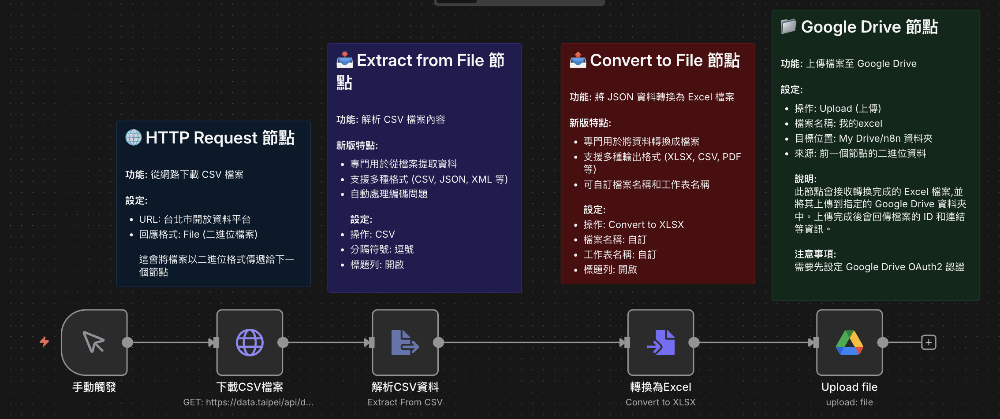

# Google Cloud API 服務
## 儲存檔案至 Google Drive

### 📚 工作流程說明

這個 n8n 工作流程示範如何從網路下載 CSV 檔案、轉換為 Excel 格式，並自動上傳到 Google Drive 指定的資料夾。這是一個完整的檔案處理和雲端儲存自動化流程，展示了如何整合多個服務來完成資料處理任務。

**資料來源**：臺北市就業服務處求職求才職缺資訊  
**儲存位置**：Google Drive (My Drive/n8n 資料夾)

### 工作流程樣版下載

[儲存檔案至googe_drive.json](./儲存檔案至googe_drive.json)

### 預覽圖



---

## 📋 節點詳細說明

### 1. **📝 工作流程說明（Sticky Note）**
   - **功能**：顯示各節點的操作說明
   - **內容**：包含四個說明區塊
     - HTTP Request 節點說明
     - Extract from File 節點說明
     - Convert to File 節點說明
     - Google Drive 節點說明

### 2. **▶️ 手動觸發（Manual Trigger）**
   - **功能**：手動觸發器，啟動工作流程
   - **操作方式**：點擊「執行工作流程」按鈕開始執行
   - **用途**：適合測試或單次執行的檔案處理任務
   - **提示**：也可以改用 Schedule Trigger 設定定期自動執行

### 3. **⬇️ 下載CSV檔案（HTTP Request Node）**
   - **功能**：從臺北市政府開放資料平台下載 CSV 檔案
   - **設定說明**：
     - **請求方式**：GET
     - **URL**：`https://data.taipei/api/dataset/9cb8ebf1-8d21-4523-908c-af853867eea1/resource/cec51213-9585-4b4a-ae18-5c9309ddf453/download`
     - **回應格式**：設定為檔案（File）
   - **為什麼這樣設定**：將回應格式設為「File」會讓檔案以二進位格式傳遞給下一個節點
   - **輸出**：CSV 格式的二進位資料

### 4. **📥 解析CSV資料（Extract from File Node）** ✨
   - **功能**：從檔案中提取資料並解析為 JSON 格式
   - **節點類型**：Extract from File（n8n 新版檔案處理節點）
   - **新版優勢**：
     - 專門用於從各種格式檔案提取資料
     - 支援 CSV、JSON、XML 等多種格式
     - 自動處理編碼問題，更加穩定
   - **設定說明**：
     - **操作模式**：CSV
     - **分隔符號**：`,`（逗號）
     - **包含表頭**：是（第一行為欄位名稱）
     - **啟用 BOM**：否
   - **處理過程**：自動將 CSV 的每一列轉換為 JSON 物件
   - **輸出**：包含所有職缺資料的 JSON 陣列

### 5. **📊 轉換為Excel（Convert to File Node）** ✨
   - **功能**：將 JSON 資料轉換為 Excel (.xlsx) 檔案
   - **節點類型**：Convert to File（n8n 新版檔案生成節點）
   - **新版優勢**：
     - 專門用於將資料轉換成各種檔案格式
     - 支援 XLSX、CSV、PDF、HTML 等多種輸出格式
     - 可自訂檔案名稱、工作表名稱等細節
   - **設定說明**：
     - **操作**：轉換為 XLSX（Convert to XLSX）
     - **檔案名稱**：可自訂（預設為空，會使用原檔名）
     - **輸出格式**：Excel 2007+ (.xlsx)
   - **輸出**：可上傳的 Excel 二進位檔案

### 6. **☁️ Upload file（Google Drive Node）** 🔑
   - **功能**：將檔案上傳至 Google Drive 指定資料夾
   - **設定說明**：
     - **操作**：Upload（上傳檔案）
     - **檔案名稱**：`我的excel`
     - **Drive**：My Drive
     - **資料夾**：n8n（需事先在 Google Drive 建立或選擇）
     - **資料來源**：前一個節點的二進位資料
   - **認證設定**：
     - **需要**：Google Drive OAuth2 API 認證
     - **設定位置**：點選 Credentials 設定 Google Drive 帳號連線
   - **輸出資訊**：
     - 檔案 ID
     - 檔案連結（可直接在瀏覽器開啟）
     - 建立時間
     - MIME 類型
   - **重要提醒**：首次使用需要授權 n8n 存取您的 Google Drive

---

## 🎯 學習重點

### 1. **HTTP 請求下載檔案**
   - 了解如何使用 HTTP Request 節點下載檔案
   - 學習設定回應格式為「檔案」而非「JSON」

### 2. **使用新版檔案處理節點**
   - 掌握 Extract from File 節點解析 CSV 的方法
   - 學習 Convert to File 節點轉換為 Excel 的技巧
   - 理解新版節點相較舊版的優勢

### 3. **Google Drive API 整合**
   - 學習設定 Google Drive OAuth2 認證
   - 了解如何指定上傳的目標資料夾
   - 掌握檔案命名和覆寫規則

### 4. **二進位資料傳遞**
   - 理解在節點之間傳遞檔案資料的方式
   - 學習如何處理和操作二進位資料

### 5. **完整的自動化流程**
   - 下載 → 解析 → 轉換 → 上傳
   - 建立端到端的資料處理與儲存流程

---

## 💡 實際應用場景

這個範例可以延伸應用到：

### 📊 **自動化報表備份**
- 定期下載公司報表並備份到 Google Drive
- 將每日銷售資料轉換為 Excel 並上傳到團隊共享資料夾
- 自動整理和歸檔各部門的資料

### 🔄 **資料同步與分享**
- 從多個來源下載資料，統一格式後上傳到雲端
- 將資料庫匯出的 CSV 轉換為 Excel 並分享給非技術人員
- 建立跨平台的資料同步機制

### 📅 **定期資料收集**
- 搭配 Schedule Trigger 每天自動執行
- 收集政府開放資料並整理成易讀格式
- 建立歷史資料的時間序列存檔

### 🎨 **進階處理流程**
- 在上傳前使用 Code Node 進行資料清洗
- 根據內容分類儲存到不同的 Google Drive 資料夾
- 上傳後透過 Gmail 發送通知給團隊成員

---

## ⚙️ 設定步驟

### **步驟一：設定 Google Drive 認證**

1. **開啟 Google Cloud Console**
   - 前往 [Google Cloud Console](https://console.cloud.google.com/)
   - 建立新專案或選擇現有專案

2. **啟用 Google Drive API**
   - 在左側選單選擇「API 和服務」→「程式庫」
   - 搜尋「Google Drive API」並啟用

3. **建立 OAuth 2.0 憑證**
   - 進入「API 和服務」→「憑證」
   - 點擊「建立憑證」→「OAuth 用戶端 ID」
   - 應用程式類型選擇「網頁應用程式」
   - 在「已授權的重新導向 URI」中加入您的 n8n 回調 URL
     - 例如：`https://your-n8n-instance.com/rest/oauth2-credential/callback`

4. **在 n8n 中設定認證**
   - 在 Upload file 節點中點選「Credentials」
   - 選擇「Create New」→「Google Drive OAuth2 API」
   - 輸入 Client ID 和 Client Secret
   - 點擊「Connect」完成授權

### **步驟二：選擇或建立目標資料夾**

1. **在 Google Drive 中建立資料夾**
   - 前往 [Google Drive](https://drive.google.com/)
   - 建立名為「n8n」的資料夾（或使用現有資料夾）

2. **在 Upload file 節點中選擇資料夾**
   - 點擊「Folder」欄位的下拉選單
   - 從列表中選擇「n8n」資料夾
   - 或直接貼上資料夾 ID

### **步驟三：匯入並測試工作流程**

1. **匯入工作流程**
   - 登入 n8n
   - 點擊「新增工作流程」
   - 點擊右上角「...」選單 → 「匯入自檔案」
   - 選擇 `儲存檔案至googe_drive.json`

2. **執行測試**
   - 點擊畫面上方的「執行工作流程」按鈕
   - 觀察各節點的執行狀態（綠色勾勾表示成功）

3. **驗證結果**
   - 前往 Google Drive 的 n8n 資料夾
   - 確認「我的excel.xlsx」檔案已成功上傳
   - 下載並開啟檔案驗證內容

### **步驟四：自訂設定（選用）**

1. **修改檔案名稱**
   - 在 Upload file 節點中修改「Name」欄位
   - 可使用動態名稱：`={{ "職缺資料_" + $now.toFormat('yyyy-MM-dd') }}`

2. **更改目標資料夾**
   - 在「Folder」欄位選擇不同的資料夾
   - 可建立多層資料夾結構進行組織

3. **設定定期執行**
   - 將 Manual Trigger 替換為 Schedule Trigger
   - 設定每天、每週或每月的執行時間

---

## 🔧 進階功能擴展

### **練習 1：動態檔案命名**
為上傳的檔案加入時間戳記：
```javascript
// 在 Upload file 節點的 Name 欄位使用表達式
={{ "職缺資料_" + $now.toFormat('yyyy-MM-dd_HH-mm') + ".xlsx" }}
```

### **練習 2：條件式上傳**
只有在資料筆數超過某個門檻時才上傳：
- 在 Convert to File 和 Upload file 之間加入 IF 節點
- 條件：`{{ $json.length > 100 }}`
- True 分支連接到 Upload file

### **練習 3：多版本備份**
上傳到不同資料夾以保留歷史版本：
```javascript
// 使用 Code Node 動態決定資料夾路徑
const monthFolder = new Date().toISOString().slice(0, 7); // 2024-12
return {
  folderPath: `n8n/備份/${monthFolder}`
};
```

### **練習 4：上傳後發送通知**
在 Upload file 後加入 Gmail 或 Slack 節點：
- 通知內容包含檔案連結
- 使用 `{{ $json.webViewLink }}` 取得檔案 URL
- 發送給團隊成員

### **練習 5：批次處理多個檔案**
下載多個不同的 CSV 檔案並分別上傳：
- 使用 Loop 節點處理檔案列表
- 為每個檔案設定不同的命名規則
- 整理到不同的子資料夾

---

## 📌 常見問題

### **Q1: 認證失敗，無法連接 Google Drive？**
**A**: 請確認以下事項：
- Google Drive API 已在 Google Cloud Console 中啟用
- OAuth 2.0 憑證的重新導向 URI 設定正確
- n8n 中的 Client ID 和 Client Secret 正確無誤
- 已完成授權流程（點擊 Connect 並在彈出視窗中授權）

### **Q2: 上傳的檔案名稱是亂碼？**
**A**: 這可能是編碼問題：
- 確保在 Convert to File 節點中設定正確的檔案名稱
- 避免使用特殊字元，建議使用英數字和底線
- 使用 n8n 表達式動態生成檔案名稱

### **Q3: 檔案上傳成功但找不到？**
**A**: 檢查以下幾點：
- 確認選擇的資料夾 ID 是正確的
- 在 Google Drive 中搜尋檔案名稱
- 檢查 Upload file 節點的輸出，確認上傳成功
- 使用節點輸出中的 `webViewLink` 直接開啟檔案

### **Q4: 如何覆寫同名檔案而非建立新版本？**
**A**: Google Drive 預設會保留所有版本。如需覆寫：
- 先使用 Google Drive 的「Search」操作查找同名檔案
- 取得檔案 ID
- 使用「Update」操作更新檔案內容

### **Q5: 可以上傳到共享雲端硬碟嗎？**
**A**: 可以！步驟如下：
- 在 Drive 欄位選擇「Shared Drive」而非「My Drive」
- 選擇對應的共享雲端硬碟
- 確保您的 Google 帳號有該共享雲端硬碟的編輯權限

### **Q6: 如何設定資料夾權限？**
**A**: 上傳後使用 Google Drive 的「Update a file」操作：
- 設定 `permissions` 參數
- 可設定為公開、特定人員或組織內共享
- 或直接在 Google Drive 網頁介面修改權限

---

## 🎓 相關資源

- [n8n HTTP Request 節點文件](https://docs.n8n.io/integrations/builtin/core-nodes/n8n-nodes-base.httprequest/)
- [n8n Extract from File 節點文件](https://docs.n8n.io/integrations/builtin/core-nodes/n8n-nodes-base.extractfromfile/)
- [n8n Convert to File 節點文件](https://docs.n8n.io/integrations/builtin/core-nodes/n8n-nodes-base.converttofile/)
- [n8n Google Drive 節點文件](https://docs.n8n.io/integrations/builtin/app-nodes/n8n-nodes-base.googledrive/)
- [Google Drive API 文件](https://developers.google.com/drive/api/v3/about-sdk)
- [Google Cloud Console](https://console.cloud.google.com/)
- [臺北市資料大平台](https://data.taipei/)

---

## 🔐 安全性提醒

### **保護您的認證資訊**
- 不要將包含認證的 n8n 工作流程分享給他人
- 定期檢查 Google Cloud Console 中的 API 使用情況
- 使用最小權限原則，只授予必要的 Drive 存取權限

### **資料隱私**
- 確認上傳的資料不包含敏感個資
- 設定適當的 Google Drive 資料夾權限
- 考慮使用組織的 Google Workspace 帳號而非個人帳號

### **監控與稽核**
- 定期檢查 Google Drive 的活動記錄
- 使用 n8n 的執行記錄追蹤上傳歷史
- 設定異常警報（如上傳失敗通知）

---

**難度**: ⭐⭐☆ (中級)  
**適用對象**: 有基礎 n8n 經驗、需要整合 Google Drive 的使用者  
**預計學習時間**: 30-45 分鐘  
**前置知識**: 
- 了解基本的 n8n 節點操作
- 擁有 Google 帳號
- 基本的 OAuth 2.0 認證概念

**範例亮點**:
- ☁️ 實際整合 Google Drive API
- 📁 學習 OAuth 2.0 認證設定
- ✨ 使用最新的檔案處理節點
- 🔄 完整的下載→轉換→上傳流程
- 💼 可直接應用到實際資料備份工作
- 🚀 展示端到端的自動化解決方案
