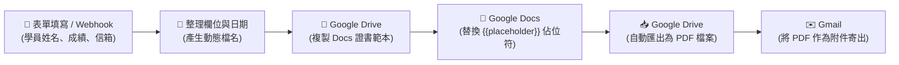

# 整合 Google 服務
## 範例 7：Google Docs 範本動態替換與 PDF 結業證書自動發信

### 📚 工作流程說明

在辦公室自動化與企業應用中，常需要根據表單回覆或資料庫資料，**自動產生客製化合約書、結業證書、報價單或電子收據**，並轉換為 PDF 檔案自動發送給客戶。

本範例教學如何使用 **Google Docs 範本** 與 **`{{placeholder}}` 佔位符替換技術**，結合 Google Drive、Google Docs 與 Gmail 節點，打造端到端的文件自動化產生系統。

---

## 🎯 工作流程概念與架構



---

## 🛠️ 第一步：在 Google Docs 建立文件範本

1. 前往 Google Drive，建立一份新的 Google 文件（例如命名為 `結業證書範本`）。
2. 在文件中完成版面設計與排版，並在需要動態替換的地方輸入 `{{變數名稱}}`：

> ### 結業證書 (Certificate of Completion)
> 
> 茲證明 **{{student_name}}** 學員已順利完成 **{{course_name}}** 專業培訓課程，並於總結評量中取得 **{{score}}** 分之優異成績，特頒此證，以資鼓勵。
> 
> 發證日期：{{issue_date}}  
> 主辦單位：n8n 自動化學院

3. 從瀏覽器網址列取得該範本文件的 **File ID**（位於網址 `/d/` 與 `/edit` 之間的一長串字串）。

---

## 🧩 第二步：n8n 節點詳細解析

我們提供了開箱即用的工作流程樣版：[`動態文件生成與PDF自動化.json`](./動態文件生成與PDF自動化.json)。

### 1. 📝 On form submission (表單提交觸發節點)
- 提供前端申請介面，收集「學員姓名」、「學員 Email」、「完訓課程名稱」與「結業總成績」。

### 2. 🔄 Edit Fields / Set (整理範本變數資料)
- 將表單欄位正規化為英文變數名稱。
- 利用表達式動態產生發證日期：`{{ $now.format('yyyy 年 MM 月 dd 日') }}`。
- 動態產生新文件名稱：`結業證書_{{ $json['學員姓名'] }}_{{ $now.format('yyyyMMdd') }}`。

### 3. 📁 Google Drive (複製範本文件)
- **Operation**：`Copy`
- **File ID**：填入您的 Google Docs 範本 File ID。
- **Name**：`={{ $json.new_doc_name }}`。
- **為什麼要先複製？** 保持原始範本文件的純淨，每次產生皆使用獨立的新副本。

### 4. 📑 Google Docs (替換佔位符文字)
- **Operation**：`Update`
- **Document URL / ID**：`={{ $json.id }}`（指向剛複製出來的新文件）
- **Action**：選擇 `Replace all text`（多次新增）：
  - 將 `{{student_name}}` 替換為 `={{ $('整理範本變數資料').item.json.student_name }}`
  - 將 `{{course_name}}` 替換為 `={{ $('整理範本變數資料').item.json.course_name }}`
  - 將 `{{score}}` 替換為 `={{ $('整理範本變數資料').item.json.score.toString() }}`
  - 將 `{{issue_date}}` 替換為 `={{ $('整理範本變數資料').item.json.issue_date }}`

### 5. 📥 Google Drive (匯出為 PDF 檔案)
- **Operation**：`Download`
- **File ID**：`={{ $('Google Drive (複製範本文件)').item.json.id }}`
- **MIME Type (匯出格式)**：選擇 `application/pdf`。
- 節點會自動將 Google Docs 轉換為高品質 PDF 二進位資料（Binary Property `data`）。

### 6. ✉️ Gmail (自動寄送 PDF 附件證書)
- **To**：`={{ $('整理範本變數資料').item.json.student_email }}`
- **Subject**：`🎉 恭喜完成課程！您的結業證書已核發`
- **Attachments**：指定 Binary Property 名稱 `data`，系統自動將 PDF 證書夾帶至信件中發送！

---

## 🤖 AI 賦能延伸實作（附 Prompt 提詞）

<details>
<summary>🤖 <strong>複製給 AI 助理的升級 Prompt</strong></summary>

```text
請幫我在目前的「動態文件生成與 PDF 自動化」工作流程中加入進階邏輯：
1. 在複製範本前，加入一個 IF 判斷：
   - 若 score >= 90，將 certificate_type 設為「特優證書」；
   - 若 score >= 70，設為「結業證書」；
   - 若 score < 70，不產生證書，改發送「未達結業標準通知信」。
2. 同時將所有已發證的學員名單（姓名、Email、課程、成績、PDF 連結）追加記錄到「發證明細」Google Sheets 試算表中存查。
請直接幫我更新工作流程節點！
```
</details>

---

## 📚 相關資源

- [Google Cloud API 憑證設定指南](../../google_cloud設定/README.md)
- [n8n Google Docs 節點官方文件](https://docs.n8n.io/integrations/builtin/app-nodes/n8n-nodes-base.googledocs/)
- [n8n Google Drive 節點官方文件](https://docs.n8n.io/integrations/builtin/app-nodes/n8n-nodes-base.googledrive/)
- [n8n Gmail 節點官方文件](https://docs.n8n.io/integrations/builtin/app-nodes/n8n-nodes-base.gmail/)
