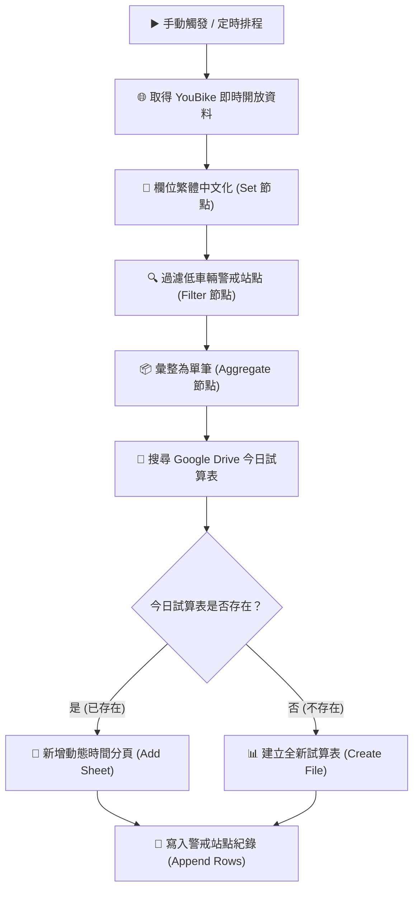

# 整合 Google 服務
## 範例 6：臺北市 YouBike 2.0 站點監控與動態試算表歸檔

### 📚 工作流程說明

這個 n8n 工作流程示範如何自動從臺北市政府開放資料平台取得 YouBike 2.0 即時站點資訊，篩選出可借車輛或可還車輛少於 3 輛的「警戒站點」，並自動將資料寫入 Google 試算表中存檔。

工作流程具備**智慧判斷機制**：
1. 自動向臺北市 API 取得即時站點狀態，並進行欄位中文化。
2. 過濾出可借或可還車輛數小於 3 的警戒站點。
3. 搜尋 Google Drive 中是否已存在今日的記錄檔（檔名格式：`YYYY-MM-DD_youbike低車輛站點`）。
4. **若今日試算表已存在**：直接在該試算表中新增一個以當前時間命名（格式：`HH-mm-ss`）的工作表（Sheet），並寫入低車輛站點資料。
5. **若今日試算表不存在**：建立全新的 Google 試算表（檔名為 `YYYY-MM-DD_youbike低車輛站點`），並將第一個工作表命名為當前時間，再寫入資料。

---

### 流程架構圖

---

### 工作流程樣版下載

- [📥 取得台北市 YouBike 資料工作流程樣版 (取得台北市youbike資料.json)](./取得台北市youbike資料.json)

---

## 📋 節點詳細說明

### 1. **▶️ 手動觸發（Manual Trigger Node）**
   - **功能**：工作流程的起點，手動點擊「Execute workflow」即可啟動執行。
   - **用途**：適合測試與單次執行任務。
   - **擴充建議**：可替換為 **Schedule Trigger** 節點（例如設定每 30 分鐘執行一次），實現全自動即時監控與紀錄。

### 2. **🌐 取得台北市youbike資料（HTTP Request Node）**
   - **功能**：向臺北市政府開放資料 API 發送 HTTP GET 請求取得即時站點資料。
   - **請求網址**：`https://tcgbusfs.blob.core.windows.net/dotapp/youbike/v2/youbike_immediate.json`
   - **回應格式**：JSON 陣列（包含臺北市所有 YouBike 2.0 站點資訊）。

### 3. **🔄 欄位繁體中文化（Set / Edit Fields Node）**
   - **功能**：將 API 回傳的英文字段提取並重新命名為易讀的繁體中文欄位名稱。
   - **欄位對應表**：
     - `sno` → `站點編號` (字串)
     - `sna` → `站點名稱` (字串)
     - `sarea` → `區域` (字串)
     - `mday` → `時間` (字串)
     - `ar` → `地址` (字串)
     - `act` → `站點狀況` (字串)
     - `Quantity` → `總停車格數` (數字)
     - `available_rent_bikes` → `可借車輛數` (數字)
     - `available_return_bikes` → `可還車輛數` (數字)

### 4. **🔍 過濾低車輛站點（Filter Node）**
   - **功能**：根據條件過濾出需要警示關注的站點。
   - **過濾條件**（滿足任一條件即留存）：
     - `可借車輛數` < `3` （可借車數不足）
     - **OR** `可還車輛數` < `3` （可還車數/空位不足）

### 5. **📦 彙整為一筆（Aggregate Node）**
   - **功能**：將過濾出的多筆低車輛站點資料打包成單一 JSON 物件中的 `站點清單` 陣列。
   - **為什麼需要它**：在 n8n 中，若後續節點輸入多筆 Item，Google Drive 搜尋節點會對每筆 Item 執行一次查詢。將資料預先打包為 1 筆後，可確保搜尋動作僅執行 1 次，大幅提升效能並省下 API 請求額度。

### 6. **📁 搜尋今天試算表（Google Drive Node）** 🔑
   - **功能**：搜尋 Google Drive 中是否已存在今日產生的試算表。
   - **搜尋檔名**：`={{ $now.format('yyyy-MM-dd') }}_youbike低車輛站點`
   - **檔案類型限制**：`application/vnd.google-apps.spreadsheet` (Google 試算表)
   - **憑證需求**：需要 Google Drive OAuth2 API 憑證。

### 7. **⚙️ 整理搜尋結果（Code Node）**
   - **功能**：執行 JavaScript 腳本解析 Google Drive 搜尋回應。
   - **邏輯**：
     - 若搜尋到符合檔名的試算表：回傳 `{ id: 檔案ID, name: 檔名, exists: true }`
     - 若找不到：回傳 `{ id: '', name: '', exists: false }`

### 8. **🔀 判斷是否存在（If Node）**
   - **功能**：依據 `$json.exists` 進行條件分流。
   - **True 分支**（檔案已存在）：走「新增Sheet至現有試算表」流程。
   - **False 分支**（檔案不存在）：走「建立新試算表」流程。

### 9. **📄 新增Sheet至現有試算表（Google Sheets Node - True 分支）** 🔑
   - **功能**：在已存在的今日試算表中建立一個全新的工作表（Sheet）。
   - **目標試算表**：`={{ $json.id }}`
   - **新分頁名稱**：`={{ $now.format('HH-mm-ss') }}`（例如：`14-30-00`，標示該批資料的紀錄時間）

### 10. **🆕 建立新試算表（Google Sheets Node - False 分支）** 🔑
    - **功能**：在 Google Drive 根目錄建立全新的試算表。
    - **試算表檔名**：`={{ $now.format('yyyy-MM-dd') }}_youbike低車輛站點`
    - **初始分頁名稱**：`={{ $now.format('HH-mm-ss') }}`

### 11. **🔓 展開站點（現有 / 新建）（Code Node）**
    - **功能**：將前述打包的 `站點清單` 陣列解開（Unaggregate），重新展開為多筆獨立 Item。
    - **處理邏輯**：`return list.map(row => ({ json: row }));`
    - **目的**：傳遞獨立 Item 給 Google Sheets Append 節點進行整批資料列寫入。

### 12. **📊 寫入資料（現有 / 新建）（Google Sheets Node）** 🔑
    - **功能**：將解開後的低車輛站點資料逐列寫入對應的工作表中。
    - **操作**：Append (追加資料列)
    - **欄位對應**：自動對應對齊中文欄位標註。

---

## 🎯 學習重點

### 1. **外部 API 即時資料串接與整理**
   - 使用 HTTP Request 取得第三方開放資料（Open Data）。
   - 使用 Set 節點將英文欄位名轉為中文，提升可讀性與數據維護品質。

### 2. **條件判斷與數據過濾**
   - 使用 Filter 節點進行複數邏輯判斷（OR 條件），精準篩選異常或警戒數據。

### 3. **n8n 中的資料彙整與展開（Aggregate & Unaggregate）**
   - 理解多筆 Item 經過 API 搜尋節點時的行為與效能影響。
   - 掌握「先 Aggregate 縮減批次作業 → 後 Code 解開」的高級工作流技巧。

### 4. **Google Cloud 服務深度整合 (Drive & Sheets)**
   - 使用 Google Drive API 進行雲端檔案搜尋與動態查詢。
   - 使用 Code 節點搭配 If 節點建立「若存在則更新，若不存在則新建」的動態分支結構。
   - 動態命名試算表與工作表（搭配日期與時間格式化語法 `$now.format(...)`）。

---

## 💡 實際應用場景

這個流程模式可廣泛應用於各種需要**定期監控、動態建檔與歷史記錄**的自動化場景：

- 🚲 **公共自行車 / 共享單車調度監控**：定期記錄各站點缺車或無位可還狀態，輔助調度管理。
- 📈 **即時設備 / 數據異常警報與日誌紀錄**：自動檢視伺服器狀態或物聯網設備，並依日期分類儲存異常日誌。
- 🛒 **電商商品庫存警戒追蹤**：定期抓取商品庫存 API，若低於安全庫存即記錄至當日 Google Sheets 檔案。
- 📊 **每日新聞 / 聲量即時追蹤與歸檔**：每天產生一份試算表，每小時記錄一次聲量變化於不同分頁中。

---

## ⚙️ 設定步驟

### **步驟一：匯入工作流程**
1. 進入 n8n 介面，點選右上角選單。
2. 選擇「Import from File」，上傳 `取得台北市youbike資料.json`。

### **步驟二：設定 Google API 憑證**
1. 在 n8n 的「Credentials」管理頁面中新增：
   - **Google Drive OAuth2 API** 憑證
   - **Google Sheets OAuth2 API** 憑證
2. 確保 Google Cloud Console 已啟用以下 API：
   - Google Drive API
   - Google Sheets API
3. 開啟流程中的 Google Drive 與 Google Sheets 節點，選擇剛設定好的憑證。

### **步驟三：測試與執行**
1. 點擊 `When clicking ‘Execute workflow’` 節點。
2. 點選「Execute workflow」執行流程。
3. 檢查您的 Google Drive，確認是否自動產生了檔名為 `YYYY-MM-DD_youbike低車輛站點` 的試算表，並且內含格式完整的低車輛站點資料。

---

## 📌 常見問題

### **Q1: 為什麼要在搜尋試算表前先使用「彙整為一筆」？**
**A**: 因為 Filter 節點會輸出多筆低車輛站點（例如 50 筆）。若不經過 Aggregate 打包，Google Drive 搜尋節點會針對這 50 筆資料重複執行 50 次搜尋，這不僅耗時，還會迅速消耗 GCP API 配額。打包後搜尋只需執行 1 次。

### **Q2: 如何調整低車輛的警戒門檻？**
**A**: 雙擊「過濾低車輛站點」節點，將 `3` 修改為您需要的數字（例如改為 `5` 輛）。

### **Q3: 如何讓這個流程每天自動定期執行？**
**A**: 將 `When clicking ‘Execute workflow’` 節點刪除，替換為 `Schedule Trigger` 節點，設定重複週期的執行時間（例如每小時或每 30 分鐘執行一次）。

---

## 🎓 相關資源

- [臺北市 YouBike2.0 即時資訊 API](https://data.taipei/dataset/detail?id=c6bc70b5-9b7b-496f-a98b-a0440e8b8e63)
- [n8n Google Drive 節點文件](https://docs.n8n.io/integrations/builtin/app-nodes/n8n-nodes-base.googledrive/)
- [n8n Google Sheets 節點文件](https://docs.n8n.io/integrations/builtin/app-nodes/n8n-nodes-base.googlesheets/)
- [n8n Luxon 日期時間處理語法](https://docs.n8n.io/code/cookbook/luxon/)

---

**難度**: ⭐⭐⭐ (進階)  
**適用對象**: 需要處理動態檔案建立、條件分支、多 API 整合與即時數據分析的使用者  
**預計學習時間**: 45-60 分鐘  

**範例亮點**:
- 🚲 實戰開放資料 API (YouBike 2.0 即時 API)
- 🧠 智慧檔案管理邏輯（自動判斷今日試算表是否存在）
- ⏱️ 動態檔案與工作表命名（日期 `yyyy-MM-DD` 與時間 `HH-mm-ss`）
- ⚡ 高效 n8n 資料流設計（Aggregate 打包避免重複 API 請求）
