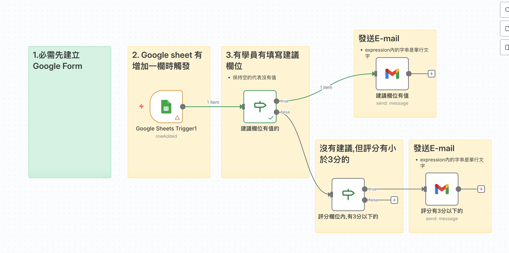

# Google_Cloud_api服務
## 學生體驗回饋問卷範本

### 📚 工作流程說明

這個工作流程展示了如何自動處理學生體驗回饋問卷。當學生填寫 Google Form 問卷後，資料會自動寫入 Google Sheet。n8n 會監控該 Google Sheet，當偵測到新的回饋且「建議」欄位有內容時，會自動透過 Gmail 發送通知給相關人員。

### 預覽圖



#### 🔄 工作流程圖

```
[Google Form 填寫] → [寫入 Google Sheet] → [Google Sheets Trigger] → [If 判斷建議欄位] → [Gmail 寄送通知]
```

#### 📋 節點詳細說明

1. **Google Form (前置準備)**
   - **功能**：讓學生填寫回饋
   - **設定**：需手動建立 Google Form，並設定將回應儲存至 Google Sheet
   - **範例連結**：[學生體驗回饋問卷](https://forms.gle/xK6udQEPLuKSGMHXA)

2. **Google Sheets Trigger**
   - **功能**：監聽 Google Sheet 的新增列（Row）
   - **觸發時機**：當有新問卷提交並寫入 Sheet 時

3. **If (判斷節點)**
   - **功能**：檢查問卷中的「建議」欄位
   - **邏輯**：判斷建議欄位是否有值（不為空）

4. **Gmail**
   - **功能**：發送電子郵件通知
   - **執行條件**：只有當建議欄位有值時才會執行

#### 🎯 學習重點

- **Google Form 與 n8n 整合**：透過 Google Sheets 作為中介，連接表單與自動化流程
- **條件邏輯**：學習使用 If 節點進行資料過濾，只針對特定情況（有建議時）進行處理
- **觸發器應用**：理解 Polling（輪詢）或 Webhook 類型的觸發器運作方式
- **除錯技巧**：了解在 Production 模式（Active）下的測試與監控方式

#### 💡 實際應用場景

- **客戶服務**：收到客戶負評或建議時，立即通知客服經理
- **活動報名**：當報名者勾選「特殊需求」時，自動通知活動籌備人員
- **錯誤回報**：當使用者提交錯誤報告表單時，自動建立工單並通知工程師

#### ⚙️ 設定步驟與注意事項

1. **建立表單與試算表**
   - 手動建立 Google Form（範例設在 roberthsu2004 帳號, n8n 資料夾內）
   - 設定表單回應產生 Google Sheet（手動測試表單一次以自動產生 Sheet）
   - **注意**：使用共用設定讓學員可以複製問卷

2. **設定 n8n 節點**
   - 設定 Google Sheets Trigger 連接至上述產生的 Sheet
   - **注意**：n8n 若要取得 Sheet ID，可能需要使用分享功能，ID 可在 URL 中找到

3. **啟用與測試**
   - **重要**：要將專案從 **Inactive** 更改為 **Active**，才可以實際測試外部觸發
   - 實際填寫表單並送出，資料會寫入 Google Sheet
   - **監控**：在 n8n Editor 中可能看不到即時動作，必須在 **Executions** 區域內才可以看到執行紀錄

---
