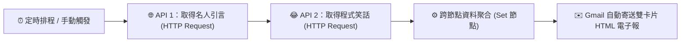

# 整合 Google 服務
## 範例 3：多來源 API 整合與幽默笑話電子報

### 📚 工作流程說明

這個工作流程示範如何**在單一工作流中依序呼叫多個外部 REST API，並將跨服務的資料整合成精美的 HTML 雙卡片電子報**。流程首先呼叫「名人金句 API」與「程式設計師笑話 API」，使用 Set 節點整合跨節點資料（Cross-node referencing），最後透過 Gmail API 自動將排版精緻的放鬆特刊發送給團隊成員。

---

### 流程架構圖



---

### 工作流程樣版下載

- [📥 幽默笑話電子報工作流程樣版 (寄送一個笑話.json)](./寄送一個笑話.json)

---

### 📋 節點詳細說明

1. **⏰ 排程觸發器 (`Schedule Trigger` v1.2)**
   - 設定每週五下午 17:00 或每日定時啟動。

2. **🌐 取得名人引言 (`HTTP Request` v4.4)**
   - API 端點：`https://zenquotes.io/api/random`

3. **😂 取得程式設計師笑話 (`HTTP Request` v4.4)**
   - API 端點：`https://v2.jokeapi.dev/joke/Programming?blacklistFlags=nsfw,religious,political,racist,sexist,explicit&type=single`

4. **⚙️ 聚合引言與笑話資料 (`Set` v3.4)**
   - 跨節點存取：使用 `$('取得名人引言').item.json.q` 讀取前前節點的引言，結合本節點的 `$json.joke`。

5. **✉️ Gmail 發送幽默電子報 (`Gmail` v2.1)**
   - 使用 HTML 雙卡片排版，自動渲染笑話與今日金句。

---

### 🧪 測試與驗證方法

1. 在 n8n 匯入 [`寄送一個笑話.json`](./寄送一個笑話.json)。
2. 在 Gmail 節點綁定您的 Gmail 憑證並填入收件信箱。
3. 點擊「**Execute workflow**」。
4. 檢查信箱是否收到包含「😂 程式笑話」與「✨ 今日金句」的雙色卡片信件！

---

<details>
<summary>🤖 <strong>AI 賦能延伸實作（附 Prompt 提詞）</strong></summary>

> 💡 **任務目標**：透過 MCP 連線，讓 AI 為英文笑話自動翻譯中文並加上雙關語註解。

**可直接複製給 AI 的 Prompt 提詞**：
```text
請幫我在「寄送一個笑話」工作流程中加入 AI 幽默翻譯能力：
1. 抓取笑話 API 資料後，將英文笑話送入 AI Agent 節點。
2. 提示詞要求：將英文笑話翻譯為在地化的台灣繁體中文，若笑話包含程式雙關語梗，需附帶 20 字的梗點解說。
3. 將英文原文、中文翻譯與梗點解說排版為 HTML 卡片，透過 Gmail 發送。
請幫我配置好流程！
```
</details>

---

**適用對象**：初中級 / 多 API 資料聚合實戰  
**預計教學時間**：40 - 50 分鐘
