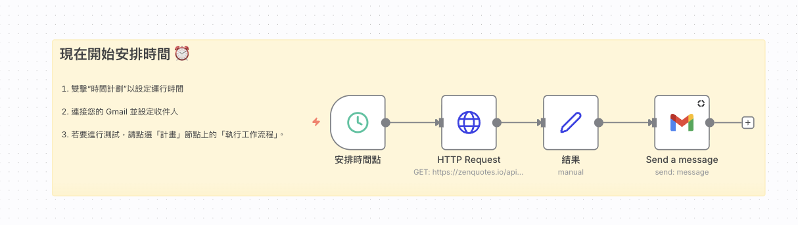

# Google_Cloud_api服務
## 寄送Gmail

### 📚 工作流程說明

這個 n8n 工作流程示範如何自動從網際網路上的 API 取得隨機引言（Quote），並透過 Gmail 自動寄送給指定的收件人。工作流程會在每天指定的時間自動執行，讓您每天都能收到勵志引言。

### 影片和template

[youtube](https://www.youtube.com/watch?v=5CBUXMO_L2Y&t=5s)

[自動寄送gmail-樣版json檔](./自動寄送gmail.json)

### 預覽圖




#### 📋 節點詳細說明

1. **📝 Sticky Note（便利貼）**
   - **功能**：顯示使用說明，幫助使用者了解如何操作這個工作流程
   - **內容**：告訴使用者如何設定排程時間、連接 Gmail 帳號、設定收件人，以及如何測試工作流程

2. **⏰ Schedule Trigger（排程觸發節點）**
   - **功能**：工作流程的自動觸發起點，根據設定的時間自動執行
   - **設定方式**：雙擊節點以設定運行時間
   - **預設時間**：每天早上 7 點（`triggerAtHour: 7`）
   - **為什麼需要它**：讓工作流程能夠在指定時間自動執行，無需手動觸發
   - **測試方式**：點選節點上的「執行工作流程」按鈕可以立即測試

3. **🌐 HTTP Request（HTTP 請求節點）**
   - **功能**：向外部 API 發送 HTTP 請求，取得資料
   - **API 網址**：`https://zenquotes.io/api/random`
   - **請求方式**：GET（取得資料）
   - **會得到的資料**：一個包含引言資訊的 JSON 陣列，每個引言包含：
     - `q`：引言內容（quote）
     - `a`：作者名稱（author）
     - `h`：HTML 格式的引言

4. **🔄 Set（設定節點）**
   - **功能**：重新整理和命名資料欄位，讓資料更容易閱讀和使用
   - **處理方式**：
     - 將 `q` 欄位重新命名為「問題」
     - 將 `a` 欄位重新命名為「作者」
     - 將 `h` 欄位重新命名為「結果」
   - **使用的語法**：`={{ $json.q }}` 這是一種 n8n 的表達式語法，用來取得前一個節點傳來的 JSON 資料

5. **📧 Gmail（Gmail 節點）**
   - **功能**：透過 Gmail 寄送電子郵件
   - **設定項目**：
     - **收件人**：`roberthsu2003@gmail.com`（可自行修改）
     - **主旨**：`從n8n發送過來的`
     - **郵件類型**：純文字（text）
     - **郵件內容**：使用 n8n 表達式動態組合引言資訊
   - **郵件內容範例**：
     ```
     這個是從n8n寄來的引言
     引言是:{{ $json.問題 }}
     作者是:{{ $json.作者 }}
     回覆是:{{ $json.結果 }}
     ```
   - **重要提醒**：使用前需要先連接您的 Gmail 帳號，在節點中設定 Gmail 憑證

#### 🎯 學習重點

- **排程觸發**：了解如何使用 Schedule Trigger 讓工作流程自動執行
- **API 整合**：學習如何透過 HTTP 請求從網路上取得資料
- **資料處理**：學習如何重新整理和命名資料欄位
- **郵件發送**：認識如何使用 Gmail 節點發送電子郵件
- **動態內容**：學習如何在郵件內容中使用 n8n 表達式插入動態資料
- **工作流程設計**：理解如何將多個節點串聯起來完成一個完整的自動化任務

#### 💡 實際應用場景

這個範例可以延伸應用到：
- 每日自動取得勵志引言並發送到個人信箱
- 定期發送工作報告或摘要到團隊成員
- 自動發送生日祝福或提醒通知
- 將系統監控資訊自動發送給管理員
- 定期發送資料分析報告

#### ⚙️ 設定步驟

1. **設定排程時間**：雙擊「安排時間點」節點，設定您希望收到郵件的時間
2. **連接 Gmail**：在「Send a message」節點中，點選「Credential to connect with」，連接您的 Gmail 帳號
3. **修改收件人**：將 `sendTo` 欄位中的電子郵件地址改為您想要接收郵件的地址
4. **測試工作流程**：點選「安排時間點」節點上的「執行工作流程」按鈕進行測試

---

