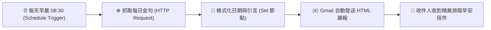

# 整合 Google 服務
## 範例 2：每日早晨 AI 晨報與 Gmail 自動發信

### 📚 工作流程說明

這個工作流程示範如何結合 **Schedule Trigger 定時排程器** 與 **Gmail API**，打造自動化每日早晨快遞。每天早晨 08:30，n8n 自動呼叫公開名言 API 取得當日勵志金句，搭配現代美觀的 HTML 卡片模板，自動發送精美的早安晨報至團隊或個人信箱。

---

### 流程架構圖


```mermaid
flowchart LR
    A["⏰ 每天早晨 08:30 (Schedule Trigger)"] --> B["🌐 抓取每日金句 (HTTP Request)"]
    B --> C["📝 格式化日期與引言 (Set 節點)"]
    C --> D["✉️ Gmail 自動發送 HTML 晨報"]
    D --> E["📱 收件人收到精美排版早安信件"]
```

---

### 工作流程樣版下載

- [📥 每日早晨自動發信樣版 (自動寄送gmail.json)](./自動寄送gmail.json)

---

### 📋 節點詳細說明

1. **⏰ 每天早晨 08:30 定時觸發 (`Schedule Trigger` v1.2)**
   - **設定**：每天早上 08 點 30 分自動啟動。

2. **🌐 取得每日勵志金句 (`HTTP Request` v4.4)**
   - **URL**：`https://zenquotes.io/api/random`

3. **📝 整理晨報與日期資料 (`Set` v3.4)**
   - **功能**：提取引言文字、作者，並格式化日期（例如 `2026 年 09 月 01 日 星期二`）。

4. **✉️ Gmail 自動寄出 HTML 晨報 (`Gmail` v2.1)**
   - **Email Type**：`HTML`
   - **排版**：採用清爽優雅的卡片式設計，並附加發送時間戳記。

---

### 🧪 測試與驗證方法

1. 在 n8n 匯入 [`自動寄送gmail.json`](./自動寄送gmail.json)。
2. 在 Gmail 節點中綁定您的 **Gmail OAuth2 憑證**，並填入您的收件信箱。
3. 點擊「**Execute workflow**」進行即時測試。
4. 打開信箱即可收到排版精美的每日能量晨報！

---

<details>
<summary>🤖 <strong>AI 賦能延伸實作（附 Prompt 提詞）</strong></summary>

> 💡 **任務目標**：透過 MCP 連線，讓 AI 結合大型語言模型（LLM）將英文名言翻譯為繁體中文，並附加工作啟發小語後再由 Gmail 寄出。

**可直接複製給 AI 的 Prompt 提詞**：
```text
請幫我將「自動寄送 Gmail」工作流程升級為「AI 晨報助理」：
1. 起點保留 Schedule Trigger（每天 08:30）與 HTTP Request 抓取引言。
2. 串接 AI Agent 節點，搭配 OpenAI 或 Gemini 模型，將英文名言翻譯為繁體中文，並產生一句 30 字的工作激勵小語。
3. 將 AI 翻譯與激勵小語排版為美觀的 HTML 郵件。
4. 透過 Gmail 節點寄送至指定信箱。
請幫我建立節點並配置好提示詞！
```
</details>

---

**適用對象**：入門初學者 / 定時郵件實戰  
**預計教學時間**：30 - 45 分鐘
