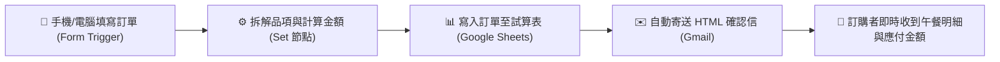

# 整合 Google 服務
## 範例 4：辦公室/班級線上訂便當與 Google Sheets 自動歸檔＋Gmail 自動確認信

### 📚 工作流程說明

這個 n8n 工作流程建立了一個現代化的**全自動線上訂便當與即時通知系統**。同仁或學生透過手機或瀏覽器填寫線上表單（姓名、Email、主餐、加價選項與備註），系統會自動拆解品項、計算應付總金額，即時寫入 **Google 試算表** 進行統一彙整，並透過 **Gmail API** 自動寄出精美的 HTML 訂購成功確認信給訂購者，徹底告別手動登記與漏單的痛點！

---

### 流程架構圖



---

### 工作流程樣版下載

- [📥 訂便當系統工作流程樣版 (訂便當.json)](./訂便當.json)

---

### 📋 節點詳細說明

1. **📝 訂便當線上表單觸發器 (`Form Trigger` v2.4)**
   - **功能**：自動生成直覺的響應式網頁表單供手機或電腦填寫。
   - **收集欄位**：
     - `name`：訂購人姓名（必填）
     - `email`：電子郵件（必填，用於寄送確認信）
     - `bento_option`：主餐下拉選單（🍗 雞腿 $130、🥩 排骨 $120、🐟 鯖魚 $115、🥗 蔬食 $100）
     - `extra_option`：加值選項（免費加飯、加購紅茶 +$20 等）
     - `note`：特殊需求備註（例如：飯少、不加蔥）

2. **⚙️ 拆解品項與計算金額 (`Edit Fields / Set` v3.4)**
   - **功能**：以表達式自動解析字串與運算總價：
     - `bentoName`：`={{ $json['bento_option'].split(' - ')[0] }}`
     - `bentoPrice`：`={{ Number($json['bento_option'].split('$')[1]) || 120 }}`
     - `extraFee`：自動檢查是否包含加價飲料（+$20）
     - `totalAmount`：便當單價 + 加購費用
     - `orderTime`：`={{ $now.format('yyyy-MM-dd HH:mm:ss') }}`

3. **📊 Google Sheets 寫入訂單 (`Google Sheets` v4.7)**
   - **功能**：將處理好的訂單逐筆自動追加（Append）到 Google 試算表中，欄位包含日期、時間、姓名、Email、品項、加值、實收金額與備註。

4. **✉️ Gmail 發送訂單確認信 (`Gmail` v2.1)**
   - **功能**：自動發送精美的 HTML 格式郵件給訂購人，清楚列出訂購品項、應付金額與領取提醒。

---

### 🧪 測試與驗證方法

1. 將 n8n 右上角開關切換為 **Active（已啟用）**。
2. 點開「訂便當線上表單觸發器」節點，複製 **Production URL**。
3. 在瀏覽器或手機開啟該網址，填寫姓名、Email 並選擇「🍗 酥脆大雞腿便當」與「加購古早味紅茶 (+$20)」。
4. 點擊「確認送出訂單」：
   - 檢查 Google 試算表是否已新增一列資料，金額顯示為 `$150`。
   - 檢查您的 Gmail 信箱是否已收到標題為「🍱【訂單確認】...」的精美 HTML 確認信！

---

<details>
<summary>🤖 <strong>AI 賦能延伸實作（附 Prompt 提詞）</strong></summary>

> 💡 **任務目標**：透過 MCP 連線，讓 AI 在每天上午 10:30 自動統計當日便當總數量與各品項總額，發送彙整報表至福委 LINE/Telegram 群組。

**可直接複製給 AI 的 Prompt 提詞**：
```text
請幫我在目前的「訂便當」自動化工作流程中加入每日結單彙整功能：
1. 新增一個 Schedule Trigger，設定在每週一至週五上午 10:30 觸發。
2. 串接 Google Sheets 節點，讀取今天日期的所有訂單紀錄。
3. 串接 Code 節點，自動統計：今日訂單總人數、各便當品項數量（如雞腿 x 5、排骨 x 3）、總收款金額。
4. 將統計摘要組裝為排版清晰的訊息，發送 Telegram 訊息（或 Gmail）通知總務同仁撥打電話向店家訂餐！
請幫我建立相關節點與連線！
```
</details>

---

**適用對象**：初學者 / 行政總務自動化實戰  
**預計教學時間**：45 - 60 分鐘