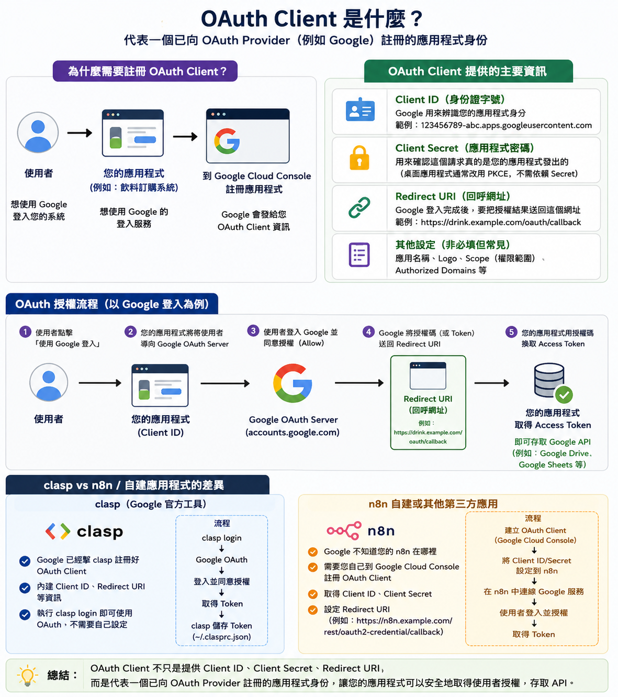
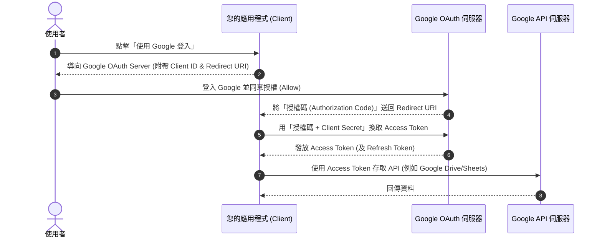

# 🔑 輕鬆搞懂 OAuth 2.0：從基本觀念到 n8n 自建應用實務

在現代網路開發與自動化（如使用 n8n）中，我們經常需要與各種第三方服務（如 Google、Microsoft、Slack）進行安全串接。這一切的背後，都建立在 **OAuth 2.0** 這套開放授權標準之上。

本指南透過**兩張直觀的全景圖**，帶您從「基本觀念（基礎篇）」一路深入到「OAuth Client 與自建應用開發實務（實務篇）」。

---

## 🧭 本文目錄
- [🎈 基礎篇：OAuth 的核心概念與運作](#-基礎篇oauth-的核心概念與運作)
  - [1. 🔑 經典比喻：代客泊車的專用鑰匙](#1--經典比喻代客泊車的專用鑰匙)
  - [2. 運作流程：實際生活中的例子 (以登入 Canva 為例)](#2-運作流程實際生活中的例子-以登入-canva-為例)
  - [3. 🛡️ OAuth 的四大安全優勢](#3--oauth-的四大安全優勢)
- [⚙️ 實務篇：什麼是 OAuth Client 與自建設定](#-實務篇什麼是-oauth-client-與自建設定)
  - [1. 什麼是 OAuth Client？](#1-什麼是-oauth-client)
  - [2. OAuth 2.0 完整授權流程 (以 Google 登入為例)](#2-oauth-20-完整授權流程-以-google-登入為例)
  - [3. clasp vs n8n：自建應用與官方工具的差異對照](#3-clasp-vs-n8n自建應用與官方工具的差異對照)

---

## 🎈 基礎篇：OAuth 的核心概念與運作

下圖是 **OAuth 的基本概念、運作流程與安全優勢全景圖**：

### 1. 🔑 經典比喻：代客泊車的專用鑰匙
簡單來說，**OAuth (開放授權)** 是一種**安全委派**的標準。您可以把它想像成「**代客泊車的鑰匙**」：

*   **🔑 您的主鑰匙 (Password)：**
    *   **權限：** 全能。可以發動引擎、打開後車廂和手套箱。
    *   **風險：** 如果弄丟或交給他人，小偷可以拿走車上所有家當。**您絕對不會把這把主鑰匙直接交給泊車小弟！**
*   **💳 OAuth 權杖 (Access Token)：**
    *   **權限：** 受限。只能用來發動引擎與開關車門（以便停車），但**無法**打開後車廂或手套箱。
    *   **優勢：** 就算這把專用鑰匙不小心弄丟，小偷也拿不走後車廂的貴重物品。**這才是 OAuth 給第三方 App 的安全鑰匙！**

---

### 2. 運作流程：實際生活中的例子 (以登入 Canva 為例)
當您點擊「使用 Google 帳號登入 Canva」時，背後發生的事情是這樣的：
1.  **請求：** 您（使用者）點擊「使用 Google 登入」。
2.  **轉向：** Canva（泊車小弟/Client）將您導向 Google 官方的登入頁面，Canva 自己則在門外等待。
3.  **驗證：** 您在 Google 頁面登入（**偷偷告訴 Google 密碼，Canva 永遠看不到！**），Google 守門員（授權伺服器）確認您的身份。
4.  **授權同意：** Google 詢問您：「要給 Canva 看 Email 嗎？」您點頭點擊同意。
5.  **取資料：** Google 發放「權杖」給 Canva。Canva 拿著權杖去 Google 資料庫（資源伺服器）順利拿到您的 Email，完成登入。

---

### 3. 🛡️ OAuth 的四大安全優勢
*   **🔒 密碼不外流：** 第三方 App 永遠不知道您的原廠密碼。
*   **✅ 權限最小化 (Scope)：** 只准許讀取特定資料（如唯讀日曆），不准刪除檔案，權限控制在您手中。
*   **⏱️ 隨時可撤銷：** 不想用了？隨時可以在 Google 安全設定中一鍵作廢權杖，App 立刻失去所有權限。
*   **⏳ 自動過期：** 權杖具備時效性，能大幅降低被長期盜用或外洩的風險。

---

## ⚙️ 實務篇：什麼是 OAuth Client 與自建設定

當您要自己動手開發系統或使用 **n8n** 等第三方自動化工具連接服務時，您就必須理解 **OAuth Client**。

下圖是 **OAuth Client 的定義、核心資訊與自建應用實務指南**：

### 1. 什麼是 OAuth Client？
**OAuth Client（用戶端）** 代表一個**已向 OAuth Provider（例如 Google）註冊的應用程式身份**。

#### 為什麼需要註冊 OAuth Client？
當您的系統或應用程式（如飲料訂購系統、自建的 n8n 等）想要使用 Google 的登入或 API 服務時，由於 Google 預先不知道您的應用程式在哪裡，您必須**到 Google Cloud Console 註冊您的應用程式**，Google 才會發給您專屬的 **OAuth Client 資訊**。

#### OAuth Client 提供的主要資訊
*   **Client ID (客戶端識別碼 / 身份證字號)：**
    *   **作用：** Google 用來辨識您的應用程式身份。
    *   **範例：** `123456789-abc.apps.googleusercontent.com`
*   **Client Secret (客戶端金鑰 / 應用程式密碼)：**
    *   **作用：** 用來向 Provider 確認，這個請求真的是由您這台安全伺服器（應用程式）所發出的。
    *   *註：如果是桌面應用程式或手機 App，通常會改用 PKCE 安全機制，不需要也不能依賴 Client Secret。*
*   **Redirect URI (回呼網址)：**
    *   **作用：** 當使用者在 Provider 端授權完成後，Provider **要把授權結果（授權碼或 Token）傳送回來的指定網址**。
    *   **範例：** `https://drink.example.com/oauth/callback`
*   **其他設定（非必填但常見）：**
    *   應用名稱、Logo、Scope（權限範圍）、Authorized Domains 等。

---

### 2. OAuth 2.0 完整授權流程 (以 Google 登入為例)

1.  **使用者點擊**「使用 Google 登入」。
2.  **您的應用程式**將使用者導向 Google OAuth Server（如 `accounts.google.com`），附帶您的 `Client ID` 和 `Redirect URI`。
3.  **使用者登入 Google** 並點擊同意授權 (Allow)。
4.  Google **將授權碼 (Authorization Code)** 送回您事先設定的 `Redirect URI`。
5.  **您的應用程式**在後台使用「授權碼 + Client Secret」向 Google 換取 **Access Token**，取得後即可存取對應的 Google API（如 Google Drive, Google Sheets）。

---

### 3. clasp vs n8n：自建應用與官方工具的差異對照

為什麼有時候我們需要設定 Client ID/Secret，有時候不用？這張表詳細分析了這兩者的不同：

| 比較項目 | `clasp` (Google 官方工具) | `n8n` 自建或其他第三方應用 |
| :--- | :--- | :--- |
| **角色定位** | Google 官方提供的專屬開發工具 | 開源的第三方自動化工作流引擎 |
| **OAuth 註冊** | Google **已經幫 clasp 註冊好** OAuth Client | Google **不知道您的 n8n 部署在哪裡**，無法預先註冊 |
| **內建資訊** | 已內建專屬的 Client ID、Redirect URI 等資訊 | 需要您**自己到 Google Cloud Console** 註冊 OAuth Client |
| **使用者設定** | 執行 `clasp login` 即可直接使用，無需手動設定憑證 | 必須手動在 Google 取得 Client ID/Secret 並設定至 n8n |
| **Redirect URI** | 使用 clasp 內部回呼機制 | 必須填寫您的 n8n 專屬回呼網址，例如： `https://n8n.example.com/rest/oauth2-credential/callback` |
| **授權流程簡述** | 1. 執行 `clasp login` 2. 瀏覽器開啟 Google OAuth 同意授權 3. 取得 Token 並自動儲存於本地 `~/.clasprc.json` | 1. Google Cloud 建立 OAuth Client 2. 將 ID/Secret 設定到 n8n 憑證 3. 在 n8n 節點點擊連線 -> 登入並授權 4. n8n 後台自動換取並保管 Token |

---

## 💡 總結
> **OAuth Client** 不只是提供 `Client ID`、`Client Secret` 和 `Redirect URI` 這三個設定值，它實質上**代表了一個已向 OAuth Provider 註冊的「應用程式身份」**。
>
> 透過這個身份，您的應用程式（如 n8n）才能在不洩露使用者密碼的安全前提下，合法且受控地取得使用者授權，順暢地存取各項 API 服務。
