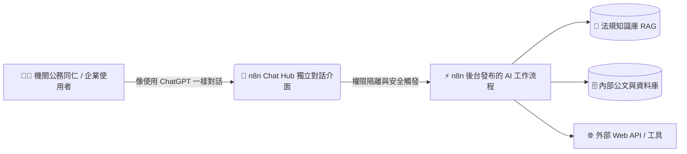
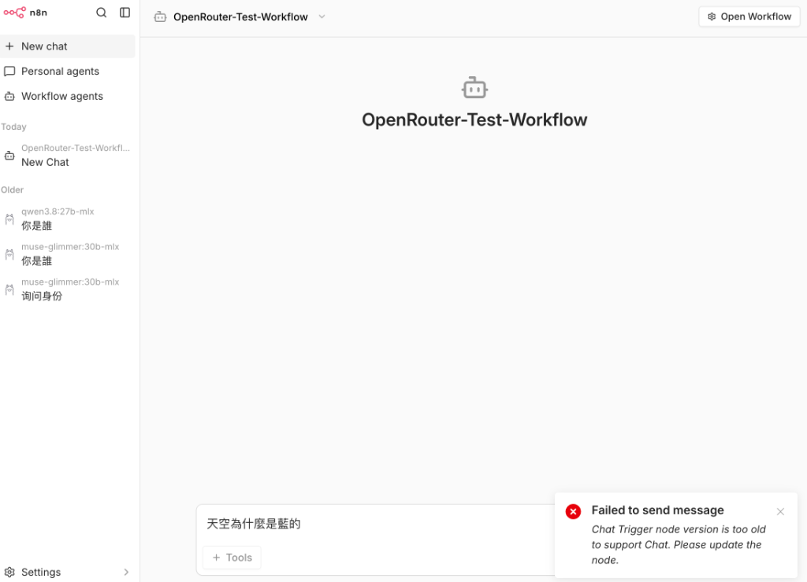
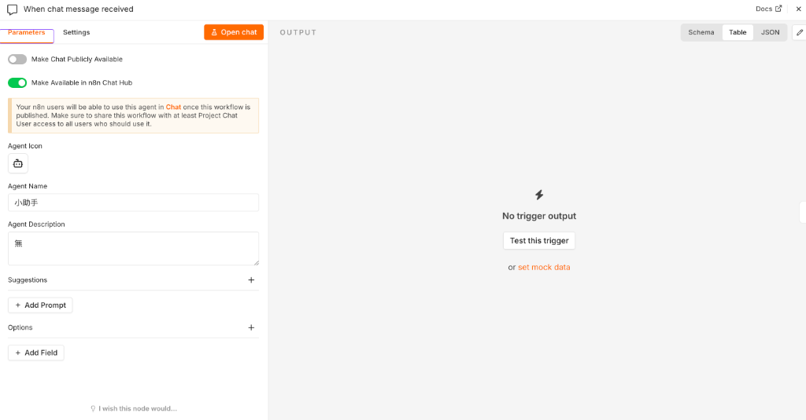
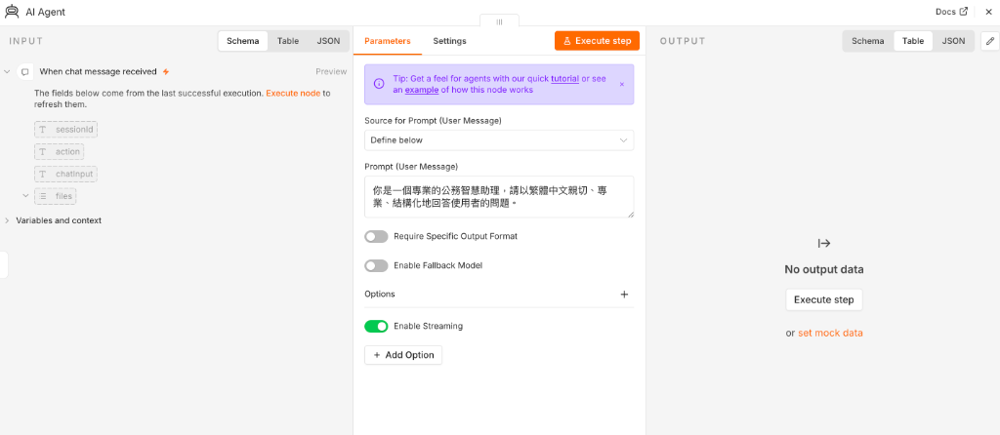

# 💬 n8n Chat Hub 企業級對話中心建置與發布指南

本指南專為公務機關與企業團隊設計，詳細說明如何利用 **n8n Chat Hub** 功能，將複雜的自動化 AI 工作流程轉化為直覺、安全的「ChatGPT 風格」內部對話助理！

---

## 📑 目錄
- [1. 什麼是 n8n Chat Hub？](#1-什麼是-n8n-chat-hub)
- [2. Chat Hub 核心介面導覽](#2-chat-hub-核心介面導覽)
- [3. 發布工作流程至 Chat Hub 的完整步驟](#3-發布工作流程至-chat-hub-的完整步驟)
- [4. 內部 Chat Hub vs 公開聊天視窗 差異對比](#4-內部-chat-hub-vs-公開聊天視窗-差異對比)
- [5. 🚀 一鍵複製 Chat Hub 測試工作流 (JSON)](#5--一鍵複製-chat-hub-測試工作流-json)
- [6. 常見問題與排錯指南 (FAQ)](#6-常見問題與排錯指南-faq)

---

## 1. 什麼是 n8n Chat Hub？

在過去，若要讓非技術同仁使用 n8n 打造的 AI 助理，通常必須透過 LINE/Telegram 機器人，或是直接將同仁加入 n8n 畫布中。但這會帶來兩大痛點：
1. **學習門檻高**：一般同仁看到複雜的工作流程節點與連線容易不知所措。
2. **資安風險大**：進入畫布可能不慎更動節點邏輯，或暴露後台 API Key 與資料庫連線資訊。

**n8n Chat Hub** 徹底解決了這個問題！它是 n8n 內建的「獨立對話應用中心」：



### 🌟 核心特色：
- 🎯 **免看畫布**：使用者只需登入專屬的 Chat 介面即可交談，介面如 ChatGPT 般親切純粹。
- 🛡️ **資安隔離 (Chat User 權限)**：使用者只能與 Agent 對話，完全接觸不到後台 API 金鑰與節點邏輯。
- ⚡ **即時串流 (Streaming)**：支援如打字機般的即時文字串流吐字反饋，大幅提升使用者體驗。
- 🗂️ **歷史紀錄保存**：支援多對話紀錄管理，可隨時回溯先前的查詢與公務分析內容。

---

## 2. Chat Hub 核心介面導覽

當點擊 n8n 左側導覽列的 **Chat** 圖示後，即可進入 Chat Hub 專屬介面：



1. **`+ New chat`**：快速開啟一個全新的對話視窗。
2. **`Personal agents`（個人助理）**：由使用者自己配置的個人專用 AI 模型。
3. **`Workflow agents`（工作流程助理）**：由 n8n 工作流程發布的企業級 Agent，具備調用工具、查詢內部知識庫（RAG）、公文生成等強大能力。
4. **歷史對話清單**：依照時間（Today / Older）分類保存的歷史對話。

---

## 3. 發布工作流程至 Chat Hub 的完整步驟

只要在現有的 AI 工作流程中完成以下 **4 個設定步驟**，即可將工作流程一鍵上架到 Chat Hub！

---

### 步驟一：設定 `When chat message received` (Chat Trigger) 節點

點開工作流程起點的 **`When chat message received`** 節點：



1. **開啟開關**：切換開啟 **`Make Available in n8n Chat Hub`**（將助理發布至 Chat Hub）。
2. **設定助理外觀與資訊**：
   - **`Agent Icon`**：挑選專屬圖示（如 🤖 機器人、📋 公文夾等）。
   - **`Agent Name`**：設定對話介面顯示的名稱（例如：`公務智慧助理`、`法規查詢秘書`）。
   - **`Agent Description`**：簡述助理功能（例如：`協助公文撰寫、公務法規查詢與格式摘要`）。
3. **設定推薦引導詞 (`Suggestions`)** *(選填)*：
   - 點擊 **`+ Add Prompt`**，新增 2~3 個常見問題按鈕（例如：「請提供今日公務摘要格式」、「查詢差勤管理規定」），讓使用者點擊即可提問！

---

### 步驟二：配置 `AI Agent` 節點（開啟串流）

點開 **`AI Agent`** 節點：



1. **Prompt (User Message)**：輸入 System Prompt 定義助理角色與原則（例如：`你是一個專業的公務智慧助理，請以繁體中文親切、專業、結構化地回答使用者的問題。`）。
2. **⚠️ 關鍵設定（開啟串流）**：
   - 展開下方 **Options** ➔ 勾選開啟 **`Enable Streaming`**。
   - 💡 **說明**：開啟後，Chat Hub 才能呈現逐字生成的打字機效果；未開啟可能會導致回應等待過久或報錯。

---

### 步驟三：綁定 LLM 模型節點

在 `AI Agent` 下方的 Model 端點連接 LLM 語言模型，支援本課程所教授之所有模型平台：
- 🌐 **[OpenRouter 多模型平台](./../openrouter/README.md)**（推薦 `meta-llama/llama-3.3-70b-instruct` 或 `google/gemini-2.0-flash-001`）
- 🟢 **[NVIDIA NIM 微服務](./../nvidia_nim/README.md)**（推薦 `nvidia/nemotron-3.5-lightning-30b-a3b`）
- 🏠 **[Ollama 本機模型](./../ollama安裝/README.md)**（推薦 `llama3.3`、`taide` 等）

---

### 步驟四：發布工作流程 (Publish) 並分享

1. **發布工作流程**：在工作流程畫布右上角，點擊 **`Publish（發布）`** 按鈕（狀態會顯示為已發布 **`Published`**），並儲存 (`Ctrl + S` / `Cmd + S`)。
2. **指派權限**：
   - 若要讓其他同仁使用，可在 n8n **Settings ➔ Users** 中新增同仁帳號。
   - 將同仁指派為 **`Chat User`** 角色，並在專案或工作流程中給予 **`Project Chat User`** 或 **`Viewer`** 權限。
   - 如此一來，同仁登入後只會看到 Chat Hub 對話中心，完全無法查看或修改任何後台工作流程！

---

## 4. 內部 Chat Hub vs 公開聊天視窗 差異對比

在 `When chat message received` 節點中，有兩個外發開關，其使用情境如下：

| 評比項目 | 💬 Make Available in n8n Chat Hub | 🌐 Make Chat Publicly Available |
| :--- | :--- | :--- |
| **目標受眾** | **機關內部同仁、跨部門團隊、內部同仁** | **外部公眾、網站訪客、民眾諮詢** |
| **存取驗證** | **需要登入 n8n 帳號**（支援 SSO / 密碼） | **免登入**（公開網址或 iframe 嵌入） |
| **權限控制** | 可設定 **Chat User** 權限隔離 | 所有人皆可透過公開 URL 存取 |
| **對話紀錄** | **完整儲存於使用者的歷史對話清單** | 瀏覽器關閉後通常即重置 |
| **使用介面** | 統一的企業 AI 助理清單與切換入口 | 單一獨立聊天小視窗 (Widget) |
| **典型公務應用** | 內部公文草擬、差勤法規查詢、內部報表分析 | 機關官網便民問答、活動線上客服 |

---

## 5. 🚀 一鍵複製 Chat Hub 測試工作流 (JSON)

學員可直接點擊下載 **[👉 下載 Chat_Hub_範例工作流.json](./Chat_Hub_範例工作流.json)**，或**展開複製下方 JSON 程式碼**，回到 n8n 畫布空白處按下 `Ctrl + V` (Windows) 或 `Cmd + V` (Mac) 即可一鍵貼上完整測試工作流！

<details>
<summary><b>點此展開 / 複製完整工作流程 JSON 程式碼 📋</b></summary>

```json
{
  "name": "Chat-Hub-Assistant-Workflow",
  "nodes": [
    {
      "parameters": {
        "content": "## 💬 n8n Chat Hub 整合工作流\n\n**本工作流特點：**\n1. 已開啟 **Make Available in n8n Chat Hub**。\n2. 已設定 **Agent Name（公務智慧助理）** 與 **Streaming 串流輸出**。\n3. 支援切換 OpenAI / OpenRouter / NVIDIA NIM / Gemini 等各類模型！\n\n> 💡 **發布步驟**：設定完成後，點擊右上角 **Publish（發布）**，即可在左側 **Workflow agents** 中看見專屬助理！",
        "height": 260,
        "width": 400,
        "color": 7
      },
      "id": "hub-guide-note",
      "name": "📋 使用說明",
      "type": "n8n-nodes-base.stickyNote",
      "position": [
        1200,
        1100
      ],
      "typeVersion": 1
    },
    {
      "parameters": {
        "availableInChat": true,
        "agentName": "公務智慧助理",
        "agentDescription": "具備結構化分析與公文草擬能力的智慧助手",
        "options": {}
      },
      "type": "@n8n/n8n-nodes-langchain.chatTrigger",
      "typeVersion": 1.4,
      "position": [
        1200,
        1390
      ],
      "id": "hub-chat-trigger",
      "name": "When chat message received"
    },
    {
      "parameters": {
        "promptType": "define",
        "text": "你是一個專業的公務智慧助理，請以繁體中文親切、專業、結構化地回答使用者的問題。",
        "options": {
          "enableStreaming": true
        }
      },
      "type": "@n8n/n8n-nodes-langchain.agent",
      "typeVersion": 3.1,
      "position": [
        1440,
        1390
      ],
      "id": "hub-ai-agent",
      "name": "AI Agent"
    },
    {
      "parameters": {
        "model": {
          "__rl": true,
          "value": "meta-llama/llama-3.3-70b-instruct",
          "mode": "id"
        },
        "options": {
          "maxTokens": 1024,
          "temperature": 0.5
        }
      },
      "id": "hub-openai-model",
      "name": "OpenAI Chat Model",
      "type": "@n8n/n8n-nodes-langchain.lmChatOpenAi",
      "position": [
        1440,
        1600
      ],
      "typeVersion": 1.2
    }
  ],
  "connections": {
    "OpenAI Chat Model": {
      "ai_languageModel": [
        [
          {
            "node": "AI Agent",
            "type": "ai_languageModel",
            "index": 0
          }
        ]
      ]
    },
    "When chat message received": {
      "main": [
        [
          {
            "node": "AI Agent",
            "type": "main",
            "index": 0
          }
        ]
      ]
    }
  },
  "settings": {
    "executionOrder": "v1"
  }
}
```

</details>

---

## 6. 常見問題與排錯指南 (FAQ)

### Q1：為什麼在左側 Chat Hub 中找不到剛剛建立的 Agent？
- **排查步驟**：
  1. **確認工作流程是否已發布**：右上角狀態必須顯示為已發布 **`Published`**（若顯示 `Unpublished` 請點擊 **Publish** 發布）。
  2. **確認開關已打開**：`When chat message received` 節點中必須開啟 **`Make Available in n8n Chat Hub`**。
  3. **重新整理頁面**：按下 `F5` 或 `Cmd + R` 重新載入 Chat Hub 清單。

### Q2：出現 `Chat Trigger node version is too old to support Chat` 錯誤？
- **原因**：使用了舊版工作流匯入，節點的 `typeVersion` 低於 1.4。
- **解決方式**：雙擊打開 `When chat message received` 節點，點擊上方的 **`Update node`** 一鍵升級；或直接在畫布重新拉入最新的 Chat Trigger 節點。

### Q3：為什麼對話時沒有逐字串流（打字機）效果？
- **解決方式**：點擊 `AI Agent` 節點，進入下方 **Options** 勾選開啟 **`Enable Streaming`** 並存檔。

### Q4：如何限制其他同仁只能在 Chat Hub 聊天，不能查看或修改工作流程？
- **解決方式**：
  1. 進入 n8n **Settings ➔ Users**。
  2. 邀請同仁並將其角色設為 **`Chat User`**（或僅授予該 Project 的 Viewer 權限）。
  3. 同仁登入後介面只會呈現 Chat Hub，能完美保障機關資料與 API Key 安全！
