# Cloudflare Tunnel 整合 Docker n8n 完整設定指南 ☁️

本指南詳細說明如何使用 **Cloudflare Tunnel (`cloudflared`)** 為本機或伺服器上的 **Docker n8n** 建立安全、穩定的永久外網 HTTPS 通道。

透過 Cloudflare Tunnel，您的 n8n 能以專屬自訂網域（例如 `n8n.yourdomain.com`）接收 **LINE Bot Webhook、Google / Notion OAuth 2.0 授權回呼** 以及進行遠端工作流管理，**完全無需在路由器設定通訊埠轉發 (Port Forwarding)**，自動享有**免費的 HTTPS (SSL/TLS 加密憑證)**、Cloudflare 全球 CDN 快取與 DDoS 安全防護。

---

## 📋 目錄

- [什麼是 Cloudflare Tunnel？](#什麼是-cloudflare-tunnel)
  - [核心運作觀念](#核心運作觀念)
- [前置需求](#前置需求)
- [詳細設定流程](#詳細設定流程)
  - [第 1 階段：設定個人網域與 DNS 移轉](#第-1-階段設定個人網域與-dns-移轉)
  - [第 2 階段：在 Cloudflare 建立 Tunnel](#第-2-階段在-cloudflare-建立-tunnel)
  - [第 3 階段：使用 Docker 啟動 cloudflared 通道容器](#第-3-階段使用-docker-啟動-cloudflared-通道容器)
  - [第 4 階段：設定已發佈應用程式路由 (指向 n8n)](#第-4-階段設定已發佈應用程式路由-指向-n8n)
  - [第 5 階段：設定 n8n 環境變數與驗證連線](#第-5-階段設定-n8n-環境變數與驗證連線)
- [⚠️ 常見問題與排錯指南](#️-常見問題與排錯指南)

---

## 什麼是 Cloudflare Tunnel？

Cloudflare Tunnel 是一種能夠安全地將內部服務（如 Docker 中的 n8n）連接到 Cloudflare 全球邊緣網路的工具，而**無需對外公開本機或伺服器的實體 IP 位址**。

### 核心運作觀念

> **在主機上透過 Docker 運行輕量級代理程式 `cloudflared`，它會主動向 Cloudflare 發起安全的加密連線（Outbound Connection）。當外部使用者或 Webhook 發送請求至您的公開網域名稱（例如 `https://n8n.yourdomain.com`）時，Cloudflare 會透過此加密通道將流量轉發給本地的 n8n 服務（`http://localhost:5678`）。**


---

## 前置需求

在開始設定前，請確認具備以下環境：

1. **已申請一個專屬獨立網域**：
   - 前往網域註冊商（如 [GoDaddy](https://godaddy.com)、Namecheap 等）購買專屬個人網域（例如：`roberthsu20030301.site` 或 `yourdomain.com`）。
   - 購買完成後即可在註冊商的控制台中看到您的網域。

   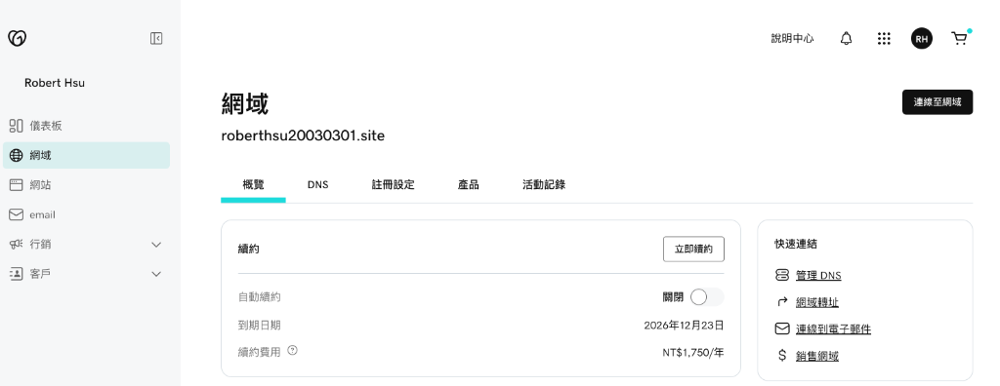

2. **Cloudflare 免費帳號**（用於提供免費 Edge SSL 憑證、DNS 託管與 Tunnel 連線）。
3. **已安裝 Docker 並運行中的 n8n 容器**（預設監聽連接埠 `5678`）。

---

## 詳細設定流程

### 第 1 階段：設定個人網域與 DNS 移轉

> **核心觀念**：將在網域商（如 GoDaddy）購買的獨立網域名稱伺服器 (Nameservers) 指向 Cloudflare，將網域的 DNS 解析權限交由 Cloudflare 全權託管。

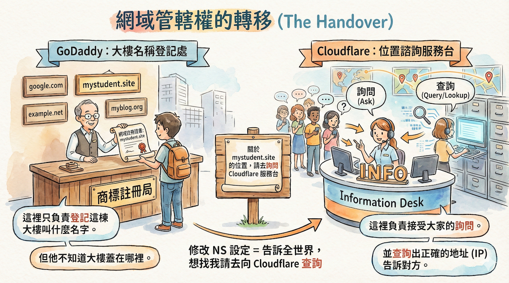

#### 1. 在 Cloudflare 新增網域
1. 登入 [Cloudflare Dashboard](https://dash.cloudflare.com/)。
2. 在左側選單點選「**網域 (Domains)**」>「**概覽**」。
3. 點擊右上角藍色的「**新增網域**」按鈕（或畫面中間的「新增網站」連結）。

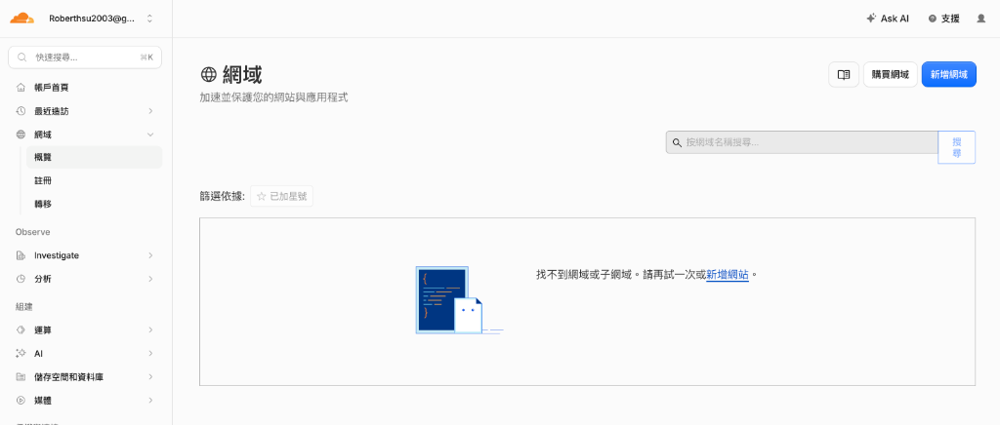

4. 輸入您在 GoDaddy 購買的個人網域名稱（例如：`roberthsu20030301.site` 或 `yourdomain.com`）。
5. 選擇 **Free (免費)** 方案並繼續。
6. Cloudflare 會自動掃描您現有的 DNS 記錄，確認後進入下一步。
7. 取得 Cloudflare 提供的 **兩組專屬名稱伺服器 (Nameservers) 位址**（例如 `lochlan.ns.cloudflare.com` 與 `roxy.ns.cloudflare.com`，日後亦可在網站後台「**DNS > 設定**」中隨時查閱）。

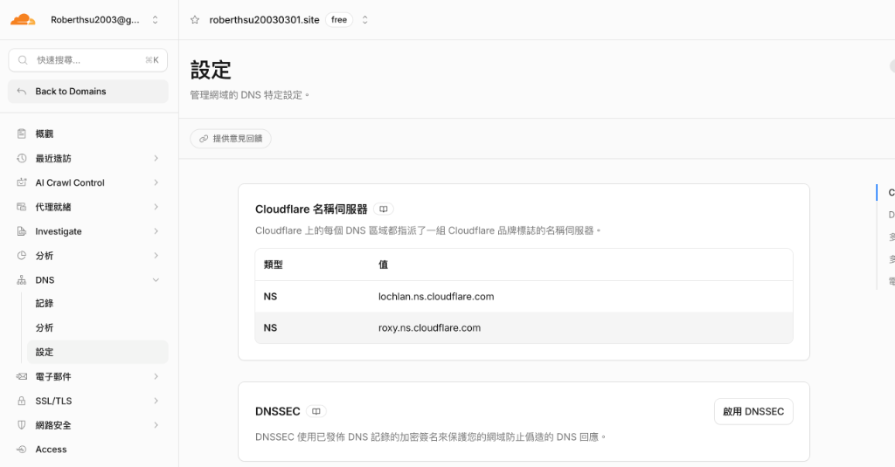

#### 2. 在網域註冊商更換 Nameservers
1. 回到您購買網域的註冊商（如 GoDaddy）。
2. 進入該網域管理頁面，切換至 **「DNS」>「名稱伺服器」** 分頁。
3. 點擊「**變更名稱伺服器**」按鈕，並選擇「**使用自訂名稱伺服器**」。
4. 依序貼上剛剛從 Cloudflare 取得的兩組名稱伺服器位址（例如 `lochlan.ns.cloudflare.com` 與 `roxy.ns.cloudflare.com`）。
5. 點擊儲存確認變更。

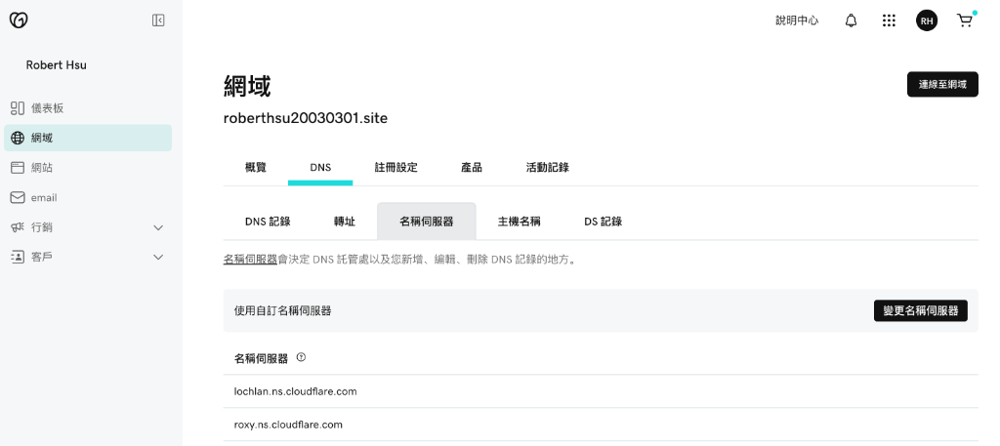

#### 3. 等待 DNS 解析同步並驗證網域生效
> ⏳ **耐心等待提醒**：變更名稱伺服器後，全球 DNS 節點同步需要一些時間（通常約數分鐘至半小時，最長可能需要 24 小時）。請稍作等待，讓 Cloudflare 與註冊商完成驗證。

- 回到 Cloudflare Dashboard，點選左側「**網域**」>「**概覽**」。
- 當看到您的網域出現在清單中，且狀態欄顯示為 **`✓ 使用中`** 時，代表 DNS 託管已正式生效！

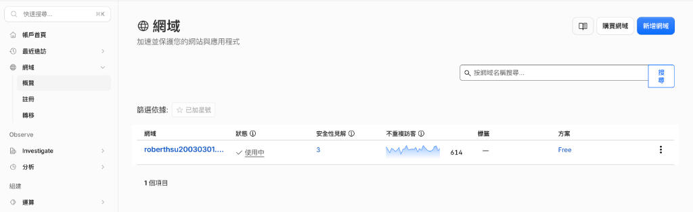

---

### 第 2 階段：在 Cloudflare 建立 Tunnel

1. 在 Cloudflare Dashboard 左側選單中，點選 **`Zero Trust`** 進入控制台。
2. 在 Zero Trust 左側選單中，導覽至 **`網路 (Networks)` > `連接器 (Tunnels)`**。
3. 點擊右上角「**+ 建立通道**」按鈕（或畫面中的藍色「**新增通道**」按鈕）。

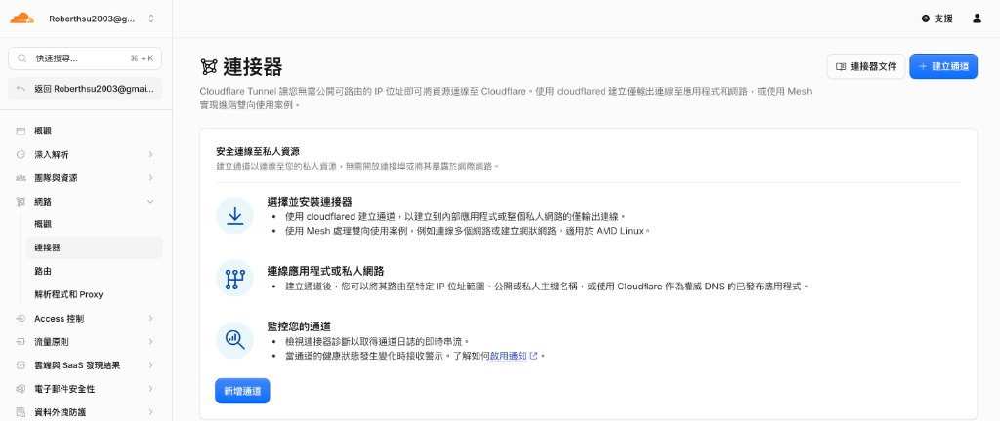

4. 選擇連接器類型為 **`Cloudflared`**，點選 Next。
5. **為通道命名**：輸入識別名稱（例如：`n8n-tunnel`），點擊 **Save tunnel**。

---

### 第 3 階段：使用 Docker 啟動 cloudflared 通道容器

1. **選取 Docker 平台並取得 Token**：
   - 進入「**安裝並執行連接器**」頁面。
   - 在「**選取裝置的作業系統**」下拉選單中選擇 **`Docker`**。
   - 畫面會顯示專屬的通道權杖 (Tunnel Token，即指令中 `--token` 後方以 `eyJhIj...` 開頭的長字串)。

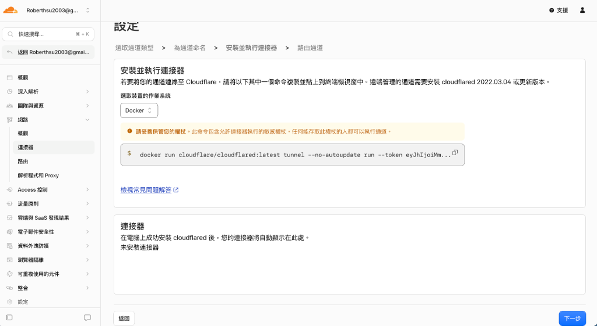

> 🔒 **極重要：請務必妥善複製並記錄您的 Token**：
> - **此 Token 僅會在建立通道時完整顯示一次**！一旦完成設定進入下一步後，Cloudflare 出於安全考量**不會再提供明文查看 Token**。
> - 請先將 Token 複製儲存至安全的記事本或密碼庫中。
> - **若日後遺忘 Token 或需要重新部署**：
>   您必須回到 Zero Trust 控制台，點選 **`網路 (Networks) > 連接器 (Tunnels)`** > 點入該通道名稱進入「**概覽**」頁面，在右側欄位找到「**重新整理 Token**」，點擊「**輪換 Token (Rotate Token)**」重新產生一組新 Token（舊 Token 會立即失效）。
> 
> 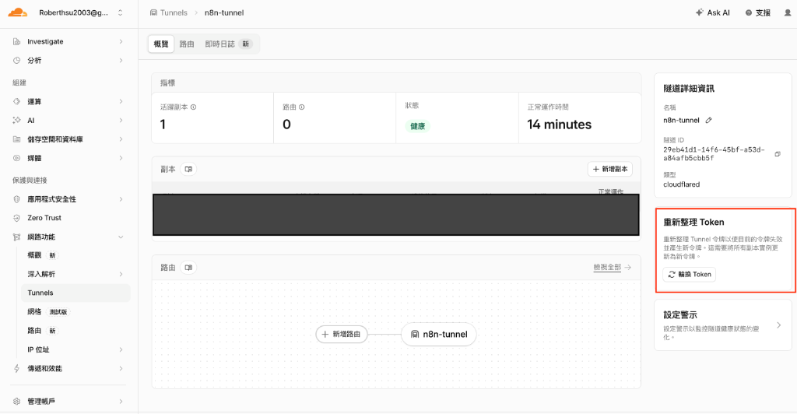

2. **在終端機中執行 Docker 指令啟動通道**：
   > ⚠️ **重要優化提醒**：Cloudflare 網頁上提供的預設指令缺少 `-d`（背景執行）與 `--network=host`（共享本機網路存取 n8n），直接執行會佔用終端機且無法轉發 localhost。**請務必使用以下改良後的生產級指令**：

```bash
docker run -d \
  --name cloudflared \
  --network=host \
  --restart unless-stopped \
  cloudflare/cloudflared:latest \
  tunnel run --token <您的_CLOUDFLARE_TUNNEL_TOKEN>
```

> 💡 **參數重要解析**：
> - `-d`：讓容器在後台持續運行，關閉終端機也不會中斷通道。
> - `--name cloudflared`：為容器命名，便於後續管理與檢視 log。
> - `--network=host`：**關鍵參數**！讓 `cloudflared` 容器共享主機網路，才能直接存取本機 Docker 映射的 `localhost:5678` (n8n)。
> - `--restart unless-stopped`：開機或 Docker 重啟時自動重新連線。
> - `<您的_CLOUDFLARE_TUNNEL_TOKEN>`：請填入畫面上指令中的 Token 字串。

3. **確認連線狀態並進入下一步**：
   - 執行指令後稍等數秒，網頁下方的「**連接器**」清單會自動偵測並顯示為 **`已連線 (Connected)`** 狀態。
   - 確認連線成功後，點擊右下角藍色「**下一步**」按鈕。

---

### 第 4 階段：設定已發佈應用程式路由 (指向 n8n)

此步驟將您的子網域與本地執行的 Docker n8n 服務（Port 5678）進行精準綁定。

#### 1. 前往通道的「已發佈應用程式路由」
1. 在 Cloudflare 左側選單進入 **`Zero Trust`**。
2. 導覽至 **`網路 (Networks)` > `連接器 (Tunnels)`**。
3. 點選剛剛建立的 **`n8n-tunnel`** 進入通道詳情。
4. 切換至頂部的 **「已發佈應用程式路由」** 分頁。
5. 點擊右上角藍色的「**+ 新增已發佈應用程式路由**」按鈕。

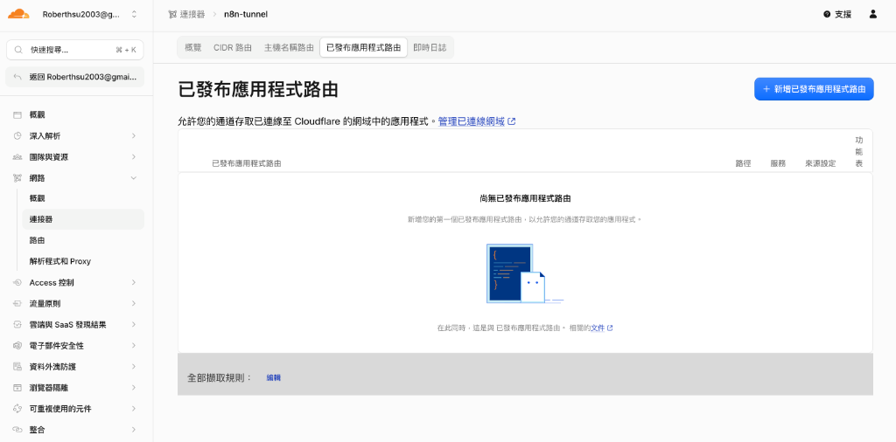

#### 2. 設定公開主機名稱與後端服務
- **子網域 (Subdomain)**：輸入 `n8n`。
- **網域 (Domain)**：下拉選單選取您的個人網域（例如：`roberthsu20030301.site`）。
- **路徑 (Path)**：留空（代表將此子網域的所有請求皆導向 n8n）。
- **服務類型 (Type)**：選擇 **`HTTP`**。
- **URL**：輸入本地 n8n 監聽的連接埠 **`localhost:5678`**。

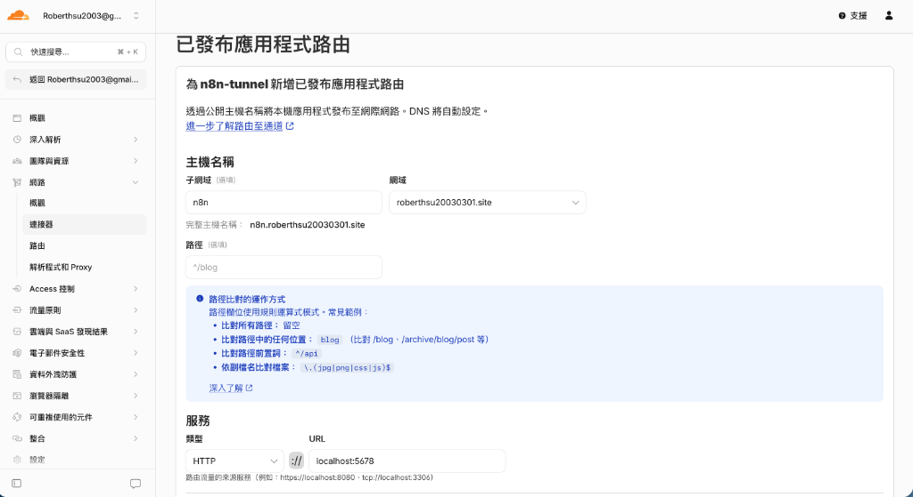

#### 3. 儲存發佈
- 點擊右下角 **`Save hostname (儲存)`**。
- Cloudflare 會自動為您在 DNS 中建立 CNAME 記錄，將 `https://n8n.您的網域` 的所有流量透過加密通道導向本地的 n8n。

---

### 第 5 階段：設定 n8n 環境變數與驗證連線

為了讓 n8n 正確產生 Webhook 觸發網址與 OAuth 2.0 回呼網址，需將自訂網域寫入 n8n 的環境變數中。

#### 1. 調整 n8n 容器環境變數
若您使用 `docker run` 啟動 n8n，請確保帶入 `WEBHOOK_URL` 參數：

```bash
docker run -d \
  --name n8n \
  -p 5678:5678 \
  -e WEBHOOK_URL=https://n8n.yourdomain.com/ \
  -e N8N_DEFAULT_BINARY_DATA_MODE=filesystem \
  -v n8n_data:/home/node/.n8n \
  --restart unless-stopped \
  docker.n8n.io/n8nio/n8n
```

> ⚠️ 請將 `https://n8n.yourdomain.com/` 替換為您在 Cloudflare Tunnel 設定的實際網址。

#### 2. 驗證連線與端對端測試
1. 打開瀏覽器，輸入網址：`https://n8n.yourdomain.com`
2. 確認能順利開啟 n8n 登入介面，且網址列顯示安全的 **HTTPS 鎖頭** 標誌。
3. 建立一個包含 **Webhook 節點** 的測試工作流，檢查節點內產生的「Production URL」是否已正確自動帶入 `https://n8n.yourdomain.com/webhook/...`。


---

## ⚠️ 常見問題與排錯指南

### Q1: 瀏覽器開啟出現「502 Bad Gateway」？
- **原因**：`cloudflared` 容器無法連線到本機的 n8n 服務。
- **檢查重點**：
  1. 確認 n8n 容器正在運行中，且於本機瀏覽器輸入 `http://localhost:5678` 可正常開啟。
  2. 確認 `cloudflared` 容器啟動時有加上 `--network=host` 參數。
  3. 在 Cloudflare Dashboard 檢查 Tunnel 的 Service URL 是否正確設定為 `HTTP` 與 `localhost:5678`。

### Q2: LINE Webhook 提示驗證失敗 (SSL 憑證問題)？
- Cloudflare Tunnel 預設提供由全球信任機構簽發的 Edge SSL 憑證，支援 LINE Developers 與 Google OAuth 嚴格的 HTTPS 檢驗。
- 請確認 Cloudflare 的 **SSL/TLS 加密模式** 設定為 **Full** 或 **Flexible**。

### Q3: 如何同時透過同一個 Tunnel 發布其他本地服務？
- 在 Cloudflare Zero Trust 的 Tunnels 頁面點擊編輯該 Tunnel，前往 **`Public Hostname`** 標籤頁，點擊 **`Add a public hostname`**。
- 您可以新增其他子網域（如 `api.yourdomain.com`）並對應至不同的本地 Port（如 `localhost:8000`），完全無需額外增加 Tunnel 費用或重新安裝連線程式！
