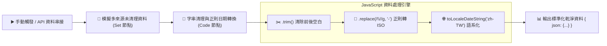

# 💻 Code Node (JavaScript)
## 範例 2：字串清理與日期格式標準化（正規表達式與 ISO 轉換）

### 📚 工作流程說明

當企業從多個不同管道（如 POS 機、Excel 試算表、第三方電商 API）匯入資料時，日期格式往往五花八門（例如 `2026/08/30`、`2026-8-30`、`30/08/2026`），且文字可能包含多餘的前後空白與雜訊標籤。

本範例展示：
1. 使用 JavaScript 正規表達式 `.replace(/\//g, '-')` 將所有斜線日期轉換為標準的 **ISO 8601** 格式（`YYYY-MM-DD`）。
2. 使用 `.trim()` 與正則表達式清除姓名中的空格與備註。
3. 利用 JavaScript `Date` 物件與 `toLocaleDateString('zh-TW')` 產出繁體中文標準日期格式。

---

### 流程架構圖



---

### 工作流程樣版下載

- [📥 字串清理與日期格式標準化工作流程樣版 (02_date_format_normalization.json)](./02_date_format_normalization.json)

---

#### 📋 節點詳細說明

1. **📝 流程說明（Sticky Note）**
   - **功能**：介紹字串操作與日期物件轉換技巧。

2. **📝 模擬未清理訂單資料（Set Node）**
   - **customer_name**：`  王小明 (VIP)  `
   - **order_date**：`2026/08/30`
   - **amount**：`1500`

3. **🧹 字串清理與日期標準化 (Code Node)**
   - **核心 JavaScript**：
     ```javascript
     const cleanName = rawName.trim().replace(/\s*\(VIP\)/g, '');
     const isoDate = rawDate.replace(/\//g, '-');
     const twDate = new Date(isoDate).toLocaleDateString('zh-TW', {
       year: 'numeric',
       month: '2-digit',
       day: '2-digit'
     });
     ```

---

#### 🎯 學習重點

- **為什麼不用 Set 節點？**：Set 節點只能進行簡單指派，無法呼叫複雜正則表達式與 JavaScript Date API。
- **標準 n8n 輸出格式**：永遠在物件外層包覆 `outputItems.push({ json: { ... } })`。

---

<details>
<summary>🤖 <strong>AI 賦能延伸實作（附 Prompt 提詞）</strong></summary>

> 💡 **任務目標**：透過 MCP 連線，讓 AI 增加時間戳記（Timestamp）與星期幾（如「星期日」）的計算。

**可直接複製給 AI 的 Prompt 提詞**：
```text
請幫我在「日期格式標準化」Code 節點中擴充日期資訊：
1. 取得日期對應的 Unix Timestamp（毫秒數）。
2. 計算該日期是「星期幾」（例如：星期一、星期日）。
3. 計算該日期距離今天相差了幾天 (diffDays)。
請提供修改後的 Code 節點程式碼！
```
</details>
